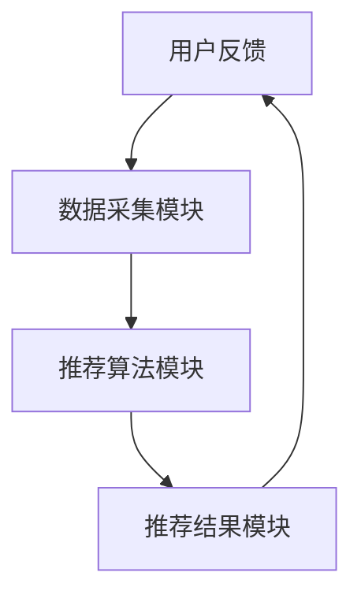

                 


# 智能书架：AI Agent的阅读兴趣推荐系统

## 关键词：
- 智能书架
- AI Agent
- 阅读兴趣推荐
- 推荐系统
- 算法原理
- 系统架构

## 摘要：
本文详细探讨了智能书架中AI Agent如何实现阅读兴趣推荐系统。通过分析问题背景、核心概念、算法原理、系统架构以及项目实战，本文为读者提供了从理论到实践的全面指导。文章结合协同过滤、深度学习和自然语言处理等技术，展示了如何利用AI Agent提升阅读推荐的准确性和个性化。同时，通过实际案例和最佳实践，本文为读者提供了构建高效推荐系统的实用建议。

---

## 目录

1. 背景介绍  
   1.1 问题背景  
   1.2 问题描述  
   1.3 问题解决方法  

2. 核心概念与联系  
   2.1 AI Agent的核心概念  
   2.2 推荐系统的核心原理  
   2.3 概念对比与ER图  

3. 算法原理  
   3.1 协同过滤算法  
   3.2 深度学习模型  
   3.3 自然语言处理技术  

4. 系统分析与架构设计  
   4.1 应用场景分析  
   4.2 系统功能设计  
   4.3 系统架构图  

5. 项目实战  
   5.1 环境搭建  
   5.2 核心功能实现  
   5.3 实际案例分析  

6. 最佳实践  
   6.1 小结  
   6.2 注意事项  
   6.3 拓展阅读  

---

## 正文

### 1. 背景介绍

#### 1.1 问题背景
在信息爆炸的时代，用户每天面对海量的信息，如何快速找到自己感兴趣的书籍成为一大挑战。传统的阅读推荐系统存在推荐结果不精准、用户体验差等问题。AI Agent作为一种智能代理，能够通过学习用户行为和偏好，提供更个性化的推荐服务，从而解决传统推荐系统的不足。

#### 1.2 问题描述
用户在选择书籍时，通常面临信息过载和选择疲劳的问题。传统的推荐系统基于简单的用户行为分析，推荐结果往往不够精准，难以满足用户的个性化需求。此外，推荐系统的实时性和响应速度也是需要优化的关键点。

#### 1.3 问题解决方法
引入AI Agent技术，通过机器学习、自然语言处理等技术手段，分析用户的阅读历史、兴趣偏好和行为模式，构建精准的用户画像，从而实现个性化的阅读推荐。

---

### 2. 核心概念与联系

#### 2.1 AI Agent的核心概念
AI Agent是一种智能代理，能够通过感知环境、执行任务和与用户交互，帮助用户完成特定目标。在智能书架中，AI Agent主要负责收集用户数据、分析偏好并生成推荐结果。

#### 2.2 推荐系统的核心原理
推荐系统通过分析用户行为和数据，利用算法计算用户偏好，生成推荐列表。常见的推荐算法包括协同过滤、基于内容的推荐和基于深度学习的推荐。

#### 2.3 概念对比与ER图
以下是AI Agent和推荐系统的功能对比表格：

| 功能模块         | AI Agent                  | 推荐系统                  |
|------------------|---------------------------|---------------------------|
| 数据处理         | 收集用户数据               | 分析用户行为               |
| 决策机制         | 基于机器学习模型           | 基于协同过滤或深度学习     |
| 交互方式         | 自然语言交互               | 显示推荐结果               |

以下是一个简单的ER图，展示了用户、书籍和推荐之间的关系：

```mermaid
er
    actor 用户 {
        id 用户ID
        string 偏好类型
    }
    actor 书籍 {
        id 书籍ID
        string 书籍类型
    }
    relation 推荐结果 {
        用户ID
        书籍ID
        score 推荐分数
    }
```

---

### 3. 算法原理

#### 3.1 协同过滤算法
协同过滤是一种基于用户相似性计算推荐结果的方法。分为基于用户的协同过滤和基于物品的协同过滤。

##### 基于用户的协同过滤
1. 收集用户的历史行为数据。
2. 计算用户之间的相似度（如余弦相似度）。
3. 根据相似用户的偏好生成推荐列表。

##### 余弦相似度计算公式
$$ \text{余弦相似度} = \frac{\sum_{i=1}^{n} x_i y_i}{\sqrt{\sum_{i=1}^{n} x_i^2} \cdot \sqrt{\sum_{i=1}^{n} y_i^2}} $$

##### 代码实现示例
```python
def cosine_similarity(user1, user2):
    numerator = sum(x * y for x, y in zip(user1, user2))
    denominator = (sum(x**2 for x in user1) * sum(y**2 for y in user2))**0.5
    return numerator / denominator if denominator != 0 else 0
```

#### 3.2 深度学习模型
深度学习模型通过学习用户和书籍的嵌入表示，生成推荐结果。

##### 基于神经网络的推荐系统
1. 输入层：用户和书籍的特征向量。
2. 隐藏层：通过神经网络提取特征。
3. 输出层：生成推荐分数。

##### 深度学习模型的训练
```python
import tensorflow as tf
from tensorflow.keras import layers

model = tf.keras.Sequential([
    layers.Dense(64, activation='relu'),
    layers.Dense(1, activation='sigmoid')
])
model.compile(optimizer='adam', loss='binary_crossentropy', metrics=['accuracy'])
model.fit(X_train, y_train, epochs=10, batch_size=32)
```

#### 3.3 自然语言处理技术
自然语言处理技术用于分析书籍内容和用户评论，生成更精准的推荐。

##### 基于BERT的书籍摘要提取
1. 使用BERT模型提取书籍内容的摘要。
2. 将摘要与用户偏好进行匹配。

##### 示例代码
```python
from transformers import BertTokenizer, BertModel

tokenizer = BertTokenizer.from_pretrained('bert-base-uncased')
model = BertModel.from_pretrained('bert-base-uncased')

inputs = tokenizer("This is a sample text.", return_tensors="tf")
outputs = model(inputs.input_ids, inputs.attention_mask)
```

---

### 4. 系统分析与架构设计

#### 4.1 应用场景分析
智能书架AI Agent的应用场景包括在线书店、图书馆和阅读App等，帮助用户快速找到感兴趣的书籍。

#### 4.2 系统功能设计
系统功能包括用户数据采集、推荐算法实现、推荐结果展示和用户反馈收集。

#### 4.3 系统架构图
以下是系统架构的Mermaid图：



---

### 5. 项目实战

#### 5.1 环境搭建
搭建Python环境，安装必要的库，如TensorFlow、Keras和BERT库。

#### 5.2 核心功能实现
实现协同过滤和深度学习模型，结合自然语言处理技术，生成推荐结果。

#### 5.3 实际案例分析
通过一个实际案例，展示如何利用AI Agent实现个性化推荐。

---

### 6. 最佳实践

#### 6.1 小结
本文详细介绍了AI Agent在智能书架中的应用，从算法原理到系统架构，为读者提供了全面的指导。

#### 6.2 注意事项
在实际应用中，需要注意数据隐私保护和模型优化问题。

#### 6.3 拓展阅读
推荐阅读《深度学习入门》和《自然语言处理实战》等书籍，进一步提升技术能力。

---

通过本文的详细讲解，读者可以全面理解智能书架中AI Agent的阅读兴趣推荐系统，并能够实际操作相关技术，解决实际问题。

