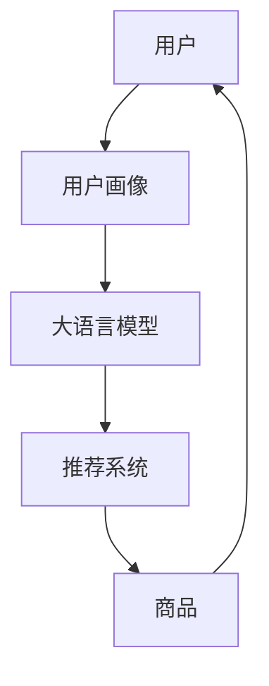
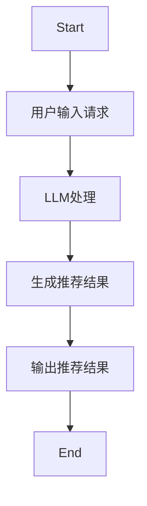
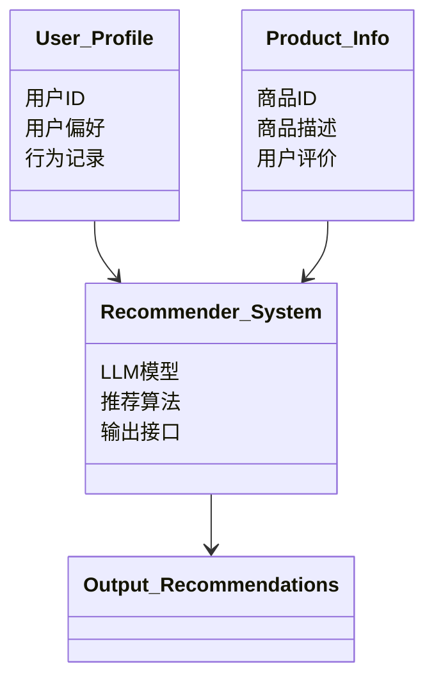

                 


# 智能产品推荐 AI Agent：LLM 驱动的电商助手

## 关键词
- 智能推荐系统
- AI Agent
- 大语言模型（LLM）
- 电商助手
- 个性化推荐

## 摘要
本文深入探讨了智能产品推荐系统中AI Agent的应用，特别是基于大语言模型（LLM）的电商助手。文章从背景、技术原理、系统架构、项目实现等多方面展开，详细分析了LLM驱动推荐系统的优势、实现方法及实际应用场景。通过系统化的分析与案例实践，本文为读者提供了全面的视角，帮助理解并掌握这一前沿技术。

---

## 第1章: 智能推荐系统的背景与意义

### 1.1 传统推荐系统的局限性

#### 1.1.1 背景介绍
传统的推荐系统主要依赖于协同过滤和基于内容的推荐算法，这些方法在一定程度上能够解决用户的信息过载问题，但存在以下局限性：

- **数据稀疏性**：当用户数量较少或商品种类较少时，协同过滤的效果较差。
- **冷启动问题**：新用户或新商品难以获得足够的推荐依据。
- **推荐结果单一**：传统推荐系统难以理解用户的深层次需求，推荐结果可能缺乏多样性。
- **实时性不足**：基于规则的推荐系统难以实时响应用户需求的变化。

#### 1.1.2 问题描述
传统推荐系统的核心问题在于无法有效处理动态变化的用户需求和实时推荐场景。此外，传统推荐系统通常依赖于固定的规则或历史数据，难以灵活适应用户行为的变化。

#### 1.1.3 问题解决
引入AI Agent和大语言模型（LLM）能够有效弥补传统推荐系统的不足，通过实时分析用户行为、上下文信息和商品描述，生成更加精准和个性化的推荐结果。

### 1.2 AI Agent的基本概念

#### 1.2.1 核心概念
AI Agent是一种智能体，能够感知环境、自主决策并执行任务。在推荐系统中，AI Agent可以理解用户需求、分析商品信息，并生成个性化推荐结果。

#### 1.2.2 问题背景
随着电商行业的快速发展，用户需求日益多样化，传统推荐系统难以满足用户的个性化需求。

#### 1.2.3 问题解决
AI Agent通过实时分析用户行为、商品信息和上下文数据，能够动态调整推荐策略，提供更加精准的推荐结果。

### 1.3 LLM驱动的推荐系统

#### 1.3.1 技术背景
大语言模型（LLM）具有强大的自然语言处理能力，能够理解用户的文本输入并生成相关的推荐结果。

#### 1.3.2 技术优势
- **语义理解**：LLM能够理解用户的自然语言输入，生成更符合用户意图的推荐结果。
- **动态调整**：LLM能够实时分析用户行为和反馈，动态调整推荐策略。
- **多模态支持**：LLM可以结合商品描述、用户评价等多种信息，生成更全面的推荐结果。

### 1.4 核心概念对比

| **对比项**       | **传统推荐系统**                     | **LLM驱动推荐系统**                |
|--------------------|--------------------------------------|-----------------------------------|
| **推荐依据**       | 历史数据和规则                       | 用户输入、商品描述和实时数据       |
| **推荐精准度**     | 较低，依赖规则和历史数据             | 较高，基于深度学习和语义理解       |
| **实时性**         | 较差，难以实时调整推荐策略           | 较好，能够实时响应用户需求变化     |
| **适应性**         | 较差，难以处理多样化需求             | 较强，能够灵活调整推荐策略         |

---

## 第2章: LLM驱动的推荐系统核心概念与联系

### 2.1 核心概念与原理

#### 2.1.1 LLM的基本原理
大语言模型通过大量的文本数据进行训练，能够理解上下文并生成相关的文本输出。在推荐系统中，LLM可以根据用户的输入生成推荐结果。

#### 2.1.2 推荐系统的数学模型
推荐系统的数学模型通常包括用户-商品评分矩阵、协同过滤算法、矩阵分解等。

#### 2.1.3 LLM与推荐系统的结合方式
LLM可以作为推荐系统的生成引擎，根据用户输入生成推荐结果，或者作为特征提取器，从商品描述中提取特征用于推荐。

### 2.2 实体关系图



---

## 第3章: LLM驱动的推荐系统算法原理

### 3.1 算法原理

#### 3.1.1 算法流程
1. **用户输入**：用户输入搜索关键词或描述需求。
2. **LLM处理**：LLM分析用户输入，生成相关的商品描述或推荐列表。
3. **推荐结果**：根据LLM的输出，生成最终的推荐结果。

#### 3.1.2 数学模型
推荐系统的数学模型可以表示为：
$$
R(u, i) = \theta^T \cdot f(u, i)
$$
其中，$R(u, i)$ 表示用户 $u$ 对商品 $i$ 的评分预测，$\theta$ 是模型参数，$f(u, i)$ 是用户和商品的特征向量。

### 3.2 算法流程图



---

## 第4章: 系统架构设计

### 4.1 系统功能设计

#### 4.1.1 用户画像
用户画像包括用户的偏好、行为习惯和历史记录等信息。

#### 4.1.2 商品信息处理
商品信息处理包括商品描述、属性和用户评价等。

#### 4.1.3 推荐引擎
推荐引擎负责根据用户输入和商品信息生成推荐结果。

### 4.2 系统架构图



---

## 第5章: 项目实战

### 5.1 环境配置

#### 5.1.1 安装依赖
```bash
pip install transformers
pip install torch
pip install numpy
```

#### 5.1.2 加载模型
```python
from transformers import AutoTokenizer, AutoModelForCausalLM
model_name = "gpt2"
tokenizer = AutoTokenizer.from_pretrained(model_name)
model = AutoModelForCausalLM.from_pretrained(model_name)
```

### 5.2 核心实现

#### 5.2.1 用户输入处理
```python
def process_input(user_input):
    inputs = tokenizer(user_input, return_tensors="pt")
    outputs = model.generate(inputs.input_ids, max_length=100)
    return tokenizer.decode(outputs[0], skip_special_tokens=True)
```

#### 5.2.2 生成推荐结果
```python
user_input = "I'm looking for a new pair of running shoes."
recommendation = process_input(user_input)
print(recommendation)
```

### 5.3 案例分析

#### 5.3.1 数据分析
通过对用户行为数据的分析，可以发现用户的偏好和购买习惯。

#### 5.3.2 算法优化
通过调整模型参数和优化推荐策略，可以提高推荐系统的精准度和响应速度。

---

## 第6章: 总结与展望

### 6.1 本章总结
本文详细探讨了智能产品推荐系统中AI Agent的应用，特别是基于大语言模型的电商助手。通过分析和实践，展示了LLM驱动推荐系统的优势和实现方法。

### 6.2 未来展望
随着大语言模型的不断发展，推荐系统的智能化水平将不断提高，未来可能会出现更多基于多模态数据的推荐系统。

### 6.3 最佳实践 Tips
- 在实际应用中，建议结合用户行为数据和商品信息，优化推荐策略。
- 定期更新模型参数，保持推荐系统的准确性和实时性。

---

通过以上章节的详细分析，读者可以全面理解LLM驱动的智能推荐系统的实现方法和应用场景，为实际项目提供了有力的参考。

