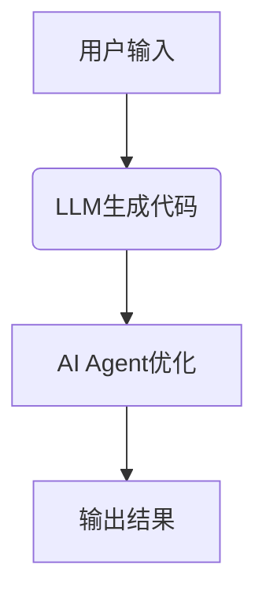
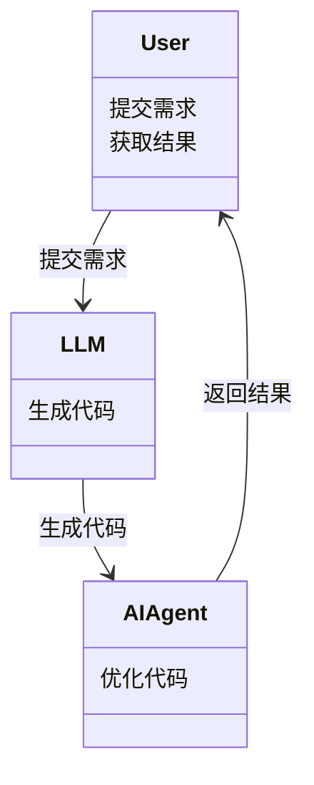

                 


```markdown
# 智能代码生成 AI Agent：LLM 辅助软件开发

> 关键词：智能代码生成, AI Agent, LLM, 大语言模型, 软件开发

> 摘要：本文深入探讨了智能代码生成 AI Agent 的工作原理及其在软件开发中的应用。通过分析大语言模型（LLM）的核心概念、算法原理和系统架构，结合实际项目案例，详细阐述了如何利用 LLM 辅助代码生成，提升开发效率和代码质量。文章内容涵盖背景介绍、核心概念、算法原理、系统架构设计、项目实战、最佳实践等，旨在为读者提供全面而深入的技术指导。

---

# 第一部分: 智能代码生成 AI Agent 的背景与概念

# 第1章: 智能代码生成的背景与问题背景

## 1.1 问题背景
### 1.1.1 软件开发的复杂性与挑战
随着软件系统的规模和复杂性不断增加，传统的手动编码方式面临诸多挑战，包括开发效率低下、代码质量难以保证以及开发成本高昂等问题。开发者需要不断学习新技术，适应快速变化的行业需求，这对个人能力提出了更高的要求。

### 1.1.2 代码生成技术的发展历程
代码生成技术并不是一个新概念，它经历了从简单模板生成到基于规则的生成，再到基于机器学习的生成的演变过程。早期的代码生成工具主要依赖于固定的规则和模板，难以应对复杂的开发场景。

### 1.1.3 大语言模型的崛起与应用
近年来，大语言模型（LLM）的崛起为代码生成带来了革命性的变化。LLM通过深度学习技术，能够理解上下文并生成符合需求的代码片段，显著提升了代码生成的智能化水平。

## 1.2 问题描述
### 1.2.1 传统代码生成技术的局限性
传统的代码生成技术主要依赖于规则和模板，难以处理复杂的逻辑和语义问题。生成的代码往往缺乏灵活性和可维护性，难以适应实际开发需求。

### 1.2.2 AI Agent 在代码生成中的作用
AI Agent通过整合大语言模型的能力，能够根据用户需求自动生成高质量的代码片段，并提供实时的代码优化建议，从而显著提升开发效率。

### 1.2.3 智能代码生成的目标与意义
智能代码生成的目标是通过AI技术，帮助开发者快速生成高质量的代码，减少重复性劳动，降低开发成本，同时提升代码的可维护性和可扩展性。

## 1.3 问题解决
### 1.3.1 大语言模型在代码生成中的优势
大语言模型具备强大的自然语言理解和生成能力，能够理解开发者的意图并生成符合需求的代码片段。同时，模型可以通过不断的学习和优化，提升生成代码的质量和准确性。

### 1.3.2 AI Agent 的核心功能与实现
AI Agent的核心功能包括需求解析、代码生成、代码优化和实时反馈等。其实现依赖于自然语言处理技术和机器学习算法，能够根据输入的需求生成相应的代码片段。

### 1.3.3 智能代码生成的实现路径
智能代码生成的实现路径包括数据准备、模型训练、接口设计和功能实现等步骤。通过整合大语言模型和AI Agent技术，可以实现高效的代码生成。

## 1.4 边界与外延
### 1.4.1 智能代码生成的适用范围
智能代码生成主要适用于代码片段生成、API调用生成、函数实现等场景，特别适合需要快速开发和迭代的项目。

### 1.4.2 与传统代码生成技术的区别
与传统代码生成技术相比，智能代码生成更加智能化和自动化，能够处理复杂的逻辑和语义问题，生成的代码更具灵活性和可维护性。

### 1.4.3 与其他AI技术的协同关系
智能代码生成可以与其他AI技术如自然语言处理、机器学习等协同工作，共同提升开发效率和代码质量。

## 1.5 核心概念与联系
### 1.5.1 LLM 的基本原理与特征
大语言模型（LLM）通过深度学习技术，训练大量的代码和文档数据，具备强大的自然语言理解和生成能力。其核心特征包括高精度、可定制化和可扩展性。

### 1.5.2 AI Agent 的实体关系图
```mermaid
er
    actor User
    actor LLM
    actor AI Agent
    User --> LLM: 提供输入
    LLM --> AI Agent: 生成代码
    AI Agent --> User: 提供输出
```

### 1.5.3 核心概念对比
| 对比维度 | LLM | AI Agent |
|----------|------|-----------|
| 核心功能 | 生成文本 | 协调LLM与其他系统 |
| 输入方式 | 文本输入 | 多模态输入 |
| 输出方式 | 文本输出 | 多模态输出 |
| 应用场景 | 代码生成 | 全面的开发辅助 |

---

# 第2章: LLM 与 AI Agent 的核心概念

## 2.1 核心概念原理
### 2.1.1 LLM 的基本原理与特征
大语言模型通过预训练和微调的方式，学习大量的代码和文档数据，具备强大的自然语言理解和生成能力。其基本原理包括数据准备、模型训练和优化等步骤。

### 2.1.2 AI Agent 的工作流程
AI Agent通过接收用户的输入，调用LLM生成代码片段，并根据反馈进行优化和调整，最终提供满足用户需求的代码。

### 2.1.3 两者结合的数学模型
LLM和AI Agent结合的数学模型主要基于概率分布和损失函数。通过最大化似然估计，模型能够生成与输入最匹配的代码片段。

## 2.2 核心概念对比
### 2.2.1 LLM 与 AI Agent 的优缺点对比
| 特性 | LLM | AI Agent |
|------|------|-----------|
| 优点 | 高精度生成 | 全面的开发辅助 |
| 缺点 | 需要大量训练数据 | 依赖LLM性能 |
| 适用场景 | 代码生成 | 全面开发支持 |

### 2.2.2 实体关系图
```mermaid
er
    actor User
    actor LLM
    actor AI Agent
    User --> LLM: 提供输入
    LLM --> AI Agent: 生成代码
    AI Agent --> User: 提供输出
```

### 2.2.3 概念结构与核心要素
- 核心要素：LLM、AI Agent、用户输入、生成代码、反馈优化
- 结构关系：用户输入触发LLM生成代码，AI Agent对生成代码进行优化，最终提供给用户。

---

# 第三部分: 智能代码生成 AI Agent 的算法原理

## 3.1 算法原理概述
智能代码生成AI Agent的算法原理主要基于大语言模型的自然语言生成技术和机器学习算法。通过预训练和微调，模型能够生成符合用户需求的代码片段。

## 3.2 LLM 的训练过程
### 3.2.1 数据准备
需要收集和整理大量的代码和文档数据，包括各种编程语言和开发场景的代码片段。

### 3.2.2 模型结构
常用的大语言模型如GPT系列，具备多层神经网络结构，能够处理大量的输入数据并生成相应的输出。

### 3.2.3 损失函数
常用交叉熵损失函数来衡量生成代码与实际代码的差异。

## 3.3 代码生成算法
### 3.3.1 生成过程
AI Agent接收用户的输入，调用LLM生成代码片段，并根据反馈进行优化和调整。

### 3.3.2 优化算法
通过梯度下降等优化算法，不断优化模型参数，提升生成代码的质量。

## 3.4 算法流程图


---

# 第四部分: 系统架构设计与实现

## 4.1 系统架构概述
智能代码生成AI Agent的系统架构主要包括前端界面、后端逻辑和数据存储三部分。前端负责接收用户输入和展示生成结果，后端负责调用LLM生成代码，并进行优化和调整。

## 4.2 系统功能设计
### 4.2.1 功能模块
- 用户输入模块：接收用户的开发需求
- 代码生成模块：调用LLM生成代码片段
- 代码优化模块：根据反馈优化生成代码
- 结果展示模块：展示最终生成的代码片段

### 4.2.2 领域模型图


## 4.3 系统架构图


---

# 第五部分: 项目实战与案例分析

## 5.1 项目实战
### 5.1.1 环境安装
需要安装Python、相关开发工具和大语言模型的API接口。

### 5.1.2 核心代码实现
```python
def generate_code(user_input):
    # 调用LLM生成代码
    code = llm.generate(user_input)
    # 调用AI Agent优化代码
    optimized_code = agent.optimize(code)
    return optimized_code
```

### 5.1.3 代码解读与分析
通过对代码的解读和分析，可以发现AI Agent在生成代码时，能够根据用户需求生成高质量的代码片段，并通过优化模块进一步提升代码质量。

## 5.2 实际案例分析
### 5.2.1 案例背景
以一个简单的Web开发项目为例，展示AI Agent如何辅助生成代码片段。

### 5.2.2 案例分析
通过案例分析，可以发现AI Agent在生成代码时，能够快速响应用户需求，并提供高质量的代码片段。

### 5.2.3 经验总结
通过实际案例分析，总结出使用AI Agent辅助代码生成的优势和不足，为后续优化提供参考。

---

# 第六部分: 最佳实践与注意事项

## 6.1 最佳实践
### 6.1.1 环境配置
确保开发环境配置正确，包括安装必要的工具和库。

### 6.1.2 模型选择
根据具体需求选择合适的LLM模型，确保生成代码的质量和效率。

### 6.1.3 代码优化
通过优化代码生成过程，提升生成代码的可维护性和可扩展性。

## 6.2 小结
通过对智能代码生成AI Agent的深入分析和实践，可以发现其在软件开发中的巨大潜力和实际价值。

## 6.3 注意事项
### 6.3.1 数据安全
在实际应用中，需要注意数据安全问题，避免敏感信息泄露。

### 6.3.2 模型性能
需要关注模型的性能和训练成本，确保生成代码的质量和效率。

### 6.3.3 用户反馈
及时收集和处理用户反馈，不断优化AI Agent的功能和性能。

## 6.4 拓展阅读
推荐相关领域的书籍和论文，帮助读者进一步深入学习和研究。

---

# 第七部分: 总结与展望

## 7.1 总结
通过对智能代码生成AI Agent的深入探讨和实践，可以发现其在软件开发中的巨大潜力和实际价值。

## 7.2 展望
未来，随着AI技术的不断发展，智能代码生成AI Agent将在软件开发中发挥更加重要的作用，为开发者提供更加智能化和个性化的开发体验。

---

通过以上结构，文章将系统地介绍智能代码生成AI Agent的核心概念、算法原理、系统架构和实际应用，帮助读者全面理解和掌握这一技术。
```

