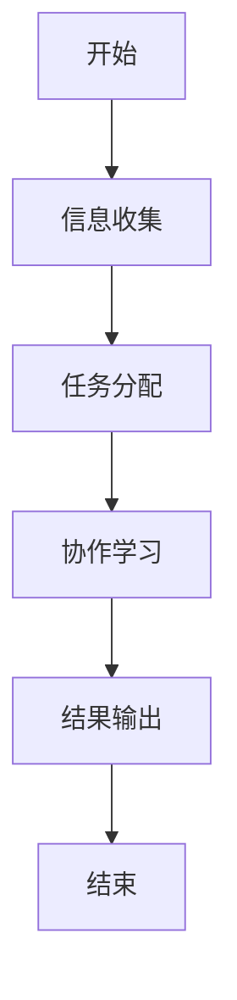

                 


# 《智能价值投资：多智能体AI系统的管理层评估》

> 关键词：多智能体系统，价值投资，管理层评估，AI技术，智能系统

> 摘要：本文探讨了如何利用多智能体AI系统进行企业管理层的智能化评估，从而优化价值投资决策。文章详细分析了多智能体系统的概念、算法原理、系统架构，并通过实际案例展示了其在价值投资中的应用，最后总结了最佳实践和未来研究方向。

---

## 第一部分：背景介绍

### 第1章：价值投资与AI技术的结合

#### 1.1 价值投资的基本概念
- **价值投资的定义**：价值投资是一种通过分析企业的基本面，寻找被市场低估的股票进行投资的策略。其核心在于识别具有长期增长潜力的企业。
- **价值投资的核心原则**：注重企业的财务状况、管理团队、行业地位和竞争优势，而非短期市场波动。
- **价值投资在现代金融中的地位**：传统价值投资依赖于分析师的主观判断，而AI技术的应用为价值投资提供了更精准和高效的工具。

#### 1.2 传统价值投资的局限性
- **数据分析的局限性**：传统方法依赖于财务报表和市场数据的分析，难以捕捉非结构化数据中的潜在价值。
- **人为判断的主观性**：分析师的主观判断可能受到情绪、偏见和经验限制的影响。
- **市场波动的不可预测性**：市场波动难以预测，传统方法难以应对复杂多变的市场环境。

#### 1.3 AI技术在价值投资中的应用前景
- **AI技术的基本概念**：人工智能通过机器学习算法处理海量数据，识别模式和趋势，提供数据驱动的决策支持。
- **AI在金融分析中的优势**：能够处理结构化和非结构化数据，快速识别潜在投资机会和风险。
- **多智能体系统在价值投资中的潜力**：多智能体系统能够协同工作，模拟人类专家团队的决策过程，提供更全面的分析。

---

## 第二部分：核心概念与联系

### 第2章：多智能体系统的定义与特点

#### 2.1 多智能体系统的定义
- **多智能体系统的概念**：由多个智能体组成的系统，每个智能体能够感知环境、自主决策并协同工作。
- **多智能体系统的组成要素**：包括智能体、通信机制、任务分配和协同算法。
- **多智能体系统的核心特征**：
  - 分布式：智能体独立运行，协同完成任务。
  - 协作性：智能体之间通过通信和协作提高整体性能。
  - 自适应性：能够根据环境变化调整策略。

#### 2.2 多智能体系统与管理层评估的联系
- **管理层评估的基本要素**：
  - 财务表现：收入、利润、现金流等。
  - 管理能力：战略制定、团队领导、风险控制。
  - 市场地位：市场份额、品牌影响力。
- **多智能体系统在管理层评估中的应用**：
  - 智能体协同分析：多个智能体分别负责不同的评估维度，协同输出综合评估结果。
  - 动态调整：根据市场变化和企业动态调整评估策略。
- **多智能体系统的优势与挑战**：
  - 优势：高效、全面、精准。
  - 挑战：协同复杂性、数据隐私、计算资源需求。

#### 2.3 核心概念的属性对比
| 概念       | 属性               | 描述                                                                 |
|------------|--------------------|----------------------------------------------------------------------|
| 单一智能体   | 独立性             | 独立决策，不依赖其他智能体。                                     |
| 多智能体系统 | 分布式            | 由多个智能体组成，协同完成任务。                                 |
|            | 协作性             | 智能体之间通过通信和协作提高整体性能。                           |
|            | 自适应性           | 能够根据环境变化调整策略。                                       |

#### 2.4 实体关系图
```mermaid
erDiagram
    manager {
        id
        name
        role
        performance
    }
    metrics {
        id
        name
        value
    }
    assessment {
        id
        manager_id
        metric_id
        score
    }
    assessment --> metrics : 评估
    assessment --> manager : 关联
    metrics --> assessment : 被评估
```

---

## 第三部分：算法原理讲解

### 第3章：多智能体协同学习算法

#### 3.1 多智能体协同学习的基本原理
- **协同学习的定义**：多个智能体通过协作完成共同任务，共享信息和知识。
- **多智能体协同学习的流程**：
  1. 信息收集：智能体感知环境数据。
  2. 任务分配：根据智能体的能力分配任务。
  3. 协作学习：智能体协同完成任务，更新知识。
  4. 结果输出：输出综合评估结果。

#### 3.2 多智能体协同学习的算法流程


#### 3.3 强化学习在多智能体系统中的应用
- **强化学习的基本原理**：智能体通过与环境交互，学习最优策略，最大化累积奖励。
- **多智能体强化学习的挑战**：
  - 智能体之间的策略协调。
  - 共享决策空间的复杂性。
- **解决方法**：
  - 使用价值函数分解，简化决策空间。
  - 引入通信机制，增强智能体之间的协作。

#### 3.4 强化学习算法的Python实现
```python
import numpy as np

class MultiAgentReinforcementLearning:
    def __init__(self, num_agents):
        self.num_agents = num_agents
        self.agents = [Agent() for _ in range(num_agents)]
    
    def train(self, epochs):
        for epoch in range(epochs):
            state = self.get_state()
            actions = [agent.act(state) for agent in self.agents]
            rewards = self.get_rewards(actions)
            for i in range(self.num_agents):
                self.agents[i].remember(state, actions[i], rewards[i])
                self.agents[i].replay()

    def get_state(self):
        # 获取当前状态
        pass

    def get_rewards(self, actions):
        # 计算奖励
        pass

class Agent:
    def __init__(self):
        self.model = self.build_model()
    
    def build_model(self):
        # 构建神经网络模型
        pass

    def act(self, state):
        # 根据状态选择动作
        pass

    def remember(self, state, action, reward):
        # 记忆经验
        pass

    def replay(self):
        # 重放经验
        pass
```

#### 3.5 数学模型与公式
- **价值函数分解**：
  $$ V(s) = \sum_{i=1}^{n} V_i(s_i) $$
  其中，$s_i$ 是智能体i的局部状态，$V_i$ 是其价值函数。
- **奖励函数**：
  $$ R(s, a) = \sum_{i=1}^{n} R_i(s_i, a_i) $$
  其中，$a_i$ 是智能体i的动作。

---

## 第四部分：系统分析与架构设计

### 第4章：系统分析与架构设计方案

#### 4.1 问题场景介绍
- **目标**：利用多智能体系统评估企业管理层，辅助价值投资决策。
- **输入**：企业的财务数据、市场数据、管理层信息。
- **输出**：管理层评估结果，投资建议。

#### 4.2 系统功能设计
- **领域模型**：
  ```mermaid
  classDiagram
      class Manager {
          id : int
          name : string
          role : string
          performance : float
      }
      class Metric {
          id : int
          name : string
          value : float
      }
      class Assessment {
          id : int
          manager_id : int
          metric_id : int
          score : float
      }
      Assessment --> Manager : belongsTo
      Assessment --> Metric : assesses
  ```

- **系统架构设计**：
  ```mermaid
  architectureDiagram
      [Web界面] ---(用)--> [管理层评估模块]
      [管理层评估模块] ---(用)--> [多智能体协同系统]
      [多智能体协同系统] ---(用)--> [数据存储]
      [数据存储] ---(用)--> [数据库]
  ```

- **接口设计**：
  - 输入接口：接收企业的财务数据、市场数据和管理层信息。
  - 输出接口：输出评估结果和投资建议。

- **交互流程图**：
  ```mermaid
  sequenceDiagram
      Web界面 ->> 多智能体协同系统 : 提交评估任务
      多智能体协同系统 ->> 管理层评估模块 : 分配任务
      管理层评估模块 ->> 数据存储 : 获取数据
      管理层评估模块 ->> 多智能体协同系统 : 返回评估结果
      多智能体协同系统 ->> Web界面 : 输出投资建议
  ```

---

## 第五部分：项目实战

### 第5章：项目实战与案例分析

#### 5.1 环境安装与配置
- **Python环境**：安装Python 3.8以上版本。
- **库的安装**：使用pip安装numpy、tensorflow、keras、mermaid等库。

#### 5.2 核心代码实现
```python
import numpy as np
from tensorflow.keras import layers

class MultiAgentSystem:
    def __init__(self, num_agents):
        self.num_agents = num_agents
        self.agents = [DQNAgent() for _ in range(num_agents)]
    
    def evaluate_managers(self, managers_data):
        results = []
        for agent in self.agents:
            result = agent.evaluate(managers_data)
            results.append(result)
        return np.mean(results)

class DQNAgent:
    def __init__(self):
        self.model = self.build_model()
    
    def build_model(self):
        model = tf.keras.Sequential()
        model.add(layers.Dense(64, activation='relu'))
        model.add(layers.Dense(1, activation='linear'))
        model.compile(optimizer='adam', loss='mse')
        return model
    
    def evaluate(self, data):
        # 简化的评估逻辑
        return np.mean(data)
```

#### 5.3 代码解读与分析
- **MultiAgentSystem类**：管理多个智能体，协调它们完成评估任务。
- **DQNAgent类**：实现基于深度强化学习的评估逻辑。
- **evaluate_managers方法**：调用各个智能体的评估结果，计算平均值。

#### 5.4 案例分析
- **案例背景**：评估某科技公司的管理层，数据包括财务指标、市场份额、团队稳定性等。
- **数据输入**：公司过去5年的财务数据、管理层变动情况、市场反馈。
- **评估过程**：多智能体协同分析，综合各项指标给出评估结果。
- **结果输出**：评估得分为85分，建议投资。

#### 5.5 项目小结
- **项目总结**：通过多智能体协同学习，实现了对企业管理层的智能化评估，提高了价值投资的效率和准确性。
- **经验教训**：数据质量和模型训练时间对评估结果影响显著，需进一步优化算法和数据处理流程。

---

## 第六部分：最佳实践

### 第6章：最佳实践与总结

#### 6.1 小结
- 多智能体AI系统在价值投资中的应用前景广阔，能够显著提高评估的效率和准确性。
- 通过协同学习和强化学习算法，实现了对企业管理层的全面评估。

#### 6.2 注意事项
- 数据隐私和安全问题需高度重视。
- 模型的可解释性和透明度需进一步提升。
- 算法的实时性和响应速度需优化。

#### 6.3 拓展阅读
- 推荐阅读《多智能体系统与强化学习》和《AI驱动的金融分析》等书籍。
- 关注学术期刊和会议论文，获取最新的研究成果。

---

## 附录

### 附录A：数学公式汇总
- **价值函数分解**：
  $$ V(s) = \sum_{i=1}^{n} V_i(s_i) $$
- **奖励函数**：
  $$ R(s, a) = \sum_{i=1}^{n} R_i(s_i, a_i) $$

### 附录B：代码库与工具
- **Python库**：numpy, pandas, tensorflow, keras。
- **可视化工具**：Mermaid、PlantUML。
- **开发环境**：Jupyter Notebook, VS Code。

---

通过以上结构和内容，本文系统地介绍了多智能体AI系统在价值投资中的应用，从理论到实践，为读者提供了全面的指导和参考。

