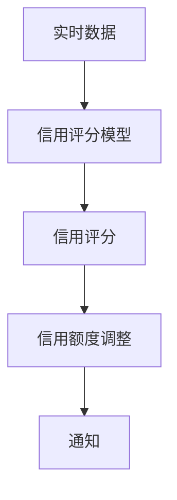
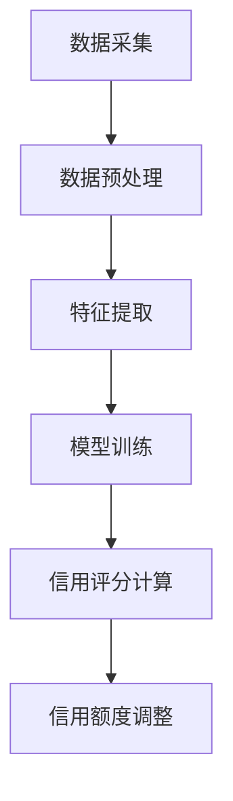
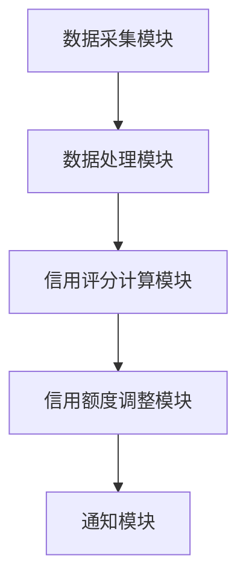
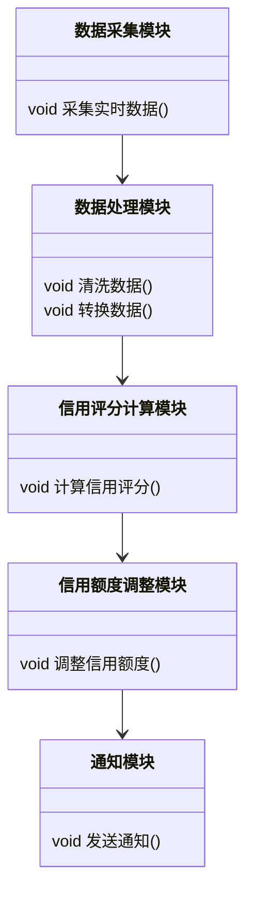
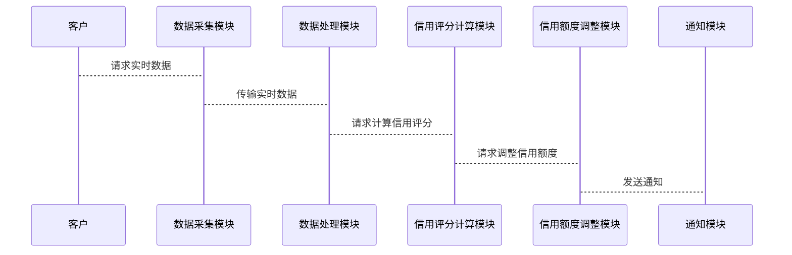

                 


# 智能企业信用额度动态调整系统

## 关键词：智能企业，信用额度，动态调整，人工智能，大数据分析，系统架构

## 摘要：本文详细探讨了智能企业信用额度动态调整系统的构建与实现，结合实时数据分析和人工智能技术，分析了系统的背景、核心概念、算法原理、系统架构，并通过项目实战和最佳实践提供了深度解析。

---

# 第一部分: 智能企业信用额度动态调整系统背景介绍

## 第1章: 问题背景与描述

### 1.1 信用额度动态调整的必要性

#### 1.1.1 传统信用额度管理的局限性
传统的信用额度管理方式通常基于历史交易数据和静态评估模型，存在以下问题：
- **数据滞后性**：无法实时反映企业的最新经营状况。
- **评估单一性**：仅依赖财务报表，忽略了市场变化和企业实时动态。
- **调整周期长**：信用额度调整往往需要人工审核，周期较长，难以满足企业快速变化的需求。

#### 1.1.2 动态调整信用额度的商业价值
动态调整信用额度能够帮助企业：
- **降低风险**：及时识别潜在风险，防止逾期和坏账的发生。
- **提升效率**：自动化调整机制减少人工干预，提高管理效率。
- **增强客户关系**：根据企业实时状况灵活调整额度，提升客户满意度。

#### 1.1.3 数字化转型对企业信用管理的影响
随着企业数字化转型的推进，实时数据分析和人工智能技术的应用，使得信用额度管理更加智能化和动态化。

### 1.2 问题描述

#### 1.2.1 信用额度动态调整的核心问题
- 如何实时获取并处理企业的动态数据。
- 如何构建高效的信用评分模型。
- 如何实现信用额度的动态调整与通知。

#### 1.2.2 企业信用管理中的痛点分析
- 数据分散：企业数据分布于多个系统，难以实时整合。
- 模型单一：传统信用评分模型难以适应实时变化。
- 调整机制不灵活：缺乏自动化和智能化的调整机制。

#### 1.2.3 动态调整信用额度的实现目标
构建一个基于实时数据分析和人工智能的信用额度动态调整系统，实现以下目标：
- 实时监控企业经营状况。
- 自动计算信用评分。
- 动态调整信用额度并及时通知相关人员。

### 1.3 问题解决思路

#### 1.3.1 数据驱动的信用额度调整方法
通过实时采集和处理企业经营数据，结合历史数据，构建动态信用评分模型。

#### 1.3.2 基于人工智能的信用评估模型
利用机器学习算法，训练信用评分模型，实现对企业的实时信用评估。

#### 1.3.3 动态调整的实现机制
通过设置阈值和规则，当企业信用评分触发阈值时，自动调整信用额度。

### 1.4 系统边界与外延

#### 1.4.1 系统功能边界
系统主要功能包括数据采集、信用评分计算、信用额度调整和通知。

#### 1.4.2 系统与外部系统的交互
系统需要与企业的财务系统、销售系统和客户关系管理系统进行数据交互。

#### 1.4.3 系统功能的扩展性
系统设计具有良好的扩展性，未来可以增加更多的数据源和调整规则。

### 1.5 概念结构与核心要素

#### 1.5.1 核心概念的定义
- **实时数据**：企业最新的经营数据，如销售额、利润、现金流等。
- **信用评分**：基于实时数据和历史数据计算的企业信用评分。
- **信用额度**：企业可使用的信用额度，根据信用评分动态调整。

#### 1.5.2 核心要素的组成
- 数据源：实时数据和历史数据。
- 信用评分模型：基于机器学习的模型。
- 调整规则：信用额度调整的触发条件和调整幅度。

#### 1.5.3 概念结构图


---

## 第2章: 核心概念与原理

### 2.1 系统核心概念

#### 2.1.1 实时数据处理
实时数据处理是系统的核心，涉及数据的采集、清洗和分析。

#### 2.1.2 风险评估模型
基于机器学习的风险评估模型，用于计算企业的信用评分。

#### 2.1.3 信用评分机制
信用评分机制是根据实时数据和模型输出，计算企业的信用评分。

### 2.2 核心概念的联系

#### 2.2.1 实时数据与信用评分的关系
实时数据是信用评分的基础，通过实时数据的输入，信用评分模型计算出信用评分。

#### 2.2.2 风险评估与信用额度调整的关联
信用评分直接影响信用额度的调整，评分越高，信用额度越大。

#### 2.2.3 系统各模块的协同工作
系统各模块协同工作，实现数据采集、处理、评分计算和额度调整。

### 2.3 核心概念对比表

| 概念属性 | 实时数据处理 | 传统静态评估 |
|----------|--------------|--------------|
| 数据来源 | 实时数据流   | 历史数据     |
| 处理方式 | 实时处理     | 定期处理     |
| 评估频率 | 实时评估     | 定期评估     |

### 2.4 ER实体关系图

```mermaid
erd
    客户 --> (有) 信用记录
    信用记录 --> (属于) 企业
    企业 --> (有) 实时数据
    实时数据 --> (影响) 信用评分
    信用评分 --> (决定) 信用额度
```

---

## 第3章: 算法原理

### 3.1 算法原理概述

#### 3.1.1 信用评分模型
信用评分模型是基于机器学习的模型，用于计算企业的信用评分。

#### 3.1.2 算法选择
选择合适的机器学习算法，如线性回归、逻辑回归或随机森林。

### 3.2 算法流程图



### 3.3 算法实现代码

```python
import pandas as pd
from sklearn.model_selection import train_test_split
from sklearn.linear_model import LinearRegression

# 数据加载
data = pd.read_csv('credit_data.csv')

# 数据分割
X = data[['销售额', '利润', '现金流']]
y = data['信用评分']
X_train, X_test, y_train, y_test = train_test_split(X, y, test_size=0.2, random_state=42)

# 模型训练
model = LinearRegression()
model.fit(X_train, y_train)

# 预测
y_pred = model.predict(X_test)
```

### 3.4 数学模型和公式

#### 3.4.1 线性回归模型
$$ y = \beta_0 + \beta_1x_1 + \beta_2x_2 + ... + \beta_nx_n $$

#### 3.4.2 逻辑回归模型
$$ P(y=1|x) = \frac{e^{\beta_0 + \beta_1x}}{1 + e^{\beta_0 + \beta_1x}} $$

---

## 第4章: 系统分析与架构设计

### 4.1 系统架构设计

#### 4.1.1 系统架构图



#### 4.1.2 系统功能设计



### 4.2 系统接口设计

#### 4.2.1 API接口

| 接口名称 | 接口描述 | 输入参数 | 输出参数 |
|----------|----------|-----------|-----------|
| get_realtime_data | 获取实时数据 | 无 | 实时数据 |
| calculate_credit_score | 计算信用评分 | 实时数据 | 信用评分 |
| adjust_credit_limit | 调整信用额度 | 信用评分 | 新信用额度 |

#### 4.2.2 交互流程图



---

## 第5章: 项目实战

### 5.1 环境安装

#### 5.1.1 安装Python

```bash
python --version
pip install --upgrade pip
```

#### 5.1.2 安装依赖库

```bash
pip install pandas scikit-learn
```

### 5.2 核心代码实现

#### 5.2.1 数据加载与预处理

```python
import pandas as pd

data = pd.read_csv('credit_data.csv')
data = data.dropna()
```

#### 5.2.2 模型训练与预测

```python
from sklearn.model_selection import train_test_split
from sklearn.linear_model import LinearRegression

X = data[['销售额', '利润', '现金流']]
y = data['信用评分']

X_train, X_test, y_train, y_test = train_test_split(X, y, test_size=0.2, random_state=42)

model = LinearRegression()
model.fit(X_train, y_train)

y_pred = model.predict(X_test)
```

#### 5.2.3 信用额度调整

```python
调整幅度 = max(0, min(10, (y_pred[0] - y_test[0]) * 10))
new_credit_limit = y_test[0] + 调整幅度
```

### 5.3 实际案例分析

#### 5.3.1 案例背景

某企业最近的销售额下降，利润减少，现金流紧张，信用评分从85分下降到75分。

#### 5.3.2 案例分析

根据模型计算，信用评分下降10分，触发信用额度调整机制，信用额度从100万调整到80万。

#### 5.3.3 案例结果

企业及时调整经营策略，信用评分回升，信用额度恢复至100万。

---

## 第6章: 最佳实践

### 6.1 小结

智能企业信用额度动态调整系统通过实时数据分析和人工智能技术，实现信用额度的动态调整，降低企业风险，提升管理效率。

### 6.2 注意事项

- 数据安全：确保实时数据的安全传输和存储。
- 模型优化：定期更新信用评分模型，提高准确性。
- 系统监控：实时监控系统运行状态，及时处理异常情况。

### 6.3 拓展阅读

- 《机器学习实战》
- 《企业信用管理》
- 《实时数据分析技术》

---

# 结语

智能企业信用额度动态调整系统是企业信用管理的重要工具，通过实时数据分析和人工智能技术，实现信用额度的动态调整，帮助企业降低风险，提升管理效率，增强客户关系。未来，随着技术的不断发展，系统将更加智能化和自动化，为企业信用管理提供更强大的支持。

