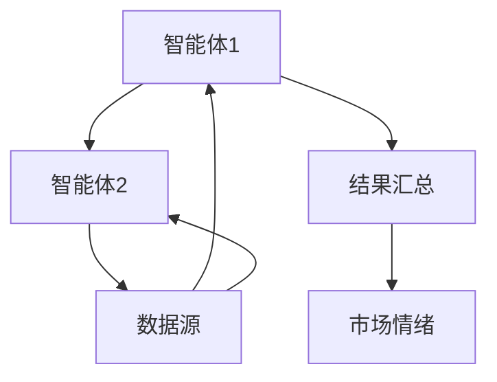
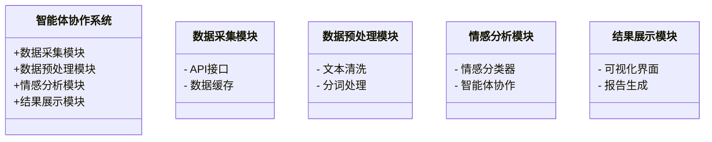
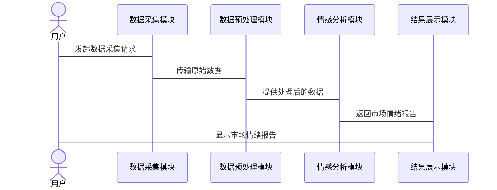

                 


# 智能体协作分析社交媒体数据：捕捉市场情绪变化

> **关键词**: 智能体协作、社交媒体数据、市场情绪分析、情感分析、自然语言处理、分布式计算

> **摘要**: 本文探讨了利用智能体协作技术分析社交媒体数据，捕捉市场情绪变化的方法。通过详细分析智能体协作的原理、情感分析算法、系统架构设计以及实际项目案例，展示了如何高效地从社交媒体数据中提取有价值的信息，为企业决策提供实时洞察。

---

# 第一部分: 智能体协作分析社交媒体数据的背景与基础

# 第1章: 智能体协作与社交媒体数据分析概述

## 1.1 问题背景与目标
### 1.1.1 社会媒体数据的爆炸性增长
社交媒体平台每天产生海量数据，包括文本、图片、视频和互动行为。这些数据蕴含着丰富的市场信息，但其复杂性和多样性使得传统分析方法难以应对。

### 1.1.2 市场情绪分析的重要性
市场情绪是影响投资决策的重要因素。通过分析社交媒体上的用户评论、点赞、分享等行为，可以实时捕捉市场情绪的变化，帮助企业做出更快的反应。

### 1.1.3 智能体协作的优势与必要性
智能体协作通过分布式计算和多智能体协同，能够高效处理海量数据，并实时更新分析结果。这种方法在社交媒体数据分析中具有显著优势。

## 1.2 问题描述与解决路径
### 1.2.1 社会媒体数据的复杂性
社交媒体数据不仅包括文本，还包括图片、视频等非结构化数据，这增加了分析的难度。

### 1.2.2 市场情绪分析的挑战
市场情绪分析需要处理数据的实时性、多样性和情感的主观性。传统方法难以满足这些要求。

### 1.2.3 智能体协作的解决方案
通过智能体协作，可以将复杂任务分解为多个子任务，由多个智能体协同完成，从而提高分析效率和准确性。

## 1.3 智能体协作的边界与外延
### 1.3.1 智能体协作的定义与特征
智能体协作是指多个智能体通过通信和协作完成共同任务的过程。其特征包括分布式性、自主性和协作性。

### 1.3.2 相关概念的对比分析
对比分析了智能体协作与传统数据处理、分布式计算和机器学习的区别与联系。

### 1.3.3 智能体协作的适用场景
适用于需要实时处理海量数据、复杂任务分解和多团队协作的场景。

## 1.4 核心概念与组成要素
### 1.4.1 智能体协作的核心要素
包括智能体、通信机制、协作任务和结果汇总。

### 1.4.2 社会媒体数据的特征分析
社交媒体数据具有实时性、多样性和社交网络结构。

### 1.4.3 市场情绪分析的指标体系
包括情感极性、情感强度、情感一致性等指标。

## 1.5 本章小结
本章介绍了智能体协作在社交媒体数据分析中的背景、目标和挑战，为后续章节奠定了基础。

---

# 第二部分: 智能体协作的核心概念与联系

# 第2章: 智能体协作的核心原理

## 2.1 智能体协作的原理与机制
### 2.1.1 分布式智能体的定义与特点
分布式智能体通过独立节点完成任务，具有高可靠性和可扩展性。

### 2.1.2 智能体之间的通信与协作
智能体通过消息传递机制进行通信，协作完成共同任务。

### 2.1.3 协作任务的分配与优化
任务分配采用负载均衡和优化算法，确保高效协作。

## 2.2 智能体协作的核心概念对比
### 2.2.1 智能体协作与传统数据处理的对比
对比了传统数据处理和智能体协作在处理复杂任务时的优劣。

### 2.2.2 分布式计算与智能体协作的异同
分布式计算强调资源分配，智能体协作强调智能体之间的协作。

### 2.2.3 智能体协作与机器学习的结合
智能体协作可以与机器学习算法结合，提升分析精度。

## 2.3 实体关系图与协作流程


## 2.4 本章小结
本章详细分析了智能体协作的原理和机制，并通过实体关系图展示了协作流程。

---

# 第三部分: 智能体协作的算法原理与数学模型

# 第3章: 情感分析算法原理

## 3.1 情感分析的数学模型
### 3.1.1 基于概率论的情感分类模型
使用贝叶斯定理进行文本分类，计算每个词语对情感的影响概率。

### 3.1.2 基于深度学习的情感分析模型
采用LSTM网络处理序列数据，捕捉文本的情感倾向。

### 3.1.3 情感分析的评价指标
包括准确率、召回率、F1值等。

## 3.2 智能体协作的算法流程
### 3.2.1 数据预处理
包括文本清洗、分词和特征提取。

### 3.2.2 情感分析模型训练
使用标注数据训练情感分类器。

### 3.2.3 智能体协作实现
多个智能体协同完成数据处理和模型训练。

---

# 第四部分: 智能体协作的系统分析与架构设计

# 第4章: 智能体协作系统的架构设计

## 4.1 问题场景介绍
### 4.1.1 社交媒体数据的实时处理需求
### 4.1.2 分布式系统的扩展性要求
### 4.1.3 系统的高可用性要求

## 4.2 系统功能设计
### 4.2.1 数据采集模块
负责从社交媒体平台获取数据。

### 4.2.2 数据预处理模块
清洗和转换数据，提取有用特征。

### 4.2.3 情感分析模块
使用智能体协作进行情感分析，输出市场情绪指标。

### 4.2.4 结果展示模块
将分析结果可视化，提供直观的市场情绪报告。

## 4.3 系统架构设计


## 4.4 系统接口设计
### 4.4.1 数据接口
定义数据采集和传输的接口规范。

### 4.4.2 智能体协作接口
定义智能体之间的通信和协作接口。

## 4.5 系统交互设计


---

# 第五部分: 智能体协作的项目实战

# 第5章: 项目实战与案例分析

## 5.1 环境安装与配置
### 5.1.1 安装Python环境
使用Anaconda安装Python 3.8及以上版本。

### 5.1.2 安装依赖库
安装自然语言处理库（如spaCy）、深度学习库（如Keras）和分布式计算库（如Dask）。

## 5.2 系统核心实现
### 5.2.1 数据采集模块实现
使用Twitter API采集社交媒体数据。

```python
import tweepy

# 授权认证
auth = tweepy.OAuth1UserHandler(consumer_key, consumer_secret, access_token, access_token_secret)
api = tweepy.API(auth)

# 采集数据
tweets = api.search(q=query, count=100)
```

### 5.2.2 情感分析模块实现
使用LSTM进行情感分析。

```python
import tensorflow as tf
from tensorflow.keras import layers

model = tf.keras.Sequential()
model.add(layers.Embedding(vocab_size, 64))
model.add(layers.LSTM(64))
model.add(layers.Dense(2, activation='softmax'))
model.compile(loss='sparse_categorical_crossentropy', optimizer='adam', metrics=['accuracy'])
```

### 5.2.3 智能体协作实现
实现智能体之间的通信与协作。

```python
from distributed import Client

client = Client('tcp://127.0.0.1:8786')
future = client.submit(task_func, *args)
result = future.result()
```

## 5.3 案例分析与解读
### 5.3.1 数据预处理案例
对社交媒体数据进行清洗和分词处理。

### 5.3.2 情感分析案例
使用训练好的模型分析特定话题的市场情绪。

### 5.3.3 系统性能分析
分析系统的处理效率和扩展性。

## 5.4 本章小结
通过实际项目案例，展示了智能体协作在社交媒体数据分析中的应用。

---

# 第六部分: 总结与扩展

# 第6章: 总结与扩展

## 6.1 最佳实践与经验分享
### 6.1.1 数据处理的注意事项
### 6.1.2 模型优化的技巧
### 6.1.3 系统部署的建议

## 6.2 小结
回顾了智能体协作在社交媒体数据分析中的应用，总结了关键技术和实现方法。

## 6.3 注意事项
### 6.3.1 数据隐私与合规性
确保数据处理符合相关法律法规。

### 6.3.2 系统性能优化
通过分布式计算和负载均衡提升系统性能。

## 6.4 拓展阅读
推荐相关领域的书籍和论文，供读者进一步学习。

---

通过以上内容，本文详细介绍了智能体协作在社交媒体数据分析中的应用，从理论到实践，为读者提供了全面的指导。

