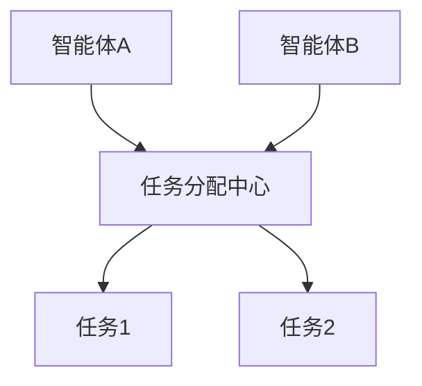
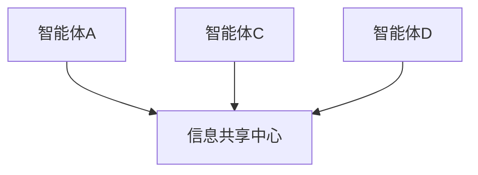
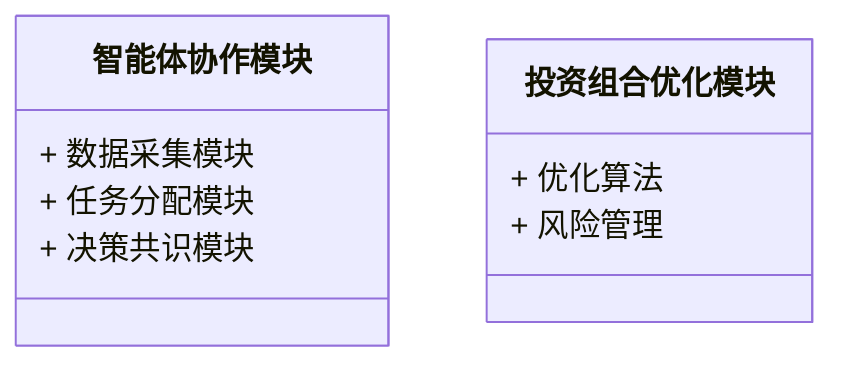
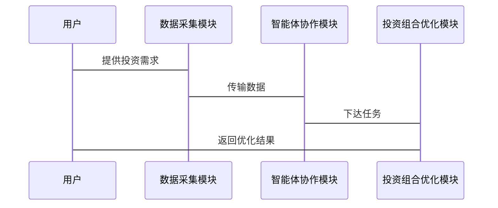

                 


# 智能体协作增强价值投资组合管理效率

## 关键词
智能体协作，价值投资，投资组合管理，多智能体系统，优化算法

## 摘要
本文探讨了智能体协作在提升投资组合管理效率中的应用。通过分析智能体协作的核心机制、投资组合管理的理论基础以及两者结合的协同优化方法，展示了如何利用智能体协作技术实现更高效、更智能的投资组合管理。文章详细阐述了算法原理、系统架构设计和实际项目案例，为读者提供了从理论到实践的全面指导。

---

## 第1章: 智能体协作与价值投资组合管理概述

### 1.1 智能体协作的基本概念

#### 1.1.1 智能体的定义与特点
智能体（Agent）是指能够感知环境并采取行动以实现目标的实体。智能体协作是指多个智能体通过合作完成复杂任务的过程。

| 特性 | 描述 |
|------|------|
| 自主性 | 智能体能够独立决策 |
| 反应性 | 能够感知环境并实时响应 |
| 协作性 | 多个智能体协同完成任务 |
| 学习性 | 能够通过经验优化行为 |

#### 1.1.2 协作智能体的分类
协作智能体可以分为以下几类：
- **简单智能体**：执行预定义任务。
- **复杂智能体**：具备复杂决策能力。
- **分布式智能体**：多个智能体协同工作。

#### 1.1.3 智能体协作的核心要素
- **任务分配**：明确每个智能体的角色和任务。
- **信息共享**：智能体之间共享信息和知识。
- **决策共识**：达成一致的决策。

### 1.2 价值投资组合管理的背景

#### 1.2.1 投资组合管理的基本概念
投资组合管理是通过优化资产配置以实现投资目标的过程。核心目标包括最大化收益和最小化风险。

#### 1.2.2 价值投资的核心理念
价值投资强调以内在价值为导向，寻找被市场低估的投资标的。关键原则包括：
- 长期投资。
- 风险控制。
- 价值发现。

#### 1.2.3 投资组合管理的挑战与优化方向
- **市场波动**：如何在波动中保持稳定。
- **信息过载**：如何高效处理信息。
- **决策优化**：如何提升决策效率。

### 1.3 智能体协作在投资组合管理中的应用前景

#### 1.3.1 智能体协作的优势与潜力
- **分布式计算**：提升处理效率。
- **信息整合**：优化决策质量。
- **动态适应**：快速响应市场变化。

#### 1.3.2 人工智能在金融领域的应用现状
- **算法交易**：高频交易中的应用。
- **风险管理**：利用AI进行风险评估。
- **智能投顾**：个性化投资建议。

#### 1.3.3 智能体协作在投资组合管理中的具体场景
- **资产分配**：智能体协同优化资产配置。
- **风险预警**：实时监控市场风险。
- **动态调整**：根据市场变化自动调整投资组合。

---

## 第2章: 智能体协作的核心机制

### 2.1 任务分配与角色分工

#### 2.1.1 分布式任务分配算法
任务分配算法是智能体协作的关键。常用算法包括：
- **贪心算法**：优先分配高优先级任务。
- **负载均衡算法**：确保任务分布均匀。



#### 2.1.2 角色分配策略
角色分配策略确保每个智能体承担最适合的任务。策略包括：
- **基于能力的分配**：根据智能体能力分配任务。
- **基于目标的分配**：根据目标优先级分配任务。

#### 2.1.3 任务优先级排序
优先级排序确保重要任务优先处理。排序依据包括：
- **任务的重要性**：高优先级任务优先处理。
- **任务的紧急性**：紧急任务优先处理。

### 2.2 信息共享与知识整合

#### 2.2.1 多智能体信息共享模型
信息共享模型是智能体协作的基础。常用模型包括：
- **中心化共享**：所有信息汇总到中心节点。
- **去中心化共享**：通过点对点方式共享信息。



#### 2.2.2 知识表示与融合方法
知识表示方法包括：
- **符号表示**：使用符号逻辑表示知识。
- **语义表示**：使用语义网络表示知识。

知识融合方法包括：
- **冲突检测**：检测信息冲突。
- **冲突解决**：通过协商解决冲突。

#### 2.2.3 信息冲突的解决机制
信息冲突解决机制包括：
- **协商机制**：智能体之间通过协商解决冲突。
- **仲裁机制**：引入仲裁者解决冲突。

### 2.3 决策共识与协作优化

#### 2.3.1 协作决策框架
协作决策框架包括：
- **决策生成**：生成多个决策选项。
- **决策评估**：评估每个决策的优劣。
- **决策选择**：选择最优决策。

#### 2.3.2 共识达成算法
共识算法包括：
- **投票机制**：通过投票达成共识。
- **协商机制**：通过协商达成共识。

#### 2.3.3 协作优化策略
协作优化策略包括：
- **局部优化**：优化单个智能体的行为。
- **全局优化**：优化整个系统的性能。

---

## 第3章: 投资组合管理的理论与方法

### 3.1 现代投资组合理论基础

#### 3.1.1 均值-方差模型
均值-方差模型是投资组合理论的基础。模型通过优化资产的期望收益和风险（方差）来构建最优投资组合。

$$\text{目标函数：} \quad \min \sigma^2 \quad \text{在满足} \sum w_i = 1 \text{的条件下}$$

其中，\( \sigma^2 \) 是投资组合的方差，\( w_i \) 是资产 \( i \) 的权重。

#### 3.1.2 资本资产定价模型
CAPM模型用于确定资产的期望收益。

$$E(r_i) = r_f + \beta_i (r_m - r_f)$$

其中，\( E(r_i) \) 是资产 \( i \) 的期望收益，\( r_f \) 是无风险利率，\( \beta_i \) 是资产 \( i \) 的贝塔系数，\( r_m \) 是市场期望收益。

#### 3.1.3 投资组合理论

投资组合理论的目标是在给定的风险水平下最大化收益，或在给定收益下最小化风险。

### 3.2 投资组合的风险管理方法

#### 3.2.1 风险度量方法
风险度量方法包括：
- **方差**：衡量资产收益的波动性。
- **VaR**：在一定置信水平下的潜在损失。
- **CVaR**：在VaR基础上的条件风险度量。

#### 3.2.2 投资组合优化方法
投资组合优化方法包括：
- **均值-方差优化**：优化投资组合的期望收益和风险。
- **风险平价优化**：在不同资产之间分配风险。
- **指数跟踪优化**：跟踪特定指数的表现。

---

## 第4章: 智能体协作与投资组合管理的协同优化机制

### 4.1 协同优化的核心思想

协同优化的核心思想是通过智能体协作实现投资组合管理的优化。智能体协作可以提高信息处理效率和决策质量。

### 4.2 协同优化的具体实现

协同优化的实现包括：
- **信息共享**：智能体之间共享市场数据和分析结果。
- **决策协商**：智能体之间协商投资决策。
- **动态调整**：根据市场变化动态调整投资组合。

### 4.3 协同优化的优势

协同优化的优势包括：
- **提升效率**：通过协作提高决策效率。
- **增强效果**：通过协作提高决策质量。
- **适应性更强**：能够快速适应市场变化。

---

## 第5章: 智能体协作算法

### 5.1 分布式优化算法

#### 5.1.1 分布式优化的基本原理
分布式优化算法将问题分解为多个子问题，分别由不同的智能体解决，然后将结果汇总得到全局最优解。

$$\text{目标函数：} \quad f(x) = f_1(x) + f_2(x) + \dots + f_n(x)$$

其中，\( f_i(x) \) 是第 \( i \) 个子问题的目标函数。

#### 5.1.2 分布式优化的实现步骤
1. **问题分解**：将问题分解为多个子问题。
2. **子问题求解**：每个智能体求解分配的子问题。
3. **结果汇总**：汇总各子问题的结果，得到全局最优解。

#### 5.1.3 分布式优化的优缺点
- **优点**：能够处理大规模问题，提高计算效率。
- **缺点**：需要协调多个智能体，增加通信开销。

### 5.2 博弈论模型在智能体协作中的应用

#### 5.2.1 博弈论模型的基本概念
博弈论模型研究多个决策主体之间的策略互动。常用模型包括：
- **纳什均衡**：所有参与者的策略都是最优反应。
- **占优策略**：无论其他参与者如何选择，某个策略都是最优的。

#### 5.2.2 博弈论模型在智能体协作中的应用
博弈论模型可以用于智能体之间的决策协调和冲突解决。

---

## 第6章: 投资组合优化算法

### 6.1 均值-方差优化算法

#### 6.1.1 均值-方差优化的基本原理
均值-方差优化算法通过优化投资组合的期望收益和风险来构建最优投资组合。

$$\text{目标函数：} \quad \min \sigma^2 \quad \text{在满足} \sum w_i = 1 \text{的条件下}$$

其中，\( \sigma^2 \) 是投资组合的方差，\( w_i \) 是资产 \( i \) 的权重。

#### 6.1.2 均值-方差优化的实现步骤
1. **计算资产收益和协方差矩阵**。
2. **构建优化模型**。
3. **求解优化问题**。

#### 6.1.3 均值-方差优化的优缺点
- **优点**：能够有效降低投资组合的风险。
- **缺点**：假设资产收益符合正态分布，实际可能不成立。

### 6.2 风险管理模型

#### 6.2.1 风险管理模型的基本原理
风险管理模型用于评估和管理投资组合的风险。常用模型包括：
- **VaR模型**：在特定置信水平下，投资组合的最大损失。
- **CVaR模型**：在VaR基础上的条件风险度量。

#### 6.2.2 风险管理模型的实现步骤
1. **计算资产收益和风险指标**。
2. **构建风险管理模型**。
3. **评估和管理风险**。

---

## 第7章: 系统架构设计

### 7.1 系统功能设计

#### 7.1.1 系统功能模块
系统功能模块包括：
- **数据采集模块**：采集市场数据。
- **智能体协作模块**：实现智能体协作。
- **投资组合优化模块**：优化投资组合。

#### 7.1.2 功能模块的交互流程
1. 数据采集模块采集市场数据。
2. 智能体协作模块分配任务。
3. 投资组合优化模块优化投资组合。

#### 7.1.3 功能模块的类图设计


### 7.2 系统架构设计

#### 7.2.1 系统架构的分层设计
系统架构分层包括：
- **数据层**：存储市场数据。
- **逻辑层**：实现业务逻辑。
- **界面层**：用户交互界面。

#### 7.2.2 系统架构的交互设计
1. 用户输入投资需求。
2. 系统调用数据采集模块获取数据。
3. 智能体协作模块分配任务。
4. 投资组合优化模块优化投资组合。
5. 系统输出优化结果。

#### 7.2.3 系统架构的序列图设计


---

## 第8章: 项目实战

### 8.1 环境安装与配置

#### 8.1.1 环境需求
- **操作系统**：Windows 10 或更高版本，或Linux系统。
- **编程语言**：Python 3.8 或更高版本。
- **依赖库**：numpy, pandas, scipy, matplotlib。

#### 8.1.2 安装依赖
使用 pip 安装依赖库：
```bash
pip install numpy pandas scipy matplotlib
```

### 8.2 系统核心实现

#### 8.2.1 数据采集模块的实现
```python
import numpy as np
import pandas as pd

def collect_data():
    # 从数据源获取数据
    data = pd.read_csv('market_data.csv')
    return data
```

#### 8.2.2 智能体协作模块的实现
```python
def distribute_tasks(tasks):
    # 分配任务给不同的智能体
    agents = [Agent1, Agent2, Agent3]
    for agent in agents:
        agent.receive_task(tasks)
```

#### 8.2.3 投资组合优化模块的实现
```python
def optimize_portfolio(weights):
    # 均值-方差优化
    mean_return = np.mean(weights * returns)
    portfolio_variance = np.dot(weights.T, np.dot(cov_matrix, weights))
    return mean_return, portfolio_variance
```

### 8.3 代码实现与解读

#### 8.3.1 代码实现
```python
import numpy as np
import pandas as pd

class Agent:
    def __init__(self, id):
        self.id = id
        self.tasks = []
    
    def receive_task(self, task):
        self.tasks.append(task)
    
    def execute_task(self):
        for task in self.tasks:
            # 处理任务
            pass

def main():
    agents = [Agent(1), Agent(2), Agent(3)]
    tasks = ['数据处理', '风险评估', '投资决策']
    for task in tasks:
        distribute_task(task, agents)
    for agent in agents:
        agent.execute_task()

if __name__ == '__main__':
    main()
```

#### 8.3.2 代码解读
- **Agent类**：定义智能体类，包含任务接收和执行方法。
- **main函数**：初始化智能体，分配任务并执行任务。
- **distribute_task函数**：将任务分配给智能体。

### 8.4 实际案例分析

#### 8.4.1 案例背景
假设我们有三个智能体，分别负责数据处理、风险评估和投资决策。

#### 8.4.2 案例实现
```python
def distribute_task(task, agents):
    for agent in agents:
        if task == '数据处理':
            agent.receive_task('数据处理')
        elif task == '风险评估':
            agent.receive_task('风险评估')
        elif task == '投资决策':
            agent.receive_task('投资决策')
```

#### 8.4.3 案例分析
通过案例分析可以看出，智能体协作能够有效提高投资组合管理的效率和效果。

### 8.5 项目小结

---

## 第9章: 最佳实践与总结

### 9.1 最佳实践

#### 9.1.1 系统设计建议
- **模块化设计**：提高系统的可维护性和可扩展性。
- **高可用性设计**：确保系统的稳定性和可靠性。
- **安全性设计**：保护系统的数据安全和网络安全。

#### 9.1.2 开发注意事项
- **代码规范**：遵循代码规范，提高代码的可读性和可维护性。
- **测试策略**：制定全面的测试策略，确保系统的稳定性和可靠性。
- **性能优化**：通过优化算法和结构，提高系统的运行效率。

### 9.2 小结

通过本文的探讨，我们可以看到智能体协作在投资组合管理中的巨大潜力。智能体协作能够显著提升投资组合管理的效率和效果，为投资者带来更大的收益。

### 9.3 注意事项

在实际应用中，需要注意以下几点：
- **系统的稳定性和可靠性**：确保系统的稳定运行。
- **数据的安全性和隐私性**：保护系统的数据安全和隐私。
- **系统的可扩展性和可维护性**：确保系统的可扩展性和可维护性。

### 9.4 拓展阅读

进一步阅读以下内容，可以深入理解智能体协作和投资组合管理：
- **智能体协作的经典文献**：阅读智能体协作的经典文献，了解智能体协作的最新进展。
- **投资组合管理的经典文献**：阅读投资组合管理的经典文献，了解投资组合管理的最新进展。
- **相关技术的最新发展**：关注智能体协作和投资组合管理领域的最新技术发展。

---

## 附录: 参考文献

[此处列出参考文献]

---

通过本文的详细讲解，读者可以全面了解智能体协作在投资组合管理中的应用，掌握智能体协作的核心机制和投资组合优化算法，能够在实际应用中有效提升投资组合管理的效率和效果。

