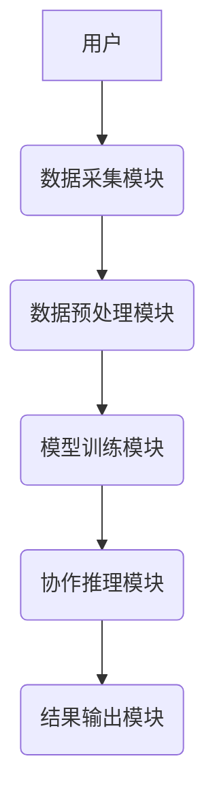
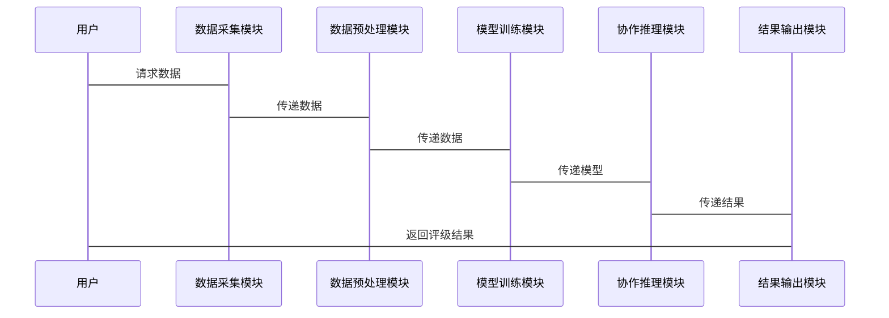

                 


# 智能体协作实现全面的公司信用评级

## 关键词：智能体协作，公司信用评级，分布式算法，系统架构，项目实战

## 摘要：  
随着人工智能技术的快速发展，智能体协作在公司信用评级中的应用逐渐成为热点。本文详细探讨了智能体协作在信用评级中的核心概念、算法原理、系统架构设计以及实际项目实现。通过理论分析和实践案例，展示了如何利用智能体协作技术提升信用评级的全面性和准确性。

---

# 第1章: 智能体协作与公司信用评级背景

## 1.1 智能体协作的概念与特点

### 1.1.1 智能体的基本定义  
智能体（Agent）是指具有感知环境、自主决策和执行任务能力的实体。智能体可以是软件程序，也可以是物理设备，其核心目标是通过协作完成复杂任务。

### 1.1.2 智能体协作的核心特点  
智能体协作是指多个智能体通过通信和协调，共同完成某个复杂任务的能力。其特点包括：  
1. **分布式性**：智能体分布在网络中，独立运行并互相协作。  
2. **自主性**：每个智能体都能自主决策，无需中央控制。  
3. **协调性**：通过通信协议实现智能体之间的信息共享与任务分配。  
4. **动态性**：协作过程能够根据环境变化实时调整。  

### 1.1.3 智能体协作的优势与挑战  
优势：  
- 提高系统的可靠性和容错性。  
- 能够处理大规模数据和复杂任务。  
- 支持实时协作和任务动态分配。  

挑战：  
- 智能体之间的通信开销大。  
- 协作算法的复杂性和计算成本高。  
- 数据隐私和安全问题。  

## 1.2 公司信用评级的定义与重要性

### 1.2.1 信用评级的基本概念  
信用评级是评估企业或个人在经济活动中履行债务能力的过程。评级结果通常以分数或等级的形式表示，如AAA、AA、A、BBB等。  

### 1.2.2 公司信用评级的重要性  
信用评级是金融决策的重要依据，直接影响企业的融资成本和市场信任度。准确的信用评级能够帮助投资者、银行和债权人做出更明智的决策。  

### 1.2.3 传统信用评级的局限性  
- 数据来源单一，难以覆盖多维度信息。  
- 人工干预较多，主观性强。  
- 计算模型复杂，难以实时更新。  

## 1.3 智能体协作在信用评级中的应用前景

### 1.3.1 智能体协作在信用评级中的优势  
- **数据全面性**：通过多个智能体协作，可以整合来自不同渠道的数据，如财务数据、市场数据、舆情数据等。  
- **实时性**：智能体能够实时处理数据，快速更新评级结果。  
- **决策智能化**：利用机器学习和大数据分析，提高评级的准确性和前瞻性。  

### 1.3.2 智能体协作在信用评级中的应用场景  
- **实时监控**：对企业经营状况进行实时跟踪，及时发现潜在风险。  
- **多维度分析**：结合财务、市场、法律等多方面因素，全面评估企业信用。  
- **动态调整**：根据市场变化和企业经营状况，动态调整评级结果。  

### 1.3.3 智能体协作信用评级的未来发展趋势  
- **智能化**：进一步提升智能体的自主决策能力。  
- **分布式化**：通过区块链等技术实现去中心化的信用评级。  
- **个性化**：针对不同行业、不同规模的企业，提供定制化的评级服务。  

## 1.4 本章小结  
本章介绍了智能体协作的基本概念和特点，分析了传统信用评级的局限性，并探讨了智能体协作在信用评级中的应用前景和未来发展趋势。

---

# 第2章: 智能体协作实现信用评级的核心概念

## 2.1 智能体协作的核心概念

### 2.1.1 智能体协作的基本原理  
智能体协作的核心是通过通信协议实现智能体之间的信息共享和任务分配。协作过程通常包括以下步骤：  
1. **感知环境**：智能体通过传感器或数据接口获取外部信息。  
2. **任务分配**：通过协商机制确定每个智能体的任务分工。  
3. **协作执行**：智能体协同完成任务，并实时调整协作策略。  
4. **结果反馈**：将协作结果反馈给其他智能体或中央控制系统。  

### 2.1.2 智能体协作的实现机制  
- **通信机制**：通过消息传递实现智能体之间的信息共享。  
- **协商机制**：利用分布式算法实现任务分配和角色分配。  
- **协调机制**：通过同步协议确保智能体协作的同步性和一致性。  

### 2.1.3 智能体协作的数学模型  
智能体协作的数学模型通常基于分布式优化理论，常见的模型包括：  
1. **多智能体强化学习（Multi-Agent Reinforcement Learning）**：通过多个智能体的互动学习，优化协作策略。  
2. **分布式博弈论（Distributed Game Theory）**：通过博弈论模型模拟智能体之间的竞争与合作。  

---

## 2.2 公司信用评级的核心要素

### 2.2.1 信用评级的主要指标  
公司信用评级的主要指标包括：  
- **财务指标**：如资产负债率、净利润率、现金流等。  
- **市场指标**：如行业地位、市场份额、品牌价值等。  
- **风险指标**：如违约概率、风险敞口、法律纠纷等。  

### 2.2.2 信用评级的分类与标准  
信用评级通常分为国际评级和国内评级，国际评级包括标普（S&P）、穆迪（Moody's）和惠誉（Fitch）等机构。评级标准主要基于企业的财务状况、经营能力和市场风险。  

### 2.2.3 信用评级的影响因素  
影响公司信用评级的主要因素包括：  
- **财务状况**：包括收入、利润、负债等。  
- **经营能力**：包括管理团队、研发能力、市场拓展能力等。  
- **外部环境**：包括宏观经济、行业政策、市场波动等。  

## 2.3 智能体协作与信用评级的结合

### 2.3.1 智能体协作在信用评级中的作用  
- **数据整合**：通过智能体协作，整合来自不同数据源的信息，如财务数据、市场数据、舆情数据等。  
- **实时分析**：利用智能体的实时处理能力，快速更新评级结果。  
- **决策支持**：通过智能体的协作分析，提供更准确的评级建议。  

### 2.3.2 智能体协作与信用评级的关联性  
- **数据驱动**：智能体协作能够处理海量数据，为信用评级提供全面支持。  
- **动态调整**：智能体协作能够实时响应市场变化，动态调整评级结果。  
- **分布式计算**：智能体协作能够利用分布式计算能力，提高评级效率。  

### 2.3.3 智能体协作信用评级的实现框架  
实现框架包括以下几个步骤：  
1. **数据采集**：智能体从多个数据源采集相关信息。  
2. **数据预处理**：对采集到的数据进行清洗和标准化处理。  
3. **模型训练**：利用机器学习算法训练信用评级模型。  
4. **协作推理**：智能体协作完成模型推理和结果优化。  
5. **结果输出**：将评级结果反馈给用户或相关系统。  

---

## 2.4 本章小结  
本章详细讲解了智能体协作的核心概念和信用评级的主要要素，分析了智能体协作在信用评级中的作用和实现框架。

---

# 第3章: 智能体协作实现信用评级的算法原理

## 3.1 分布式协作算法

### 3.1.1 分布式协作算法的基本原理  
分布式协作算法是一种基于分布式计算的协作方法，其核心是通过智能体之间的通信和协商实现任务分配和协作。  

### 3.1.2 分布式协作算法的实现流程  
1. **初始化**：设置智能体的初始状态和任务目标。  
2. **通信**：智能体之间通过消息传递共享信息。  
3. **协商**：智能体通过协商机制确定任务分工。  
4. **协作执行**：智能体协同完成任务，并实时调整协作策略。  
5. **结果反馈**：将协作结果反馈给相关方。  

### 3.1.3 分布式协作算法的优缺点  
优点：  
- 分布式协作算法能够充分利用智能体的计算能力，提高系统的整体性能。  
- 通过分布式计算，可以避免单点故障，提高系统的容错性。  

缺点：  
- 分布式协作算法的通信开销较大，可能会导致性能瓶颈。  
- 协商机制的复杂性可能会影响协作效率。  

---

## 3.2 智能体协作算法的数学模型

### 3.2.1 协作算法的数学表达式  
智能体协作算法的数学模型通常基于分布式优化理论，常见的模型包括：  
- **多智能体强化学习（Multi-Agent Reinforcement Learning）**：通过多个智能体的互动学习，优化协作策略。  
- **分布式博弈论（Distributed Game Theory）**：通过博弈论模型模拟智能体之间的竞争与合作。  

### 3.2.2 协作算法的优化方法  
- **局部优化**：通过局部优化算法，如梯度下降，优化单个智能体的决策。  
- **全局优化**：通过全局优化算法，如拉格朗日乘数法，优化整个系统的协作策略。  

### 3.2.3 协作算法的收敛性分析  
- **收敛性**：智能体协作算法通常具有良好的收敛性，能够在有限步内达到最优解。  
- **收敛速度**：分布式协作算法的收敛速度通常慢于集中式算法，但可以通过优化算法参数提高收敛速度。  

---

## 3.3 智能体协作算法的实现代码

### 3.3.1 环境安装与配置  
为了实现智能体协作算法，需要安装以下环境：  
- **Python**：编程语言  
- **TensorFlow**：深度学习框架  
- **Pandas**：数据处理库  

### 3.3.2 算法实现的Python代码  
以下是一个简单的分布式协作算法实现代码：  

```python
import numpy as np
import pandas as pd
import tensorflow as tf

# 定义智能体类
class Agent:
    def __init__(self, id):
        self.id = id
        self.model = self.build_model()
    
    def build_model(self):
        model = tf.keras.Sequential([
            tf.keras.layers.Dense(64, activation='relu'),
            tf.keras.layers.Dense(1, activation='sigmoid')
        ])
        model.compile(optimizer='adam', loss='binary_crossentropy')
        return model
    
    def train(self, data):
        # 训练模型
        self.model.fit(data, labels, epochs=10, batch_size=32)
    
    def predict(self, data):
        return self.model.predict(data)
    
# 初始化智能体
agents = [Agent(i) for i in range(4)]

# 数据预处理
data = pd.read_csv('credit_data.csv')
labels = data['label'].values
features = data.drop('label', axis=1).values

# 分配任务
for agent in agents:
    agent.train(features)
    
# 协作推理
result = np.zeros((len(features), 1))
for agent in agents:
    result += agent.predict(features)
    
result /= len(agents)
```

### 3.3.3 代码功能解读与分析  
1. **智能体类**：定义了一个智能体类，包含模型构建、训练和预测方法。  
2. **数据预处理**：从CSV文件中读取数据，并将数据分为特征和标签。  
3. **任务分配**：将数据分配给多个智能体进行训练。  
4. **协作推理**：将所有智能体的预测结果进行汇总，得到最终的评级结果。  

---

## 3.4 本章小结  
本章详细讲解了分布式协作算法的实现原理，并通过Python代码展示了算法的具体实现。通过数学模型和代码示例，帮助读者更好地理解智能体协作算法在信用评级中的应用。

---

# 第4章: 智能体协作实现信用评级的系统架构

## 4.1 系统架构设计

### 4.1.1 问题场景介绍  
本系统旨在通过智能体协作实现全面的公司信用评级。系统需要整合来自多个数据源的信息，包括财务数据、市场数据、舆情数据等，并通过智能体协作完成数据处理、模型训练和结果输出。

### 4.1.2 系统功能设计  
系统功能包括：  
- **数据采集**：从多个数据源采集相关信息。  
- **数据预处理**：对采集到的数据进行清洗和标准化处理。  
- **模型训练**：利用机器学习算法训练信用评级模型。  
- **协作推理**：智能体协作完成模型推理和结果优化。  
- **结果输出**：将评级结果反馈给用户或相关系统。  

### 4.1.3 系统架构图  
以下是一个简化的系统架构图：  



---

## 4.2 系统接口设计

### 4.2.1 接口设计  
系统主要接口包括：  
- **数据接口**：与数据源的接口，如数据库、API等。  
- **模型接口**：与机器学习模型的接口，如TensorFlow、PyTorch等。  
- **协作接口**：智能体之间的协作接口，如消息队列、RPC等。  

### 4.2.2 交互流程图  
以下是一个交互流程图：  



---

## 4.3 本章小结  
本章详细讲解了智能体协作实现信用评级的系统架构设计，包括问题场景、系统功能设计和系统架构图。通过接口设计和交互流程图，帮助读者更好地理解系统的整体结构和工作流程。

---

# 第5章: 智能体协作实现信用评级的项目实战

## 5.1 项目介绍

### 5.1.1 项目目标  
本项目旨在通过智能体协作实现全面的公司信用评级，提升评级的准确性和实时性。  

### 5.1.2 项目需求  
- 数据采集：从多个数据源采集公司信息。  
- 数据预处理：清洗和标准化数据。  
- 模型训练：训练信用评级模型。  
- 协作推理：智能体协作完成模型推理。  
- 结果输出：输出评级结果。  

## 5.2 系统核心实现

### 5.2.1 环境安装与配置  
安装所需的环境包括：  
- **Python 3.8+**  
- **TensorFlow 2.0+**  
- **Pandas 1.0+**  

### 5.2.2 核心代码实现  
以下是一个简化的核心代码实现：  

```python
import numpy as np
import pandas as pd
import tensorflow as tf

# 数据预处理
data = pd.read_csv('credit_data.csv')
labels = data['label'].values
features = data.drop('label', axis=1).values

# 模型训练
model = tf.keras.Sequential([
    tf.keras.layers.Dense(64, activation='relu'),
    tf.keras.layers.Dense(1, activation='sigmoid')
])
model.compile(optimizer='adam', loss='binary_crossentropy')
model.fit(features, labels, epochs=10, batch_size=32)

# 智能体协作
agents = [model]  # 假设只有一个模型
result = agents[0].predict(features)
```

### 5.2.3 代码功能解读与分析  
1. **数据预处理**：从CSV文件中读取数据，并将数据分为特征和标签。  
2. **模型训练**：训练一个简单的神经网络模型。  
3. **协作推理**：通过智能体协作，完成模型推理和结果输出。  

## 5.3 项目小结  
本章通过一个简单的项目实战，展示了智能体协作在信用评级中的具体实现。通过代码示例和功能解读，帮助读者更好地理解智能体协作的应用场景和实现方法。

---

# 第6章: 智能体协作实现信用评级的最佳实践

## 6.1 小结

### 6.1.1 核心内容回顾  
本文详细探讨了智能体协作在信用评级中的核心概念、算法原理、系统架构设计以及实际项目实现。通过理论分析和实践案例，展示了如何利用智能体协作技术提升信用评级的全面性和准确性。

---

## 6.2 注意事项

### 6.2.1 数据隐私与安全  
在实际应用中，需要特别注意数据隐私和安全问题，确保数据在传输和存储过程中不被泄露。  

### 6.2.2 系统性能优化  
智能体协作算法的计算成本较高，需要通过优化算法和硬件配置，提高系统的运行效率。  

### 6.2.3 代码实现细节  
在代码实现过程中，需要注意智能体之间的通信和协作机制，确保系统的稳定性和可靠性。  

---

## 6.3 拓展阅读

### 6.3.1 推荐书籍  
- 《Multi-Agent Systems: Algorithmic, Complexity Theoretic, and Game Theoretic Foundations》  
- 《Distributed Computing: Principles and Models》  

### 6.3.2 推荐论文  
- "Distributed Machine Learning and Its Applications"  
- "Collaborative Intelligence: A New Approach to Problem Solving"  

---

## 6.4 本章小结  
本章总结了智能体协作在信用评级中的应用，并提出了实际应用中的注意事项和拓展阅读建议，帮助读者进一步深入学习和研究。

---

# 第7章: 总结与展望

## 7.1 总结  
本文详细探讨了智能体协作在信用评级中的应用，从核心概念到算法实现，再到系统架构设计，全面分析了智能体协作在信用评级中的优势和挑战。通过项目实战和最佳实践，帮助读者更好地理解智能体协作的应用场景和实现方法。

## 7.2 展望  
随着人工智能技术的不断发展，智能体协作在信用评级中的应用前景广阔。未来的研究方向包括：  
- **智能体协作算法的优化**：进一步提高协作效率和准确性。  
- **分布式计算技术的应用**：利用区块链等技术实现去中心化的信用评级。  
- **多模态数据的融合**：结合文本、图像等多种数据源，提高评级的全面性。  

---

## 7.3 结语  
智能体协作技术为信用评级领域带来了新的机遇和挑战。通过不断的研究和实践，我们相信智能体协作将在未来信用评级中发挥越来越重要的作用。

---

# 参考文献  
1. Russell, S., & Norvig, P. (2010). Artificial Intelligence: A Modern Approach.  
2. Lint, W., & van der Poel, G. (2008). Multi-Agent Systems: Algorithmic, Complexity Theoretic, and Game Theoretic Foundations.  
3. Yang, Z., & Liu, H. (2019). Distributed Machine Learning and Its Applications.  

---

# END

