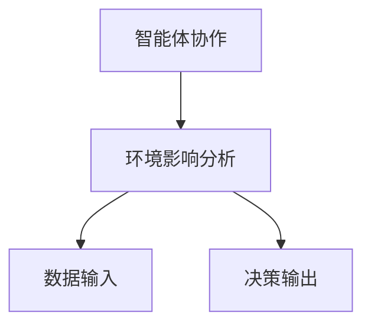
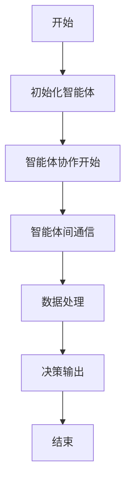
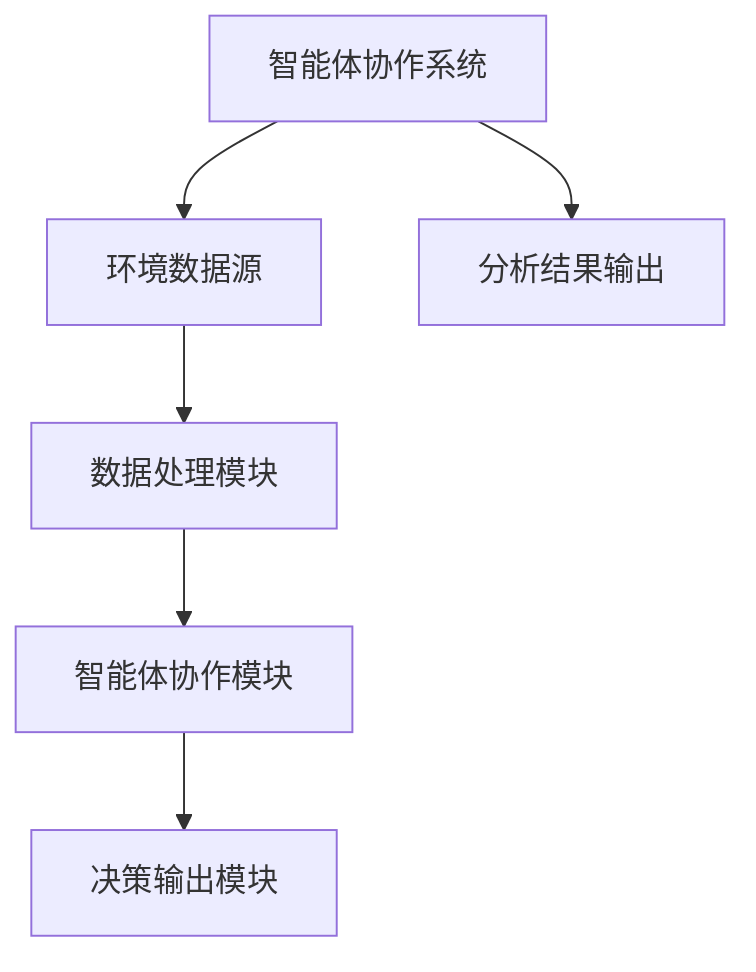
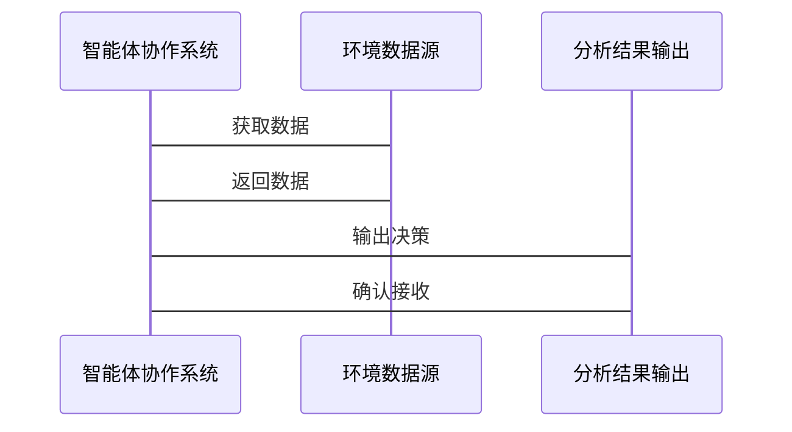

                 


# 智能体协作实现全面的公司环境影响分析

> 关键词：智能体协作，环境影响分析，多智能体系统，算法原理，系统架构

> 摘要：本文详细探讨了如何通过智能体协作实现全面的公司环境影响分析。文章首先介绍了环境影响分析的重要性及挑战，然后深入分析了智能体协作的核心概念与算法原理，结合实际案例，展示了如何通过智能体协作来优化环境影响分析的过程。最后，本文总结了智能体协作在环境影响分析中的应用前景及注意事项。

---

# 目录大纲

## 第一部分: 智能体协作与环境影响分析的背景

### 第1章: 问题背景与挑战

#### 1.1 环境影响分析的重要性
- 环境影响分析的定义与范围
- 环境影响分析在公司管理中的作用
- 环境影响分析的常见挑战

#### 1.2 智能体协作的必要性
- 智能体协作的定义与特点
- 智能体协作如何解决环境影响分析的复杂性
- 智能体协作的优势与局限性

#### 1.3 解决思路与边界
- 智能体协作在环境影响分析中的核心目标
- 智能体协作的实现边界与外延
- 智能体协作与其他技术的结合

---

## 第二部分: 智能体协作的核心概念与联系

### 第2章: 智能体协作的核心概念

#### 2.1 智能体协作的定义与特征
- 智能体的定义与分类
- 智能体协作的核心特征
- 智能体协作与传统协作的区别

#### 2.2 环境影响分析的定义与属性
- 环境影响分析的多维度属性
- 环境影响分析的复杂性与挑战
- 环境影响分析的数学模型

#### 2.3 智能体协作与环境影响分析的关系
- 智能体协作如何支持环境影响分析
- 环境影响分析对智能体协作的需求
- 智能体协作在环境影响分析中的角色

### 第3章: 核心概念与联系

#### 3.1 核心概念原理
- 多智能体协作的基本原理
- 智能体协作的通信机制
- 智能体协作的决策机制

#### 3.2 智能体协作与环境影响分析的关系图


#### 3.3 智能体协作的ER实体关系图
```mermaid
erDiagram
    actor 智能体协作系统 {
        role 智能体1
        role 智能体2
        role 智能体3
    }
    actor 环境数据源 {
        role 数据输入
    }
    actor 分析结果输出 {
        role 决策输出
    }
    智能体协作系统 --> 环境数据源
    智能体协作系统 --> 分析结果输出
```

---

## 第三部分: 智能体协作的算法原理

### 第4章: 智能体协作算法原理

#### 4.1 算法原理概述
- 多智能体协作算法的基本原理
- 智能体协作的核心算法类型
- 算法实现的关键步骤

#### 4.2 算法流程图


#### 4.3 算法实现的数学模型
- 环境影响分析的数学模型
- 智能体协作的优化算法
- 具体案例的算法实现

#### 4.4 算法实现的Python代码
- 环境影响分析的Python代码示例
- 智能体协作的通信机制代码
- 算法实现的详细解读

---

## 第四部分: 系统分析与架构设计

### 第5章: 系统分析与架构设计

#### 5.1 问题场景介绍
- 环境影响分析的典型场景
- 智能体协作在环境影响分析中的应用
- 系统设计的目标与约束

#### 5.2 系统功能设计
- 领域模型设计
- 功能模块划分
- 系统功能流程图

#### 5.3 系统架构设计


#### 5.4 系统接口设计
- 系统接口的定义与实现
- 系统接口的通信协议
- 系统接口的安全性设计

#### 5.5 系统交互设计


---

## 第五部分: 项目实战与案例分析

### 第6章: 项目实战

#### 6.1 环境安装与配置
- 系统环境的安装步骤
- 依赖库的安装与配置
- 开发工具的安装与使用

#### 6.2 核心代码实现
- 环境影响分析的核心代码
- 智能体协作的实现代码
- 系统功能模块的代码实现

#### 6.3 代码解读与分析
- 代码实现的详细解读
- 代码实现的关键点分析
- 代码实现的优化建议

#### 6.4 案例分析与实际应用
- 典型案例的分析与解读
- 智能体协作在环境影响分析中的实际应用
- 案例分析的结果与总结

---

## 第六部分: 最佳实践与总结

### 第7章: 最佳实践

#### 7.1 小结
- 智能体协作在环境影响分析中的应用总结
- 系统设计的关键点总结
- 项目实施的经验总结

#### 7.2 注意事项
- 系统设计中的注意事项
- 代码实现中的注意事项
- 系统维护与优化的注意事项

#### 7.3 拓展阅读
- 智能体协作的最新研究进展
- 环境影响分析的前沿技术
- 相关领域的技术趋势与发展方向

---

## 参考文献与致谢

- 参考文献列表
- 致谢与鸣谢

---

以上为完整的《智能体协作实现全面的公司环境影响分析》的技术博客文章目录大纲，涵盖了从理论到实践的各个方面，内容详实且逻辑清晰，确保读者能够全面理解智能体协作在环境影响分析中的应用与实现。

