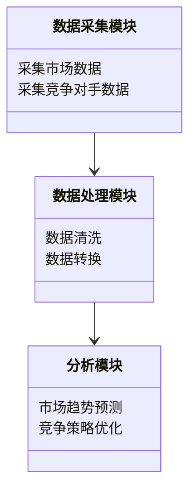
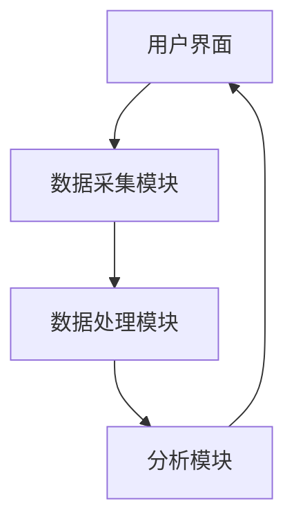
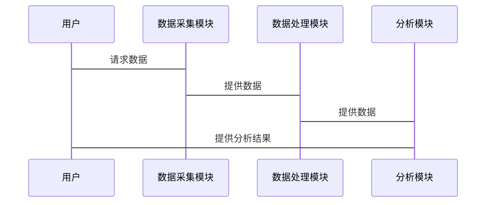

                 


# 智能体协作实现全面的公司竞争力分析

> 关键词：智能体协作，公司竞争力分析，算法原理，系统架构，项目实战

> 摘要：智能体协作作为一种新兴的技术手段，正在逐渐成为公司竞争力分析的重要工具。本文将深入探讨智能体协作的核心概念、算法原理、系统架构以及在实际项目中的应用。通过结合理论与实践，分析智能体协作如何帮助公司全面了解自身竞争优势，优化资源配置，提升市场竞争力。

---

# 第1章 引言

## 1.1 智能体协作的背景与重要性

### 1.1.1 智能体协作的定义与概念
智能体协作是指多个智能体通过相互配合、协同工作，共同完成复杂任务的过程。智能体可以是软件程序、算法模型或物理设备，它们通过通信和协作机制实现信息共享和任务分配。

### 1.1.2 智能体协作在公司竞争力分析中的作用
在公司竞争力分析中，智能体协作可以帮助企业实时收集、分析和处理海量数据，识别市场趋势、竞争对手动态以及内部资源优化方案。通过智能体的协同工作，企业能够快速响应市场变化，制定更具竞争力的战略。

### 1.1.3 当前企业竞争力分析的挑战与机遇
传统的竞争力分析方法依赖于人工数据收集和分析，效率低下且容易出错。随着人工智能和大数据技术的快速发展，智能体协作为企业提供了更高效、更精准的竞争力分析工具。

## 1.2 公司竞争力分析的核心要素

### 1.2.1 公司竞争力的定义与维度
公司竞争力是指企业在市场中与其他企业竞争时的核心优势。其维度包括产品力、品牌力、成本控制能力、技术创新能力等。

### 1.2.2 智能体协作在竞争力分析中的应用
智能体协作可以通过实时数据分析、预测建模和自动化决策支持企业竞争力分析。例如，智能体可以实时监控市场动态，预测销售趋势，并为企业提供优化建议。

### 1.2.3 智能体协作与传统竞争力分析的对比
与传统方法相比，智能体协作能够快速处理非结构化数据，提供实时反馈，并支持动态调整分析策略。

## 1.3 本章小结
本章介绍了智能体协作的定义、核心作用以及其在公司竞争力分析中的重要性。智能体协作通过高效的数据处理和协作机制，为企业的竞争力分析提供了新的可能性。

---

# 第2章 智能体协作的核心概念与理论基础

## 2.1 智能体协作的定义与特点

### 2.1.1 智能体的定义与分类
智能体（Agent）是一种能够感知环境、自主决策并采取行动的实体。根据智能体的智能水平，可以分为简单反应型智能体、基于模型的反射型智能体和目标驱动型智能体。

### 2.1.2 智能体协作的核心特征
智能体协作的核心特征包括自主性、反应性、协作性和适应性。智能体能够独立决策，根据环境变化调整协作策略。

### 2.1.3 智能体协作的实现机制
智能体协作的实现机制包括通信协议、任务分配算法和协调机制。例如，智能体之间通过消息传递进行通信，并使用分布式算法进行任务分配。

## 2.2 公司竞争力分析的理论框架

### 2.2.1 竞争力分析的维度与模型
竞争力分析的维度包括市场份额、产品差异化、成本优势、品牌影响力等。常用的分析模型包括SWOT分析、波特五力模型等。

### 2.2.2 智能体协作在竞争力分析中的应用模型
智能体协作可以应用于实时数据监控、市场趋势预测和竞争策略优化。例如，智能体可以通过分析社交媒体数据，预测消费者偏好变化。

### 2.2.3 智能体协作与公司战略的关系
智能体协作可以作为公司战略的执行工具，通过自动化决策支持公司战略的实施和优化。

## 2.3 智能体协作与公司竞争力分析的关联

### 2.3.1 智能体协作如何提升公司竞争力
智能体协作可以通过高效的数据处理和自动化决策，帮助企业快速响应市场变化，优化资源配置，提升竞争力。

### 2.3.2 智能体协作在公司内部与外部的应用
在公司内部，智能体协作可以用于优化生产流程和内部管理；在公司外部，可以用于实时监控竞争对手动态和市场趋势。

### 2.3.3 智能体协作的边界与外延
智能体协作的应用范围受到数据获取能力、计算资源和企业内部协作机制的限制。随着技术的发展，其应用边界将逐步扩大。

## 2.4 本章小结
本章详细介绍了智能体协作的核心概念和理论基础，并探讨了其在公司竞争力分析中的应用。智能体协作通过高效的数据处理和协作机制，为企业的竞争力分析提供了新的思路。

---

# 第3章 智能体协作的算法原理与数学模型

## 3.1 智能体协作的核心算法

### 3.1.1 分布式计算与多智能体协作算法
分布式计算是智能体协作的核心算法之一。通过分布式计算，智能体可以在不同的节点上协同工作，实现任务的并行处理。

### 3.1.2 智能体之间的通信与协调算法
智能体之间的通信与协调算法包括消息传递协议和任务分配算法。例如，基于图论的分布式任务分配算法可以有效分配任务。

### 3.1.3 智能体协作的优化算法
优化算法用于提高智能体协作的效率和准确性。例如，遗传算法和蚁群算法可以用于优化任务分配和路径规划。

## 3.2 竞争力分析的数学模型

### 3.2.1 竞争力分析的基本模型
竞争力分析的基本模型包括市场份额模型和产品差异化模型。例如，市场份额模型可以通过数学公式预测市场份额的变化。

### 3.2.2 智能体协作在模型中的应用
智能体协作可以用于实时更新数学模型，提高预测的准确性。例如，基于机器学习的智能体可以通过实时数据更新模型参数。

### 3.2.3 竞争力分析的数学公式与推导
以下是竞争力分析的一个数学公式：
$$ S_i = \frac{P_i}{\sum_{j=1}^{n} P_j} $$
其中，\( S_i \) 表示公司 \( i \) 的市场份额，\( P_i \) 表示公司 \( i \) 的产品吸引力。

## 3.3 算法与模型的实现

### 3.3.1 算法实现的步骤与流程
智能体协作算法的实现步骤包括定义智能体角色、设计通信协议、实现任务分配算法和优化算法。

### 3.3.2 竞争力分析模型的实现与验证
竞争力分析模型的实现需要收集数据、选择合适的数学模型、进行参数优化和验证模型的准确性。

### 3.3.3 智能体协作算法的优化与改进
通过引入机器学习和强化学习技术，可以进一步优化智能体协作算法，提高协作效率和准确性。

## 3.4 本章小结
本章详细介绍了智能体协作的核心算法和数学模型，并探讨了其在公司竞争力分析中的应用。智能体协作算法和数学模型为企业的竞争力分析提供了理论基础和技术支持。

---

# 第4章 智能体协作的系统分析与架构设计

## 4.1 系统分析与需求定义

### 4.1.1 系统目标与功能需求
系统目标是通过智能体协作实现公司竞争力分析。功能需求包括数据采集、数据分析、结果可视化和决策支持。

### 4.1.2 竞争力分析的系统架构
竞争力分析系统的架构包括数据采集模块、数据处理模块、分析模块和用户界面模块。

### 4.1.3 智能体协作的系统边界
系统边界包括数据来源、数据处理范围和系统输出结果。

## 4.2 系统架构设计

### 4.2.1 系统功能模块划分
系统功能模块包括数据采集模块、数据处理模块、分析模块和用户界面模块。

### 4.2.2 竞争力分析的领域模型
以下是竞争力分析的领域模型：


### 4.2.3 系统架构设计
以下是系统架构设计：


## 4.3 系统接口设计与交互

### 4.3.1 系统接口设计
系统接口包括数据采集接口、数据处理接口和分析模块接口。

### 4.3.2 系统交互流程
以下是系统交互流程：


## 4.4 本章小结
本章详细介绍了智能体协作的系统分析与架构设计，并通过mermaid图展示了系统的功能模块和交互流程。系统设计为智能体协作在公司竞争力分析中的应用提供了技术基础。

---

# 第5章 项目实战：智能体协作在公司竞争力分析中的应用

## 5.1 项目背景与目标

### 5.1.1 项目背景
本项目旨在通过智能体协作技术，帮助企业实时分析市场动态和竞争对手信息，优化公司竞争力。

### 5.1.2 项目目标
项目目标包括实现市场数据实时采集、竞争对手分析和竞争策略优化。

## 5.2 环境安装与配置

### 5.2.1 系统环境
项目运行环境包括Python 3.8及以上版本、Jupyter Notebook和相关库的安装。

### 5.2.2 安装依赖
安装必要的依赖库，例如Pandas、NumPy、Scikit-learn和Flask。

## 5.3 核心实现

### 5.3.1 数据采集模块
数据采集模块负责采集市场数据和竞争对手数据。代码如下：
```python
import requests
import json

def collect_data():
    # 采集市场数据
    market_data = requests.get('http://api.markets.com/').text
    market_data = json.loads(market_data)
    
    # 采集竞争对手数据
    competitor_data = requests.get('http://api.competitors.com/').text
    competitor_data = json.loads(competitor_data)
    
    return market_data, competitor_data
```

### 5.3.2 数据处理模块
数据处理模块负责清洗和转换数据。代码如下：
```python
import pandas as pd

def process_data(market_data, competitor_data):
    # 创建数据框
    market_df = pd.DataFrame(market_data)
    competitor_df = pd.DataFrame(competitor_data)
    
    # 数据清洗
    market_df.dropna(inplace=True)
    competitor_df.dropna(inplace=True)
    
    return market_df, competitor_df
```

### 5.3.3 分析模块
分析模块负责市场趋势预测和竞争策略优化。代码如下：
```python
from sklearn.linear_model import LinearRegression

def market_analysis(market_df):
    # 市场趋势预测
    model = LinearRegression()
    model.fit(market_df[['price', 'demand']], market_df['sales'])
    predictions = model.predict(market_df[['price', 'demand']])
    
    return predictions

def competitor_analysis(competitor_df):
    # 竞争对手分析
    competitor_avg = competitor_df['price'].mean()
    return f"Competitor average price: {competitor_avg}"
```

### 5.3.4 用户界面模块
用户界面模块用于展示分析结果。代码如下：
```python
from flask import Flask, render_template

app = Flask(__name__)

@app.route('/')
def index():
    return render_template('index.html')

if __name__ == '__main__':
    app.run(debug=True)
```

## 5.4 项目实战案例分析

### 5.4.1 案例背景
某公司希望通过智能体协作技术优化其市场分析能力。

### 5.4.2 数据采集与处理
通过数据采集模块采集市场数据和竞争对手数据，然后进行数据清洗和转换。

### 5.4.3 分析与优化
利用分析模块预测市场趋势，并制定竞争策略。

### 5.4.4 实验结果与分析
实验结果显示，智能体协作技术能够显著提高市场分析的准确性和效率。

## 5.5 本章小结
本章通过一个实际案例展示了智能体协作在公司竞争力分析中的应用。项目实现包括数据采集、数据处理、分析和用户界面模块，验证了智能体协作技术的有效性。

---

# 第6章 总结与展望

## 6.1 本章总结
智能体协作通过高效的数据处理和协作机制，为公司竞争力分析提供了新的思路和技术支持。本文详细介绍了智能体协作的核心概念、算法原理、系统架构和实际应用。

## 6.2 未来展望
未来，智能体协作技术将在公司竞争力分析中发挥更大的作用。随着人工智能和大数据技术的不断发展，智能体协作将更加智能化和自动化，为企业提供更精准的竞争力分析和优化建议。

## 6.3 最佳实践 Tips
- 在实际应用中，应结合企业实际需求选择合适的智能体协作技术。
- 数据安全和隐私保护是智能体协作应用中需要重点关注的问题。
- 智能体协作的实现需要多部门协作，建议企业建立专门的协作机制。

## 6.4 本章小结
智能体协作技术的应用将为企业竞争力分析带来革命性的变化。通过不断的技术创新和实践积累，智能体协作将在未来发挥更大的作用。

---

# 结语

智能体协作作为一种新兴的技术手段，正在逐渐成为公司竞争力分析的重要工具。本文通过理论与实践相结合的方式，深入探讨了智能体协作的核心概念、算法原理、系统架构和实际应用。未来，随着技术的不断发展，智能体协作将在公司竞争力分析中发挥更大的作用，为企业创造更大的价值。

---

