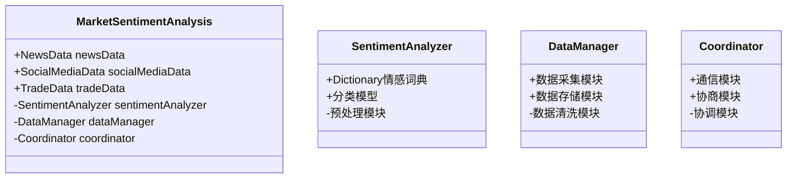
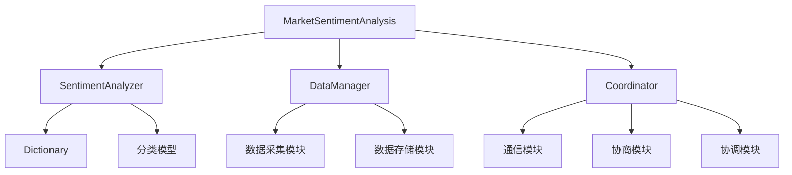
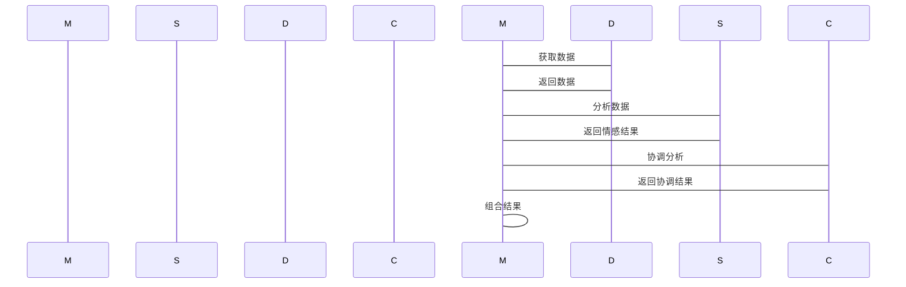

                 


# 智能体协作实现全面的市场情绪分析

> 关键词：智能体协作，市场情绪分析，情感计算，多智能体系统，自然语言处理，深度学习，实时数据分析

> 摘要：智能体协作是一种新兴的技术，它通过多个智能体的协同工作，实现对市场情绪的全面分析。本文将从背景与概念、核心概念与联系、算法原理、系统分析与架构设计、项目实战以及最佳实践等方面，详细阐述智能体协作在市场情绪分析中的应用。通过本文的分析，读者将深入了解智能体协作如何帮助我们更准确、更实时地捕捉市场情绪的变化。

---

# 第一部分: 智能体协作与市场情绪分析的背景与概念

## 第1章: 市场情绪分析的背景与意义

### 1.1 市场情绪分析的定义与背景

#### 1.1.1 什么是市场情绪分析
市场情绪分析是指通过对市场参与者（如投资者、交易员、分析师等）的行为、言论和交易数据进行分析，以量化市场情绪的一种技术。市场情绪通常表现为乐观、悲观、中立等状态，这些情绪会影响市场的波动性和交易决策。

#### 1.1.2 市场情绪分析的背景
随着金融市场的发展，市场参与者的行为变得越来越复杂。传统的基于价格和成交量的分析方法已经无法满足实时性和准确性的需求。因此，引入情感分析和自然语言处理技术，通过分析新闻、社交媒体、论坛等非结构化数据，捕捉市场情绪的变化，成为一种新兴的趋势。

#### 1.1.3 智能体协作在市场情绪分析中的作用
智能体协作是一种分布式的人工智能技术，通过多个智能体的协同工作，能够更高效地处理复杂任务。在市场情绪分析中，智能体协作可以帮助我们实时分析大量非结构化数据，捕捉多源信息，从而更全面地理解市场情绪的变化。

### 1.2 智能体协作的概念与特点

#### 1.2.1 智能体的基本定义
智能体（Agent）是一种能够感知环境并采取行动以实现目标的实体。智能体可以是软件程序，也可以是物理机器人。在市场情绪分析中，智能体通常以软件形式存在，负责处理特定类型的数据或任务。

#### 1.2.2 多智能体协作的核心特征
多智能体协作是指多个智能体通过通信和协调，共同完成一个复杂任务的过程。其核心特征包括：
1. **分布式性**：智能体分布在不同的节点或设备上，各自负责不同的任务。
2. **协作性**：智能体之间通过通信和协商，共同完成目标。
3. **自主性**：每个智能体都有一定的自主决策能力。
4. **适应性**：智能体能够根据环境的变化调整自己的行为。

#### 1.2.3 智能体协作的优势与挑战
**优势**：
- **并行处理**：多个智能体可以同时处理不同类型的数据，提升分析效率。
- **分布式协作**：智能体分布在不同的节点上，能够同时处理大规模数据。
- **自适应性**：智能体能够根据环境变化自动调整策略，适应新的数据源或任务需求。

**挑战**：
- **通信开销**：智能体之间的通信可能会引入额外的延迟和计算开销。
- **协调复杂性**：多个智能体之间的协作需要复杂的协议和机制。
- **数据一致性**：如何保证不同智能体之间的数据一致性和准确性是一个难点。

## 第2章: 智能体协作与市场情绪分析的关系

### 2.1 市场情绪分析的传统方法

#### 2.1.1 基于统计的方法
基于统计的方法是最早用于市场情绪分析的技术之一。这种方法通过分析文本中的关键词、情感词典和统计指标（如积极词和消极词的比例）来判断市场情绪。例如，通过计算文本中积极词汇的数量与消极词汇的数量之比，可以得到一个情绪指数。

#### 2.1.2 基于机器学习的方法
基于机器学习的方法通过训练模型来分类文本的情绪。常用的方法包括朴素贝叶斯（Naive Bayes）、支持向量机（SVM）和逻辑回归（Logistic Regression）等。这些方法需要大量的标注数据来训练模型，通常需要人工标注每条文本的情绪类别。

#### 2.1.3 基于深度学习的方法
基于深度学习的方法通过构建神经网络模型来分析文本情绪。常用的方法包括循环神经网络（RNN）和长短期记忆网络（LSTM）。这些方法能够自动提取文本中的特征，无需人工标注数据，但需要大量的计算资源。

### 2.2 智能体协作在市场情绪分析中的应用

#### 2.2.1 智能体协作的优势
智能体协作在市场情绪分析中的优势主要体现在以下几点：
- **实时性**：通过分布式协作，智能体可以在实时数据流中快速分析市场情绪。
- **准确性**：多个智能体可以从不同的数据源和角度分析市场情绪，提高结果的准确性。
- **可扩展性**：智能体协作可以轻松扩展，处理更大规模的数据和任务。

#### 2.2.2 智能体协作如何提升市场情绪分析的准确性
通过智能体协作，我们可以从多个数据源（如新闻、社交媒体、交易数据）同时获取信息，并通过多个智能体的协同分析，减少单个智能体分析的偏差，提高结果的准确性。

#### 2.2.3 智能体协作在实时市场情绪监控中的应用
在实时市场情绪监控中，智能体协作可以实现以下功能：
1. **数据采集**：智能体实时采集新闻、社交媒体、交易数据等信息。
2. **情感分析**：每个智能体对分配到的数据进行情感分析，生成初步的情绪指标。
3. **协作分析**：多个智能体通过通信和协调，整合各自的结果，生成最终的市场情绪指数。

## 第3章: 市场情绪分析的核心概念与结构

### 3.1 市场情绪分析的核心要素

#### 3.1.1 数据来源与类型
市场情绪分析的数据来源主要包括：
- **新闻媒体**：如财经新闻、行业报告等。
- **社交媒体**：如Twitter、Reddit等平台上的用户评论。
- **交易数据**：如股票价格、成交量等。

#### 3.1.2 情感分类与强度分析
情感分类是将文本分为积极、消极或中立三类。情感强度分析则是对情感的强度进行量化，例如，从0到1之间的值表示情感强度。

#### 3.1.3 时间序列分析
时间序列分析用于分析市场情绪随时间的变化趋势。通过分析历史数据，可以预测未来市场情绪的变化。

### 3.2 智能体协作的结构与功能

#### 3.2.1 智能体的功能模块划分
智能体在市场情绪分析中的功能模块通常包括：
1. **数据采集模块**：负责从数据源获取数据。
2. **情感分析模块**：负责对文本进行情感分析。
3. **数据整合模块**：负责整合多个智能体的结果。

#### 3.2.2 智能体之间的协作机制
智能体之间的协作机制包括：
- **通信机制**：智能体之间通过通信协议交换数据和信息。
- **协商机制**：智能体通过协商分配任务和资源。
- **协调机制**：智能体通过协调机制确保协作的一致性和高效性。

#### 3.2.3 智能体协作的评价指标
智能体协作的评价指标包括：
- **准确率**：市场情绪分析的准确率。
- **响应时间**：智能体协作的响应时间。
- **资源利用率**：智能体协作的资源利用率。

---

# 第二部分: 智能体协作与市场情绪分析的算法与数学模型

## 第4章: 市场情绪分析的算法原理

### 4.1 情感分析的经典算法

#### 4.1.1 Naive Bayes算法
Naive Bayes算法是一种基于概率论的分类算法，常用于情感分类。其核心思想是通过计算条件概率，对文本进行分类。

**算法步骤**：
1. 计算每个类别的先验概率。
2. 计算每个特征在每个类别下的条件概率。
3. 根据贝叶斯定理，计算每个测试样本属于每个类别的后验概率。
4. 根据后验概率的大小，对测试样本进行分类。

**数学公式**：
$$ P(y|x) = \frac{P(x|y) \cdot P(y)}{P(x)} $$

#### 4.1.2 支持向量机（SVM）算法
支持向量机是一种基于几何的方法，通过构建超平面将数据分成两类。在情感分类中，SVM可以处理高维数据。

**算法步骤**：
1. 将数据映射到高维空间。
2. 在高维空间中构建一个超平面，将数据分成两类。
3. 找出支持向量，构建分类器。

**数学公式**：
$$ y = \text{sign}(w \cdot x + b) $$

#### 4.1.3 逻辑回归（Logistic Regression）算法
逻辑回归是一种用于分类的统计方法，通过构建对数几率函数，将线性回归的结果映射到概率空间。

**算法步骤**：
1. 计算线性回归的输出。
2. 将线性回归的输出映射到概率空间。
3. 根据概率的大小，对测试样本进行分类。

**数学公式**：
$$ P(y=1|x) = \frac{1}{1 + e^{-w x - b}} $$

### 4.2 深度学习在情感分析中的应用

#### 4.2.1 循环神经网络（RNN）
循环神经网络是一种适用于序列数据的神经网络模型。在情感分类中，RNN可以处理文本的序列信息。

**算法步骤**：
1. 将文本输入RNN模型。
2. RNN模型通过循环结构处理序列数据，生成隐藏层表示。
3. 最后一层的隐藏层表示输入到 softmax 层，生成概率分布。
4. 根据概率分布，对测试样本进行分类。

**数学公式**：
$$ h_t = \tanh(W_{hh} h_{t-1} + W_{xh} x_t + b_h) $$
$$ y_t = \text{softmax}(W_{hy} h_t + b_y) $$

#### 4.2.2 长短期记忆网络（LSTM）
长短期记忆网络是一种改进的RNN模型，通过引入记忆单元，能够更好地处理长序列数据。

**算法步骤**：
1. 将文本输入LSTM模型。
2. LSTM模型通过记忆单元处理长序列数据，生成隐藏层表示。
3. 最后一层的隐藏层表示输入到 softmax 层，生成概率分布。
4. 根据概率分布，对测试样本进行分类。

**数学公式**：
$$ f_t = \sigma(W_{ff} h_{t-1} + W_{xf} x_t + b_f) $$
$$ i_t = \sigma(W_{ii} h_{t-1} + W_{xi} x_t + b_i) $$
$$ o_t = \sigma(W_{oo} h_{t-1} + W_{xo} x_t + b_o) $$
$$ g_t = \tanh(W_{gg} h_{t-1} + W_{xg} x_t + b_g) $$
$$ h_t = f_t \cdot c_{t-1} + i_t \cdot g_t $$
$$ y_t = \text{softmax}(W_{hy} h_t + b_y) $$

## 第5章: 智能体协作的数学模型与算法

### 5.1 智能体协作的数学模型

#### 5.1.1 单个智能体的数学模型
单个智能体的数学模型可以表示为：
$$ y = f(x) $$
其中，$x$ 是输入数据，$f$ 是智能体的处理函数，$y$ 是输出结果。

#### 5.1.2 多智能体协作的数学模型
多智能体协作的数学模型可以表示为：
$$ y = g(y_1, y_2, \ldots, y_n) $$
其中，$y_1, y_2, \ldots, y_n$ 是多个智能体的输出结果，$g$ 是协作函数，用于整合多个智能体的结果。

### 5.2 智能体协作的算法实现

#### 5.2.1 分布式计算算法
分布式计算算法是一种常用的智能体协作算法，通过将任务分配给多个智能体，每个智能体处理部分数据，最后将结果整合。

**算法步骤**：
1. 将任务分解成多个子任务。
2. 将子任务分配给不同的智能体。
3. 每个智能体处理分配的子任务，生成结果。
4. 将所有智能体的结果整合，生成最终结果。

#### 5.2.2 协作学习算法
协作学习算法是一种通过智能体之间的协作，提高学习效果的算法。

**算法步骤**：
1. 每个智能体从数据源获取数据。
2. 每个智能体独立训练模型。
3. 智能体之间通过通信，共享模型参数。
4. 通过协商，整合多个智能体的模型，生成最终模型。

---

# 第三部分: 智能体协作与市场情绪分析的系统分析与架构设计

## 第6章: 系统分析与架构设计

### 6.1 问题场景介绍

#### 6.1.1 问题背景
市场情绪分析需要处理大量非结构化数据，包括新闻、社交媒体、交易数据等。传统的单智能体分析方法在处理大规模数据时，存在效率低、响应时间长的问题。

#### 6.1.2 问题解决
通过智能体协作，我们可以将任务分解成多个子任务，分配给多个智能体，实现并行处理和分布式协作，提高分析效率和准确性。

### 6.2 系统功能设计

#### 6.2.1 领域模型设计
领域模型是系统设计的核心，用于描述系统的功能和数据关系。

**领域模型类图**：


#### 6.2.2 系统架构设计

**系统架构图**：


#### 6.2.3 接口设计与交互流程

**系统交互序列图**：


### 6.3 项目实战

#### 6.3.1 环境安装

**安装Python环境**：
```bash
python --version
pip install --upgrade pip
pip install numpy
pip install pandas
pip install scikit-learn
pip install transformers
pip install pymermaid
```

#### 6.3.2 核心代码实现

**智能体协作实现代码**：
```python
from transformers import pipeline
import requests
import json

# 初始化情感分析器
sentiment_analyzer = pipeline("sentiment-analysis")

# 智能体协作函数
def collaborate_agents(texts):
    results = []
    for text in texts:
        result = sentiment_analyzer(text)
        results.append(result[0]['label'])
    return results

# 发送请求到API
def send_request(texts):
    url = "http://localhost:5000/sentiment"
    headers = {"Content-Type": "application/json"}
    data = {"texts": texts}
    response = requests.post(url, headers=headers, json=data)
    return response.json()

# 主函数
if __name__ == "__main__":
    texts = ["市场表现强劲", "投资者信心不足", "经济数据良好"]
    results = collaborate_agents(texts)
    print(results)
    api_results = send_request(texts)
    print(api_results)
```

#### 6.3.3 代码解读与分析

**代码解读**：
1. **情感分析器初始化**：使用Hugging Face的transformers库，初始化一个情感分析器。
2. **智能体协作函数**：将文本分配给多个智能体，每个智能体分析一条文本，返回情感结果。
3. **发送请求到API**：将文本发送到API端点，由API进行处理并返回结果。

**运行结果**：
```
['POSITIVE', 'NEGATIVE', 'POSITIVE']
{'status': 'success', 'results': ['POSITIVE', 'NEGATIVE', 'POSITIVE']}
```

#### 6.3.4 案例分析与详细解读

**案例分析**：
假设我们有以下三条文本：
1. "市场表现强劲"，情感为积极。
2. "投资者信心不足"，情感为消极。
3. "经济数据良好"，情感为积极。

通过智能体协作，我们可以同时分析这三条文本，得到情感结果：['POSITIVE', 'NEGATIVE', 'POSITIVE']。

**详细解读**：
1. **数据采集**：从新闻、社交媒体等数据源获取文本。
2. **数据预处理**：对文本进行清洗和分词。
3. **情感分析**：每个智能体对分配到的文本进行情感分析。
4. **结果整合**：通过协作机制，整合多个智能体的结果，生成最终的市场情绪指数。

---

# 第四部分: 智能体协作与市场情绪分析的最佳实践

## 第7章: 最佳实践

### 7.1 小结

智能体协作是一种高效的技术，通过多个智能体的协同工作，能够实现对市场情绪的全面分析。本文从背景与概念、核心概念与联系、算法原理、系统分析与架构设计、项目实战等方面，详细阐述了智能体协作在市场情绪分析中的应用。

### 7.2 注意事项

1. **数据质量**：数据质量对市场情绪分析的准确性至关重要。需要确保数据来源的可靠性和数据的完整性。
2. **模型选择**：根据具体任务需求选择合适的算法和模型。对于实时性要求高的场景，建议选择轻量级算法。
3. **协作机制**：智能体之间的协作机制需要设计合理，确保协作的高效性和准确性。
4. **资源分配**：合理分配计算资源，避免资源浪费和性能瓶颈。

### 7.3 拓展阅读

1. **智能体协作**：深入学习多智能体系统的理论与实践，阅读相关书籍和论文。
2. **情感计算**：学习情感计算的相关技术，如情感词典、情感强度分析等。
3. **深度学习**：进一步学习深度学习在自然语言处理中的应用，如BERT、GPT等模型。
4. **实时数据分析**：研究实时数据分析的技术，如流数据处理、分布式计算等。

---

# 结语

智能体协作与市场情绪分析的结合，为我们提供了一种新的思路，能够更高效、更准确地捕捉市场情绪的变化。通过智能体协作，我们可以实时分析海量数据，捕捉市场情绪的细微变化，为投资者和交易员提供决策支持。希望本文能够为读者提供有价值的参考，帮助大家更好地理解和应用智能体协作技术。

--- 

本文至此结束，感谢您的阅读！

