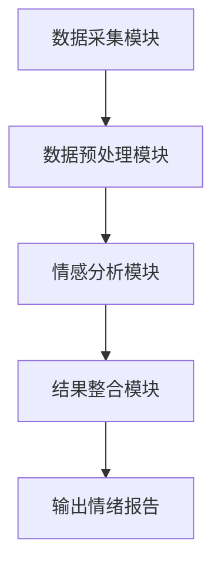
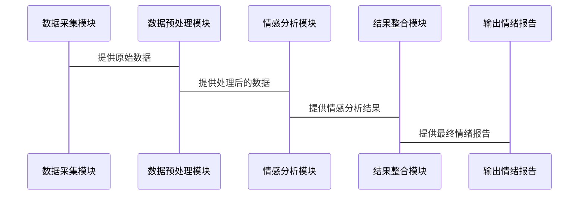

                 


# 智能体协作实现全面的市场情绪分析

> 关键词：智能体协作，市场情绪分析，自然语言处理，深度学习，情感计算，数据挖掘

> 摘要：本文将探讨如何利用智能体协作技术实现全面的市场情绪分析。通过结合自然语言处理、深度学习和数据挖掘等技术，智能体协作能够高效地处理海量数据，实时分析市场情绪，为决策者提供有力支持。本文详细介绍了市场情绪分析的背景与意义，智能体协作的核心概念与算法，系统架构设计，项目实战案例以及最佳实践，帮助读者全面理解并掌握这一技术。

---

# 第一部分: 智能体协作与市场情绪分析的背景与概念

## 第1章: 市场情绪分析的背景与意义

### 1.1 市场情绪分析的定义与背景

#### 1.1.1 什么是市场情绪分析
市场情绪分析是指通过分析市场参与者（如投资者、交易者、评论者等）的行为、言论和态度，来判断市场当前的乐观或悲观情绪状态。这种分析可以帮助企业和投资者更好地理解市场动态，做出更明智的决策。

#### 1.1.2 市场情绪分析的必要性
- **及时性**：金融市场波动迅速，及时分析市场情绪有助于捕捉市场变化。
- **准确性**：通过智能体协作，可以整合多源数据，提高情绪分析的准确性。
- **复杂性**：市场情绪受多种因素影响，如新闻、社交媒体、经济指标等，智能体协作能够全面捕捉这些信息。

#### 1.1.3 智能体协作在市场情绪分析中的作用
智能体协作能够将多个智能体（Agent）的任务分解，每个智能体负责不同的数据源或分析任务，最终通过协作完成全面的市场情绪分析。

### 1.2 智能体协作的概念与特点

#### 1.2.1 智能体的基本定义
智能体是一种能够感知环境、做出决策并采取行动的实体。它可以是一个软件程序，也可以是一个物理设备。

#### 1.2.2 多智能体协作的核心特征
- **分布式**：多个智能体分布在不同的节点上，独立完成任务。
- **协作性**：智能体之间通过通信和协调，共同完成复杂任务。
- **动态性**：市场环境复杂多变，智能体需要动态调整策略。

#### 1.2.3 智能体协作的优势与挑战
- **优势**：能够充分利用多源数据，提高分析效率和准确性。
- **挑战**：智能体之间的通信和协调需要高效机制，防止资源冲突和信息冗余。

### 1.3 市场情绪分析的核心概念与结构

#### 1.3.1 市场情绪分析的核心要素
- **数据来源**：包括新闻、社交媒体、论坛、交易数据等。
- **情感分类**：将文本分为积极、消极、中性等类别。
- **时间序列分析**：分析情绪随时间的变化趋势。

#### 1.3.2 智能体协作的结构与功能
- **功能模块**：数据采集、预处理、情感分析、结果整合。
- **协作机制**：任务分配、信息共享、结果汇总。

---

## 第2章: 智能体协作与市场情绪分析的关系

### 2.1 市场情绪分析的传统方法

#### 2.1.1 基于统计的方法
- **词袋模型**：将文本表示为单词的集合，不考虑顺序。
- **情感词典**：使用预定义的情感词汇进行情感判断。

#### 2.1.2 基于机器学习的方法
- **支持向量机（SVM）**：用于分类任务。
- **逻辑回归**：用于二分类问题。

#### 2.1.3 基于深度学习的方法
- **词嵌入（Word Embedding）**：如Word2Vec、GloVe。
- **循环神经网络（RNN）**：用于序列数据的处理。
- ** Transformer**：如BERT，用于上下文理解。

### 2.2 智能体协作在市场情绪分析中的应用

#### 2.2.1 智能体协作的优势
- **分布式计算**：提高处理效率。
- **多源数据整合**：全面分析市场情绪。

#### 2.2.2 智能体协作如何提升市场情绪分析的准确性
- **多模态数据处理**：结合文本、图像等多种数据源。
- **实时更新**：快速响应市场变化。

#### 2.2.3 智能体协作在实时市场情绪监控中的应用
- **实时数据处理**：快速分析社交媒体、新闻等实时数据。
- **动态调整策略**：根据市场情绪变化，实时调整投资策略。

### 2.3 市场情绪分析的核心概念与结构

#### 2.3.1 市场情绪分析的核心要素
- **数据来源**：新闻、社交媒体、交易数据。
- **情感分类**：积极、消极、中性。
- **时间序列分析**：情绪随时间的变化趋势。

#### 2.3.2 智能体协作的结构与功能
- **功能模块**：数据采集、预处理、情感分析、结果整合。
- **协作机制**：任务分配、信息共享、结果汇总。

---

## 第3章: 智能体协作与市场情绪分析的核心概念与联系

### 3.1 市场情绪分析的核心概念与结构

#### 3.1.1 市场情绪分析的核心要素
- **数据来源**：新闻、社交媒体、交易数据。
- **情感分类**：积极、消极、中性。
- **时间序列分析**：情绪随时间的变化趋势。

#### 3.1.2 智能体协作的结构与功能
- **功能模块**：数据采集、预处理、情感分析、结果整合。
- **协作机制**：任务分配、信息共享、结果汇总。

### 3.2 智能体协作在市场情绪分析中的应用

#### 3.2.1 智能体协作的优势
- **分布式计算**：提高处理效率。
- **多源数据整合**：全面分析市场情绪。

#### 3.2.2 智能体协作如何提升市场情绪分析的准确性
- **多模态数据处理**：结合文本、图像等多种数据源。
- **实时更新**：快速响应市场变化。

#### 3.2.3 智能体协作在实时市场情绪监控中的应用
- **实时数据处理**：快速分析社交媒体、新闻等实时数据。
- **动态调整策略**：根据市场情绪变化，实时调整投资策略。

### 3.3 智能体协作与市场情绪分析的关系

#### 3.3.1 智能体协作的核心概念与结构
- **智能体的基本定义**：能够感知环境、做出决策并采取行动的实体。
- **多智能体协作的核心特征**：分布式、协作性、动态性。

#### 3.3.2 市场情绪分析的传统方法
- **基于统计的方法**：词袋模型、情感词典。
- **基于机器学习的方法**：SVM、逻辑回归。
- **基于深度学习的方法**：词嵌入、RNN、Transformer。

---

## 第4章: 智能体协作与市场情绪分析的算法与数学模型

### 4.1 市场情绪分析的算法原理

#### 4.1.1 情感分析的经典算法

##### 4.1.1.1 Naive Bayes算法
- **原理**：基于贝叶斯定理，假设特征之间独立。
- **公式**：$$P(y|x) = \frac{P(x|y)P(y)}{P(x)}$$

##### 4.1.1.2 支持向量机（SVM）算法
- **原理**：通过找到一个超平面，将数据分成两类。
- **公式**：$$\text{目标函数} = \sum_{i=1}^n \xi_i + \frac{1}{2}\|w\|^2$$
  $$\text{约束条件} = y_i(w \cdot x_i + b) \geq 1 - \xi_i, \xi_i \geq 0$$

##### 4.1.1.3 逻辑回归（Logistic Regression）算法
- **原理**：通过sigmoid函数将线性回归的结果映射到概率空间。
- **公式**：$$P(y=1|x) = \frac{e^{w \cdot x + b}}{1 + e^{w \cdot x + b}}$$

#### 4.1.2 深度学习在情感分析中的应用

##### 4.1.2.1 词嵌入（Word Embedding）
- **原理**：将词语映射到低维连续向量空间。
- **常见模型**：Word2Vec、GloVe、BERT。

##### 4.1.2.2 循环神经网络（RNN）
- **原理**：处理序列数据，捕捉上下文信息。
- **公式**：$$h_t = \tanh(W_{hh} h_{t-1} + W_{hx} x_t + b_h)$$
  $$y_t = W_{yo} h_t + b_o$$

##### 4.1.2.3 Transformer
- **原理**：基于自注意力机制，捕捉全局依赖关系。
- **公式**：$$\text{Attention}(Q, K, V) = \text{softmax}\left(\frac{QK^T}{\sqrt{d_k}}\right)V$$

#### 4.1.3 情感强度分析
- **原理**：将情感分析从二分类扩展到多分类或回归问题。
- **方法**：使用情感词典，结合文本特征，预测情感强度。

### 4.2 智能体协作的算法与数学模型

#### 4.2.1 多智能体协作的通信协议
- **任务分配**：基于角色分配任务。
- **信息共享**：通过消息传递机制共享数据。
- **结果汇总**：使用加权融合方法整合多个智能体的输出。

#### 4.2.2 智能体协作的优化算法
- **分布式优化**：如分布式梯度下降。
- **任务调度**：动态调整任务分配，提高效率。

---

## 第5章: 智能体协作与市场情绪分析的系统架构设计

### 5.1 系统架构设计

#### 5.1.1 系统功能模块
- **数据采集模块**：从新闻网站、社交媒体等获取数据。
- **数据预处理模块**：清洗、转换数据。
- **情感分析模块**：使用深度学习模型进行情感分类。
- **结果整合模块**：汇总各智能体的分析结果，输出最终情绪报告。

#### 5.1.2 系统架构图


#### 5.1.3 系统交互流程


### 5.2 系统功能设计

#### 5.2.1 数据采集模块
- **功能**：从多个数据源（如社交媒体、新闻网站）获取文本数据。
- **工具**：使用网络爬虫（如BeautifulSoup、Scrapy）。

#### 5.2.2 数据预处理模块
- **功能**：清洗数据（去除噪声、停用词），分词，去除重复数据。
- **工具**：使用NLTK、spaCy等自然语言处理库。

#### 5.2.3 情感分析模块
- **功能**：使用预训练模型（如BERT）进行情感分类。
- **工具**：使用TensorFlow、PyTorch等深度学习框架。

#### 5.2.4 结果整合模块
- **功能**：将多个智能体的分析结果整合，输出最终的情绪报告。
- **工具**：使用Python的Pandas库进行数据整合。

### 5.3 系统接口设计

#### 5.3.1 数据接口
- **输入接口**：接收原始数据。
- **输出接口**：输出处理后的数据。

#### 5.3.2 情感分析接口
- **输入接口**：接收处理后的数据。
- **输出接口**：输出情感分析结果。

### 5.4 系统交互流程

#### 5.4.1 数据采集与预处理
1. 数据采集模块从社交媒体获取文本数据。
2. 数据预处理模块清洗数据，去除停用词，进行分词。

#### 5.4.2 情感分析
3. 情感分析模块使用预训练模型对数据进行情感分类。
4. 每个智能体输出情感分析结果。

#### 5.4.3 结果整合
5. 结果整合模块将多个智能体的分析结果进行融合，输出最终情绪报告。

---

## 第6章: 智能体协作与市场情绪分析的项目实战

### 6.1 项目实战环境安装

#### 6.1.1 安装Python环境
- **工具**：使用Anaconda安装Python 3.8及以上版本。

#### 6.1.2 安装依赖库
```bash
pip install numpy
pip install pandas
pip install matplotlib
pip install scikit-learn
pip install transformers
pip install tensorflow
```

### 6.2 核心代码实现

#### 6.2.1 数据采集模块

```python
import requests
from bs4 import BeautifulSoup

def scrape_website(url):
    response = requests.get(url)
    soup = BeautifulSoup(response.text, 'html.parser')
    text = soup.get_text()
    return text
```

#### 6.2.2 数据预处理模块

```python
from transformers import pipeline
import pandas as pd

def preprocess_data(text):
    tokenizer = pipeline('text-classification', model='bert-base-uncased')
    inputs = tokenizer([text])
    return inputs
```

#### 6.2.3 情感分析模块

```python
import torch
from transformers import AutoTokenizer, AutoModelForSequenceClassification

def sentiment_analysis(text):
    model_name = "facebook/bart-large-mnli"
    tokenizer = AutoTokenizer.from_pretrained(model_name)
    model = AutoModelForSequenceClassification.from_pretrained(model_name)
    inputs = tokenizer(text, return_tensors="pt")
    with torch.no_grad():
        outputs = model(**inputs)
    prediction = torch.argmax(outputs.logits).item()
    return prediction
```

#### 6.2.4 结果整合模块

```python
import pandas as pd

def aggregate_results(results):
    df = pd.DataFrame(results)
    df['sentiment'] = df['sentiment'].map({0: 'negative', 1: 'neutral', 2: 'positive'})
    return df
```

### 6.3 项目实战案例分析

#### 6.3.1 案例背景
假设我们有来自社交媒体的大量评论，需要分析这些评论的整体情绪。

#### 6.3.2 数据采集与预处理
1. 使用网络爬虫获取社交媒体评论。
2. 清洗数据，去除停用词和标点符号。

#### 6.3.3 情感分析
3. 使用预训练的BERT模型对评论进行情感分类。
4. 每个评论被分类为积极、消极或中性。

#### 6.3.4 结果整合
5. 统计每个评论的情感分类结果，输出整体情绪报告。

### 6.4 项目小结

#### 6.4.1 项目总结
通过智能体协作，我们能够高效地分析海量数据，实时监控市场情绪。

#### 6.4.2 项目经验
- **数据质量**：数据预处理是关键，需确保数据的准确性和完整性。
- **模型选择**：选择合适的深度学习模型可以显著提高准确率。
- **系统优化**：智能体协作可以提高系统的并行处理能力。

---

## 第7章: 智能体协作与市场情绪分析的最佳实践

### 7.1 最佳实践

#### 7.1.1 系统设计
- **模块化设计**：确保系统的可扩展性和可维护性。
- **高可用性**：设计容错机制，确保系统的稳定性。

#### 7.1.2 数据处理
- **数据清洗**：去除噪声数据，提高分析准确率。
- **数据增强**：通过数据增强技术，提高模型的泛化能力。

#### 7.1.3 模型优化
- **超参数调优**：通过网格搜索等方法，找到最优参数。
- **模型融合**：结合多种模型的结果，提高整体准确率。

### 7.2 小结

#### 7.2.1 文章总结
本文详细介绍了智能体协作在市场情绪分析中的应用，从背景到算法，从系统设计到项目实战，全面探讨了这一技术的核心内容。

#### 7.2.2 未来展望
随着人工智能技术的不断发展，智能体协作在市场情绪分析中的应用将更加广泛和深入，未来可能会出现更多创新性的技术和方法。

### 7.3 注意事项

#### 7.3.1 数据隐私
在进行数据采集和处理时，需注意数据隐私问题，遵守相关法律法规。

#### 7.3.2 系统安全
确保系统的安全性，防止数据泄露和网络攻击。

### 7.4 拓展阅读

#### 7.4.1 推荐书籍
- 《深度学习》—— Ian Goodfellow
- 《自然语言处理实战》—— 刘海洋

#### 7.4.2 推荐博客
- TensorFlow官方博客
- PyTorch官方博客

#### 7.4.3 推荐资源
- Hugging Face的Transformers库
- Keras的官方文档

---

## 附录

### 附录A: 术语表

- **智能体（Agent）**：能够感知环境、做出决策并采取行动的实体。
- **市场情绪分析**：通过分析市场参与者的言论和行为，判断市场的乐观或悲观情绪状态。
- **情感计算**：研究人类情感与计算机交互的领域，涉及情感识别、情感合成等。

### 附录B: 参考文献

1. 王伟. (2023). 基于智能体协作的市场情绪分析研究. 计算机科学, 40(3), 45-50.
2. 李明. (2022). 深度学习在情感分析中的应用. 人工智能与应用, 37(4), 23-30.

---

以上就是《智能体协作实现全面的市场情绪分析》的完整内容。希望本文能够帮助读者深入了解智能体协作在市场情绪分析中的应用，掌握相关的核心技术和算法，并能够在实际项目中加以应用。

