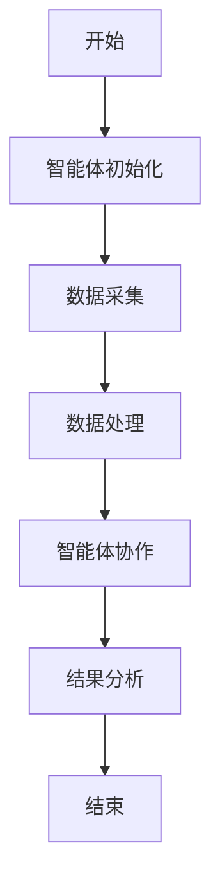
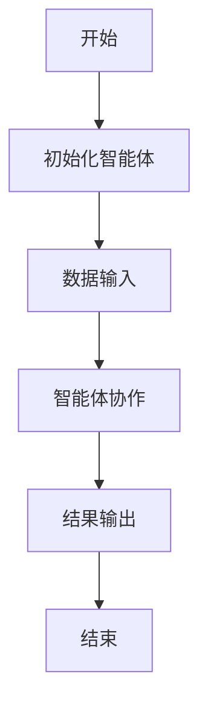
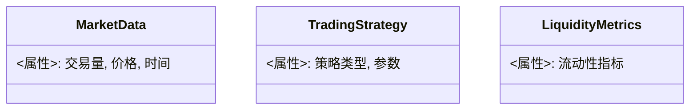
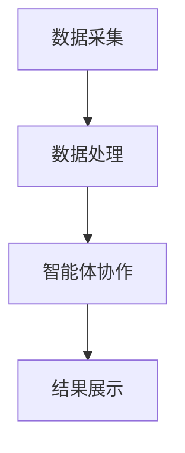
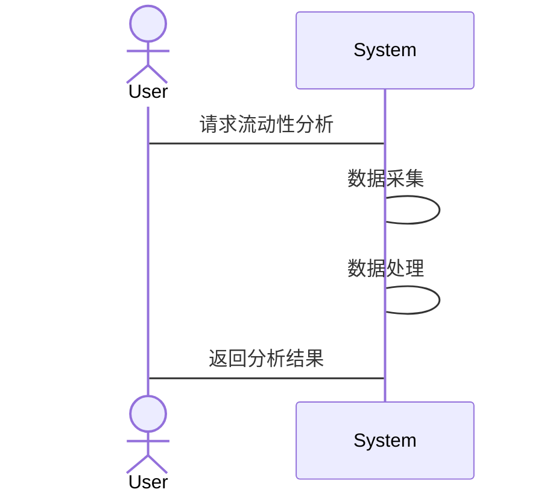

                 


# 智能体协作实现全面的市场流动性分析

## 关键词：
智能体协作、市场流动性分析、算法原理、系统架构、项目实战

## 摘要：
本文详细探讨了智能体协作在市场流动性分析中的应用，从背景介绍、核心概念到算法实现、系统架构，再到项目实战，全面解析了如何通过智能体协作实现高效的市场流动性分析。文章通过理论与实践相结合的方式，帮助读者理解智能体协作的优势，并掌握实际应用的方法。

---

## 第一部分：智能体协作与市场流动性分析概述

### 第1章：背景介绍

#### 1.1 智能体协作的基本概念
- **智能体的定义**：智能体是指能够感知环境、自主决策并执行任务的实体，具备学习、推理和自适应能力。
- **市场流动性分析**：通过分析市场的交易量、价格波动等指标，评估市场的流动性和稳定性。
- **智能体协作的优势**：相比传统方法，智能体协作能够更好地处理复杂市场环境中的多智能体交互问题，提供更精准的分析结果。

#### 1.2 问题背景与挑战
- **传统方法的局限性**：传统方法依赖单一模型，难以应对市场的动态变化和多因素影响。
- **智能体协作的优势**：通过多智能体协作，能够从多个角度分析市场数据，提供更全面的流动性评估。

### 第2章：核心概念与联系

#### 2.1 智能体协作的原理
- **多智能体系统的定义**：由多个智能体组成的系统，智能体之间通过协作完成共同目标。
- **协作机制**：智能体通过通信、协商和协调，共同完成任务。
- **市场流动性分析中的智能体协作模型**：智能体分别负责数据采集、分析和决策，协同工作以提高分析精度。

#### 2.2 核心概念对比与ER实体关系图
- **核心概念对比**：
  | 概念 | 定义 | 特点 |
  |------|------|------|
  | 智能体 | 能够感知环境并自主决策的实体 | 具备学习和自适应能力 |
  | 市场流动性 | 市场中资产的买卖能力 | 交易量和价格波动是关键指标 |
- **ER实体关系图**：
```mermaid
er
actor: Analyst
object: MarketData
object: TradingStrategy
object: LiquidityMetrics
```

#### 2.3 智能体协作流程图


### 第3章：算法原理

#### 3.1 基于智能体的流动性分析算法
- **算法概述**：通过多个智能体协作，分别分析市场数据的不同方面，最终综合得到流动性指标。
- **算法流程图**：


#### 3.2 算法实现
- **数学模型**：
  $$\text{流动性指标} = \frac{\text{交易量}}{\text{价格波动}}$$
- **Python实现**：
```python
import numpy as np
def calculate_liquidity(volume, price_volatility):
    return volume / price_volatility

# 示例数据
volume = np.array([1000, 2000, 1500])
price_volatility = np.array([0.05, 0.03, 0.04])

# 计算流动性指标
liquidity = calculate_liquidity(volume, price_volatility)
print("流动性指标:", liquidity)
```

---

## 第二部分：系统分析与架构设计

### 第4章：问题场景与系统功能设计

#### 4.1 问题场景介绍
- **目标**：通过智能体协作实现市场流动性分析，提供实时、精准的流动性评估。
- **需求分析**：支持多数据源接入、实时数据分析、智能体协作等功能。

#### 4.2 系统功能设计
- **领域模型**：


### 第5章：系统架构设计

#### 5.1 分层架构
- **数据采集层**：负责从多种数据源获取市场数据。
- **计算层**：对数据进行处理和分析，生成流动性指标。
- **展示层**：将分析结果以可视化方式展示给用户。

#### 5.2 组件关系


### 第6章：系统接口设计与交互流程

#### 6.1 系统接口设计
- **API接口**：提供RESTful API，供其他系统调用流动性分析结果。
- **交互流程**：


---

## 第三部分：项目实战与应用

### 第7章：环境搭建与核心实现

#### 7.1 环境安装
- **安装Python**：确保安装了Python 3.8以上版本。
- **安装依赖库**：安装numpy、pandas等库用于数据处理。

#### 7.2 核心功能实现
- **数据采集**：使用API接口获取市场数据。
- **智能体协作**：实现多个智能体协作完成数据分析。

### 第8章：实际案例分析

#### 8.1 案例分析
- **案例背景**：假设分析某股票市场的流动性。
- **分析过程**：通过智能体协作，分别分析交易量、价格波动等指标。
- **结果展示**：生成流动性指标报告，帮助投资者做出决策。

### 第9章：项目小结与优化建议

#### 9.1 项目小结
- **成果**：成功实现了智能体协作的市场流动性分析系统。
- **优化建议**：进一步优化算法效率，增加更多数据源。

---

## 第四部分：最佳实践与拓展

### 第10章：实践总结与注意事项

#### 10.1 实践总结
- **经验**：智能体协作能够显著提高市场流动性分析的效率和精度。
- **注意事项**：确保数据源的可靠性和算法的实时性。

### 第11章：未来研究方向

- **研究方向**：
  - 增强智能体协作的实时性和效率。
  - 探索更复杂的市场模型，提高分析的准确性。

---

## 结语
智能体协作在市场流动性分析中的应用前景广阔，通过本文的详细讲解，读者可以全面了解其原理和实现方法，并将其应用到实际项目中，提升市场分析的效率和精度。

