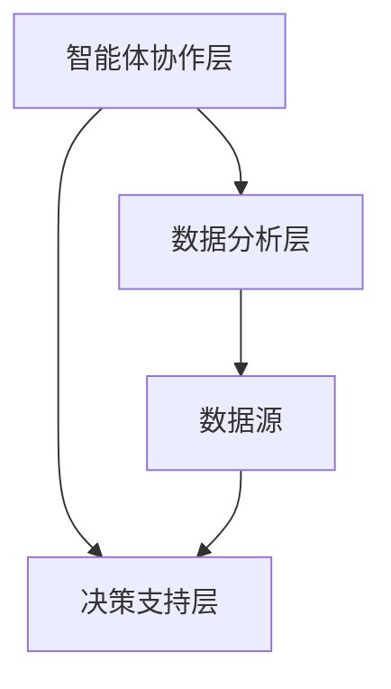

                 


# 智能体协作提升价值投资的供应商财务健康度分析

> 关键词：智能体协作，价值投资，供应商财务健康度，分布式计算，多智能体系统，博弈论，财务分析模型

> 摘要：本文深入探讨了智能体协作在价值投资中的应用，特别是如何通过智能体协作提升供应商财务健康度分析的效率和准确性。文章从背景介绍、核心概念、算法原理、系统架构、项目实战等多个维度展开，详细分析了智能体协作在价值投资中的潜力和实现路径，为读者提供了全面的技术解读和实践指导。

---

## 第一部分: 智能体协作与价值投资基础

### 第1章: 智能体协作与价值投资概述

#### 1.1 智能体协作的概念与背景
智能体协作是指多个智能体通过协同工作，共同完成复杂任务的过程。智能体可以是软件程序、算法或分布式系统中的节点，它们通过通信和协调，实现信息共享和任务分配。智能体协作的核心在于通过分布式计算和博弈论模型，优化决策过程。

#### 1.2 价值投资的核心理念
价值投资是一种以基本面分析为基础的投资策略，旨在通过识别市场低估的资产，实现长期稳定的收益。供应商财务健康度分析是价值投资中的关键环节，通过对供应商的财务数据进行深入分析，评估其偿债能力、盈利能力和发展潜力，从而为投资决策提供支持。

#### 1.3 问题背景与目标
在价值投资中，传统的供应商财务健康度分析依赖于人工数据收集和单点计算，存在效率低下、信息孤岛和决策滞后等问题。智能体协作通过分布式计算和多智能体系统，可以实现数据的实时共享和协同分析，显著提升分析效率和准确性。

---

### 第2章: 智能体协作的核心概念与联系

#### 2.1 多智能体系统原理
多智能体系统由多个智能体组成，每个智能体都有自己的目标和决策机制。智能体之间的通信和协调是通过消息传递、状态共享和任务分配实现的。多智能体系统的优势在于能够处理复杂任务，实现全局最优。

#### 2.2 供应商财务健康度分析模型
供应商财务健康度分析模型是一个多维度的评估系统，包括偿债能力、盈利能力、运营能力和成长能力等指标。通过智能体协作，可以实时更新财务数据，动态评估供应商的财务状况。

#### 2.3 智能体协作与财务健康度分析的联系
智能体协作在数据采集、分析和决策支持中发挥了重要作用。通过智能体协作，可以实现跨机构、跨系统的数据共享，提升分析的全面性和实时性。

---

### 第3章: 智能体协作算法原理

#### 3.1 分布式一致性算法
分布式一致性算法（如Paxos、Raft）用于确保多个智能体之间的数据一致性。通过这些算法，智能体可以协同工作，确保数据的准确性和一致性。

#### 3.2 联合学习算法
联合学习算法（如Federated Learning）允许多个智能体在不共享原始数据的情况下，通过模型更新实现协作学习。这在保护数据隐私的同时，提升了分析的准确性。

#### 3.3 博弈论模型
博弈论模型用于模拟智能体之间的竞争与合作。通过纳什均衡等概念，可以设计智能体的决策策略，实现全局最优。

---

## 第二部分: 系统架构与实现

### 第4章: 系统架构设计

#### 4.1 系统功能设计
系统功能包括数据采集、数据分析、决策支持和结果展示。通过智能体协作，系统能够实时更新数据，动态评估供应商的财务健康度。

#### 4.2 系统架构图


#### 4.3 接口设计
系统接口包括数据接口、算法接口和用户接口。数据接口负责数据的采集和传输，算法接口负责智能体协作的实现，用户接口负责结果的展示和交互。

---

## 第三部分: 项目实战与优化

### 第5章: 项目实战

#### 5.1 环境安装
需要安装分布式计算框架（如Kubernetes）、智能体协作库（如Multi-Agent Toolkit）和数据分析工具（如Python的Pandas库）。

#### 5.2 核心代码实现
以下是智能体协作的核心代码示例：
```python
import numpy as np
from multi_agent import Agent

class FinancialAgent(Agent):
    def __init__(self, name):
        super().__init__(name)
        self.data = None

    def update_data(self, data):
        self.data = data
        self.broadcast(self.data)

    def analyze(self, data):
        # 简单的财务分析逻辑
        return np.mean(data)

# 初始化智能体
agent1 = FinancialAgent("Agent1")
agent2 = FinancialAgent("Agent2")

# 注册监听器
agent1.register_listener(agent2.update_data)
agent2.register_listener(agent1.analyze)

# 发送数据
agent1.update_data([100, 200, 300])
```

#### 5.3 实际案例分析
通过实际案例分析，展示智能体协作在供应商财务健康度分析中的应用效果。例如，通过智能体协作，某公司成功识别了多个潜在的财务风险点，避免了重大损失。

---

## 第四部分: 总结与展望

### 第6章: 总结与展望

#### 6.1 本章小结
本文详细探讨了智能体协作在价值投资中的应用，特别是供应商财务健康度分析的实现。通过智能体协作，可以显著提升分析的效率和准确性。

#### 6.2 未来展望
未来，智能体协作在价值投资中的应用将更加广泛。通过结合区块链、人工智能等技术，可以进一步提升分析的智能化和自动化水平。

#### 6.3 注意事项
在实际应用中，需要注意数据隐私和安全问题，确保智能体协作的高效性和可靠性。

#### 6.4 拓展阅读
推荐读者进一步阅读《分布式系统：概念与设计》和《博弈论与经济行为》等书籍，深入了解智能体协作的理论基础。

---

通过本文的详细分析，读者可以全面理解智能体协作在价值投资中的潜力和实现路径，为实际应用提供有力的技术支持。

