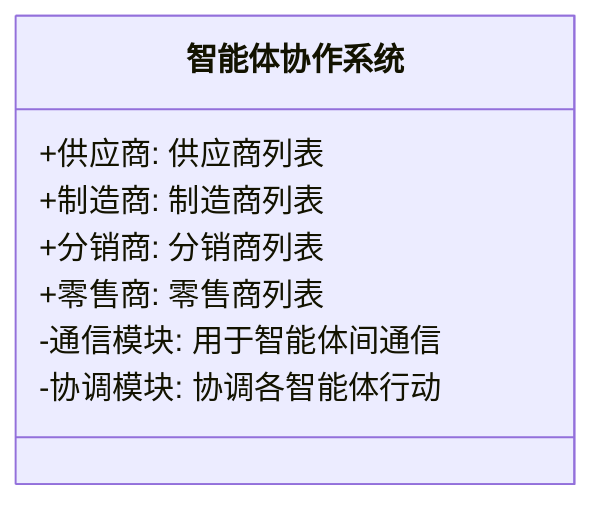
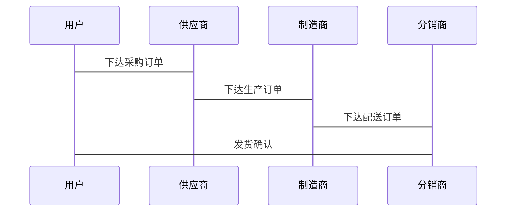

                 


# 《智能体协作提升价值投资的供应链弹性评估》

> **关键词**: 智能体协作, 供应链弹性, 价值投资, 多智能体系统, 弹性评估, 投资策略, 系统架构

> **摘要**: 本文探讨了智能体协作在供应链管理中的应用，特别是在提升供应链弹性方面的作用，进而优化价值投资。通过分析智能体协作的核心原理、算法模型和系统架构，结合实际案例，提出了一套基于智能体协作的供应链弹性评估方法，为企业在不确定环境下的价值投资提供新的视角。

---

## 第1章: 智能体协作与供应链弹性概述

### 1.1 问题背景与核心概念

#### 1.1.1 供应链管理的现状与挑战
供应链管理是企业运营的核心环节，但面临着诸多挑战，如需求波动、供应商不稳定、物流延迟等。这些因素可能导致供应链中断，影响企业的运营效率和成本控制。

#### 1.1.2 智能体协作的定义与特点
智能体协作（Multi-Agent Collaboration）是指多个智能体通过协作完成共同目标的过程。其特点包括自主性、反应性、社会性和学习能力。

#### 1.1.3 供应链中的智能体协作
在供应链中，智能体可以是供应商、制造商、分销商或零售商，通过协作优化资源分配、降低库存成本并提高响应速度。

### 1.2 供应链弹性评估的重要性

#### 1.2.1 供应链弹性的定义
供应链弹性指供应链在面对外部干扰时的适应和恢复能力。

#### 1.2.2 弹性与企业价值的关系
供应链弹性强的企业能够更快适应市场变化，降低风险，从而提高投资回报率。

#### 1.2.3 智能体协作对弹性的提升
通过智能体协作，供应链能够实时调整策略，快速响应变化，从而提高弹性。

### 1.3 价值投资与供应链弹性评估的结合

#### 1.3.1 价值投资的基本概念
价值投资是通过分析企业内在价值，选择低估股票进行投资。

#### 1.3.2 供应链弹性对投资的影响
供应链弹性强的企业更具抗风险能力，投资价值更高。

#### 1.3.3 智能体协作的应用前景
智能体协作能够优化供应链管理，增强企业竞争力，从而提升其投资价值。

---

## 第2章: 智能体协作的核心原理

### 2.1 多智能体系统（MAS）的定义与特点

#### 2.1.1 MAS的定义
MAS是由多个智能体组成的系统，每个智能体具备自主决策能力。

#### 2.1.2 智能体的特点
- **自主性**: 智能体能够自主决策。
- **反应性**: 能够感知环境并做出反应。
- **社会性**: 智能体之间可以通信协作。
- **学习能力**: 能够通过经验改进决策。

### 2.2 智能体协作的核心机制

#### 2.2.1 通信机制
智能体之间通过消息传递进行通信。

#### 2.2.2 协调机制
通过协商达成一致行动方案。

#### 2.2.3 分配机制
智能体根据自身能力和任务需求分配任务。

---

## 第3章: 供应链弹性评估的数学模型与算法

### 3.1 协同过滤算法

#### 3.1.1 算法原理
协同过滤通过分析用户行为推荐相似产品。

#### 3.1.2 算法实现
使用矩阵分解方法，计算用户-物品评分矩阵的低秩近似。

#### 3.1.3 示例代码
```python
import numpy as np
from sklearn.metrics.pairwise import pairwise_distances

def collaborative_filtering(train_matrix, test_cases):
    user_similarities = pairwise_distances(train_matrix, metric='cosine')
    predictions = []
    for user, item in test_cases:
        similar_users = np.where(user_similarities[user] > 0.5)[0]
        prediction = np.mean(train_matrix[similar_users, item])
        predictions.append(prediction)
    return predictions
```

### 3.2 强化学习算法

#### 3.2.1 算法原理
强化学习通过智能体与环境交互，学习最优策略。

#### 3.2.2 算法实现
使用Q-learning算法，通过状态-动作-奖励机制优化决策。

#### 3.2.3 示例代码
```python
import numpy as np

class QLearning:
    def __init__(self, state_size, action_size, learning_rate=0.1, gamma=0.9):
        self.q_table = np.zeros((state_size, action_size))
        self.learning_rate = learning_rate
        self.gamma = gamma

    def choose_action(self, state):
        return np.argmax(self.q_table[state])

    def update(self, state, action, reward, next_state):
        self.q_table[state, action] = self.q_table[state, action] * (1 - self.learning_rate) + reward * self.learning_rate
```

---

## 第4章: 系统分析与架构设计方案

### 4.1 问题场景介绍

#### 4.1.1 供应链中断的风险
如自然灾害或供应商罢工可能导致供应链中断。

#### 4.1.2 智能体协作的应用场景
在供应链规划、库存管理、物流调度等领域。

### 4.2 系统功能设计

#### 4.2.1 领域模型设计
使用Mermaid类图展示系统各角色及交互关系。



### 4.3 系统架构设计

#### 4.3.1 分层架构
- **数据层**: 存储供应链数据。
- **业务逻辑层**: 实现协作逻辑。
- **用户界面层**: 提供人机交互界面。

#### 4.3.2 通信架构
使用消息队列（如Kafka）实现异步通信。

### 4.4 系统接口设计

#### 4.4.1 API接口
- `/api/supplier/update` 更新供应商信息。
- `/api/order/create` 创建订单。

#### 4.4.2 交互流程
使用Mermaid序列图展示订单处理流程。



---

## 第5章: 项目实战

### 5.1 环境安装与配置

#### 5.1.1 安装Python与相关库
- 安装`numpy`、`scikit-learn`、`mermaid`等库。

#### 5.1.2 安装Jupyter Notebook
用于代码实现和结果展示。

### 5.2 核心功能实现

#### 5.2.1 智能体协作模块
实现供应商、制造商和分销商之间的协作。

#### 5.2.2 弹性评估模块
使用协同过滤算法评估供应链弹性。

### 5.3 代码实现与解读

#### 5.3.1 协同过滤算法实现
```python
def collaborative_filtering(train_matrix, test_cases):
    user_similarities = pairwise_distances(train_matrix, metric='cosine')
    predictions = []
    for user, item in test_cases:
        similar_users = np.where(user_similarities[user] > 0.5)[0]
        prediction = np.mean(train_matrix[similar_users, item])
        predictions.append(prediction)
    return predictions
```

#### 5.3.2 强化学习算法实现
```python
class QLearning:
    def __init__(self, state_size, action_size, learning_rate=0.1, gamma=0.9):
        self.q_table = np.zeros((state_size, action_size))
        self.learning_rate = learning_rate
        self.gamma = gamma

    def choose_action(self, state):
        return np.argmax(self.q_table[state])

    def update(self, state, action, reward, next_state):
        self.q_table[state, action] = self.q_table[state, action] * (1 - self.learning_rate) + reward * self.learning_rate
```

### 5.4 案例分析与结果解读

#### 5.4.1 案例背景
假设一家制造企业，面临原材料供应不稳定的问题。

#### 5.4.2 实施智能体协作后的效果
供应链弹性显著提高，订单交付时间缩短，库存成本降低。

---

## 第6章: 最佳实践与小结

### 6.1 最佳实践

#### 6.1.1 系统设计
采用分层架构，确保系统的可扩展性和可维护性。

#### 6.1.2 算法选择
根据具体场景选择合适的算法，如协同过滤或强化学习。

### 6.2 小结

智能体协作能够有效提升供应链弹性，优化企业价值投资。通过合理设计系统架构和选择算法，企业能够在不确定环境中保持竞争优势。

### 6.3 注意事项

- 确保数据安全，防止信息泄露。
- 定期更新模型，适应市场变化。
- 建立完善的监控机制，及时发现和解决问题。

### 6.4 拓展阅读

- 推荐阅读《Multi-Agent Systems》和《Supply Chain Resilience》。

---

通过本文的详细分析，智能体协作在供应链弹性评估中的应用为企业优化价值投资提供了新思路。希望本文能为读者在智能体协作与供应链管理领域提供有益的参考。

