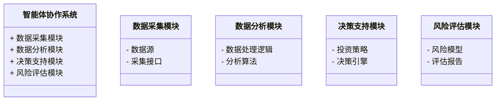

                 


# 智能体协作提升价值投资的技术颠覆风险评估

> 关键词：智能体协作、价值投资、技术颠覆、风险评估、系统架构

> 摘要：本文探讨了智能体协作在价值投资中的潜力，分析了其可能带来的技术颠覆风险，并提出了系统的风险评估模型和应对策略。

---

# 第1章：智能体协作与价值投资概述

## 1.1 智能体协作的定义与特点

智能体（Agent）是指能够感知环境、自主决策并执行任务的实体。智能体协作则是多个智能体通过协同工作，实现复杂目标的过程。其特点包括：

- **自主性**：智能体能够独立决策。
- **反应性**：能实时感知环境变化并调整行为。
- **协作性**：通过通信和协调完成共同目标。

## 1.2 价值投资的基本概念

价值投资是以低于公平价值的价格买入优质资产的投资策略，核心在于寻找市场低估的机会。其特点包括：

- **长期视角**：注重长期收益而非短期波动。
- **基本面分析**：依赖于对公司的深入分析。
- **逆向思维**：在市场恐慌时寻找机会。

## 1.3 智能体协作在价值投资中的应用前景

智能体协作可以通过数据分析、预测市场趋势和优化投资组合，显著提升投资效率和准确性。其优势包括：

- **高效数据处理**：智能体能够快速分析大量数据。
- **实时反馈**：及时调整投资策略。
- **降低人为错误**：减少情绪化决策的影响。

---

# 第2章：智能体协作的核心机制

## 2.1 智能体协作的基本原理

### 2.1.1 多智能体协作的定义
多智能体协作是指多个智能体通过通信和协调，共同完成复杂任务的过程。

### 2.1.2 智能体之间的通信协议
通信协议确保智能体之间能够有效传递信息，包括数据格式、传输频率和错误处理机制。

### 2.1.3 智能体任务分配策略
任务分配策略根据智能体的能力和当前状态，动态分配任务以最大化整体效率。

## 2.2 智能体协作的实现技术

### 2.2.1 分布式计算技术
分布式计算允许智能体在不同节点上协作，提高计算能力和容错性。

### 2.2.2 多智能体协调算法
如一致性算法和共识机制，确保智能体决策的一致性和可靠性。

### 2.2.3 智能体协作的优化方法
通过遗传算法和模拟退火等优化技术，提升协作效率和决策质量。

## 2.3 智能体协作在价值投资中的具体应用

### 2.3.1 数据分析与预测
智能体通过分析历史数据和市场动态，预测股票价格走势。

### 2.3.2 投资决策支持
智能体提供实时市场数据和风险评估，辅助投资决策。

### 2.3.3 风险评估与管理
通过协作分析，智能体帮助投资者识别和管理潜在风险。

---

# 第3章：技术颠覆风险的来源与分析

## 3.1 技术颠覆风险的定义

技术颠覆风险是指新技术的出现可能导致现有技术迅速被淘汰的风险。

## 3.2 智能体协作技术的潜在缺陷

### 3.2.1 技术实现的不确定性
算法的不完善可能导致决策失误。

### 3.2.2 数据依赖性与隐私问题
过度依赖数据可能导致隐私泄露和数据偏差。

### 3.2.3 系统稳定性与安全性
系统故障或网络攻击可能引发重大损失。

## 3.3 外部环境对智能体协作的影响

### 3.3.1 市场波动与政策变化
市场环境变化和政策调整可能影响智能体的决策依据。

### 3.3.2 用户行为与需求变化
用户需求的变化可能使智能体的协作机制失效。

### 3.3.3 技术进步与替代方案
新兴技术的出现可能取代现有智能体协作技术。

---

# 第4章：风险评估模型的构建与分析

## 4.1 风险评估模型的构建原理

### 4.1.1 模型输入与输出
- **输入**：技术缺陷、环境影响、用户行为等。
- **输出**：技术颠覆风险的概率和影响程度。

## 4.2 智能体协作风险评估的数学模型

构建一个综合评估模型，公式如下：

$$ R = \sum_{i=1}^{n} w_i \cdot r_i $$

其中，$R$ 表示总体风险，$w_i$ 表示第 $i$ 个风险因素的权重，$r_i$ 表示第 $i$ 个风险因素的值。

---

# 第5章：系统架构设计

## 5.1 系统功能设计

### 5.1.1 领域模型
使用Mermaid类图展示系统模块和交互关系。



## 5.2 系统架构设计

使用Mermaid架构图展示系统整体结构。

```mermaid
archiecture
    客户端 ---(HTTP)--> 中间件
    中间件 ---(RPC)--> 数据库
    中间件 ---(WebSocket)--> 智能体节点
```

---

# 第6章：项目实战

## 6.1 环境配置

- **工具安装**：安装Python、TensorFlow和相关库。
- **数据获取**：获取历史股票数据和市场新闻。

## 6.2 核心代码实现

### 6.2.1 数据预处理代码

```python
import pandas as pd

def preprocess_data(data):
    # 处理缺失值
    data = data.dropna()
    # 标准化处理
    data = (data - data.mean()) / data.std()
    return data
```

### 6.2.2 风险评估模型代码

```python
import numpy as np

def calculate_risk(data):
    weights = np.array([0.4, 0.3, 0.2, 0.1])
    risks = np.array([0.8, 0.6, 0.5, 0.3])
    total_risk = np.dot(weights, risks)
    return total_risk
```

---

# 第7章：最佳实践与未来展望

## 7.1 最佳实践

- **持续学习**：定期更新模型和算法。
- **数据隐私保护**：加强数据加密和访问控制。
- **系统监控**：实时监控系统运行状态。

## 7.2 未来展望

随着人工智能和大数据技术的进步，智能体协作在价值投资中的应用将更加广泛和深入。未来，可能会出现更复杂的协作机制和更精准的风险评估模型。

---

# 参考文献

（此处列出相关文献和资源）

---

# 结语

智能体协作在价值投资中具有巨大潜力，但也伴随着技术颠覆风险。通过构建完善的评估模型和优化系统架构，可以有效降低风险，提升投资效率和准确性。未来，随着技术的进一步发展，智能体协作将在金融领域发挥更大作用。

