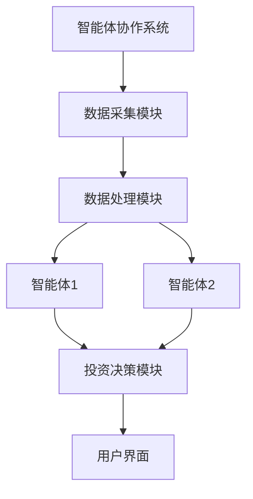
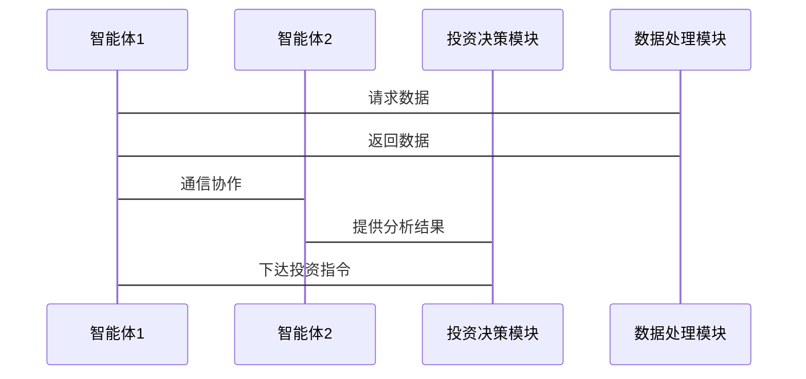

                 


# 智能体协作提升价值投资的时机选择

## 关键词：智能体协作、价值投资、时机选择、协作机制、算法模型

## 摘要：本文探讨如何利用智能体协作技术提升价值投资的时机选择。通过分析智能体协作的基本原理、算法模型和系统架构，结合实际案例，展示如何通过智能体协作优化投资决策。文章内容包括背景介绍、核心概念、算法原理、系统设计、项目实战及总结与展望。

---

# 第一部分：智能体协作与价值投资的背景

## 第1章：智能体协作与价值投资概述

### 1.1 智能体协作的基本概念

#### 1.1.1 智能体的定义与特征
智能体（Agent）是指具有感知环境、自主决策和执行任务能力的实体。智能体协作是指多个智能体通过通信和协调，共同完成复杂任务的过程。

#### 1.1.2 智能体协作的含义与特点
- **含义**：智能体协作是指多个智能体通过共享信息、协同决策，共同完成目标。
- **特点**：
  - 分布式：智能体独立运行，通过通信协作。
  - 协作性：智能体之间通过协商达成一致。
  - 动态性：环境变化时，智能体能够自适应调整策略。

#### 1.1.3 智能体协作在投资领域的应用潜力
- **潜力**：智能体协作能够通过分布式计算和数据分析，帮助投资者捕捉市场机会，优化投资策略。

### 1.2 价值投资的基本原理

#### 1.2.1 价值投资的定义与核心理念
- **定义**：价值投资是通过分析企业的基本面，寻找市场价格低于内在价值的股票进行投资。
- **核心理念**：长期投资、价值发现。

#### 1.2.2 价值投资的关键要素
- **企业分析**：包括财务状况、行业地位、竞争优势等。
- **市场分析**：包括宏观经济、行业趋势、市场情绪等。
- **估值模型**：如DCF模型、市盈率等。

#### 1.2.3 价值投资与智能体协作的结合点
- **数据处理**：智能体协作可以高效处理多源数据，为价值评估提供支持。
- **决策优化**：通过协作，智能体可以优化投资决策，提升时机选择的准确性。

### 1.3 时机选择的重要性

#### 1.3.1 投资时机选择的挑战
- **市场波动**：市场波动大，时机选择难度高。
- **信息不对称**：投资者难以获取全面信息。
- **决策延迟**：传统方法决策时间长，错失良机。

#### 1.3.2 智能体协作在时机选择中的优势
- **高效协作**：智能体协作能够快速处理信息，提高决策效率。
- **分布式计算**：通过分布式计算，智能体可以同时分析多个市场数据，提供实时建议。
- **动态调整**：智能体能够根据市场变化实时调整策略，优化投资时机。

#### 1.3.3 智能体协作提升价值投资的潜力
- **潜力**：通过智能体协作，投资者能够更精准地评估企业价值，及时捕捉投资机会，提高投资收益。

### 1.4 本章小结
本章介绍了智能体协作的基本概念、价值投资的核心理念以及时机选择的重要性。智能体协作在价值投资中的应用潜力巨大，特别是在数据处理和决策优化方面具有显著优势。

---

# 第二部分：智能体协作的核心概念与联系

## 第2章：智能体协作的原理与机制

### 2.1 多智能体系统的构建

#### 2.1.1 多智能体系统的组成与结构
- **组成**：由多个智能体、通信机制、协作规则和目标任务组成。
- **结构**：可以分为层次结构、网状结构等。

#### 2.1.2 智能体之间的通信与协作机制
- **通信机制**：智能体通过消息传递、数据共享等方式进行通信。
- **协作机制**：包括协商、任务分配、协调等步骤。

#### 2.1.3 智能体协作的实现方式
- **分布式协作**：智能体独立运行，通过通信协作完成任务。
- **集中式协作**：由中央控制器协调各智能体的行动。

### 2.2 智能体协作的核心算法

#### 2.2.1 基于强化学习的协作算法
- **强化学习**：智能体通过与环境互动，学习最优策略。
- **协作算法**：通过Q-learning算法，智能体之间通过协作获得更高的奖励。

#### 2.2.2 基于博弈论的协作模型
- **博弈论**：研究智能体在博弈中的策略选择和收益分配。
- **纳什均衡**：所有智能体策略达到均衡状态。

#### 2.2.3 基于分布式计算的协作机制
- **分布式计算**：任务分解到多个智能体，分别计算后汇总结果。
- **负载均衡**：智能体之间动态分配任务，提高效率。

### 2.3 智能体协作的数学模型

#### 2.3.1 协作智能体的数学表示
- **状态表示**：用向量表示智能体的状态。
- **动作表示**：用策略函数表示智能体的动作。

#### 2.3.2 协作目标的优化函数
- **目标函数**：最大化整体收益。
- **约束条件**：满足协作规则和资源限制。

#### 2.3.3 协作过程的动态模型
- **动态模型**：描述智能体协作过程中的状态转移和收益变化。

### 2.4 本章小结
本章详细讲解了智能体协作的构建、算法和数学模型。通过强化学习、博弈论和分布式计算等方法，智能体能够高效协作，优化投资决策。

---

# 第三部分：价值投资时机选择的智能体协作方案

## 第3章：价值投资时机选择的数学模型

### 3.1 价值投资的量化分析

#### 3.1.1 股票价值的评估模型
- **DCF模型**：通过现金流折现评估企业价值。
- **相对估值法**：通过市盈率、市净率等指标评估股票价值。

#### 3.1.2 市场波动的预测模型
- **时间序列分析**：预测市场趋势和波动。
- **机器学习模型**：使用LSTM网络预测市场走势。

### 3.2 时机选择的优化策略

#### 3.2.1 基于强化学习的时机选择
- **强化学习模型**：智能体通过学习选择最佳投资时机。
- **策略网络**：通过神经网络预测市场变化。

#### 3.2.2 基于博弈论的时机选择
- **博弈分析**：分析市场参与者的策略，预测市场走势。
- **纳什均衡**：确定市场均衡点，选择最佳时机。

#### 3.2.3 基于多智能体的协作优化
- **分布式协作**：多个智能体分别分析市场数据，汇总结果。
- **动态调整**：根据市场变化实时调整策略。

### 3.3 智能体协作优化模型

#### 3.3.1 多智能体协作优化框架
- **框架设计**：多个智能体分别负责不同的数据源和分析任务。
- **协作机制**：智能体之间通过通信和协作，共同优化投资决策。

#### 3.3.2 智能体协作优化的数学模型
- **优化目标**：最大化投资收益。
- **约束条件**：满足市场规则和资源限制。

### 3.4 本章小结
本章介绍了价值投资时机选择的数学模型和优化策略，通过智能体协作优化模型，能够有效提升投资决策的准确性和效率。

---

# 第四部分：系统分析与架构设计

## 第4章：智能体协作系统的架构设计

### 4.1 问题场景介绍
- **目标**：构建智能体协作系统，优化价值投资的时机选择。
- **需求**：高效处理多源数据，实时分析市场动态。

### 4.2 系统功能设计

#### 4.2.1 领域模型设计
- **实体关系图**：包括智能体、数据源、投资决策等实体。
- **类图设计**：展示系统中各组件的关系和交互。

#### 4.2.2 系统架构设计
- **分层架构**：包括数据层、业务逻辑层和用户界面层。
- **微服务架构**：各智能体作为独立的服务，协同工作。

### 4.3 系统架构图


### 4.4 系统接口设计
- **数据接口**：与数据源对接，获取市场数据。
- **通信接口**：智能体之间通过API进行通信。

### 4.5 系统交互流程图


### 4.6 本章小结
本章详细设计了智能体协作系统的架构和接口，通过分层架构和微服务架构，确保系统的高效运行和灵活性。

---

# 第五部分：项目实战

## 第5章：智能体协作系统的实现

### 5.1 环境安装
- **Python环境**：安装Python 3.8及以上版本。
- **依赖库安装**：使用pip安装numpy、pandas、keras、scikit-learn等库。

### 5.2 核心代码实现

#### 5.2.1 智能体协作模块
```python
class Agent:
    def __init__(self, id):
        self.id = id
        self.data = None
        self.strategy = None

    def receive_data(self, data):
        self.data = data

    def compute_strategy(self):
        # 实现策略计算
        pass

    def send_strategy(self, agent):
        agent.receive_data(self.strategy)
```

#### 5.2.2 投资决策模块
```python
class InvestmentDecision:
    def __init__(self):
        self.agents = []
        self.recommendations = []

    def add_agent(self, agent):
        self.agents.append(agent)

    def collect_recommendations(self):
        for agent in self.agents:
            agent.compute_strategy()
            agent.send_strategy(self)

    def make_decision(self):
        # 综合各智能体的策略，做出最终决策
        pass
```

### 5.3 案例分析与实现解读
- **案例分析**：分析某公司股票，利用智能体协作优化投资时机。
- **代码实现**：展示如何实现智能体协作模块和投资决策模块，详细解读每一步代码的作用。

### 5.4 项目总结与优化
- **总结**：项目实现过程中的关键点和经验。
- **优化方向**：进一步优化算法和系统架构，提升性能和效率。

### 5.5 本章小结
本章通过实际项目案例，展示了智能体协作系统的实现过程，详细解读了核心代码和系统设计。

---

# 第六部分：总结与展望

## 第6章：总结与展望

### 6.1 最佳实践 tips
- **数据质量**：确保数据来源可靠，数据处理准确。
- **算法优化**：不断优化协作算法，提升决策效率。
- **系统维护**：定期维护和升级系统，确保稳定运行。

### 6.2 小结
本文详细探讨了智能体协作在价值投资中的应用，通过数学模型、算法设计和系统架构，展示了如何利用智能体协作优化投资决策。

### 6.3 注意事项
- **风险管理**：投资有风险，需谨慎操作。
- **法律合规**：确保系统运行符合相关法律法规。

### 6.4 拓展阅读
- **推荐书籍**：《智能体协作与分布式计算》、《价值投资的真谛》。
- **推荐论文**：相关领域的最新研究论文。

### 6.5 本章小结
本章总结了全文内容，提出了未来的研究方向和优化建议，为读者提供了进一步学习和实践的指导。

---

# 附录

## 附录A：相关术语解释
- **智能体（Agent）**：具有感知环境、自主决策和执行任务能力的实体。
- **价值投资**：通过分析企业基本面，寻找市场价格低于内在价值的股票进行投资。
- **时机选择**：在最佳时机进行投资，以获取最大收益。

## 附录B：参考文献
- [1] Russell, S. J., & Norvig, P. (2010). Artificial Intelligence: A Modern Approach.
- [2] Graham, B. (1974). The Intelligent Investor.
- [3] Mnih, V., et al. (2015). Human-level control through deep reinforcement learning.

---

通过以上结构，您可以按照每部分内容逐步展开，撰写一篇逻辑清晰、内容详实的技术博客文章。

