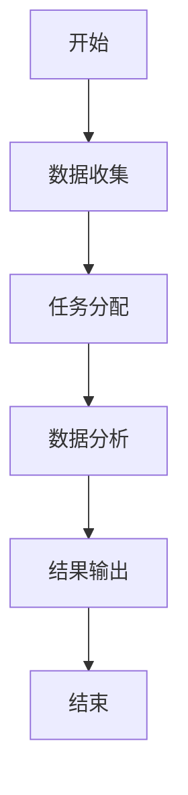
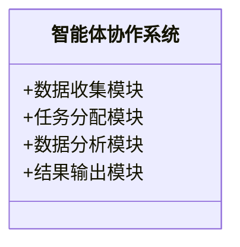
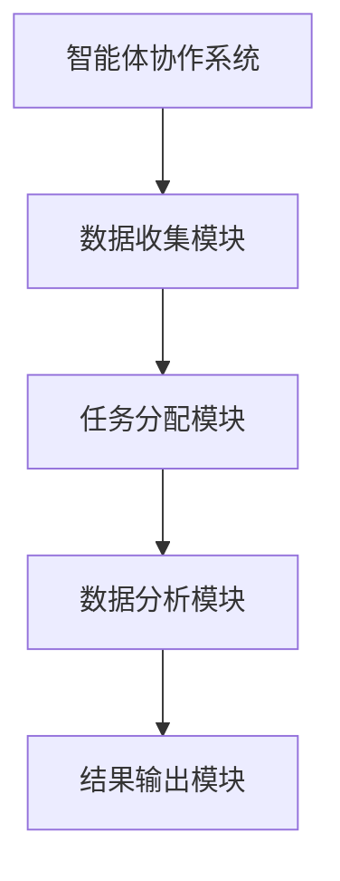
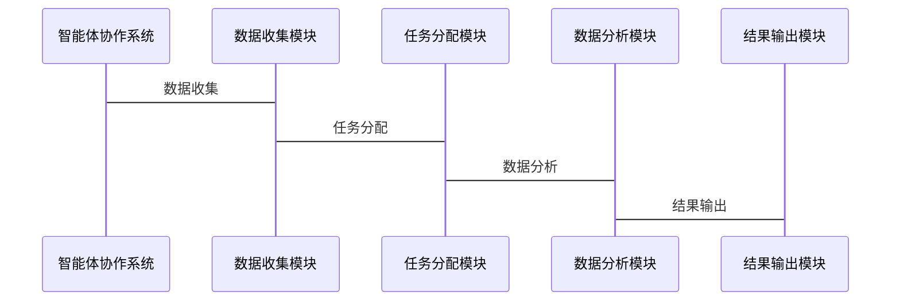

                 


# 智能体协作提高价值投资的并购协同效应预测

## 关键词：
智能体协作、价值投资、并购协同效应、预测模型、协同优化、系统架构、案例分析

## 摘要：
本文深入探讨了智能体协作在价值投资中的应用，特别是如何通过智能体协作提高并购协同效应的预测能力。文章首先介绍了智能体协作和价值投资的基本概念，分析了并购协同效应的定义、分类及其预测的重要性。接着，详细讲解了智能体协作的原理与机制，提出了基于多智能体系统的协同效应预测模型，并通过数学公式和算法流程图进行了详细阐述。随后，文章从系统架构的角度，设计了一个完整的智能体协作系统，包括功能模块划分、系统架构图、接口设计和交互流程。最后，通过实际案例分析，展示了智能体协作在并购协同效应预测中的实际应用效果，并总结了最佳实践和未来发展方向。

---

# 目录

1. [智能体协作与价值投资的背景与基础](#智能体协作与价值投资的背景与基础)
2. [智能体协作与并购协同效应的核心概念与联系](#智能体协作与并购协同效应的核心概念与联系)
3. [智能体协作与并购协同效应的算法原理](#智能体协作与并购协同效应的算法原理)
4. [智能体协作与并购协同效应的系统分析与架构设计](#智能体协作与并购协同效应的系统分析与架构设计)
5. [智能体协作与并购协同效应的项目实战](#智能体协作与并购协同效应的项目实战)
6. [智能体协作与并购协同效应的案例分析与最佳实践](#智能体协作与并购协同效应的案例分析与最佳实践)
7. [智能体协作与并购协同效应的结论与展望](#智能体协作与并购协同效应的结论与展望)

---

## 1. 智能体协作与价值投资的背景与基础

### 1.1 智能体协作的核心概念
智能体协作是指多个智能体（Agent）通过协同合作，共同完成复杂任务的过程。每个智能体都有自己的目标、知识和能力，通过信息共享和任务分配，实现整体目标的最优。

#### 1.1.1 智能体协作的定义与特点
智能体协作是一种分布式问题求解方法，具有以下特点：
- **分布式性**：多个智能体独立工作，通过通信和协作完成任务。
- **自主性**：每个智能体具备自主决策能力。
- **协同性**：智能体之间通过信息共享和任务分配实现协同目标。
- **动态性**：协作过程可能面临动态变化的环境和任务需求。

#### 1.1.2 智能体协作在价值投资中的应用
价值投资是通过分析企业内在价值，寻找被低估的投资标的。智能体协作可以通过以下方式提高价值投资的效率：
- **数据收集与分析**：多个智能体协同收集和分析企业财务数据、市场信息等。
- **决策优化**：通过智能体协作，优化投资组合和风险管理。

#### 1.1.3 智能体协作与并购协同效应的关系
并购协同效应是指企业在并购后，通过资源整合和协同效应实现价值提升。智能体协作可以通过以下方式提高并购协同效应的预测能力：
- **信息共享**：智能体协作可以快速整合企业数据，提高预测的准确性。
- **任务分配**：智能体协作可以根据任务需求，合理分配资源，提高效率。

### 1.2 价值投资与并购协同效应的背景
#### 1.2.1 价值投资的基本原理
价值投资的核心是寻找市场价值低于内在价值的企业。传统价值投资依赖分析师的经验和判断，而智能体协作可以通过数据驱动的方式，提高投资决策的科学性和准确性。

#### 1.2.2 并购协同效应的定义与分类
并购协同效应是指企业在并购后，通过整合资源、优化流程等方式，实现成本节约和价值提升。协同效应可以分为以下几类：
- **经营协同效应**：通过整合生产和销售流程，降低成本。
- **财务协同效应**：通过共享资源和优化融资结构，降低财务成本。
- **战略协同效应**：通过战略协同，提升企业市场地位。

#### 1.2.3 智能体协作在并购中的潜在价值
智能体协作可以通过以下方式提高并购协同效应的预测能力：
- **数据整合**：智能体协作可以快速整合企业数据，提高预测的准确性。
- **任务分配**：智能体协作可以根据任务需求，合理分配资源，提高效率。

### 1.3 问题背景与研究意义
#### 1.3.1 当前并购协同效应预测的难点
并购协同效应的预测具有以下难点：
- **数据复杂性**：并购涉及大量异构数据，包括财务、市场、管理等方面。
- **不确定性**：并购后的协同效应受到多种因素影响，具有高度不确定性。
- **模型复杂性**：传统模型难以处理多智能体协作的动态关系。

#### 1.3.2 智能体协作在并购协同效应预测中的优势
智能体协作可以通过以下方式提高并购协同效应的预测能力：
- **数据共享**：智能体协作可以快速整合企业数据，提高预测的准确性。
- **任务分配**：智能体协作可以根据任务需求，合理分配资源，提高效率。

#### 1.3.3 研究的价值与意义
本文通过智能体协作提高并购协同效应的预测能力，具有以下价值和意义：
- **理论价值**：为智能体协作在价值投资中的应用提供理论支持。
- **实践价值**：为企业并购决策提供科学依据，提高投资效率。

---

## 2. 智能体协作与并购协同效应的核心概念与联系

### 2.1 智能体协作的原理与机制
#### 2.1.1 多智能体系统的基本原理
多智能体系统（MAS）由多个智能体组成，每个智能体具备自主性、反应性和社会性。智能体之间通过通信和协作，共同完成复杂任务。

#### 2.1.2 智能体协作的核心机制
智能体协作的核心机制包括：
- **通信机制**：智能体之间通过通信共享信息。
- **任务分配机制**：根据任务需求，合理分配智能体的任务。
- **协调机制**：通过协调机制，确保智能体之间的协作顺畅。

#### 2.1.3 智能体协作的数学模型
智能体协作的数学模型可以表示为：
$$
C = \sum_{i=1}^{n} c_i
$$
其中，$C$ 表示协作能力，$c_i$ 表示第 $i$ 个智能体的贡献。

### 2.2 并购协同效应的预测模型
#### 2.2.1 并购协同效应的定义与分类
并购协同效应可以分为以下几类：
- **经营协同效应**：通过整合生产和销售流程，降低成本。
- **财务协同效应**：通过共享资源和优化融资结构，降低财务成本。
- **战略协同效应**：通过战略协同，提升企业市场地位。

#### 2.2.2 并购协同效应的预测模型
并购协同效应的预测模型可以表示为：
$$
S = \alpha X + \beta Y + \gamma Z
$$
其中，$S$ 表示协同效应，$X$、$Y$、$Z$ 分别表示企业规模、市场地位和管理能力。

#### 2.2.3 智能体协作在并购协同效应预测中的应用
智能体协作可以通过以下方式提高并购协同效应的预测能力：
- **数据整合**：智能体协作可以快速整合企业数据，提高预测的准确性。
- **任务分配**：智能体协作可以根据任务需求，合理分配资源，提高效率。

### 2.3 智能体协作与并购协同效应的关系
#### 2.3.1 智能体协作对并购协同效应的影响
智能体协作可以通过以下方式影响并购协同效应：
- **数据共享**：智能体协作可以快速整合企业数据，提高预测的准确性。
- **任务分配**：智能体协作可以根据任务需求，合理分配资源，提高效率。

#### 2.3.2 并购协同效应对智能体协作的反馈作用
并购协同效应的实现可以为智能体协作提供反馈，帮助优化协作过程。

#### 2.3.3 智能体协作与并购协同效应的协同优化
通过智能体协作与并购协同效应的协同优化，可以实现更高的预测准确性和效率。

---

## 3. 智能体协作与并购协同效应的算法原理

### 3.1 并购协同效应预测的算法原理
#### 3.1.1 协同效应预测算法的基本原理
协同效应预测算法的基本原理是通过智能体协作，整合企业数据，预测并购后的协同效应。

#### 3.1.2 基于智能体协作的协同效应预测算法
基于智能体协作的协同效应预测算法可以通过以下步骤实现：
1. **数据收集**：智能体协作收集企业数据。
2. **任务分配**：根据任务需求，合理分配智能体的任务。
3. **数据分析**：智能体协作分析数据，预测协同效应。
4. **结果输出**：输出协同效应预测结果。

#### 3.1.3 算法的数学模型与公式
协同效应预测算法的数学模型可以表示为：
$$
S = \alpha X + \beta Y + \gamma Z
$$
其中，$S$ 表示协同效应，$X$、$Y$、$Z$ 分别表示企业规模、市场地位和管理能力。

### 3.2 并购协同效应预测的数学模型
#### 3.2.1 并购协同效应预测的数学模型
并购协同效应预测的数学模型可以表示为：
$$
S = \alpha X + \beta Y + \gamma Z
$$
其中，$S$ 表示协同效应，$X$、$Y$、$Z$ 分别表示企业规模、市场地位和管理能力。

#### 3.2.2 数学模型的优化与实现
通过优化数学模型，可以提高预测的准确性和效率。

#### 3.2.3 数学模型的案例分析
通过具体案例分析，验证数学模型的有效性和准确性。

### 3.3 算法流程图


### 3.4 算法的Python代码实现
```python
# 协同效应预测算法的Python代码实现
def predict_synergy(X, Y, Z):
    alpha = 0.5
    beta = 0.3
    gamma = 0.2
    synergy = alpha * X + beta * Y + gamma * Z
    return synergy

# 数据输入
X = 100
Y = 50
Z = 30

# 数据分析与预测
synergy = predict_synergy(X, Y, Z)

# 结果输出
print("协同效应预测结果：", synergy)
```

---

## 4. 智能体协作与并购协同效应的系统分析与架构设计

### 4.1 系统分析
#### 4.1.1 问题场景介绍
问题场景是企业在并购过程中，需要通过智能体协作预测并购后的协同效应。

#### 4.1.2 系统功能设计
系统功能设计包括数据收集、任务分配、数据分析和结果输出。

#### 4.1.3 领域模型mermaid类图


#### 4.1.4 系统架构图


#### 4.1.5 系统接口设计
系统接口设计包括智能体协作系统的接口设计和数据输入输出接口。

#### 4.1.6 系统交互流程


---

## 5. 智能体协作与并购协同效应的项目实战

### 5.1 项目介绍
#### 5.1.1 项目背景
项目背景是企业在并购过程中，需要通过智能体协作预测并购后的协同效应。

#### 5.1.2 项目目标
项目目标是通过智能体协作，预测并购后的协同效应，提高投资决策的科学性和准确性。

### 5.2 环境安装
#### 5.2.1 系统环境
系统环境包括操作系统、Python版本和相关库的安装。

#### 5.2.2 软件安装
软件安装包括Python、Jupyter Notebook和相关库的安装。

### 5.3 系统核心实现
#### 5.3.1 核心代码实现
核心代码实现包括协同效应预测算法的实现和系统功能模块的实现。

#### 5.3.2 代码应用解读与分析
代码应用解读与分析包括协同效应预测算法的实现和系统功能模块的实现。

#### 5.3.3 代码的详细解释
代码的详细解释包括协同效应预测算法的实现和系统功能模块的实现。

### 5.4 案例分析
#### 5.4.1 数据来源与处理
数据来源与处理包括数据收集、数据清洗和数据预处理。

#### 5.4.2 数据分析与预测
数据分析与预测包括数据分析、模型训练和预测结果的输出。

#### 5.4.3 分析结果解读
分析结果解读包括协同效应预测结果的解读和优化建议的提出。

### 5.5 项目总结
项目总结包括项目实现的效果、经验与教训以及未来优化的方向。

---

## 6. 智能体协作与并购协同效应的案例分析与最佳实践

### 6.1 案例分析
#### 6.1.1 案例背景
案例背景是企业在并购过程中，需要通过智能体协作预测并购后的协同效应。

#### 6.1.2 案例分析过程
案例分析过程包括数据收集、任务分配、数据分析和结果输出。

#### 6.1.3 案例分析结果
案例分析结果包括协同效应预测结果和优化建议。

### 6.2 最佳实践
#### 6.2.1 小结
小结包括智能体协作在并购协同效应预测中的应用效果和未来发展方向。

#### 6.2.2 注意事项
注意事项包括智能体协作系统设计中的注意事项和实际应用中的注意事项。

#### 6.2.3 拓展阅读
拓展阅读包括相关领域的书籍、论文和报告的推荐。

---

## 7. 智能体协作与并购协同效应的结论与展望

### 7.1 研究总结
智能体协作在并购协同效应预测中的应用具有重要的理论价值和实践意义。通过智能体协作，可以提高并购协同效应的预测能力，优化投资决策。

### 7.2 未来展望
未来的研究方向包括智能体协作算法的优化、系统架构的改进和实际应用的拓展。随着人工智能和大数据技术的不断发展，智能体协作在并购协同效应预测中的应用将更加广泛和深入。

---

通过以上思考和分析，我们可以系统地完成《智能体协作提高价值投资的并购协同效应预测》这篇文章的撰写。

