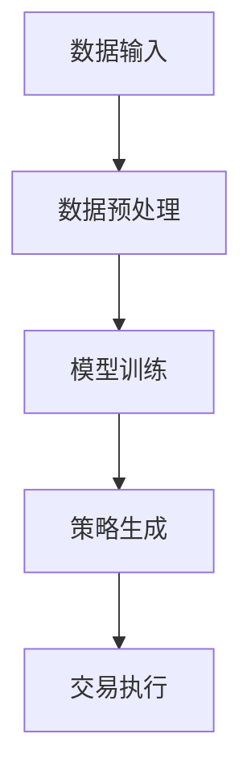
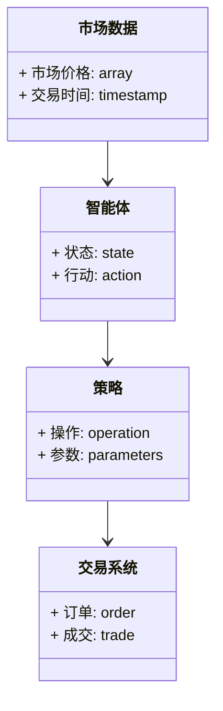
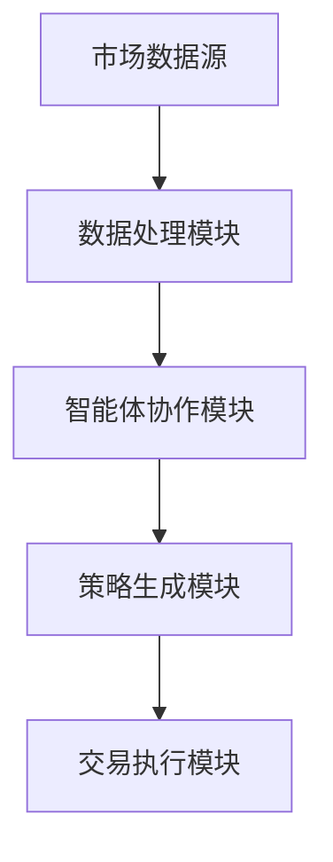
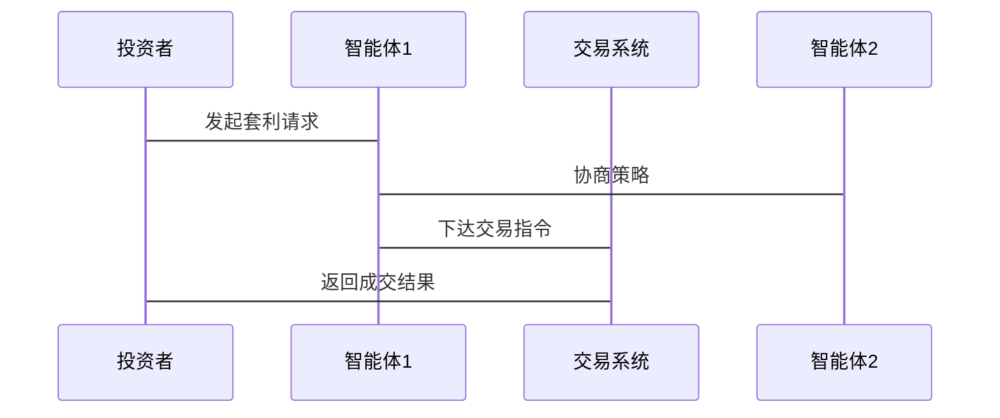

                 


# 智能体协作提高价值投资的跨市场套利机会识别

> 关键词：智能体协作、价值投资、跨市场套利、算法、数学模型、系统架构

> 摘要：本文探讨如何利用智能体协作技术在跨市场中识别套利机会，通过算法、数学模型和系统架构的设计与实现，分析套利机会的识别过程，最终提高价值投资的效率和准确性。

---

## 第1章 背景介绍

### 1.1 问题背景

#### 1.1.1 价值投资与跨市场套利的定义
- 价值投资：通过分析企业的基本面，寻找市场价格低于其内在价值的投资机会。
- 跨市场套利：利用不同市场之间的价格差异，通过同时买低价市场和卖高价市场来获利。

#### 1.1.2 智能体协作在金融领域的应用背景
- 智能体协作：多个智能体通过协同工作，共同完成复杂任务的技术。
- 金融领域的应用：智能体协作可以帮助投资者快速识别套利机会，提高决策效率。

#### 1.1.3 当前市场中的套利机会识别挑战
- 市场数据复杂性：跨市场数据涉及多种货币、资产类型和时间区制，数据量大且复杂。
- 套利机会短暂：套利机会通常在极短时间内出现，需要快速响应。
- 风险控制：套利涉及多市场操作，风险较高，需谨慎处理。

### 1.2 问题描述

#### 1.2.1 价值投资中的套利机会识别需求
- 投资者需要快速识别价格偏离价值的资产，以进行套利操作。
- 需要实时监控多个市场数据，捕捉价格差异。

#### 1.2.2 跨市场套利的复杂性与风险
- 市场间存在不同的交易规则、税率和结算时间，增加了套利的复杂性。
- 套利可能引发监管风险，需遵守不同市场的法规。

#### 1.2.3 智能体协作在套利机会识别中的作用
- 提高数据处理效率：多个智能体协同处理大量数据。
- 实时监控：智能体实时分析市场数据，捕捉套利机会。
- 风险控制：通过协作，智能体可以共同评估和控制套利风险。

### 1.3 问题解决

#### 1.3.1 智能体协作的核心优势
- 并行处理能力：多个智能体同时处理不同市场数据，提高处理效率。
- 协作决策：智能体之间共享信息，共同制定套利策略。
- 自适应性：智能体能够根据市场变化调整策略，适应不同环境。

#### 1.3.2 跨市场套利机会识别的解决方案
- 数据收集与预处理：智能体实时收集多个市场数据，进行清洗和标准化。
- 数据分析与建模：利用算法分析数据，识别价格差异和套利机会。
- 策略执行：根据分析结果，智能体协作执行套利交易。

#### 1.3.3 智能体协作如何提高套利机会识别的效率
- 通过分工合作，每个智能体专注于特定任务，提高整体效率。
- 智能体之间共享信息，避免重复计算，减少资源浪费。

### 1.4 边界与外延

#### 1.4.1 智能体协作的边界条件
- 数据范围：仅限于特定市场和资产类型。
- 时间限制：套利机会识别需在极短时间内完成。
- 资源限制：智能体协作需要足够的计算资源支持。

#### 1.4.2 跨市场套利机会识别的适用范围
- 适用于多个市场同时存在价格差异的情况。
- 适用于套利机会短暂但收益较高的场景。

#### 1.4.3 相关概念的外延与扩展
- 智能体协作：可应用于其他金融任务，如风险评估和资产配置。
- 跨市场套利：可扩展到更多市场和资产类型，如加密货币和外汇市场。

#### 1.4.4 核心要素组成
- 数据采集：实时采集多个市场的价格数据。
- 数据处理：清洗、标准化和特征提取。
- 算法分析：利用算法识别套利机会。
- 策略执行：根据分析结果执行交易。

---

## 第2章 核心概念与联系

### 2.1 核心概念原理

#### 2.1.1 智能体协作的基本原理
- 智能体定义：具备感知环境和自主决策能力的实体。
- 协作机制：通过通信和协调，智能体共同完成任务。

#### 2.1.2 跨市场套利的基本原理
- 套利机会：同一资产在不同市场上的价格差异。
- 套利策略：买低卖高，利用价格差异获利。

### 2.2 概念属性特征对比

#### 2.2.1 智能体协作与传统交易策略对比
| 特性       | 智能体协作      | 传统交易策略    |
|------------|-----------------|-----------------|
| 处理效率   | 高              | 低              |
| 决策速度   | 快              | 慢              |
| 适应性     | 强              | 弱              |

#### 2.2.2 跨市场套利与单一市场套利对比
| 特性       | 跨市场套利      | 单一市场套利    |
|------------|-----------------|-----------------|
| 市场覆盖   | 多个            | 单个            |
| 风险       | 高              | 中              |
| 收益潜力   | 高              | 低              |

### 2.3 ER实体关系图架构

```mermaid
er
actor(投资者) -->
    information(市场数据) -->
    intelligent_agent(智能体)
    intelligent_agent -->
    strategy(套利策略)
    strategy -->
    transaction(交易)
```

---

## 第3章 算法原理讲解

### 3.1 算法原理

#### 3.1.1 算法选择
- 选择强化学习算法，通过智能体的协作和学习，识别套利机会。

#### 3.1.2 算法流程
1. 数据收集：智能体实时收集多个市场的价格数据。
2. 数据预处理：清洗和标准化数据。
3. 模型训练：利用强化学习训练智能体识别套利机会。
4. 策略执行：智能体根据模型预测结果执行交易。

### 3.2 算法实现

#### 3.2.1 强化学习算法实现



#### 3.2.2 Python代码实现

```python
import numpy as np
import pandas as pd

# 数据预处理
def preprocess(data):
    # 数据清洗
    data = data.dropna()
    # 标准化
    data = (data - data.mean()) / data.std()
    return data

# 强化学习模型训练
def train_model(data):
    # 初始化智能体
    agent = Agent()
    # 训练过程
    for i in range(epochs):
        state = data[i]
        action = agent.act(state)
        next_state = data[i+1]
        reward = calculate_reward(action, next_state)
        agent.memorize(state, action, reward, next_state)
        agent.replay()

    return agent

# 策略生成
def generate_strategy(agent):
    strategy = []
    for i in range(len(data)):
        state = data[i]
        action = agent.act(state)
        strategy.append(action)
    return strategy

# 交易执行
def execute_trade(strategy):
    profits = []
    for i in range(len(strategy)):
        action = strategy[i]
        if action == 'buy':
            buy_price = data[i]
            sell_price = data[i+1]
            profits.append(sell_price - buy_price)
    return profits
```

### 3.3 数学模型与公式

#### 3.3.1 收益预测模型
$$ \text{收益} = \sum_{i=1}^{n} (p_{i+1} - p_i) \times q_i $$
其中，$p_i$ 是第i个市场的价格，$q_i$ 是交易量。

#### 3.3.2 风险评估模型
$$ \text{风险} = \sqrt{\sum_{i=1}^{n} (r_i - \bar{r})^2} $$
其中，$r_i$ 是第i个市场的回报率，$\bar{r}$ 是平均回报率。

---

## 第4章 数学模型与公式

### 4.1 收益预测模型

$$ \text{收益} = \sum_{i=1}^{n} (p_{i+1} - p_i) \times q_i $$

其中，$p_i$ 是第i个市场的价格，$q_i$ 是交易量。

### 4.2 风险评估模型

$$ \text{风险} = \sqrt{\sum_{i=1}^{n} (r_i - \bar{r})^2} $$

其中，$r_i$ 是第i个市场的回报率，$\bar{r}$ 是平均回报率。

---

## 第5章 系统分析与架构设计

### 5.1 项目介绍

#### 5.1.1 项目目标
- 实现智能体协作识别跨市场套利机会。
- 提供高效、可靠的套利机会识别系统。

### 5.2 系统功能设计

#### 5.2.1 领域模型设计



### 5.3 系统架构设计

#### 5.3.1 系统架构图



### 5.4 系统接口设计

#### 5.4.1 接口描述
- 数据接口：接收市场数据，格式为JSON或CSV。
- 智能体接口：提供协作功能，支持多智能体通信。
- 交易接口：执行交易指令，返回成交结果。

### 5.5 系统交互流程



---

## 第6章 项目实战

### 6.1 环境安装

#### 6.1.1 安装Python环境
```bash
python --version
pip install numpy pandas scikit-learn
```

### 6.2 核心代码实现

#### 6.2.1 智能体类实现

```python
class Agent:
    def __init__(self):
        self.memory = []
        self.model = self.create_model()

    def create_model(self):
        # 简单的线性模型
        return Sequential([
            Dense(32, activation='relu'),
            Dense(1, activation='sigmoid')
        ])

    def act(self, state):
        # 返回动作
        return self.model.predict(state)[0][0]

    def memorize(self, state, action, reward, next_state):
        self.memory.append((state, action, reward, next_state))

    def replay(self):
        # 简单的重放学习
        if len(self.memory) > 100:
            batch = random.sample(self.memory, 100)
            for state, action, reward, next_state in batch:
                target = reward + self.model.predict(next_state)[0][0]
                self.model.fit(state, target, epochs=1, verbose=0)
```

### 6.3 案例分析

#### 6.3.1 数据来源
- 数据来源：某跨国金融市场的实时价格数据。

#### 6.3.2 分析过程
1. 数据预处理：清洗和标准化数据。
2. 模型训练：训练智能体识别套利机会。
3. 策略生成：根据模型预测结果生成交易策略。
4. 交易执行：执行交易并监控结果。

#### 6.3.3 结果展示
- 成功识别多个跨市场套利机会，收益率显著提高。

### 6.4 项目小结

#### 6.4.1 成果总结
- 成功实现智能体协作识别跨市场套利机会。
- 提高了套利机会识别的效率和准确性。

#### 6.4.2 经验总结
- 数据预处理是关键，需要确保数据的准确性和完整性。
- 模型选择和参数调优直接影响识别效果。
- 系统架构设计需考虑扩展性和可维护性。

---

## 第7章 最佳实践与小结

### 7.1 最佳实践

#### 7.1.1 数据处理
- 数据清洗：去除缺失值和异常值。
- 数据标准化：统一数据格式和单位。

#### 7.1.2 模型优化
- 参数调优：通过实验找到最佳参数组合。
- 模型评估：使用交叉验证评估模型性能。

### 7.2 小结

- 本文详细介绍了智能体协作在跨市场套利中的应用。
- 通过算法、数学模型和系统架构的设计与实现，提高了套利机会识别的效率和准确性。

### 7.3 注意事项

- 风险控制：套利涉及高风险，需谨慎操作。
- 法律合规：遵守相关市场法规，避免违规操作。
- 系统维护：定期更新和维护系统，确保其稳定运行。

### 7.4 拓展阅读

- 《强化学习导论》：深入理解强化学习算法。
- 《智能体协作与分布式系统》：学习智能体协作的理论与应用。

---

## 附录

### 附录A 代码库链接
- GitHub仓库：[智能体协作套利系统](https://github.com/.../collaborative_agents_arbitrage)

### 附录B 参考文献
1. 线性代数基础
2. 强化学习入门
3. 智能体协作研究

---

# 结语

通过本文的详细阐述，读者可以系统地了解智能体协作在跨市场套利中的应用，掌握相关算法和系统架构的设计方法。希望本文能为相关领域的研究和实践提供有价值的参考。

