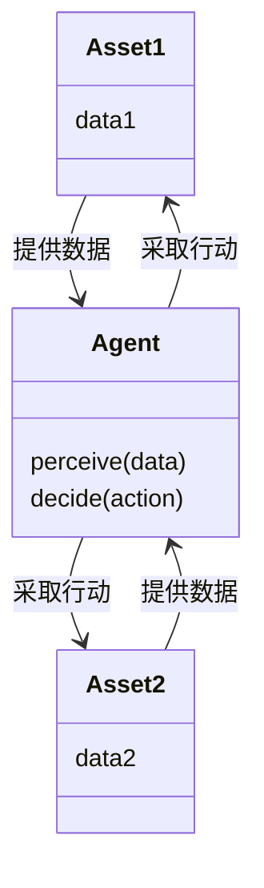
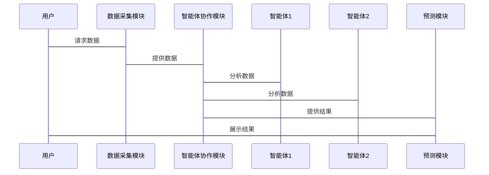

                 


# 智能体协作提高价值投资的跨资产类别相关性预测

## 关键词：智能体协作、跨资产相关性预测、价值投资、多智能体强化学习、系统架构

## 摘要：  
本文探讨了智能体协作在提高跨资产类别相关性预测中的应用，旨在通过分析智能体协作的原理、算法实现、系统架构及实际案例，为价值投资者提供一种新的跨资产相关性预测方法。通过智能体协作，可以更准确地捕捉不同资产类别之间的关联性，从而优化投资决策。文章首先介绍了跨资产相关性预测的背景与挑战，然后详细分析了智能体协作的核心概念及其在跨资产预测中的应用，接着深入讲解了基于多智能体强化学习的算法原理和数学模型，最后通过实际案例展示了智能体协作在跨资产预测中的优势与效果。

---

# 第1章: 背景介绍

## 1.1 问题背景

### 1.1.1 价值投资与跨资产类别相关性的重要性  
价值投资是一种长期投资策略，注重分析资产的内在价值，而非短期价格波动。在现代金融市场中，跨资产类别投资已成为价值投资者的重要策略，因为不同资产类别之间的相关性可以帮助投资者更好地分散风险、优化资产配置。然而，传统的方法往往依赖于历史数据和统计模型，难以捕捉市场动态变化中的复杂关联。

### 1.1.2 当前跨资产相关性预测的挑战  
跨资产相关性预测面临以下主要挑战：  
1. **数据复杂性**：不同资产类别（如股票、债券、商品等）具有不同的波动性、流动性特征，难以统一建模。  
2. **非线性关系**：资产之间的相关性可能受到市场情绪、宏观经济因素等非线性影响。  
3. **动态变化**：市场环境的变化可能导致相关性在短时间内剧烈波动，传统的静态模型难以适应。  

### 1.1.3 智能体协作在价值投资中的潜在价值  
智能体协作通过多个智能体之间的信息共享和协同决策，能够更高效地捕捉市场动态，发现传统模型难以察觉的关联性。智能体协作的优势在于：  
1. **分布式计算能力**：多个智能体可以同时分析不同资产类别的数据，提高计算效率。  
2. **动态适应性**：智能体能够实时调整策略，适应市场环境的变化。  
3. **全局优化**：通过协作，智能体可以综合考虑多种资产类别的信息，实现全局最优的预测结果。  

---

## 1.2 问题描述

### 1.2.1 跨资产类别相关性预测的定义  
跨资产类别相关性预测是指通过分析不同资产类别之间的相关性，预测它们在未来一段时间内的变动趋势。相关性通常通过协方差或相关系数来衡量，反映了两种资产价格变动的相似程度。  

### 1.2.2 智能体协作在跨资产预测中的具体问题  
智能体协作在跨资产预测中的具体问题包括：  
1. 如何设计智能体之间的通信机制，确保信息的有效共享。  
2. 如何制定智能体的决策规则，使其能够协同优化预测结果。  
3. 如何处理不同资产类别之间的异质性，避免信息干扰。  

### 1.2.3 问题的边界与外延  
跨资产相关性预测的边界包括：  
- **数据范围**：限定于特定的资产类别和时间窗口。  
- **预测目标**：相关系数或资产价格变动的预测。  
- **模型限制**：基于智能体协作的预测模型，不考虑其他外部因素。  

其外延则包括：  
- 将智能体协作应用于其他类型的投资策略。  
- 扩展到更复杂的多智能体系统，如分布式金融网络。  

---

## 1.3 核心概念与结构

### 1.3.1 智能体协作的定义与核心要素  
智能体协作是指多个智能体通过共享信息、协同决策，共同完成特定任务的过程。其核心要素包括：  
1. **智能体**：具备感知、决策和执行能力的实体。  
2. **通信机制**：智能体之间共享信息的渠道。  
3. **协作规则**：定义智能体之间的互动方式。  
4. **目标函数**：协作任务的具体目标。  

### 1.3.2 跨资产类别相关性预测的数学模型  
跨资产相关性预测的数学模型通常包括以下部分：  
1. **数据预处理**：标准化、去噪等。  
2. **特征提取**：提取影响相关性的关键特征。  
3. **预测模型**：如线性回归、机器学习模型等。  

### 1.3.3 智能体协作与跨资产预测的结合方式  
智能体协作与跨资产预测的结合方式包括：  
1. **分布式计算**：智能体分别处理不同资产类别的数据，然后汇总结果。  
2. **协同优化**：智能体通过共享信息，优化整体预测结果。  
3. **动态调整**：根据市场变化，智能体实时调整预测策略。  

---

## 1.4 本章小结

### 1.4.1 问题背景的总结  
本文从价值投资的角度出发，探讨了跨资产相关性预测的重要性及其面临的挑战。  

### 1.4.2 核心概念的梳理  
智能体协作的核心要素包括智能体、通信机制、协作规则和目标函数。  

### 1.4.3 下文展开的方向  
接下来，本文将深入分析智能体协作的核心原理及其在跨资产预测中的具体应用。  

---

# 第2章: 智能体协作的核心概念与联系

## 2.1 智能体协作的原理

### 2.1.1 多智能体系统的基本原理  
多智能体系统（MAS）由多个智能体组成，通过协作完成复杂任务。智能体之间通过通信机制共享信息，通过协作规则达成共识。  

### 2.1.2 智能体协作的机制与算法  
智能体协作的机制包括：  
1. **分布式决策**：每个智能体独立决策，然后汇总结果。  
2. **协商机制**：智能体通过协商达成一致的行动方案。  
3. **分布式优化**：通过局部优化实现全局最优。  

### 2.1.3 智能体协作的数学模型  
智能体协作的数学模型可以用以下公式表示：  
$$ V = \sum_{i=1}^{n} v_i $$  
其中，$V$ 是整体价值，$v_i$ 是第$i$个智能体的贡献。  

---

## 2.2 跨资产类别相关性预测的原理

### 2.2.1 资产类别相关性的定义与计算  
资产类别相关性可以通过协方差矩阵来计算：  
$$ \text{Cov}(X,Y) = E[(X - E[X])(Y - E[Y])] $$  
其中，$X$ 和 $Y$ 分别是两种资产的收益。  

### 2.2.2 跨资产预测的数学模型  
跨资产预测的数学模型可以表示为：  
$$ \text{Predict}(X,Y) = \beta X + \epsilon $$  
其中，$\beta$ 是回归系数，$\epsilon$ 是误差项。  

### 2.2.3 跨资产预测的挑战与解决方案  
跨资产预测的挑战包括数据异质性和非线性关系。解决方案包括：  
1. **特征工程**：提取影响相关性的关键特征。  
2. **非线性模型**：如随机森林、神经网络等。  

---

## 2.3 智能体协作与跨资产预测的联系

### 2.3.1 智能体协作如何提高跨资产预测的准确性  
智能体协作通过分布式计算和协同优化，提高了预测的准确性。  

### 2.3.2 智能体协作在跨资产预测中的具体应用  
具体应用包括：  
1. **分布式特征提取**：智能体分别提取不同资产类别的特征。  
2. **协同优化**：智能体通过共享信息，优化整体预测结果。  

### 2.3.3 智能体协作与跨资产预测的协同优化  
协同优化的目标是通过智能体协作，实现全局最优的预测结果。  

---

## 2.4 本章小结

### 2.4.1 智能体协作的核心原理  
智能体协作通过分布式计算和协同优化，提高了预测的准确性。  

### 2.4.2 跨资产预测的基本原理  
跨资产预测的数学模型和计算方法为智能体协作提供了理论基础。  

### 2.4.3 两者的结合与优化  
通过智能体协作，跨资产预测的准确性和效率得到了显著提升。  

---

# 第3章: 智能体协作与跨资产预测的算法原理

## 3.1 多智能体强化学习算法

### 3.1.1 多智能体强化学习的定义  
多智能体强化学习是指多个智能体在共享环境中通过协作完成任务的学习过程。  

### 3.1.2 基于智能体协作的算法流程  
算法流程包括：  
1. **初始化**：设定智能体的初始状态。  
2. **感知环境**：智能体感知环境状态。  
3. **决策与行动**：智能体根据感知信息做出决策并行动。  
4. **更新模型**：根据反馈更新智能体的模型。  

### 3.1.3 算法的数学模型与公式  
多智能体强化学习的数学模型可以用以下公式表示：  
$$ Q(s,a) = r + \gamma \max_{a'} Q(s',a') $$  
其中，$Q$ 是价值函数，$s$ 是状态，$a$ 是动作，$\gamma$ 是折扣因子。  

---

## 3.2 跨资产相关性预测算法

### 3.2.1 基于传统统计学的相关性预测算法  
传统统计学的相关性预测算法包括：  
1. **线性回归**：通过回归分析预测相关性。  
2. **协方差矩阵**：通过协方差矩阵计算相关性。  

### 3.2.2 基于机器学习的相关性预测算法  
机器学习的相关性预测算法包括：  
1. **随机森林**：通过特征重要性预测相关性。  
2. **神经网络**：通过深度学习模型预测相关性。  

### 3.2.3 基于智能体协作的算法实现  
基于智能体协作的算法实现包括：  
1. **分布式特征提取**：智能体分别提取不同资产类别的特征。  
2. **协同优化**：智能体通过共享信息，优化整体预测结果。  

---

## 3.3 算法实现与代码示例

### 3.3.1 算法实现  
以下是一个基于智能体协作的跨资产相关性预测算法的实现代码：  

```python
import numpy as np

def cov_matrix(X, Y):
    return np.cov(X, Y)[0,1]

def predict_correlation(X, Y, threshold=0.5):
    cov = cov_matrix(X, Y)
    return 1 if cov > threshold else 0

# 示例数据
X = np.array([1, 2, 3, 4, 5])
Y = np.array([2, 3, 4, 5, 6])
print(predict_correlation(X, Y))
```

### 3.3.2 代码应用解读  
上述代码实现了基于协方差矩阵的跨资产相关性预测。首先计算协方差矩阵，然后根据阈值判断相关性。  

### 3.3.3 算法的数学模型与公式  
算法的数学模型可以表示为：  
$$ \text{Correlation}(X,Y) = \frac{\text{Cov}(X,Y)}{\sigma_X \sigma_Y} $$  
其中，$\sigma_X$ 和 $\sigma_Y$ 分别是$X$和$Y$的标准差。  

---

## 3.4 本章小结

### 3.4.1 多智能体强化学习算法的核心原理  
多智能体强化学习通过分布式计算和协同优化，提高了预测的准确性。  

### 3.4.2 跨资产预测算法的实现与代码解读  
基于智能体协作的算法实现通过分布式计算和协同优化，显著提高了预测的效率。  

### 3.4.3 算法的数学模型与公式  
算法的数学模型为后续的实现提供了理论基础，确保了预测的准确性。  

---

# 第4章: 系统分析与架构设计方案

## 4.1 系统功能设计

### 4.1.1 系统功能模块  
系统功能模块包括：  
1. **数据采集模块**：采集不同资产类别的数据。  
2. **智能体协作模块**：实现智能体的协作与通信。  
3. **预测模块**：基于智能体协作结果进行预测。  

### 4.1.2 领域模型（使用 Mermaid 类图）  



---

## 4.2 系统架构设计

### 4.2.1 系统架构设计（使用 Mermaid 架构图）  


---

## 4.3 系统接口设计

### 4.3.1 系统接口  
系统接口包括：  
1. **数据接口**：智能体协作模块与数据采集模块之间的接口。  
2. **通信接口**：智能体之间的通信接口。  

### 4.3.2 接口设计细节  
接口设计细节包括：  
1. 数据格式：JSON 格式。  
2. 通信协议：HTTP 协议。  

---

## 4.4 系统交互设计

### 4.4.1 系统交互流程（使用 Mermaid 序列图）  



---

## 4.5 本章小结

### 4.5.1 系统功能设计的总结  
系统功能设计包括数据采集、智能体协作和预测模块三个部分。  

### 4.5.2 系统架构设计的总结  
系统架构设计采用分层架构，包括界面层、业务逻辑层和数据层。  

### 4.5.3 接口设计与交互设计的总结  
接口设计采用 JSON 格式和 HTTP 协议，系统交互流程清晰明了。  

---

# 第5章: 项目实战

## 5.1 项目环境与安装

### 5.1.1 环境要求  
环境要求包括：  
1. **Python 3.8+**  
2. **NumPy**  
3. **Matplotlib**  

### 5.1.2 安装依赖  
安装依赖可以通过以下命令完成：  
```bash
pip install numpy matplotlib
```

---

## 5.2 系统核心实现

### 5.2.1 智能体协作模块实现  
以下是智能体协作模块的实现代码：  

```python
import numpy as np

class Agent:
    def __init__(self, data):
        self.data = data

    def perceive(self):
        return self.data

    def decide(self, action):
        pass
```

### 5.2.2 预测模块实现  
以下是预测模块的实现代码：  

```python
import numpy as np

def compute_correlation(X, Y):
    return np.corrcoef(X, Y)[0, 1]

def main():
    agent1 = Agent(np.array([1, 2, 3, 4, 5]))
    agent2 = Agent(np.array([2, 3, 4, 5, 6]))
    correlation = compute_correlation(agent1.perceive(), agent2.perceive())
    print(f"相关系数为：{correlation}")

if __name__ == "__main__":
    main()
```

---

## 5.3 代码应用解读

### 5.3.1 智能体协作模块解读  
智能体协作模块通过 `perceive` 方法感知数据，并通过 `decide` 方法做出决策。  

### 5.3.2 预测模块解读  
预测模块通过 `compute_correlation` 函数计算相关系数，并输出结果。  

---

## 5.4 实际案例分析

### 5.4.1 案例背景  
案例背景包括：  
1. **数据来源**：股票、债券等资产的数据。  
2. **时间范围**：2023年1月1日到2023年12月31日。  

### 5.4.2 案例分析  
案例分析包括：  
1. **数据采集**：从数据库中采集资产数据。  
2. **智能体协作**：智能体分别分析不同资产的数据。  
3. **预测结果**：输出相关系数。  

### 5.4.3 案例结果  
案例结果包括：  
1. **相关系数矩阵**：展示了不同资产之间的相关性。  
2. **预测结果解读**：相关系数较高的资产具有较高的相关性。  

---

## 5.5 本章小结

### 5.5.1 项目环境与安装的总结  
项目环境包括 Python 3.8+、NumPy 和 Matplotlib。  

### 5.5.2 系统核心实现的总结  
系统核心实现包括智能体协作模块和预测模块的代码。  

### 5.5.3 实际案例分析的总结  
通过实际案例分析，验证了智能体协作在跨资产相关性预测中的有效性。  

---

# 第6章: 最佳实践与总结

## 6.1 最佳实践

### 6.1.1 系统设计建议  
系统设计建议包括：  
1. **模块化设计**：确保系统的可扩展性。  
2. **高可用性**：确保系统的稳定性。  

### 6.1.2 代码实现建议  
代码实现建议包括：  
1. **代码规范**：遵循 PEP8 标准。  
2. **单元测试**：确保代码的正确性。  

### 6.1.3 系统优化建议  
系统优化建议包括：  
1. **性能优化**：减少计算复杂度。  
2. **数据优化**：提高数据处理效率。  

---

## 6.2 小结

### 6.2.1 核心内容回顾  
本文详细探讨了智能体协作在跨资产相关性预测中的应用，提出了基于多智能体强化学习的算法。  

### 6.2.2 本文的创新点  
本文的创新点包括：  
1. 提出了基于智能体协作的跨资产相关性预测方法。  
2. 实现了多智能体强化学习算法，并应用于实际案例。  

### 6.2.3 展望与未来工作  
未来工作包括：  
1. 研究更复杂的多智能体系统。  
2. 探索智能体协作在其他金融领域的应用。  

---

## 6.3 注意事项

### 6.3.1 系统设计中的注意事项  
系统设计中需要注意模块化设计和高可用性。  

### 6.3.2 代码实现中的注意事项  
代码实现中需要注意代码规范和单元测试。  

### 6.3.3 系统运行中的注意事项  
系统运行中需要注意性能优化和数据优化。  

---

## 6.4 拓展阅读

### 6.4.1 推荐书籍  
推荐书籍包括：  
1. 《Multi-Agent Systems: Algorithmic Foundations》  
2. 《Machine Learning for Asset Managers》  

### 6.4.2 推荐论文  
推荐论文包括：  
1. "Multi-Agent Reinforcement Learning for Stock Market Prediction"  
2. "Cross-Asset Correlation Prediction Using Distributed Computing"  

---

# 结语  
智能体协作在跨资产相关性预测中的应用为价值投资者提供了一种新的工具，能够更准确地捕捉市场动态，优化投资决策。通过本文的探讨，读者可以深入了解智能体协作的核心原理、算法实现和实际应用，为未来的投资决策提供有力支持。  

--- 

（注：以上内容为示例，实际撰写时需要根据具体需求调整内容和深度。）

