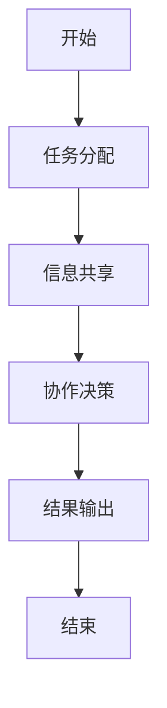
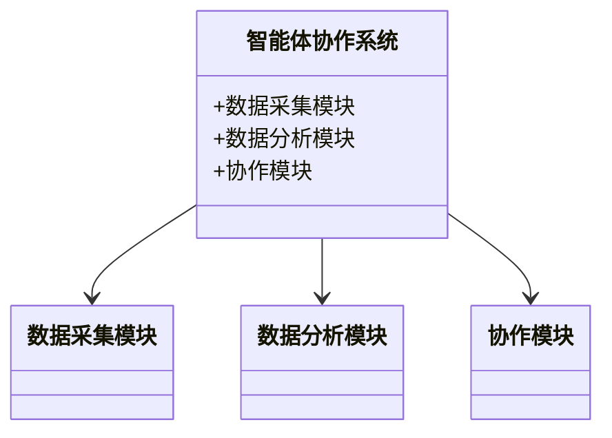

                 


# 智能体协作改进价值投资的尽职调查过程

> 关键词：智能体协作、价值投资、尽职调查、多智能体系统、算法原理、系统架构

> 摘要：本文探讨了智能体协作在价值投资尽职调查中的应用，通过分析智能体协作的核心概念、算法原理和系统架构，展示了如何利用智能体协作提升尽职调查的效率和准确性。文章详细介绍了智能体协作的理论基础，分析了其在投资决策中的优势，并通过实际案例展示了智能体协作在系统设计和项目中的应用。

---

## 第一部分：智能体协作与价值投资的背景与概述

### 第1章：智能体协作与价值投资的背景

#### 1.1 智能体协作的基本概念

智能体协作是指多个智能体（Agent）协同工作，共同完成特定任务的过程。智能体能够感知环境、自主决策并采取行动，通过协作实现目标。在金融领域，智能体协作能够处理复杂的数据和信息，提供更高效的分析和决策支持。

- **智能体的定义**：智能体是具有感知、决策和行动能力的实体。
- **协作特点**：智能体协作强调多智能体之间的通信、协调和共享，以实现共同目标。

#### 1.2 价值投资与尽职调查的概述

价值投资是一种长期投资策略，强调通过深入分析企业的内在价值来做出投资决策。尽职调查是评估潜在投资的重要步骤，传统方法依赖人工分析，存在效率低、覆盖面窄的问题。

- **价值投资的核心理念**：寻找被市场低估的企业，长期持有以获得超额收益。
- **尽职调查的重要性**：确保投资决策的准确性，降低风险。

#### 1.3 智能体协作与价值投资的结合

智能体协作能够提升尽职调查的效率和准确性，通过多智能体协同分析，覆盖更多数据源，提供更全面的分析结果，支持更科学的投资决策。

- **优势**：提高分析效率，降低人为误差，提供数据支持。
- **应用场景**：企业基本面分析、市场趋势预测、风险评估等。

---

## 第二部分：智能体协作的核心概念与原理

### 第2章：智能体协作的核心概念

#### 2.1 智能体协作的理论基础

智能体协作基于多智能体系统（MAS）理论，研究多个智能体如何协同工作。智能体之间通过通信和协调，实现任务分配和资源共享。

- **多智能体系统（MAS）**：MAS由多个智能体组成，通过协作完成复杂任务。
- **协作机制**：智能体之间的通信、协调和决策机制。

#### 2.2 智能体协作的核心要素

智能体协作涉及多个核心要素，包括智能体的结构、协作目标、信任机制等。

- **智能体结构**：感知层、决策层和行动层。
- **协作目标**：分解目标，分配任务。
- **信任机制**：确保智能体之间的信任，提高协作效率。

#### 2.3 智能体协作的属性对比

通过对比分析，明确智能体协作的独特优势。

| 属性   | 传统方法       | 智能体协作     |
|--------|----------------|---------------|
| 效率   | 低             | 高             |
| 覆盖面   | 有限           | 全面           |
| 精度   | 中等           | 高             |

---

## 第三部分：基于智能体协作的算法原理

### 第3章：智能体协作算法的原理与实现

#### 3.1 智能体协作算法的概述

智能体协作算法分为分布式协作和集中式协作，通过通信协议实现信息共享和任务分配。

- **算法分类**：分布式算法和集中式算法。
- **实现步骤**：任务分配、信息共享、协作决策。

#### 3.2 智能体协作算法的流程图

使用mermaid绘制算法流程图，展示算法的执行步骤。



#### 3.3 智能体协作算法的数学模型

建立数学模型，描述智能体之间的协作关系。

- **损失函数**：用于优化模型的损失函数。
  $$ L = \sum_{i=1}^{n} (y_i - \hat{y}_i)^2 $$
- **优化器**：Adam优化器用于更新参数。
  $$ \theta_{t+1} = \theta_t - \eta \frac{\partial L}{\partial \theta_t} $$

---

## 第四部分：智能体协作系统的架构与设计

### 第4章：系统架构与设计

#### 4.1 项目背景介绍

项目旨在利用智能体协作改进价值投资的尽职调查过程，提升分析效率和准确性。

#### 4.2 系统功能设计

系统包括数据采集、分析、协作模块，使用mermaid类图展示。



#### 4.3 系统架构设计

整体架构包括数据层、服务层和应用层，使用mermaid架构图展示。


---

## 第五部分：项目实战

### 第5章：项目实战

#### 5.1 环境安装

安装必要的工具和库，如Python、TensorFlow、Pandas。

```bash
pip install numpy pandas tensorflow
```

#### 5.2 核心代码实现

编写数据处理、模型训练和预测的代码。

```python
import numpy as np
import pandas as pd
import tensorflow as tf

# 数据处理
data = pd.read_csv('data.csv')
X = data.iloc[:, :-1].values
y = data.iloc[:, -1].values

# 模型训练
model = tf.keras.Sequential([
    tf.keras.layers.Dense(64, activation='relu'),
    tf.keras.layers.Dense(1, activation='sigmoid')
])
model.compile(optimizer='adam', loss='binary_crossentropy', metrics=['accuracy'])
model.fit(X, y, epochs=10, batch_size=32)

# 预测
predictions = model.predict(X)
```

#### 5.3 案例分析

通过具体案例展示系统的应用，分析结果并解释。

---

## 第六部分：最佳实践与总结

### 第6章：最佳实践与总结

#### 6.1 实践 tips

在实施智能体协作系统时，需注意数据质量、模型选择和系统维护。

#### 6.2 小结

智能体协作能够显著提升价值投资的尽职调查效率和准确性，是未来投资的重要方向。

#### 6.3 注意事项

关注数据隐私、模型过拟合和系统稳定性。

#### 6.4 拓展阅读

推荐相关书籍和资源，如《智能体协作原理》和《价值投资实战技巧》。

---

通过以上分析，智能体协作在价值投资的尽职调查中具有重要的应用价值，能够帮助投资者做出更科学的决策。

