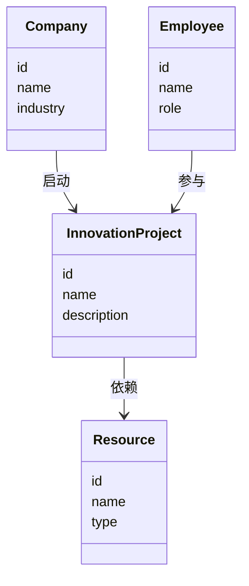

                 


# 智能体协作评估公司的创新生态系统：预测长期竞争力

## 关键词：智能体协作、创新生态系统、竞争力预测、系统架构设计、算法原理

## 摘要：  
本文详细探讨了智能体协作在评估公司创新生态系统中的应用，并通过预测模型分析公司的长期竞争力。文章从理论基础、算法原理、系统架构到实际案例，全面阐述了智能体协作评估模型的构建与应用。通过本篇文章，读者将了解如何利用智能体协作技术，对公司创新生态系统进行量化评估，从而为企业战略决策提供科学依据。

---

# 第一部分: 智能体协作与创新生态系统基础

## 第1章: 智能体协作与创新生态系统概述

### 1.1 智能体协作的基本概念

#### 1.1.1 智能体的基本定义  
智能体（Agent）是指具有感知环境、做出决策并采取行动以实现特定目标的实体。智能体可以是软件程序、机器人或其他具备自主决策能力的系统。在商业环境中，智能体可以代表员工、部门或整个组织，通过协作完成复杂任务。

#### 1.1.2 智能体协作的定义与特点  
智能体协作是指多个智能体通过信息共享、协同决策和行动，共同完成复杂任务的过程。其特点包括：  
- **自主性**：智能体能够独立决策。  
- **协作性**：智能体之间通过通信和协调实现共同目标。  
- **动态性**：协作过程适应环境变化。  

#### 1.1.3 创新生态系统的核心要素  
创新生态系统由以下几个核心要素组成：  
- **创新主体**：包括员工、团队、部门等。  
- **创新资源**：包括资金、技术、数据等。  
- **创新环境**：包括企业文化、制度、政策等。  
- **创新成果**：包括产品、服务、专利等。  

### 1.2 公司创新生态系统的重要性

#### 1.2.1 创新生态系统对企业发展的影响  
创新是企业保持竞争力的关键。创新生态系统能够帮助企业快速响应市场变化，优化资源配置，提升创新能力。  

#### 1.2.2 创新生态系统与公司竞争力的关系  
创新能力强的企业更容易推出新产品、开拓新市场，从而在竞争中占据优势。  

#### 1.2.3 创新生态系统评估的必要性  
通过评估创新生态系统，企业可以识别瓶颈、优化流程，从而提升整体竞争力。  

### 1.3 智能体协作在创新生态系统评估中的作用

#### 1.3.1 智能体协作的优势  
智能体协作能够实时感知环境变化，快速做出决策，适合复杂动态的创新生态系统评估。  

#### 1.3.2 智能体协作在创新生态系统中的应用场景  
- 识别创新瓶颈。  
- 优化创新流程。  
- 预测创新趋势。  

#### 1.3.3 智能体协作与传统评估方法的对比  
传统评估方法依赖人工分析，效率低、主观性强。智能体协作能够自动化、实时化地进行评估，结果更客观、准确。  

---

## 第2章: 智能体协作评估模型的核心概念

### 2.1 智能体协作评估模型的原理

#### 2.1.1 智能体协作评估模型的基本原理  
智能体协作评估模型通过分析创新生态系统中的各个要素，利用智能体协作技术，量化评估企业的创新能力。  

#### 2.1.2 智能体协作评估模型的数学基础  
评估模型基于图论和概率论，通过构建网络关系图，计算各节点的影响力权重。  

### 2.2 智能体协作评估模型的特征

#### 2.2.1 智能体协作评估模型的主要特征  
- **动态性**：能够实时更新评估结果。  
- **多维度性**：从资源、环境、成果等多个维度进行评估。  
- **可扩展性**：适用于不同规模的企业。  

#### 2.2.2 智能体协作评估模型的优缺点  
- **优点**：高效、准确、动态。  
- **缺点**：依赖高质量数据，实施成本较高。  

### 2.3 智能体协作评估模型的ER实体关系图

#### 2.3.1 实体关系图的定义  
ER实体关系图用于描述创新生态系统中的各个实体及其关系。  

#### 2.3.2 实体关系图的构建过程  
1. 确定核心实体：公司、员工、创新项目、资源等。  
2. 分析实体之间的关系：员工参与项目、项目依赖资源等。  
3. 绘制ER图。  

#### 2.3.3 实体关系图的案例分析  
以下是创新生态系统实体关系图的Mermaid示例：  

```mermaid
erDiagram
    company {
        id
        name
        industry
    }
    employee {
        id
        name
        role
    }
    innovation_project {
        id
        name
        description
    }
    resource {
        id
        name
        type
    }
    company --> innovation_project : "启动项目"
    employee --> innovation_project : "参与项目"
    innovation_project --> resource : "依赖资源"
```

---

## 第3章: 智能体协作评估模型的算法原理

### 3.1 算法原理概述

#### 3.1.1 算法的基本思路  
通过构建创新生态系统网络，计算各节点的影响力权重，评估企业的创新能力。  

#### 3.1.2 算法的核心步骤  
1. 数据采集：收集公司、员工、项目、资源等数据。  
2. 数据预处理：清洗、标准化数据。  
3. 网络构建：建立创新生态系统网络模型。  
4. 权重计算：基于网络关系计算各节点的影响力。  
5. 评估结果：输出创新能力评估结果。  

### 3.2 算法的数学模型与公式

#### 3.2.1 数学模型的定义  
评估模型基于图论，通过计算节点的影响力权重，量化创新能力。  

#### 3.2.2 数学公式的推导  
影响力权重计算公式：  
$$ w_i = \frac{d_i}{\sum_{j} d_j} $$  
其中，$d_i$ 表示节点 $i$ 的度数，$\sum_{j} d_j$ 是所有节点度数之和。  

#### 3.2.3 数学公式的应用案例  
假设公司A的创新网络中，节点度数分布如下：  
节点A：度数为3  
节点B：度数为2  
节点C：度数为5  
总度数为10  
则节点C的影响力权重为：  
$$ w_C = \frac{5}{10} = 0.5 $$  

### 3.3 算法的实现步骤

#### 3.3.1 数据预处理  
- 清洗数据：去除重复、错误数据。  
- 标准化数据：统一数据格式。  

#### 3.3.2 模型训练  
- 构建创新生态系统网络模型。  
- 计算各节点的影响力权重。  

#### 3.3.3 模型评估  
- 评估结果：输出创新能力评分。  
- 验证模型准确性。  

---

## 第4章: 智能体协作评估模型的系统分析与架构设计

### 4.1 系统功能设计

#### 4.1.1 领域模型的Mermaid类图  
以下是创新生态系统领域的类图：  



### 4.2 系统架构设计

#### 4.2.1 系统架构的Mermaid图  
以下是系统架构的Mermaid图：  

```mermaid
div class="mermaid"
graph LR
    I1[创新数据采集] --> D1[数据预处理]
    D1 --> M1[模型训练]
    M1 --> E1[评估结果]
    E1 --> O1[输出报告]
```

---

## 第5章: 智能体协作评估模型的项目实战

### 5.1 环境安装与配置

#### 5.1.1 安装Python环境  
安装Python 3.8及以上版本，建议使用Anaconda。  

#### 5.1.2 安装依赖库  
安装以下依赖库：  
- networkx  
- numpy  
- pandas  

### 5.2 核心代码实现

#### 5.2.1 数据预处理代码  

```python
import pandas as pd

# 读取数据
data = pd.read_csv('innovation.csv')

# 数据清洗
data.dropna(inplace=True)
data = data.drop_duplicates()
```

#### 5.2.2 模型训练代码  

```python
import networkx as nx

# 构建网络
G = nx.Graph()
G.add_nodes_from(['Company', 'Employee', 'InnovationProject', 'Resource'])
G.add_edges_from([('Company', 'InnovationProject'), ('Employee', 'InnovationProject'), ('InnovationProject', 'Resource')])

# 计算影响力权重
degree = nx.degree(G)
total_degree = sum(degree.values())
weights = {node: degree[node]/total_degree for node in G.nodes()}
```

---

## 第6章: 总结与展望

### 6.1 最佳实践 Tips

#### 6.1.1 数据质量的重要性  
确保数据的准确性和完整性。  

#### 6.1.2 模型优化建议  
根据实际需求调整模型参数。  

### 6.2 小结

本文详细介绍了智能体协作评估模型的构建与应用，从理论到实践，全面阐述了如何利用智能体协作技术，对公司创新生态系统进行评估与预测。  

### 6.3 注意事项

- 数据隐私保护。  
- 模型的可解释性。  
- 系统的可扩展性。  

### 6.4 拓展阅读

建议阅读以下相关资料：  
- 图论与网络分析。  
- 智能体协作算法。  
- 企业创新管理。  

---

通过本文的学习，读者可以掌握智能体协作评估模型的核心原理与实现方法，并能够将其应用于实际的企业创新管理中，为企业长期竞争力的预测与提升提供有力支持。

