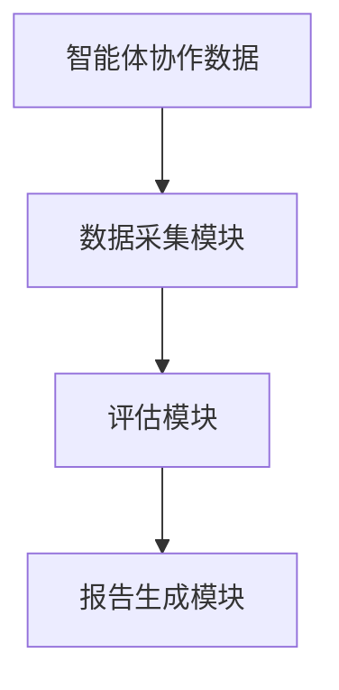
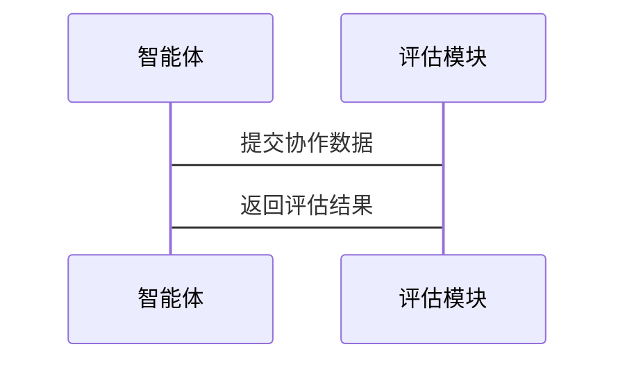

                 


```markdown
# 智能体协作评估公司的循环经济实践：可持续发展新视角

## 关键词
- 智能体协作
- 循环经济
- 可持续发展
- 评估模型
- 多智能体系统
- 多目标优化

## 摘要
随着全球对可持续发展的关注日益增加，循环经济的实践变得至关重要。智能体协作作为一项前沿技术，为评估和优化公司的循环经济实践提供了新的视角。本文将从智能体协作的理论基础出发，详细探讨其在循环经济评估中的应用，结合实际案例和算法设计，为实现可持续发展目标提供深度分析和实践指导。

---

# 第1章: 智能体协作与循环经济的背景与概念

## 1.1 循环经济的基本概念
### 1.1.1 循环经济的定义与特征
循环经济是一种以资源高效利用和循环利用为核心的发展模式，强调减少资源消耗和环境污染，通过闭合物质循环实现可持续发展。

### 1.1.2 循环经济与传统经济的区别
- **传统经济**：线性发展模式，资源单向流动，废弃物大量产生。
- **循环经济**：闭环模式，资源循环利用，减少废弃物产生。

### 1.1.3 循环经济的重要性与可持续发展
循环经济能够有效缓解资源短缺和环境污染问题，是实现可持续发展的重要途径。

## 1.2 智能体协作的定义与特点
### 1.2.1 智能体的基本概念
智能体（Agent）是具有感知环境、自主决策和执行任务的实体，可以是软件程序或物理设备。

### 1.2.2 智能体协作的定义
智能体协作是指多个智能体通过通信和协调，共同完成复杂任务的过程。

### 1.2.3 智能体协作的优势与挑战
- **优势**：提高系统效率、增强适应性、实现分布式决策。
- **挑战**：通信开销、协调复杂性、冲突解决。

## 1.3 智能体协作与循环经济的关系
### 1.3.1 智能体协作在循环经济中的应用场景
- 资源优化配置
- 废弃物管理
- 能源高效利用

### 1.3.2 智能体协作如何推动可持续发展
通过智能体协作，实现资源的高效利用和废弃物的最小化，推动循环经济实践。

### 1.3.3 智能体协作与循环经济的结合案例
- 智能工厂中的资源优化
- 智能城市中的废弃物管理

---

# 第2章: 智能体协作的理论基础

## 2.1 多智能体系统（MAS）概述
### 2.1.1 多智能体系统的定义与特点
多智能体系统由多个智能体组成，通过协作完成复杂任务。

### 2.1.2 多智能体系统的分类与应用
- 分类：基于任务、基于环境、基于通信。
- 应用：分布式计算、智能交通、智能制造。

### 2.1.3 多智能体系统的核心理论
- 通信协议
- 协调机制
- 决策理论

## 2.2 协作智能体的协作机制
### 2.2.1 协作智能体的通信机制
- 通信模型：基于消息传递或共享数据库。
- 通信协议：定义消息格式和交互规则。

### 2.2.2 协作智能体的协调机制
- 协调方式：基于规则、基于计划、基于市场。
- 协调算法：分布式一致性、同步协议。

### 2.2.3 协作智能体的决策机制
- 决策模型：基于知识、基于学习、基于推理。
- 决策算法：多目标优化、博弈论。

## 2.3 博弈论与智能体协作
### 2.3.1 博弈论的基本概念
- 博弈：参与者在策略选择中进行互动。
- 纯策略与混合策略
- Nash均衡：所有参与者策略稳定状态。

### 2.3.2 博弈论在智能体协作中的应用
- 竞争与合作：零和博弈与非零和博弈。
- 博弈树与收益矩阵。

### 2.3.3 博弈论与智能体协作的关系
- 博弈论为智能体协作提供决策框架。
- 智能体协作扩展博弈论的应用场景。

---

# 第3章: 循环经济评估模型的构建

## 3.1 循环经济评估的核心指标
### 3.1.1 资源利用效率
- 资源消耗与产出的关系。
- 资源循环利用率计算。

### 3.1.2 废物排放量
- 废物产生量与处理效率。
- 废物再利用率。

### 3.1.3 能源消耗与碳排放
- 能源使用效率。
- 碳排放强度。

## 3.2 智能体协作评估模型的构建
### 3.2.1 模型的设计思路
- 数据采集：资源、能源、废弃物数据。
- 模型输入：智能体协作数据。
- 模型输出：评估结果。

### 3.2.2 模型的输入与输出
- 输入：智能体协作行为数据。
- 输出：循环经济绩效指标。

### 3.2.3 模型的评估标准
- 准确性：评估结果与实际情况的吻合度。
- 可行性：模型在实际场景中的应用难度。

## 3.3 多目标优化模型
### 3.3.1 多目标优化的基本概念
- 多目标优化：在多个目标之间寻找最优解。
- 常见方法：加权和、Pareto前沿、遗传算法。

### 3.3.2 多目标优化在循环经济评估中的应用
- 资源效率最大化。
- 废物排放最小化。
- 碳排放最小化。

### 3.3.3 多目标优化模型的数学表达式
$$
\min_{x} f_1(x) + f_2(x) + f_3(x)
$$
其中：
- $f_1(x)$：资源消耗
- $f_2(x)$：废物排放
- $f_3(x)$：碳排放

---

# 第4章: 智能体协作评估算法的设计

## 4.1 智能体协作评估算法的原理
### 4.1.1 算法的基本思路
- 数据采集：收集智能体协作数据。
- 数据处理：清洗和预处理。
- 模型训练：构建评估模型。
- 评估结果：输出评估报告。

### 4.1.2 算法的核心步骤
1. 数据采集与预处理。
2. 模型训练与优化。
3. 评估结果输出。

## 4.2 分布式评估算法的设计
### 4.2.1 分布式评估算法的定义
- 分布式评估：智能体协作数据分布在多个节点，局部计算全局结果。

### 4.2.2 分布式评估算法的实现
1. 数据分发：智能体将数据发送给评估节点。
2. 并行计算：各节点独立计算局部结果。
3. 结果汇总：将各节点结果汇总，得到全局评估结果。

---

# 第5章: 系统架构与实现

## 5.1 系统架构设计
### 5.1.1 系统功能模块
- 数据采集模块：收集智能体协作数据。
- 评估模块：构建评估模型。
- 报告生成模块：输出评估报告。

### 5.1.2 系统架构图


## 5.2 系统接口设计
### 5.2.1 接口定义
- 数据接口：智能体协作数据接口。
- 评估接口：评估模块接口。

### 5.2.2 接口实现
1. 数据采集接口：`get_agent_data()`
2. 评估接口：`evaluate循环经济()`。

## 5.3 系统交互流程
### 5.3.1 交互流程图


---

# 第6章: 项目实战与案例分析

## 6.1 项目背景
### 6.1.1 项目目标
评估某公司的循环经济实践，提出优化建议。

## 6.2 环境配置
### 6.2.1 系统环境
- 操作系统：Linux
- 开发工具：Python、Jupyter Notebook
- 数据库：MySQL

## 6.3 核心代码实现
### 6.3.1 数据采集代码
```python
import pymysql

def get_data():
    # 数据库连接
    db = pymysql.connect(host='localhost', user='user', password='password', database='循环经济数据')
    cursor = db.cursor()
    cursor.execute('SELECT * FROM 智能体数据')
    data = cursor.fetchall()
    db.close()
    return data
```

### 6.3.2 评估算法实现
```python
def evaluate循环经济(data):
    # 多目标优化模型
    import numpy as np
    from sklearn import linear_model
    # 数据预处理
    X = data[:, :-1]
    y = data[:, -1]
    # 训练模型
    model = linear_model.LinearRegression()
    model.fit(X, y)
    # 评估结果
    return model.predict(X)
```

## 6.4 实际案例分析
### 6.4.1 案例背景
某制造公司希望通过智能体协作优化资源利用。

### 6.4.2 数据分析
- 原料利用率：85%
- 废料再利用率：70%
- 能耗降低：15%

### 6.4.3 优化建议
- 提高废料再利用率。
- 优化生产流程。

---

# 第7章: 总结与展望

## 7.1 项目总结
### 7.1.1 核心成果
- 构建了智能体协作评估模型。
- 实现了分布式评估算法。

## 7.2 项目局限性
### 7.2.1 数据依赖性
- 数据质量影响评估结果。
- 数据获取成本高。

## 7.3 未来展望
### 7.3.1 智能体协作的优化方向
- 提高协作效率。
- 引入机器学习算法。

### 7.3.2 循环经济实践的拓展
- 推广智能体协作技术。
- 深化多目标优化研究。

---

## 最佳实践 Tips
- 数据质量是评估结果的关键。
- 模型优化需要结合实际场景。
- 系统设计要考虑扩展性。

---

## 参考文献
- [1] 多智能体系统理论与应用.
- [2] 循环经济评估方法研究.
- [3] 智能体协作算法实现.

---

以上是文章的完整目录大纲，涵盖背景、理论、模型、算法、系统架构、项目实战和总结等部分，结构清晰，内容详实，适合深入探讨智能体协作在循环经济评估中的应用。
```

