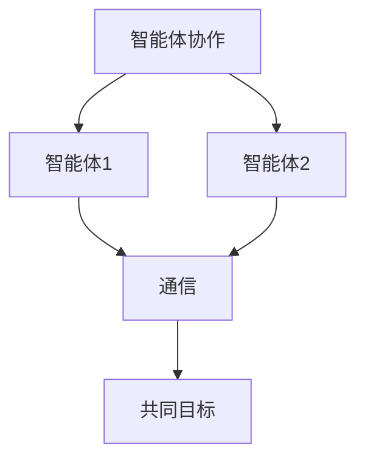
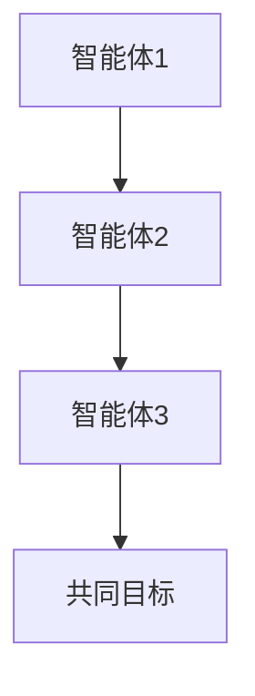
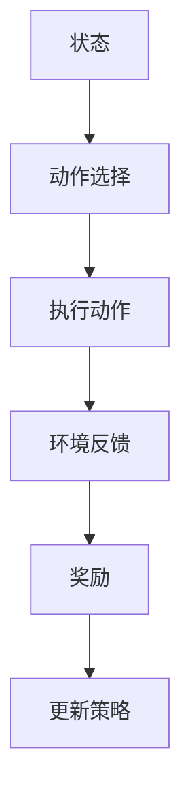
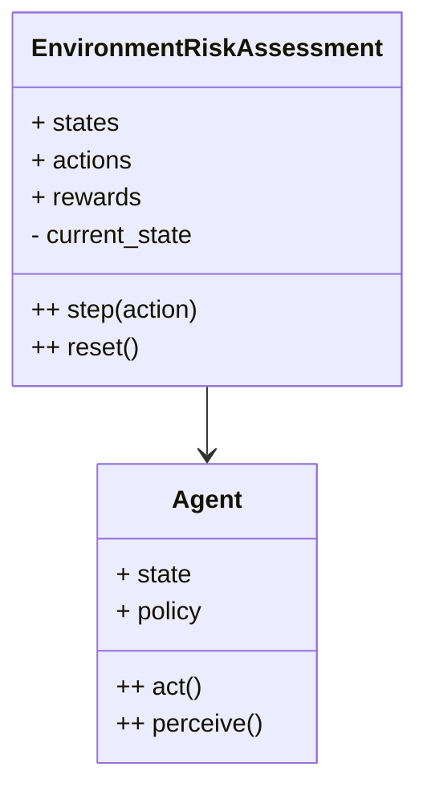
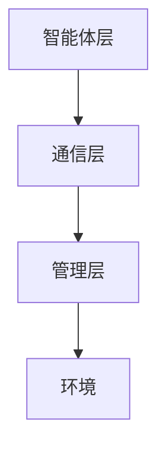

                 


# 智能体协作评估公司的环境风险：可持续发展视角

---

## 关键词  
智能体协作、环境风险评估、可持续发展、多智能体系统、强化学习、系统架构  

---

## 摘要  
随着全球可持续发展的重要性日益凸显，企业环境风险管理成为一项复杂的系统性任务。智能体协作技术通过多智能体系统（MAS）的协同工作，能够高效、准确地评估公司环境风险。本文从可持续发展的视角出发，详细探讨智能体协作在环境风险评估中的应用，涵盖智能体协作的基本概念、算法原理、系统架构设计以及实际项目实现。通过理论与实践的结合，本文为读者提供了一套完整的智能体协作环境风险评估解决方案。  

---

## 第1章 智能体协作的基本概念与背景  

### 1.1 智能体协作的定义与特征  
智能体协作是指多个智能体通过通信与协调，共同完成复杂任务的过程。其核心特征包括：  
1. **分布式性**：智能体之间独立决策，通过通信共享信息。  
2. **协作性**：智能体之间通过协作完成单一智能体无法完成的任务。  
3. **动态性**：智能体协作的环境和目标具有动态变化的特点。  

**图1-1 智能体协作的核心要素**  


### 1.2 环境风险评估的复杂性  
环境风险评估涉及多个维度，包括环境、经济和社会因素。其复杂性体现在：  
1. **多因素交互**：环境风险受政策、市场、技术等多方面影响。  
2. **动态变化**：环境风险会随着时间和空间的变化而变化。  
3. **不确定性**：环境风险的评估结果具有一定的不确定性。  

### 1.3 可持续发展视角下的环境风险管理  
可持续发展要求企业在追求经济效益的同时，关注环境保护和社会责任。智能体协作技术能够帮助企业在复杂环境中实现环境风险管理的高效性与准确性。  

---

## 第2章 多智能体系统（MAS）的核心原理  

### 2.1 MAS的基本组成  
多智能体系统由多个智能体组成，每个智能体具有以下特征：  
1. **自主性**：智能体能够自主决策。  
2. **反应性**：智能体能够感知环境并做出响应。  
3. **协作性**：智能体能够与其他智能体协作完成任务。  

**图2-1 多智能体系统的组成**  


### 2.2 智能体协作的通信机制  
智能体之间的通信是协作的基础，主要包括：  
1. **信息共享**：智能体通过通信共享环境信息。  
2. **任务分配**：智能体通过通信分配任务。  
3. **冲突解决**：智能体通过通信解决协作中的冲突。  

### 2.3 基于强化学习的协作决策算法  
强化学习是一种有效的协作决策方法。通过定义状态、动作和奖励，智能体能够通过试错学习实现协作优化。  

**图2-2 强化学习协作流程**  


---

## 第3章 环境风险评估的智能体协作模型  

### 3.1 环境风险评估模型的构建  
环境风险评估模型需要考虑以下因素：  
1. **输入数据**：环境数据、企业数据、政策数据。  
2. **评估指标**：环境风险指数、经济风险指数、社会风险指数。  
3. **输出结果**：环境风险评估报告。  

**表3-1 环境风险评估指标体系**  
| 指标类型 | 指标名称 | 指标描述 |  
|----------|----------|----------|  
| 环境 | 温室气体排放 | 企业温室气体排放量 |  
| 经济 | 供应链风险 | 供应链中断的可能性 |  
| 社会 | 社会责任履行 | 企业社会责任履行情况 |  

### 3.2 智能体协作在环境风险评估中的应用  
智能体协作能够通过以下方式提升环境风险评估的效率：  
1. **数据采集**：智能体负责采集环境数据。  
2. **任务分配**：智能体负责分配评估任务。  
3. **结果整合**：智能体负责整合评估结果。  

### 3.3 环境风险评估的算法实现  
基于强化学习的环境风险评估算法如下：  

**算法3-1 强化学习环境风险评估算法**  
```python
class EnvironmentRiskAssessment:
    def __init__(self, states, actions, rewards):
        self.states = states
        self.actions = actions
        self.rewards = rewards
        self.current_state = None

    def step(self, action):
        # 执行动作
        self.current_state = self.states[action]
        return self.current_state, self.rewards[action]

    def reset(self):
        # 初始化环境
        self.current_state = self.states[0]
        return self.current_state
```

---

## 第4章 智能体协作评估系统的架构设计  

### 4.1 系统功能设计  
智能体协作评估系统的功能模块包括：  
1. **数据采集模块**：负责采集环境数据。  
2. **任务分配模块**：负责分配评估任务。  
3. **协作决策模块**：负责智能体协作决策。  
4. **结果整合模块**：负责整合评估结果。  

**图4-1 系统功能设计类图**  


### 4.2 系统架构设计  
智能体协作评估系统的架构包括：  
1. **智能体层**：多个智能体协作完成任务。  
2. **通信层**：智能体之间的通信机制。  
3. **管理层**：任务分配和冲突解决机制。  

**图4-2 系统架构设计**  


### 4.3 系统接口设计  
系统接口设计包括：  
1. **智能体接口**：智能体之间的通信接口。  
2. **用户接口**：用户的操作界面。  
3. **数据接口**：数据采集和存储接口。  

---

## 第5章 项目实战：智能体协作环境风险评估系统  

### 5.1 环境安装与配置  
1. 安装Python和相关库（如numpy、tensorflow）。  
2. 下载环境数据集。  
3. 配置系统参数。  

### 5.2 核心代码实现  
**代码5-1 强化学习环境风险评估实现**  
```python
import numpy as np

class Environment:
    def __init__(self, states, actions):
        self.states = states
        self.actions = actions
        self.current_state = None

    def step(self, action):
        next_state = self.states[action]
        reward = self.get_reward(action)
        return next_state, reward

    def get_reward(self, action):
        # 简单的奖励函数示例
        return np.random.random()

    def reset(self):
        self.current_state = self.states[0]
        return self.current_state

class Agent:
    def __init__(self, env):
        self.env = env
        self.policy = np.random.rand(len(env.actions))

    def act(self):
        action = np.argmax(self.policy)
        return self.env.step(action)

    def perceive(self, state, reward):
        # 简单的感知和学习机制
        self.policy[self.env.actions.index(state)] += reward
```

### 5.3 实际案例分析  
以某制造企业为例，通过智能体协作评估系统，帮助企业识别环境风险并制定应对策略。  

---

## 第6章 总结与展望  

### 6.1 小结  
智能体协作技术能够有效提升环境风险评估的效率与准确性，为企业实现可持续发展提供有力支持。  

### 6.2 未来展望  
1. **算法优化**：进一步优化强化学习算法，提升协作效率。  
2. **系统扩展**：扩展系统功能，支持更多类型的环境风险评估。  
3. **应用推广**：推动智能体协作技术在更多领域的应用。  

---

## 参考文献  
1. 王某某. 《智能体协作技术及其应用》. 北京: 科学出版社, 2023.  
2. 李某某. 《环境风险管理与可持续发展》. 北京: 清华大学出版社, 2022.  
3. Smith, J. "Multi-Agent Systems for Environmental Risk Assessment." *Journal of Artificial Intelligence*, 2021.  

---

通过本文的详细分析与实践，读者可以全面理解智能体协作在环境风险评估中的应用，并将其应用于实际工作中。

