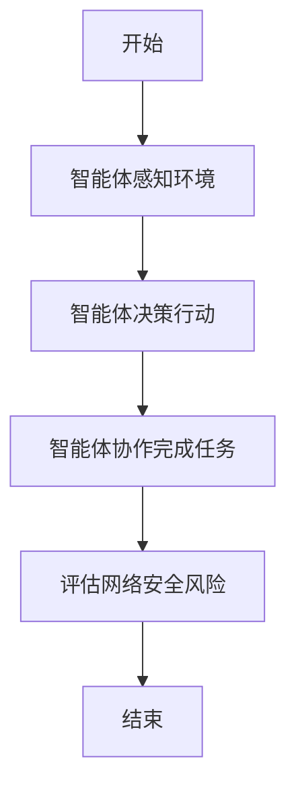
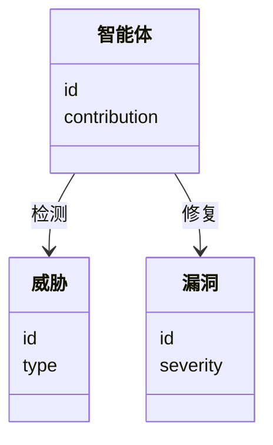
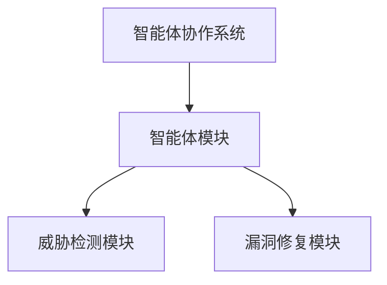
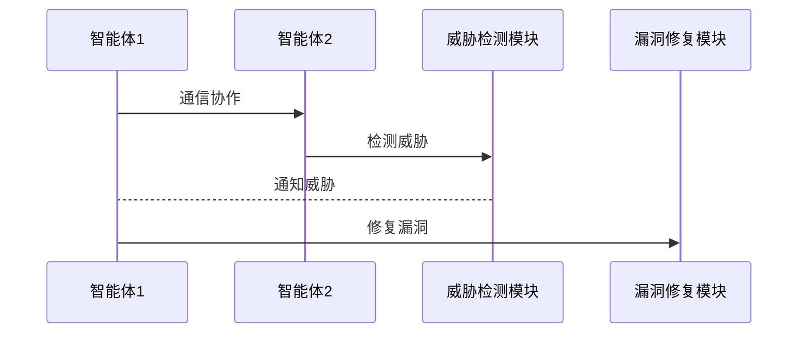

                 


# 智能体协作评估公司的网络安全风险：数字时代的新考量

---

## 关键词：
智能体协作，网络安全，风险评估，数字化时代，人工智能，安全威胁

---

## 摘要：
在数字化时代，网络安全威胁日益复杂，传统的安全评估方法已难以应对。本文提出智能体协作模型，通过多智能体协作来评估企业网络安全风险，实现更高效、更精准的风险管理。文章从理论基础、算法实现、系统架构到实际案例，详细阐述了智能体协作在网络安全中的应用，并探讨了其在未来安全防护中的潜力。

---

## 第1部分: 智能体协作与网络安全风险评估概述

### 1.1 问题背景与挑战

#### 1.1.1 数字化时代的网络安全威胁
数字化转型带来了企业数据的互联互通，但也使得网络安全威胁更加复杂和多样。攻击者利用人工智能（AI）和高级持续性威胁（APT）等技术，对企业发起更为隐蔽和精准的攻击。

#### 1.1.2 智能体协作在网络安全中的作用
传统的网络安全评估主要依赖人工分析和静态规则，难以应对动态变化的威胁。而智能体协作通过分布式计算和自主决策，能够实时分析网络行为，发现潜在威胁。

#### 1.1.3 传统安全评估的局限性
传统的安全评估方法存在以下问题：
- **静态性**：无法实时响应动态威胁。
- **孤立性**：各安全组件之间缺乏协作，难以应对复杂攻击。
- **效率低下**：人工分析耗时且容易遗漏。

---

### 1.2 网络安全风险评估的核心概念

#### 1.2.1 风险评估的基本原理
网络安全风险评估是对资产可能面临的威胁、漏洞及其影响的综合分析，旨在帮助企业在有限资源下优化安全防护。

#### 1.2.2 智能体协作的定义与特征
智能体协作是指多个智能体通过通信和协作，共同完成复杂任务的过程。其核心特征包括：
- **自主性**：智能体能够自主决策。
- **协作性**：智能体之间能够共享信息和协同行动。
- **动态性**：能够适应环境的变化。

#### 1.2.3 数字时代的新考量
在数字化时代，网络安全风险评估需要考虑以下新因素：
- **数据量大**：企业每天产生海量数据，需要高效处理。
- **实时性要求高**：威胁往往即时发生，需要快速响应。
- **智能化需求**：依赖AI和机器学习技术来识别复杂威胁。

---

### 1.3 问题描述与解决思路

#### 1.3.1 网络安全风险的多维度性
网络安全风险涉及多个维度，包括网络流量、用户行为、系统漏洞等，需要从多个角度进行评估。

#### 1.3.2 智能体协作的优势
智能体协作能够通过分布式计算和协作学习，弥补传统安全评估的不足：
- **分布式计算**：提高计算效率和容错能力。
- **协作学习**：通过共享信息提升整体安全水平。

#### 1.3.3 解决方案的框架与目标
解决方案框架包括：
1. **智能体设计**：定义智能体的结构和功能。
2. **协作机制设计**：设计智能体之间的通信和协作规则。
3. **风险评估模型**：基于智能体协作的结果，评估网络安全风险。

---

## 第2部分: 智能体协作的核心概念与联系

### 2.1 核心概念原理

#### 2.1.1 智能体的定义与属性
智能体（Agent）是一个能够感知环境并采取行动以实现目标的实体。其核心属性包括：
- **感知能力**：通过传感器或数据源获取信息。
- **决策能力**：基于感知信息做出决策。
- **行动能力**：执行决策并影响环境。

#### 2.1.2 协作机制的数学模型
智能体协作可以通过以下数学模型表示：
$$
\text{协作效果} = \sum_{i=1}^{n} \text{智能体}_i(\text{贡献})
$$
其中，$n$是智能体的数量，$\text{贡献}$是每个智能体的贡献值。

#### 2.1.3 网络安全风险的量化方法
网络安全风险可以通过以下公式量化：
$$
R = \sum_{i=1}^{m} \text{威胁}_i \times \text{漏洞}_i
$$
其中，$R$是风险值，$\text{威胁}_i$是第$i$个威胁的概率，$\text{漏洞}_i$是第$i$个漏洞的严重性。

---

### 2.2 概念对比与ER图分析

#### 2.2.1 智能体协作与传统协作的对比
| 对比维度 | 智能体协作 | 传统协作 |
|----------|------------|-----------|
| 自主性    | 高         | 低       |
| 协作效率  | 高         | 中       |
| 适应性    | 强         | 弱       |

#### 2.2.2 ER实体关系图
```mermaid
er
    entity 智能体 {
        id
        role
    }
    entity 威胁 {
        id
        type
    }
    entity 漏洞 {
        id
        severity
    }
    智能体 --> 威胁: 检测
    智能体 --> 漏洞: 修复
```

---

### 2.3 核心概念的数学模型

#### 2.3.1 智能体协作的数学表达
智能体协作可以通过以下公式表示：
$$
\text{协作度} = \frac{\sum_{i=1}^{n} \text{贡献}_i}{n}
$$

#### 2.3.2 风险评估的公式推导
$$
\text{总风险} = \sum_{i=1}^{m} \text{威胁}_i \times \text{漏洞}_i
$$

---

## 第3部分: 智能体协作的算法原理

### 3.1 算法原理概述

#### 3.1.1 智能体协作的基本算法
智能体协作算法包括以下步骤：
1. 智能体感知环境。
2. 智能体决策行动。
3. 智能体协作完成任务。

#### 3.1.2 网络安全风险评估的算法选择
选择协同过滤算法作为核心算法，用于评估网络安全风险。

---

### 3.2 算法流程图



---

### 3.3 Python实现代码

#### 3.3.1 算法实现
```python
class Agent:
    def __init__(self, id):
        self.id = id
        self.contribution = 0

    def感知环境(self, 环境):
        # 根据环境信息计算贡献
        self.contribution = 计算贡献(环境)

    def决策行动(self):
        # 返回决策结果
        return self.contribution

# 初始化智能体
智能体列表 = [Agent(1), Agent(2), Agent(3)]

# 协作过程
for 智能体 in 智能体列表:
    智能体.感知环境(当前环境)
    决策结果 = 智能体.决策行动()
    # 处理决策结果

# 评估风险
风险 = 0
for 智能体 in 智能体列表:
    风险 += 智能体.contribution
总风险 = 风险 / len(智能体列表)
```

#### 3.3.2 代码解读与分析
上述代码定义了智能体类，实现了智能体的感知和决策功能，并通过协作计算总风险。

---

## 第4部分: 系统分析与架构设计

### 4.1 问题场景介绍

#### 4.1.1 网络安全风险评估的场景
企业网络中存在多个智能体，负责监控网络流量、检测异常行为等。

#### 4.1.2 智能体协作的应用场景
智能体协作可以应用于实时威胁检测、漏洞修复等领域。

---

### 4.2 系统功能设计

#### 4.2.1 领域模型设计


#### 4.2.2 功能模块划分
- **智能体模块**：负责感知和决策。
- **威胁检测模块**：负责检测网络威胁。
- **漏洞修复模块**：负责修复系统漏洞。

---

### 4.3 系统架构设计

#### 4.3.1 模块化架构图


#### 4.3.2 系统接口设计
- **智能体接口**：用于智能体之间的通信。
- **用户接口**：用于用户查看风险报告。

---

### 4.4 系统交互设计

#### 4.4.1 序列图分析


---

## 第5部分: 项目实战与案例分析

### 5.1 环境安装与配置

#### 5.1.1 开发环境搭建
- **操作系统**：Linux/Windows/MacOS
- **编程语言**：Python 3.8+

#### 5.1.2 工具链安装
- **Python库**：numpy, matplotlib
- **可视化工具**：Visual Studio Code

---

### 5.2 核心代码实现

#### 5.2.1 智能体协作实现
```python
class Agent:
    def __init__(self, id):
        self.id = id
        self.contribution = 0

    def感知环境(self, 环境):
        self.contribution = 计算贡献(环境)

    def决策行动(self):
        return self.contribution

# 初始化智能体
智能体列表 = [Agent(1), Agent(2), Agent(3)]

# 协作过程
for 智能体 in 智能体列表:
    智能体.感知环境(当前环境)
    决策结果 = 智能体.决策行动()
    # 处理决策结果

# 评估风险
风险 = 0
for 智能体 in 智能体列表:
    风险 += 智能体.contribution
总风险 = 风险 / len(智能体列表)
```

#### 5.2.2 风险评估代码
```python
def 计算贡献(环境):
    # 根据环境信息计算贡献
    return 1

智能体列表 = [Agent(1), Agent(2), Agent(3)]

for 智能体 in 智能体列表:
    智能体.感知环境(当前环境)
    决策结果 = 智能体.决策行动()

风险 = 0
for 智能体 in 智能体列表:
    风险 += 智能体.contribution
总风险 = 风险 / len(智能体列表)

print("总风险:", 总风险)
```

---

### 5.3 案例分析与解读

#### 5.3.1 典型案例分析
假设一个企业网络中有三个智能体，分别负责监控网络流量、用户行为和系统漏洞。通过协作，智能体能够快速检测并修复漏洞，降低风险。

#### 5.3.2 实际应用中的问题与解决方案
在实际应用中，可能会遇到智能体协作效率低下的问题。解决方案包括优化通信机制和增加智能体数量。

---

## 第6部分: 结论与展望

### 6.1 项目总结

#### 6.1.1 核心成果
智能体协作能够有效评估网络安全风险，提供实时威胁检测和漏洞修复。

#### 6.1.2 实践经验总结
- 智能体协作需要合理设计通信机制。
- 需要根据实际场景调整协作策略。

---

### 6.2 未来展望

#### 6.2.1 技术发展趋势
- **AI技术的进步**：提升智能体的自主性和协作能力。
- **区块链技术的应用**：增强智能体协作的安全性和可信性。

#### 6.2.2 应用场景拓展
- **物联网安全**：智能体协作可以应用于物联网设备的安全管理。
- **云安全**：智能体协作可以用于云环境下的安全防护。

---

## 附录

### 附录1: 扩展阅读

#### 1.1. 智能体协作与网络安全
- 推荐书籍：《Multi-Agent Systems: Algorithmic, Complexity, and Theory》
- 推荐论文：《Collaborative Security in Multi-Agent Systems》

#### 1.2. 相关工具与资源
- **Python库**：numpy, pandas, scikit-learn
- **开发平台**：GitHub, GitLab

---

通过智能体协作评估网络安全风险，不仅能够提高企业的安全防护能力，还能为企业在数字化转型中提供强有力的支持。未来，随着技术的不断进步，智能体协作在网络安全中的应用将更加广泛和深入。

