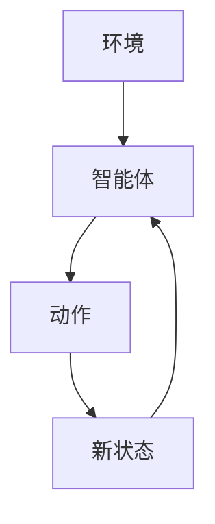

                 


# 《智能体系统提升价值投资的另类数据分析能力》

## 关键词：
- 智能体系统
- 价值投资
- 数据分析能力
- 金融创新
- 投资决策优化

## 摘要：
智能体系统通过结合人工智能、大数据分析和强化学习等技术，为价值投资提供了全新的数据分析和决策支持方式。本文将详细探讨智能体系统在价值投资中的应用，从系统构成、算法原理到实际项目实施，一步步解析其如何提升投资决策的准确性和效率。

---

# 第一部分: 智能体系统与价值投资的结合

## 第1章: 智能体系统的背景与价值投资的结合

### 1.1 智能体系统的定义与特点

#### 1.1.1 智能体系统的定义
智能体系统（Intelligent Agent System）是由多个智能体（Agent）组成的复杂系统，这些智能体能够感知环境、自主决策并执行任务。智能体系统具有以下特点：
- **自主性**：智能体能够独立运作，无需外部干预。
- **反应性**：能够实时感知环境变化并做出反应。
- **目标导向**：智能体的行为旨在实现特定目标。
- **学习能力**：通过经验优化决策策略。

#### 1.1.2 智能体系统的核心特点
智能体系统在金融领域的优势在于其能够处理复杂、动态的环境，并通过学习和优化提升决策能力。例如：
- **多智能体协同**：通过多个智能体的协同工作，实现复杂任务的分解与优化。
- **动态适应性**：智能体能够根据市场变化实时调整策略。
- **数据驱动决策**：依赖于大量数据进行分析和决策。

#### 1.1.3 智能体系统与传统数据分析的区别
传统数据分析主要依赖于统计方法和规则，而智能体系统引入了机器学习、强化学习等技术，能够进行更复杂的模式识别和策略优化。

### 1.2 价值投资的核心概念与挑战

#### 1.2.1 价值投资的定义与核心要素
价值投资是一种以内在价值为导向的投资策略，关注于公司基本面分析。其核心要素包括：
- **公司基本面**：如财务报表、行业地位等。
- **市场情绪**：投资者情绪对市场的影响。
- **风险控制**：通过分散投资降低风险。

#### 1.2.2 传统价值投资的局限性
传统价值投资依赖于人工分析，存在以下问题：
- **信息处理能力有限**：难以处理海量数据。
- **决策滞后**：人工分析速度较慢，难以应对快速变化的市场。
- **情绪影响**：投资者情绪波动可能导致决策失误。

#### 1.2.3 智能体系统如何解决价值投资的痛点
智能体系统能够通过以下方式优化价值投资：
- **高效数据处理**：快速分析大量数据，识别潜在投资机会。
- **动态调整策略**：根据市场变化实时优化投资组合。
- **降低情绪影响**：通过算法决策减少人为情绪干扰。

### 1.3 智能体系统在价值投资中的应用前景

#### 1.3.1 智能体系统在金融领域的潜在应用
智能体系统可以应用于股票筛选、风险评估、交易策略优化等多个方面。

#### 1.3.2 智能体系统提升价值投资的潜力
通过智能体系统，投资者可以更精准地识别低估资产，优化投资组合，提升收益。

#### 1.3.3 智能体系统应用的挑战与机遇
挑战包括数据获取难度、算法复杂性等，但随着技术进步，智能体系统在金融领域的应用前景广阔。

---

## 第2章: 智能体系统的构成与价值投资的关系

### 2.1 智能体系统的构成要素

#### 2.1.1 知识表示与推理
知识表示是智能体系统的核心，通过知识图谱等技术表示领域知识，并进行推理。

#### 2.1.2 行为决策与优化
智能体通过强化学习等算法优化决策策略，实现投资目标。

#### 2.1.3 交互与反馈机制
智能体与环境（市场）交互，并根据反馈调整行为。

### 2.2 价值投资的核心要素与智能体系统的映射

#### 2.2.1 价值评估的智能体模型
通过智能体模型评估资产的内在价值，识别低估机会。

#### 2.2.2 风险控制的智能体机制
利用智能体系统进行风险预警和控制，降低投资风险。

#### 2.2.3 投资决策的智能体优化
通过智能体优化投资组合，提升收益并降低风险。

### 2.3 智能体系统与价值投资的核心要素对比

#### 2.3.1 核心概念原理对比
通过对比分析，智能体系统在价值投资中的应用优势明显。

#### 2.3.2 概念属性特征对比表格
| 智能体系统 | 传统价值投资 |
|----------|--------------|
| 数据驱动 | 人工分析为主 |
| 实时决策 | 周期性决策    |
| 自适应性 | 较低          |

#### 2.3.3 ER实体关系图架构
```mermaid
er
actor(投资者) --> entity(智能体系统)
entity(智能体系统) --> entity(投资组合)
entity(智能体系统) --> entity(市场数据)
```

---

## 第3章: 智能体系统的算法原理与实现

### 3.1 智能体系统的算法原理

#### 3.1.1 强化学习算法
强化学习是智能体系统的核心算法之一，通过试错学习优化决策策略。

#### 3.1.2 深度学习算法
深度学习用于处理非结构化数据，如文本和图像。

#### 3.1.3 自然语言处理
NLP技术用于分析新闻、财报等文本数据，提取情感和关键词。

### 3.2 智能体系统在金融中的应用

#### 3.2.1 金融数据的预处理
包括数据清洗、特征提取等步骤。

#### 3.2.2 智能体系统的实现步骤
从数据获取、模型训练到策略执行的完整流程。

### 3.3 智能体系统的代码实现

#### 3.3.1 强化学习算法实现
使用Python和TensorFlow框架实现强化学习模型。

#### 3.3.2 算法流程图


---

## 第4章: 数学模型与价值投资的关系

### 4.1 价值评估的数学模型

#### 4.1.1 DCF模型
 discounted cash flow model，用于估算公司内在价值。

#### 4.1.2 市盈率模型
 price-to-earnings ratio，用于评估股票的估值。

### 4.2 智能体系统的数学模型

#### 4.2.1 Q-learning算法
数学公式：
$$ Q(s, a) = Q(s, a) + \alpha [r + \max_{a'} Q(s', a')] $$

#### 4.2.2 深度神经网络模型
神经网络结构包括输入层、隐藏层和输出层。

### 4.3 数学模型与价值投资的结合

#### 4.3.1 DCF模型的优化
通过智能体系统优化DCF模型的参数估计。

#### 4.3.2 市盈率模型的改进
利用智能体系统实时更新市盈率数据，提高评估准确性。

---

## 第5章: 系统分析与架构设计

### 5.1 系统分析

#### 5.1.1 问题场景介绍
智能体系统在价值投资中的应用场景，如实时监控、策略优化等。

#### 5.1.2 系统功能需求
包括数据采集、模型训练、策略执行等功能。

### 5.2 系统架构设计

#### 5.2.1 领域模型设计
使用Mermaid类图展示系统各组件之间的关系。

#### 5.2.2 系统架构图


### 5.3 接口设计与交互流程

#### 5.3.1 接口设计
定义RESTful API接口，如`/api/trade`。

#### 5.3.2 交互流程
从用户请求到系统响应的完整流程。

---

## 第6章: 项目实战

### 6.1 环境配置

#### 6.1.1 Python环境搭建
安装必要的库如TensorFlow、Pandas等。

#### 6.1.2 数据集准备
获取股票历史数据和新闻数据。

### 6.2 系统核心实现

#### 6.2.1 强化学习模型实现
编写智能体系统的核心算法代码。

#### 6.2.2 系统功能实现
实现数据采集、模型训练、策略执行等功能。

### 6.3 实际案例分析

#### 6.3.1 案例背景
选择特定股票进行分析。

#### 6.3.2 数据分析与策略优化
展示智能体系统如何优化投资策略。

### 6.4 项目小结

#### 6.4.1 实验结果
展示实验中智能体系统的表现。

#### 6.4.2 经验总结
总结项目实施中的经验和教训。

---

## 第7章: 最佳实践与小结

### 7.1 最佳实践 tips

#### 7.1.1 数据处理
确保数据质量和完整性。

#### 7.1.2 模型优化
定期更新模型参数，保持系统适应性。

### 7.2 小结

#### 7.2.1 核心要点总结
智能体系统如何提升价值投资的效率和准确性。

#### 7.2.2 未来展望
智能体系统在金融领域的潜在发展。

### 7.3 注意事项

#### 7.3.1 数据风险
注意数据隐私和合规性。

#### 7.3.2 系统稳定性
确保系统运行稳定，避免交易中断。

### 7.4 拓展阅读

#### 7.4.1 推荐书籍
《机器学习实战》、《智能系统设计》。

#### 7.4.2 技术博客
推荐相关技术博客和资源。

---

通过以上结构和内容，我们可以系统地探讨智能体系统在价值投资中的应用，从理论到实践，全面分析其潜力和实现路径。

