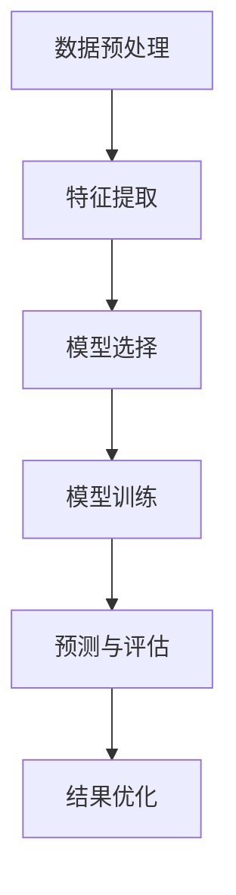
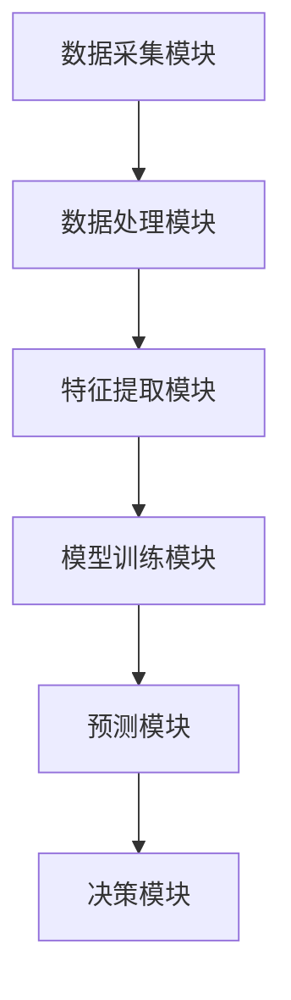
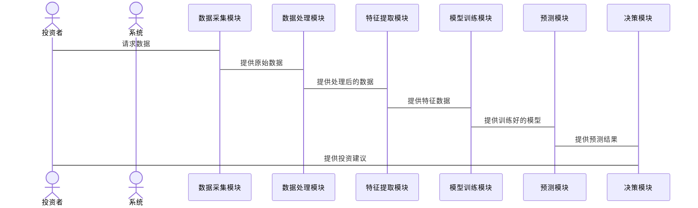

                 


```markdown
# 第一部分: 智能体系统与宏观经济指标分析基础

# 第1章: 智能体系统与宏观经济指标概述

## 1.1 智能体系统的基本概念
### 1.1.1 智能体的定义与特点
智能体（Agent）是指在计算机系统中能够感知环境并采取行动以实现目标的实体。它具备自主性、反应性、主动性、社会性和社会性等特征。与传统的被动系统不同，智能体能够主动地与环境交互，做出决策并执行动作。在金融领域，智能体系统能够通过分析大量数据，识别模式和趋势，从而辅助投资者做出更明智的决策。

### 1.1.2 智能体与传统经济分析的对比
传统的经济分析方法主要依赖于统计分析和专家判断，而智能体系统能够通过机器学习和大数据处理能力，自动分析和预测经济指标的变化。智能体系统的优势在于其能够实时处理大量数据，发现传统方法难以察觉的复杂关系。

### 1.1.3 智能体系统在金融领域的应用前景
随着人工智能技术的快速发展，智能体系统在金融领域的应用前景广阔。它可以在实时交易、风险管理、资产配置等方面发挥重要作用。特别是在宏观经济指标分析方面，智能体系统能够通过整合多源数据，提供更准确的预测和决策支持。

## 1.2 宏观经济指标的核心概念
### 1.2.1 宏观经济指标的分类与作用
宏观经济指标通常分为总量指标、结构指标和价格指标。总量指标如GDP、失业率等，反映了整体经济的健康状况；结构指标如产业构成、消费结构等，揭示了经济的内在结构；价格指标如CPI、PPI等，反映了通货膨胀压力。这些指标对价值投资决策具有重要影响。

### 1.2.2 宏观经济指标对价值投资的影响
宏观经济指标通过对整体经济环境的分析，帮助投资者判断市场的整体走势和风险水平。例如，GDP增长率高通常意味着经济向好，企业盈利增加，股票价格可能上升。反之，若通胀率过高，央行可能加息，导致债券收益率上升，股市可能下跌。

### 1.2.3 宏观经济指标的综合分析方法
综合分析方法包括时间序列分析、回归分析和因子分析等。通过综合分析，投资者可以发现不同指标之间的相互作用，从而做出更全面的投资决策。例如，通过分析GDP、失业率和通胀率的综合影响，投资者可以更好地判断市场的未来走势。

## 1.3 智能体系统与宏观经济指标的结合
### 1.3.1 智能体系统在宏观经济分析中的优势
智能体系统能够通过大数据处理和机器学习算法，快速识别宏观经济指标中的复杂关系。它不仅可以处理结构化数据，还可以分析非结构化数据，如新闻、社交媒体等，从而提供更全面的市场分析。

### 1.3.2 宏观经济指标对智能体系统的挑战
宏观经济指标具有高度的复杂性和不确定性，这对智能体系统的算法和模型提出了更高的要求。例如，如何处理数据的缺失、噪声和偏差，如何选择合适的模型和参数等，都是需要解决的难题。

### 1.3.3 综合分析的实现目标与意义
综合分析的实现目标是通过智能体系统对宏观经济指标的实时监控和预测，为投资者提供更精准的投资决策支持。其意义在于，通过技术手段提升投资效率和准确性，降低投资风险，实现价值最大化。

## 1.4 本章小结
### 1.4.1 智能体系统的核心作用
智能体系统通过实时数据处理和智能分析，为宏观经济指标的分析提供了新的工具和方法。

### 1.4.2 宏观经济指标分析的关键点
综合分析方法和智能体系统的优势结合，能够更全面地揭示宏观经济指标对投资决策的影响。

### 1.4.3 综合分析的未来发展方向
未来，随着人工智能和大数据技术的进一步发展，智能体系统在宏观经济分析中的应用将更加广泛和深入，推动价值投资进入一个新的智能化时代。

# 第2章: 智能体系统的核心概念与原理

## 2.1 智能体系统的体系结构
### 2.1.1 分层结构与功能模块
智能体系统的体系结构通常分为感知层、决策层和执行层。感知层负责数据的采集和初步处理；决策层通过算法对数据进行分析，制定决策；执行层则根据决策结果采取相应的行动。

### 2.1.2 各模块之间的关系与协作
感知层与决策层之间通过数据流进行交互，决策层根据数据做出决策，并将结果传递给执行层。各模块之间协作密切，确保系统的整体效率和准确性。

### 2.1.3 智能体系统的输入输出机制
智能体系统的输入包括各种宏观经济指标数据和市场信息，输出则包括对市场的预测和投资建议。通过高效的输入输出机制，智能体系统能够快速响应市场变化。

## 2.2 宏观经济指标的特征分析
### 2.2.1 指标的时间序列特性
宏观经济指标通常具有时间序列特性，可以通过时间序列分析方法进行预测。例如，GDP增长率可以通过ARIMA模型进行预测。

### 2.2.2 指标的多维度关联性
不同宏观经济指标之间存在相互关联，例如，利率和通胀率之间通常存在负相关关系。通过分析这些关联性，可以更好地理解经济系统的行为。

### 2.2.3 指标的动态变化规律
宏观经济指标的变化往往受到多种因素的影响，具有动态变化的特性。智能体系统需要能够实时捕捉这些变化，做出相应的调整。

## 2.3 智能体系统与宏观经济指标的关系
### 2.3.1 数据流的双向传递
智能体系统通过输入宏观经济指标数据进行分析，同时输出对市场的预测和建议，实现数据流的双向传递。

### 2.3.2 智能体对指标的实时响应
智能体系统能够实时感知市场变化，迅速调整分析模型和预测结果，确保对宏观经济指标的实时响应。

### 2.3.3 综合分析的逻辑框架
综合分析的逻辑框架包括数据采集、特征提取、模型训练、预测与决策等步骤。通过这些步骤的有机组合，智能体系统能够对宏观经济指标进行全方位的分析。

## 2.4 核心概念对比表格
### 表2.1: 智能体系统与传统经济分析的对比

| 对比维度         | 智能体系统                          | 传统经济分析                      |
|------------------|------------------------------------|----------------------------------|
| 数据处理能力     | 强大的大数据处理能力                | 依赖于统计数据和专家判断          |
| 分析效率         | 高效实时分析                       | 较低，依赖人工分析                |
| 模型复杂度       | 可处理复杂非线性关系               | 通常处理线性关系                 |
| 知识更新速度     | 实时更新                           | 较慢，依赖定期更新               |
| 应用范围         | 广泛应用于金融、经济预测等领域     | 主要应用于学术研究和政策制定      |

## 2.5 ER实体关系图
### 图2.1: 宏观经济指标与智能体系统的实体关系图

```mermaid
er
actor 智能体系统 {
  <actor>宏观经济指标
  <actor>市场数据
  <actor>投资决策
}

entity 经济指标数据 {
  <id>指标ID
  <string>指标名称
  <float>指标值
  <date>时间戳
}

entity 市场数据 {
  <id>数据ID
  <string>数据类型
  <float>数据值
  <date>时间戳
}

entity 投资决策 {
  <id>决策ID
  <string>决策类型
  <float>决策权重
  <date>决策时间
}

关系 智能体系统-经济指标数据 {
  智能体系统 <-> 经济指标数据 : 采集、分析、预测
}

关系 智能体系统-市场数据 {
  智能体系统 <-> 市场数据 : 采集、分析、预测
}

关系 智能体系统-投资决策 {
  智能体系统 <-> 投资决策 : 制定、优化、执行
}
```

## 2.4 算法原理讲解
### 2.4.1 时间序列分析算法



### 2.4.2 时间序列分析的Python代码实现

```python
import pandas as pd
from statsmodels.tsa.arima_model import ARIMA
import matplotlib.pyplot as plt

# 加载数据
data = pd.read_csv('macroeconomic_indicators.csv')
# 数据预处理
data['date'] = pd.to_datetime(data['date'])
data.set_index('date', inplace=True)
# 特征提取
target = data['GDP增长率']
# 模型选择与训练
model = ARIMA(target, order=(5,1,0))
model_fit = model.fit()
# 预测
forecast = model_fit.forecast(steps=5)
# 结果可视化
plt.figure(figsize=(10,6))
plt.plot(target, label='实际值')
plt.plot(forecast, label='预测值')
plt.legend()
plt.show()
```

## 2.5 数学模型
### 2.5.1 ARIMA模型公式

$$ARIMA(p, d, q) = y_t - \phi_1 y_{t-1} - \phi_2 y_{t-2} - \dots - \phi_p y_{t-p} = \theta_1 \epsilon_{t-1} + \theta_2 \epsilon_{t-2} + \dots + \theta_q \epsilon_{t-q} + \epsilon_t$$

### 2.5.2 模型参数估计
通过最大似然估计（MLE）方法，可以估计ARIMA模型的参数。假设误差项$\epsilon_t$服从正态分布，模型参数的估计可以通过优化似然函数来实现。

### 2.5.3 模型评估
模型的评估可以通过均方误差（MSE）、平均绝对误差（MAE）和R平方值等指标来进行。选择合适的评价指标，可以更好地评估模型的预测能力。

## 2.6 系统分析与架构设计
### 2.6.1 系统功能设计
系统功能模块包括数据采集、特征提取、模型训练、预测与决策等。每个模块都有其特定的功能和输入输出接口。

### 2.6.2 系统架构设计



### 2.6.3 系统接口设计
系统接口包括数据接口、模型接口和决策接口。数据接口负责数据的输入和输出，模型接口负责模型的训练和预测，决策接口负责投资决策的制定和执行。

### 2.6.4 系统交互流程



## 2.7 项目实战
### 2.7.1 环境安装
需要安装Python、Pandas、NumPy、StatsModels、Matplotlib等库。可以通过以下命令进行安装：

```bash
pip install pandas numpy statsmodels matplotlib
```

### 2.7.2 核心实现代码
以下是一个完整的ARIMA模型实现代码：

```python
import pandas as pd
from statsmodels.tsa.arima_model import ARIMA
import matplotlib.pyplot as plt

# 加载数据
data = pd.read_csv('macroeconomic_indicators.csv')
# 数据预处理
data['date'] = pd.to_datetime(data['date'])
data.set_index('date', inplace=True)
# 特征提取
target = data['GDP增长率']
# 模型选择与训练
model = ARIMA(target, order=(5,1,0))
model_fit = model.fit()
# 预测
forecast = model_fit.forecast(steps=5)
# 结果可视化
plt.figure(figsize=(10,6))
plt.plot(target, label='实际值')
plt.plot(forecast, label='预测值')
plt.legend()
plt.show()
```

### 2.7.3 代码应用解读
上述代码首先加载数据并进行预处理，然后提取目标变量（GDP增长率），选择ARIMA模型进行训练，并生成未来5步的预测结果。最后，将实际值和预测值进行可视化对比，帮助投资者更好地理解模型的预测能力。

### 2.7.4 实际案例分析
以GDP增长率为例子，通过上述代码进行预测，结果如图所示。实际值和预测值的对比可以帮助投资者判断模型的准确性，并据此做出投资决策。

### 2.7.5 项目小结
通过本项目，我们了解了如何利用智能体系统对宏观经济指标进行预测和分析。ARIMA模型作为一种经典的时序分析方法，能够有效地捕捉数据中的趋势和季节性变化，为投资决策提供有力支持。

## 2.8 总结与展望
### 2.8.1 本章总结
智能体系统通过强大的数据处理能力和机器学习算法，为宏观经济指标的分析提供了新的工具和方法。通过综合分析，投资者可以更好地理解经济环境，做出更明智的投资决策。

### 2.8.2 未来展望
随着人工智能技术的不断发展，智能体系统在宏观经济分析中的应用将更加广泛和深入。未来的研究方向可能包括更复杂模型的开发、多因素分析的实现以及实时决策支持系统的优化。

### 2.8.3 最佳实践 Tips
- 在进行宏观经济指标分析时，应充分考虑数据的多样性和复杂性。
- 选择合适的模型和算法，确保分析结果的准确性和可靠性。
- 定期更新模型和数据，保持系统的实时性和准确性。

### 2.8.4 注意事项
- 避免过度依赖单一模型，应结合多种方法进行分析。
- 注意数据的完整性和准确性，确保分析结果的可靠性。
- 在实际应用中，应结合市场实际情况，灵活调整分析策略。

### 2.8.5 拓展阅读
- 关于ARIMA模型的深入学习，可以参考《时间序列分析与应用》。
- 对于机器学习在金融领域的应用，可以阅读《机器学习实战》中的相关内容。

---

通过以上详细的内容，我们可以看到智能体系统在宏观经济指标分析中的巨大潜力。未来，随着技术的进步和经验的积累，智能体系统将为价值投资带来更多的创新和突破。

