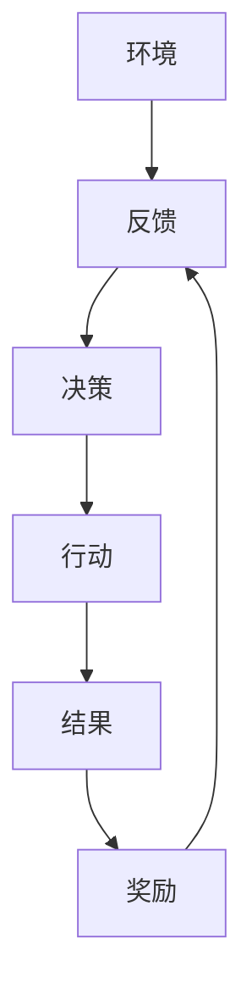

                 


# 智能体群体决策在投资时机选择中的应用：优化入场点

## 关键词：智能体、群体决策、投资时机、入场点、多智能体协作、强化学习、投资系统架构

## 摘要：  
智能体群体决策是一种通过多个智能体协作来优化投资决策的方法，尤其在选择投资时机和优化入场点方面表现出色。本文详细探讨了智能体群体决策的核心概念、算法原理、系统架构，并通过实际案例展示了其在投资决策中的应用。通过多智能体协作算法和强化学习算法的结合，本文提出了一种创新的投资决策系统，能够有效提升投资时机的选择能力，优化入场点，从而提高投资收益。

---

## 第一部分：智能体群体决策的背景与基础

### 第1章：智能体与群体决策概述

#### 1.1 智能体的基本概念  
- **定义**：智能体（Agent）是指能够感知环境、做出决策并采取行动的实体。  
- **特点**：智能体具有自主性、反应性、目标导向性和社会性。  
- **分类**：智能体可以分为简单反射型智能体、基于模型的反射型智能体、目标驱动型智能体和效用驱动型智能体。  
- **应用场景**：智能体广泛应用于自动驾驶、机器人控制、金融投资等领域。  

#### 1.2 群体决策的原理  
- **定义**：群体决策是指多个智能体通过协作和信息共享，共同做出决策的过程。  
- **典型模型**：包括分布式决策模型、协商决策模型和基于共识的决策模型。  
- **优势**：群体决策能够利用多个智能体的信息和知识，提高决策的准确性和鲁棒性。  
- **挑战**：群体决策面临信息冗余、计算复杂性和通信延迟等问题。  

#### 1.3 投资学基础与投资时机选择  
- **投资学核心概念**：投资学研究如何通过优化资源配置实现财富最大化。  
- **投资时机选择的重要性**：正确的投资时机能够显著提高投资收益，降低风险。  
- **智能体群体决策的应用前景**：通过智能体的协作，能够更准确地预测市场趋势，优化投资时机选择。  

---

## 第二部分：智能体群体决策的核心概念与联系

### 第2章：智能体群体决策的核心概念

#### 2.1 智能体的决策模型  
- **单智能体决策模型**：单个智能体基于自身信息做出决策。  
- **多智能体决策模型**：多个智能体协作，共同做出决策。  
- **群体决策模型**：群体决策模型强调智能体之间的信息共享和协作。  

#### 2.2 投资时机选择中的群体决策机制  
- **群体决策在投资中的作用**：通过多个智能体的协作，提高决策的准确性和鲁棒性。  
- **群体决策的关键要素**：包括智能体的数量、信息共享机制、决策规则和反馈机制。  
- **数学模型与公式**：  
  - 群体决策的共识模型：  
  $$ \text{Consensus} = \frac{\sum_{i=1}^{n} w_i x_i}{\sum_{i=1}^{n} w_i} $$  
  其中，$w_i$是智能体的权重，$x_i$是智能体的决策。  

#### 2.3 智能体群体决策的ER实体关系图  
```mermaid
er
  actor 投资者
  actor 市场环境
  actor 智能体1
  actor 智能体2
  actor 智能体3
  entity 投资决策
  entity 市场数据
  entity 入场点
  entity 投资收益
  entity 风险评估
  entity 反馈机制
  relationship 投资者 -> 投资决策：制定投资策略
  relationship 智能体1 -> 市场数据：采集市场数据
  relationship 智能体2 -> 市场数据：分析市场趋势
  relationship 智能体3 -> 市场数据：预测市场波动
  relationship 投资决策 -> 入场点：确定入场时机
  relationship 入场点 -> 投资收益：评估收益
  relationship 投资收益 -> 风险评估：评估风险
  relationship 风险评估 -> 反馈机制：优化决策
```

---

## 第三部分：智能体群体决策的算法原理

### 第3章：多智能体协作算法

#### 3.1 多智能体协作的基本原理  
- **定义**：多智能体协作是指多个智能体通过信息共享和协作，共同完成任务的过程。  
- **典型算法**：包括分布式协作算法、协商算法和基于共识的协作算法。  
- **实现步骤**：  
  1. 初始化多个智能体。  
  2. 智能体感知环境并采集数据。  
  3. 智能体之间共享信息并协商决策。  
  4. 输出最终决策。  

#### 3.2 基于多智能体的群体决策算法  
- **算法分类**：包括基于规则的群体决策算法、基于模型的群体决策算法和基于学习的群体决策算法。  
- **实现步骤**：  
  1. 初始化多个智能体。  
  2. 智能体根据环境信息生成决策。  
  3. 智能体之间通过协商或共识机制优化决策。  
  4. 输出优化后的决策。  

#### 3.3 强化学习算法在投资决策中的应用  
- **强化学习的基本原理**：智能体通过与环境互动，学习最优策略以最大化累积奖励。  
- **在投资中的应用**：  
  - 状态空间：市场数据、历史价格、技术指标。  
  - 行动空间：买入、卖出、持有。  
  - 奖励函数：投资收益。  



---

## 第四部分：系统分析与架构设计方案

### 第4章：投资决策系统的架构设计

#### 4.1 问题场景介绍  
- **目标**：设计一个基于智能体群体决策的投资决策系统，优化投资入场点。  
- **需求分析**：  
  - 实时采集市场数据。  
  - 分析市场趋势并生成投资建议。  
  - 优化投资入场点以提高收益。  

#### 4.2 系统功能设计  
- **领域模型**：  
  ```mermaid
  classDiagram
    class 投资者
    class 智能体
    class 市场数据
    class 投资决策
    class 入场点
    class 投资收益
    class 风险评估
    投资者 --> 智能体：委托决策
    智能体 --> 市场数据：采集数据
    智能体 --> 投资决策：生成决策
    投资决策 --> 入场点：确定时机
    入场点 --> 投资收益：评估收益
    投资收益 --> 风险评估：评估风险
  ```

#### 4.3 系统架构设计  
- **分层架构**：  
  - 数据采集层：实时采集市场数据。  
  - 数据处理层：分析市场数据并生成决策建议。  
  - 决策层：优化投资入场点。  
  - 应用层：输出投资决策结果。  

  ```mermaid
  architecture
    高层：投资者
    中层：智能体协作层
    低层：数据采集层
    高层 --> 中层：委托决策
    中层 --> 低层：采集数据
    低层 --> 中层：反馈数据
    中层 --> 高层：优化决策
  ```

#### 4.4 系统接口设计  
- **接口1**：智能体与市场数据的接口。  
- **接口2**：决策层与投资收益的接口。  

#### 4.5 系统交互设计  
- **交互流程**：  
  1. 投资者委托智能体做出投资决策。  
  2. 智能体采集市场数据并生成决策建议。  
  3. 决策层优化投资入场点。  
  4. 投资者获得优化后的投资决策。  

  ```mermaid
  sequenceDiagram
    投资者 -> 智能体：做出投资决策
    智能体 -> 市场数据：采集市场数据
    市场数据 -> 智能体：返回数据
    智能体 -> 投资决策：生成决策建议
    投资决策 -> 入场点：确定入场时机
    入场点 -> 投资收益：评估收益
    投资收益 -> 风险评估：评估风险
    风险评估 -> 智能体：反馈优化建议
    智能体 -> 投资者：优化后的决策
  ```

---

## 第五部分：项目实战

### 第5章：基于股票数据的智能体决策系统

#### 5.1 环境安装与配置  
- **工具安装**：安装Python、Pandas、NumPy、Scikit-learn、TensorFlow。  
- **数据源**：使用Yahoo Finance API获取股票数据。  

#### 5.2 核心代码实现  

##### 5.2.1 数据采集模块  
```python
import pandas as pd
import numpy as np

# 从Yahoo Finance获取股票数据
def get_stock_data(ticker, start_date, end_date):
    data = pd.DataFrame()
    # 具体实现使用Yahoo Finance API
    return data
```

##### 5.2.2 群体决策算法实现  
```python
class Agent:
    def __init__(self, id):
        self.id = id
        self.data = None
        self.decision = None

    def process_data(self):
        # 具体实现根据数据生成决策
        pass

    def get_decision(self):
        return self.decision

# 多智能体协作
class MultiAgentSystem:
    def __init__(self, agents):
        self.agents = agents

    def collect_data(self, data):
        for agent in self.agents:
            agent.data = data

    def make_decision(self):
        decisions = [agent.get_decision() for agent in self.agents]
        # 共识算法生成最终决策
        return np.mean(decisions)
```

##### 5.2.3 入场点优化模块  
```python
def optimize_entry_point(entry_points, data):
    # 使用强化学习优化入场点
    pass
```

#### 5.3 代码解读与分析  
- **数据采集模块**：从Yahoo Finance获取股票数据，清洗和预处理数据。  
- **群体决策算法**：多个智能体协作，生成共识决策。  
- **入场点优化模块**：利用强化学习优化入场点，提高投资收益。  

#### 5.4 案例分析与详细讲解  
- **案例背景**：假设我们有三个智能体，分别关注不同的市场指标。  
- **数据采集**：智能体从Yahoo Finance获取股票数据。  
- **决策生成**：每个智能体基于自身数据生成决策，群体决策算法生成最终决策。  
- **优化入场点**：通过强化学习优化入场点，提高投资收益。  

#### 5.5 项目小结  
- **项目总结**：通过多智能体协作和强化学习，优化了投资入场点，提高了投资收益。  
- **经验分享**：智能体群体决策在投资决策中具有显著优势，但需要处理好智能体之间的协作和信息共享问题。  

---

## 第六部分：最佳实践

### 第6章：智能体群体决策的最佳实践

#### 6.1 小结  
- 智能体群体决策在投资时机选择中具有显著优势。  
- 通过多智能体协作和强化学习，能够优化投资入场点，提高投资收益。  

#### 6.2 注意事项  
- **数据质量**：确保数据的准确性和实时性。  
- **算法选择**：根据具体场景选择合适的算法。  
- **系统优化**：优化系统架构，提高决策效率。  

#### 6.3 未来的研究方向  
- **算法优化**：研究更高效的群体决策算法。  
- **应用场景扩展**：探索智能体群体决策在其他领域的应用。  
- **技术融合**：将智能体群体决策与其他技术（如区块链）结合，提升决策的可信度和透明度。  

---

## 参考文献  
（此处列出相关的学术论文、书籍和技术文档）  

---

通过以上思考过程，我们可以逐步撰写一篇内容丰富、结构清晰的技术博客，详细探讨智能体群体决策在投资时机选择中的应用，优化入场点，从而提高投资收益。

