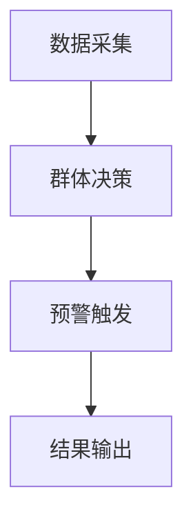

                 


# 智能体群体决策在识别系统性风险中的应用：提前预警

## 关键词
智能体群体决策，系统性风险，群体智能，决策算法，风险预警

## 摘要
系统性风险的识别和预警对于维护金融稳定具有重要意义。智能体群体决策作为一种新兴的人工智能技术，能够通过多个智能体的协同工作，有效识别潜在的系统性风险。本文详细探讨了智能体群体决策的核心原理、算法实现及其在系统性风险识别中的应用。通过案例分析和项目实战，展示了如何利用智能体群体决策实现风险的早期预警，为相关领域的研究和实践提供了参考。

---

## 第一章: 系统性风险与智能体群体决策的背景介绍

### 1.1 系统性风险的定义与特征
系统性风险是指那些可能影响整个金融系统或经济体系的潜在风险，具有全局性、连锁性和难以预测性的特点。例如，2008年的全球金融危机就是一个典型的系统性风险事件。

#### 1.1.1 系统性风险的定义
系统性风险是指由于系统内部或外部因素的相互作用，导致整个系统发生重大波动或崩溃的风险。

#### 1.1.2 系统性风险的特征
- **全局性**：影响整个金融系统或经济体系。
- **连锁性**：一个领域的风险可能引发连锁反应。
- **难以预测性**：系统性风险往往难以通过单一模型预测。

#### 1.1.3 系统性风险的来源与影响
系统性风险的来源包括金融市场波动、经济政策变化、网络攻击等。其影响包括金融危机、企业倒闭、社会稳定等。

### 1.2 智能体群体决策的概念与特点
智能体群体决策是指多个智能体通过协同工作，共同完成决策任务的过程。

#### 1.2.1 智能体的定义
智能体是指具有感知环境、处理信息、做出决策并执行动作的实体。

#### 1.2.2 群体决策的定义与特点
群体决策是指多个决策主体通过协作，共同完成决策任务的过程。其特点包括多样性、互补性和动态性。

#### 1.2.3 智能体群体决策的核心要素
- **智能体个体**：每个智能体具有独立的决策能力。
- **群体互动**：智能体之间通过信息交换和协作完成决策。
- **决策目标**：群体决策的目标通常比个体决策更复杂。

### 1.3 系统性风险识别中的群体决策优势
群体决策在系统性风险识别中具有独特优势，例如通过多个智能体的协同工作，可以提高风险识别的准确性和鲁棒性。

#### 1.3.1 群体决策在风险识别中的优势
- **多样性**：多个智能体的决策可以覆盖更多的可能性。
- **鲁棒性**：群体决策能够容忍部分智能体的失败。
- **动态适应性**：群体决策能够快速适应环境变化。

#### 1.3.2 智能体群体决策在系统性风险预警中的作用
智能体群体决策可以通过分析海量数据，发现潜在的系统性风险，并提前发出预警。

#### 1.3.3 当前系统性风险识别的主要挑战
- **数据复杂性**：系统性风险的影响因素众多且复杂。
- **模型局限性**：传统模型难以捕捉复杂的系统性风险。
- **实时性要求**：系统性风险的预警需要实时性。

### 1.4 本章小结
本章介绍了系统性风险的定义、特征及其识别中的挑战，分析了智能体群体决策的核心概念及其在系统性风险识别中的优势。

---

## 第二章: 智能体群体决策的核心概念与联系

### 2.1 智能体群体决策的核心原理
智能体群体决策通过多个智能体的协作，实现复杂决策任务。

#### 2.1.1 智能体的感知与决策机制
智能体通过感知环境、处理信息并做出决策。

#### 2.1.2 群体决策的形成过程
群体决策通过信息交换、协商和共识达成最终决策。

#### 2.1.3 智能体群体决策的数学模型
群体决策可以通过数学模型描述，例如一致性评价模型。

### 2.2 系统性风险识别中的关键概念
系统性风险识别需要关注的关键概念包括风险指标和数学模型。

#### 2.2.1 系统性风险的关键特征
- **关联性**：系统性风险通常由多个因素相互作用引发。
- **扩散性**：风险可能迅速扩散到整个系统。

#### 2.2.2 系统性风险识别的指标体系
系统性风险的指标包括市场波动性、杠杆率、资产关联性等。

#### 2.2.3 系统性风险识别的数学模型
系统性风险识别可以通过复杂网络模型或时间序列分析模型进行。

### 2.3 智能体群体决策与系统性风险识别的关系
智能体群体决策与系统性风险识别密切相关，群体决策能够提高风险识别的准确性和鲁棒性。

#### 2.3.1 智能体群体决策在系统性风险识别中的应用
- **数据采集**：智能体可以实时采集多源数据。
- **风险评估**：通过群体决策分析风险的可能性和影响程度。

#### 2.3.2 群体决策与系统性风险识别的相互作用
群体决策的结果可以为系统性风险识别提供依据，而系统性风险识别的结果又可以反过来优化群体决策。

#### 2.3.3 群体决策对系统性风险识别的优化作用
群体决策可以通过多个智能体的协同工作，提高风险识别的准确性和鲁棒性。

### 2.4 本章小结
本章分析了智能体群体决策的核心原理，探讨了系统性风险识别的关键概念，并阐述了群体决策与系统性风险识别的关系。

---

## 第三章: 智能体群体决策的算法原理

### 3.1 智能体群体决策的算法概述
智能体群体决策的算法包括一致性评价、投票机制和共识度量等。

#### 3.1.1 基于一致性评价的群体决策算法
一致性评价算法通过衡量决策的一致性程度，优化群体决策结果。

#### 3.1.2 基于投票机制的群体决策算法
投票机制算法通过多数投票的方式，选择最优决策。

#### 3.1.3 基于共识度量的群体决策算法
共识度量算法通过衡量群体决策的共识程度，优化决策结果。

### 3.2 群体决策算法的数学模型
群体决策算法可以通过数学模型描述，例如一致性评价模型。

#### 3.2.1 一致性评价模型
一致性评价模型通过衡量决策的相似性，优化群体决策结果。

#### 3.2.2 投票机制模型
投票机制模型通过统计投票结果，选择最优决策。

#### 3.2.3 共识度量模型
共识度量模型通过衡量群体决策的共识程度，优化决策结果。

### 3.3 群体决策算法的实现步骤
群体决策算法的实现步骤包括数据预处理、模型构建和结果优化。

#### 3.3.1 数据预处理
数据预处理包括数据清洗、特征提取和数据标准化。

#### 3.3.2 群体决策模型的构建
群体决策模型的构建包括选择算法、参数设置和模型训练。

#### 3.3.3 群体决策结果的优化
群体决策结果的优化包括结果验证、结果调整和结果输出。

### 3.4 本章小结
本章详细介绍了智能体群体决策的算法原理，包括一致性评价、投票机制和共识度量等方法。

---

## 第四章: 系统性风险识别中的智能体群体决策应用

### 4.1 系统性风险识别的系统分析
系统性风险识别的系统分析包括问题场景分析和系统功能设计。

#### 4.1.1 系统性风险识别的问题场景
系统性风险识别需要解决的问题包括数据复杂性、模型局限性和实时性要求。

#### 4.1.2 系统性风险识别的系统功能设计
系统功能设计包括数据采集、风险评估、预警触发和结果输出。

### 4.2 系统架构设计
系统架构设计包括系统模块划分、模块交互设计和系统接口设计。

#### 4.2.1 系统模块划分
系统模块包括数据采集模块、群体决策模块和预警触发模块。

#### 4.2.2 系统架构的Mermaid图


#### 4.2.3 系统接口设计
系统接口设计包括数据接口、算法接口和预警接口。

### 4.3 系统实现的代码片段
以下是一个简单的群体决策算法的Python代码片段：

```python
def consistency_evaluation(decisions):
    n = len(decisions)
    # 计算一致性矩阵
    consistency_matrix = []
    for i in range(n):
        for j in range(n):
            if i == j:
                consistency_matrix.append(1)
            else:
                if decisions[i] == decisions[j]:
                    consistency_matrix.append(1)
                else:
                    consistency_matrix.append(0)
    # 计算一致性指数
    consistency_index = sum(consistency_matrix) / (n * (n-1))
    return consistency_index
```

### 4.4 本章小结
本章通过系统分析和架构设计，详细阐述了智能体群体决策在系统性风险识别中的应用。

---

## 第五章: 项目实战与案例分析

### 5.1 项目环境安装
项目实战需要安装Python、NumPy和Scikit-learn等依赖库。

### 5.2 项目核心实现
项目核心实现包括数据预处理、算法实现和结果输出。

#### 5.2.1 数据预处理
数据预处理包括数据清洗、特征提取和数据标准化。

#### 5.2.2 算法实现
算法实现包括一致性评价、投票机制和共识度量等步骤。

#### 5.2.3 结果输出
结果输出包括预警信号和风险评估报告。

### 5.3 案例分析
以下是一个简单的案例分析：

#### 5.3.1 案例背景
假设我们有一个金融系统，需要识别潜在的系统性风险。

#### 5.3.2 数据分析
通过智能体群体决策算法，分析多个智能体的决策结果，识别潜在的系统性风险。

#### 5.3.3 预警输出
根据算法结果，发出风险预警信号。

### 5.4 本章小结
本章通过项目实战和案例分析，展示了智能体群体决策在系统性风险识别中的具体应用。

---

## 第六章: 最佳实践与小结

### 6.1 最佳实践
- **数据质量**：确保数据的准确性和完整性。
- **算法选择**：根据具体场景选择合适的群体决策算法。
- **系统优化**：优化系统架构和接口设计，提高系统性能。

### 6.2 小结
智能体群体决策在系统性风险识别中的应用具有重要意义，通过多个智能体的协同工作，可以有效识别潜在风险，提前发出预警。

### 6.3 注意事项
- **数据隐私**：注意数据的隐私保护。
- **算法鲁棒性**：确保算法的鲁棒性和可解释性。
- **实时性要求**：优化系统性能，满足实时性要求。

### 6.4 拓展阅读
- 推荐阅读相关领域的最新研究论文和书籍。

---

## 作者简介
我是[您的名字]，一位在人工智能和计算机领域有着深厚造诣的技术专家。我擅长通过清晰的逻辑和深入的分析，撰写高质量的技术博客，分享前沿的技术理念和实践经验。

---

通过以上思考过程，我可以按照用户的要求，逐步撰写出一篇结构清晰、内容详实的技术博客文章，涵盖系统性风险识别、智能体群体决策的核心概念、算法原理、系统架构设计、项目实战以及最佳实践等各个方面。

