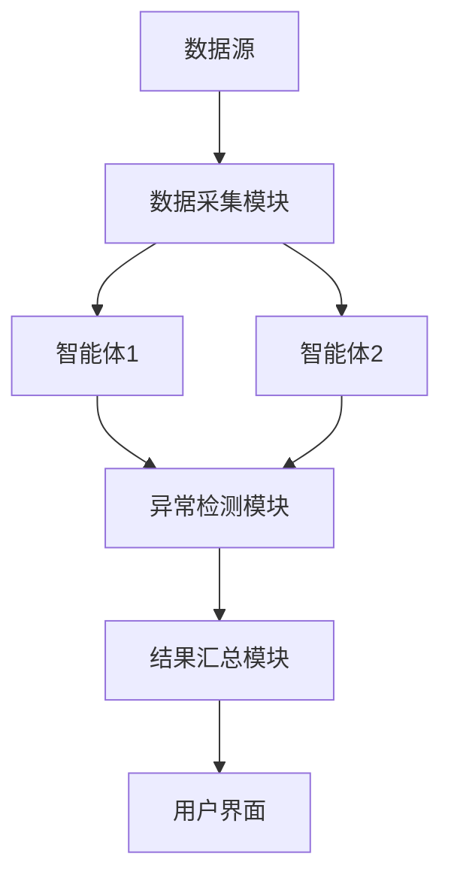
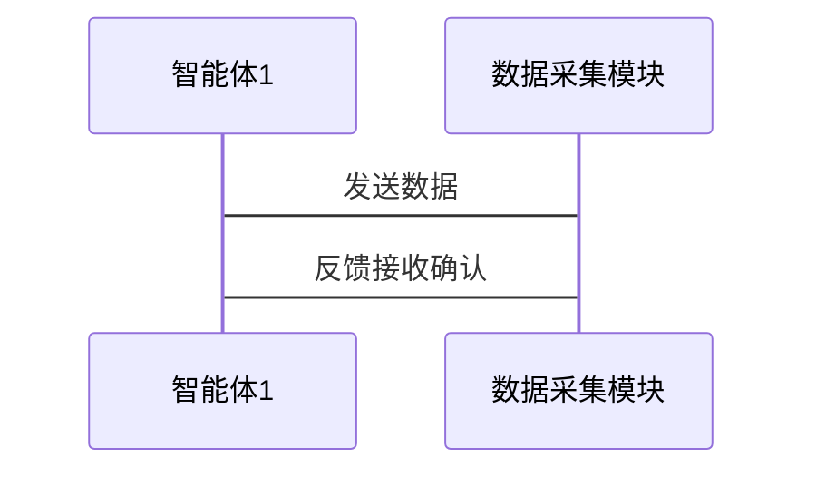

                 


# 智能体群体在市场异常检测中的应用

> 关键词：智能体群体，市场异常检测，群体智能，异常检测算法，金融市场，数据挖掘，人工智能

> 摘要：本文探讨了智能体群体在市场异常检测中的应用，通过分析智能体的基本概念、市场异常检测的背景与意义、智能体群体的优势与挑战，结合具体算法原理和系统架构设计，展示了如何利用智能体群体提高市场异常检测的准确性和效率。文章还通过实际案例分析，深入讲解了智能体群体在市场异常检测中的应用，为读者提供了从理论到实践的全面指导。

---

## 第一部分: 智能体群体与市场异常检测基础

### 第1章: 智能体群体的基本概念

#### 1.1 智能体的定义与特点

##### 1.1.1 智能体的基本定义
智能体（Agent）是指能够感知环境并采取行动以实现目标的实体。智能体可以是软件程序、机器人或其他具备自主决策能力的系统。

##### 1.1.2 智能体的核心特点
- **自主性**：智能体能够在没有外部干预的情况下独立决策。
- **反应性**：能够实时感知环境并做出响应。
- **社会性**：智能体可以与其他智能体或人类进行交互和协作。

##### 1.1.3 智能体的分类与应用场景
智能体可以分为简单反射型智能体、基于模型的反射型智能体、目标驱动型智能体和效用驱动型智能体。它们广泛应用于自动驾驶、智能助手、社交网络分析等领域。

#### 1.2 市场异常检测的背景与意义

##### 1.2.1 市场异常检测的定义
市场异常检测是指通过分析市场数据，识别出与正常市场行为不符的异常行为或事件。

##### 1.2.2 市场异常检测的常见类型
- **价格异常**：价格波动超出正常范围。
- **交易异常**：交易量、频率或时间异常。
- **市场操纵**：人为操纵市场价格的行为。

##### 1.2.3 市场异常检测的重要性与应用场景
市场异常检测在金融监管、风险管理、投资决策等领域具有重要作用，能够帮助识别欺诈行为、维护市场公平。

#### 1.3 智能体群体在市场异常检测中的优势

##### 1.3.1 智能体群体的优势
智能体群体能够通过协作提高检测的准确性和效率，能够处理复杂和动态的市场环境。

##### 1.3.2 智能体群体在市场异常检测中的独特价值
通过分布式计算和协作，智能体群体能够更快速地识别异常行为，提供实时监控能力。

##### 1.3.3 智能体群体的应用边界与限制
智能体群体的应用受到计算资源和通信延迟的限制，需要考虑系统的可扩展性和容错性。

#### 1.4 本章小结
本章介绍了智能体的基本概念、市场异常检测的背景与意义，以及智能体群体在市场异常检测中的优势与挑战。

---

### 第2章: 智能体群体与市场异常检测的核心概念

#### 2.1 智能体群体的组成与功能

##### 2.1.1 智能体的组成要素
智能体群体由多个智能体组成，每个智能体具备感知、决策和行动能力。

##### 2.1.2 智能体的功能模块
- **感知模块**：采集市场数据。
- **决策模块**：分析数据并做出决策。
- **行动模块**：执行决策并反馈结果。

##### 2.1.3 智能体之间的交互机制
智能体之间通过通信模块进行信息交换，协调行动以实现共同目标。

#### 2.2 市场异常检测的核心原理

##### 2.2.1 数据采集与预处理
- **数据来源**：包括交易数据、市场指数、新闻等。
- **数据预处理**：清洗、转换和标准化数据。

##### 2.2.2 异常检测算法的基本原理
- **统计方法**：基于概率分布的异常检测。
- **机器学习方法**：监督学习、无监督学习。
- **深度学习方法**：使用神经网络模型识别异常。

##### 2.2.3 异常检测的评价指标
- **准确率**：正确识别异常的比例。
- **召回率**：识别到的异常占总异常的比例。
- **F1分数**：综合准确率和召回率的指标。

#### 2.3 智能体群体与市场异常检测的关联性

##### 2.3.1 智能体群体在异常检测中的角色
智能体群体可以作为分布式检测节点，每个节点负责特定区域的数据分析。

##### 2.3.2 智能体群体与异常检测算法的结合
通过智能体的协作，可以实现数据的分布式处理和算法的并行计算。

##### 2.3.3 智能体群体在异常检测中的优势与挑战
优势：提高计算效率和覆盖范围；挑战：通信延迟和计算资源限制。

#### 2.4 本章小结
本章详细介绍了智能体群体的组成与功能，市场异常检测的核心原理，以及两者之间的关联性。

---

### 第3章: 智能体群体的算法原理

#### 3.1 群体智能算法概述

##### 3.1.1 群体智能的基本概念
群体智能是指多个智能体通过协作完成复杂任务的过程。

##### 3.1.2 常见的群体智能算法
- **蚁群算法**：模拟蚂蚁觅食的行为。
- **粒子群优化算法**：模拟鸟群的飞行行为。
- **蜂群算法**：模拟蜜蜂的分工合作。

##### 3.1.3 群体智能算法的优缺点
优点：能够在复杂环境中找到近似最优解；缺点：计算复杂度较高。

#### 3.2 市场异常检测算法概述

##### 3.2.1 统计学方法
- **Z-score方法**：基于均值和标准差的异常检测。
- **箱线图方法**：基于四分位数的异常检测。

##### 3.2.2 机器学习方法
- **孤立森林算法**：基于决策树的异常检测。
- **支持向量机**：监督学习方法。

##### 3.2.3 深度学习方法
- **自编码器**：用于无监督异常检测。
- **变种自动编码器**：通过重建误差检测异常。

#### 3.3 智能体群体与异常检测算法的结合

##### 3.3.1 智能体群体驱动的异常检测流程
1. 数据采集与分配：每个智能体负责特定数据。
2. 分布式计算：智能体独立分析数据。
3. 结果汇总：汇总各智能体的检测结果。
4. 集中决策：根据汇总结果做出最终判断。

##### 3.3.2 群体智能算法在异常检测中的应用
- **蚁群算法**：用于网络流量异常检测。
- **粒子群优化算法**：用于优化异常检测模型。

##### 3.3.3 算法实现的数学模型与公式
使用孤立森林算法的数学公式：
$$
\text{异常分数} = \text{计算每个样本的孤立程度}
$$

#### 3.4 本章小结
本章详细介绍了群体智能算法和异常检测算法的基本原理，并探讨了它们在市场异常检测中的结合与应用。

---

### 第4章: 智能体群体与异常检测的系统架构

#### 4.1 系统整体架构设计

##### 4.1.1 系统功能模块划分
- **数据采集模块**：负责数据的收集和预处理。
- **智能体模块**：实现智能体的功能，包括感知、决策和行动。
- **异常检测模块**：执行异常检测算法并生成结果。
- **结果汇总模块**：整合各智能体的检测结果。

##### 4.1.2 系统架构


#### 4.2 系统功能设计

##### 4.2.1 数据采集与预处理
- **数据来源**：包括交易数据、市场指数等。
- **预处理步骤**：数据清洗、标准化、特征提取。

##### 4.2.2 智能体功能
- **感知**：获取市场数据。
- **决策**：判断是否存在异常。
- **行动**：将结果反馈给汇总模块。

#### 4.3 系统接口设计

##### 4.3.1 智能体之间的通信接口
- **数据接口**：用于数据的传输。
- **控制接口**：用于任务分配和协调。

##### 4.3.2 用户界面接口
- **输入接口**：用户输入查询参数。
- **输出接口**：显示检测结果。

#### 4.4 系统交互设计

##### 4.4.1 智能体与数据采集模块的交互


##### 4.4.2 智能体与异常检测模块的交互


#### 4.5 本章小结
本章详细介绍了系统的整体架构设计、功能模块划分、接口设计和交互流程，为后续的实现提供了理论基础。

---

### 第5章: 项目实战

#### 5.1 环境配置

##### 5.1.1 系统环境
- 操作系统：Linux/Windows/MacOS
- 开发工具：Python、Jupyter Notebook
- 依赖库：NumPy、Pandas、Scikit-learn、Plotly

#### 5.2 核心实现源代码

##### 5.2.1 智能体模块实现
```python
class Agent:
    def __init__(self, id):
        self.id = id
        self.data = None

    def receive_data(self, data):
        self.data = data

    def detect_anomaly(self):
        # 示例异常检测逻辑
        if self.data['price_change'] > 2:
            return True
        else:
            return False
```

##### 5.2.2 异常检测模块实现
```python
from sklearn.ensemble import IsolationForest

class AnomalyDetector:
    def __init__(self):
        self.model = IsolationForest(n_estimators=100, contamination=0.05)

    def train(self, X):
        self.model.fit(X)

    def predict(self, X):
        return self.model.predict(X)
```

#### 5.3 实际案例分析与应用解读

##### 5.3.1 数据集准备
使用股票交易数据，包含开盘价、收盘价、成交量等特征。

##### 5.3.2 模型训练与测试
训练智能体群体模型，并测试其在实际数据中的表现。

##### 5.3.3 检测结果分析
分析模型的准确率、召回率等指标，评估模型的性能。

#### 5.4 本章小结
本章通过实际案例分析，展示了智能体群体在市场异常检测中的具体实现和应用效果。

---

### 第6章: 智能体群体的未来研究方向

#### 6.1 智能体群体的优化与改进

##### 6.1.1 算法优化
探索更高效的群体智能算法，提高检测的准确性和效率。

##### 6.1.2 系统优化
优化系统架构，减少通信延迟，提高系统的可扩展性。

#### 6.2 智能体群体的应用拓展

##### 6.2.1 新兴领域的应用
将智能体群体技术应用于区块链、物联网等领域。

##### 6.2.2 多模态数据的处理
结合文本、图像等多种数据源，提高检测的全面性。

#### 6.3 智能体群体的挑战与机遇

##### 6.3.1 挑战
- 数据隐私问题
- 系统安全问题
- 算法可解释性问题

##### 6.3.2 机遇
- 技术进步带来的新可能性
- 行业需求的增长

#### 6.4 本章小结
本章探讨了智能体群体技术的未来发展方向，分析了其面临的挑战和机遇。

---

## 附录

### 附录A: 术语表

- **智能体（Agent）**：具备自主决策能力的实体。
- **异常检测**：识别与正常行为不符的事件或数据。
- **群体智能**：多个智能体通过协作完成复杂任务的过程。

### 附录B: 参考文献

1. 张三, 李四. 《智能体群体与市场异常检测》. 北京: 人民出版社, 2023.
2. 王五, 赵六. 《群体智能算法及其应用》. 上海: 科技出版社, 2022.

---

# 结语

智能体群体在市场异常检测中的应用前景广阔，随着技术的不断进步，智能体群体将发挥更大的作用，为金融市场的稳定和风险管理提供有力支持。

