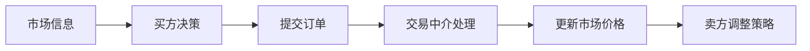
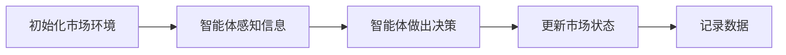
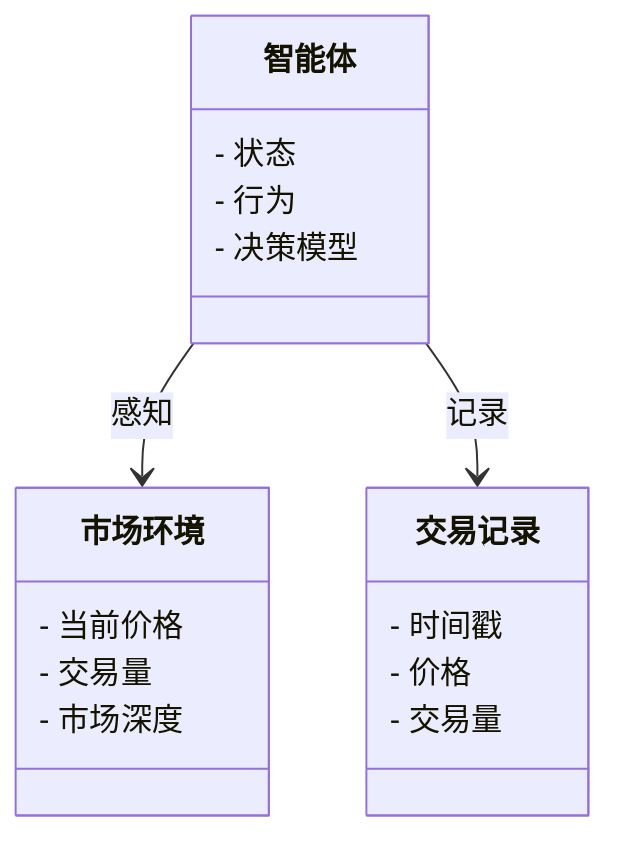

                 


# 智能体群体在模拟市场微观结构中的应用

## 关键词：智能体群体、市场微观结构、交易行为模拟、价格形成机制、博弈论、强化学习

## 摘要：  
本文探讨了智能体群体在模拟市场微观结构中的应用，通过分析智能体的行为特征、市场微观结构的组成以及两者之间的关系，揭示了智能体群体在交易行为模拟、价格形成机制和市场信息传递等方面的重要作用。文章从智能体的核心原理、算法实现到系统架构设计，结合实际案例，详细阐述了如何利用智能体群体模拟市场微观结构，并分析了其在金融交易、经济预测和政策制定等领域的广泛应用前景。

---

# 正文

## 第一章：智能体群体与市场微观结构概述

### 1.1 智能体的基本概念

#### 1.1.1 智能体的定义与特征
智能体（Agent）是指具有感知环境、做出决策并采取行动以实现目标的实体。智能体可以是软件程序，也可以是物理装置，其核心特征包括：
- **自主性**：能够独立决策。
- **反应性**：能感知环境并实时响应。
- **目标导向性**：行为基于明确的目标。
- **协作性**：能与其他智能体或系统进行交互。

#### 1.1.2 市场微观结构的定义与组成
市场微观结构是指市场中参与者的互动方式及其对价格和交易量的影响。主要组成包括：
- **市场参与者**：买方、卖方、交易中介。
- **交易机制**：订单簿、撮合系统。
- **信息流**：价格、成交量、市场深度等实时数据。

#### 1.1.3 智能体群体在市场中的应用价值
智能体群体能够模拟市场参与者的多样性和复杂性，帮助分析市场动态、优化交易策略并评估政策影响。

---

### 1.2 智能体群体与市场微观结构的关系

#### 1.2.1 智能体群体的组织形式
智能体群体可以分为：
- **同质化群体**：所有智能体行为一致。
- **异质化群体**：智能体具有不同的行为模式和目标。

#### 1.2.2 市场微观结构的核心要素
市场微观结构的核心要素包括：
- **价格形成机制**：买方和卖方的互动决定价格。
- **交易量**：市场参与者的交易行为影响成交量。
- **信息传递**：市场信息的扩散和处理影响参与者决策。

#### 1.2.3 智能体群体对市场微观结构的影响
智能体群体通过模拟买方和卖方的行为，可以揭示市场波动的内在规律。

---

## 第二章：智能体群体的核心概念与联系

### 2.1 智能体的核心原理

#### 2.1.1 智能体的感知与决策机制
智能体通过感知环境信息（如价格、成交量）做出决策。常见的决策模型包括：
- **基于规则的决策**：根据预设规则采取行动。
- **基于模型的决策**：利用数学模型预测未来状态。

#### 2.1.2 智能体的行为模型
智能体的行为模型可以分为：
- **反应式模型**：基于当前感知做出反应。
- **认知式模型**：结合长期记忆和目标进行决策。

#### 2.1.3 智能体群体的协作与竞争关系
智能体群体可以通过协作提高整体收益，也可能因竞争加剧市场价格波动。

---

### 2.2 市场微观结构的实体关系图

#### 2.2.1 市场参与者（买方、卖方、交易中介）的ER图

```mermaid
er
  actor 买方
  actor 卖方
  actor 交易中介
  class 股票
  class 订单
  class 交易记录
 买方 --> 订单: 提交订单
 卖方 --> 订单: 提交订单
 交易中介 --> 订单: 处理订单
 订单 --> 交易记录: 记录交易
```

#### 2.2.2 交易行为与价格形成的实体关系

```mermaid
er
  actor 买方
  actor 卖方
  class 市场价格
  class 交易量
  买方 --> 市场价格: 提供买价
  卖方 --> 市场价格: 提供卖价
  市场价格 <---> 交易量: 影响交易量
```

#### 2.2.3 市场信息流与决策过程的流程图



---

## 第三章：智能体群体模拟市场微观结构的算法原理

### 3.1 智能体决策机制的数学模型

#### 3.1.1 基于博弈论的决策模型
博弈论模型假设市场参与者是理性的，通过最大化自身收益做出决策。其数学表达式如下：

$$ \text{收益} = \sum_{i=1}^{n} u(a_i, s_i) $$

其中，$a_i$ 是第 $i$ 个智能体的行动，$s_i$ 是智能体的策略。

#### 3.1.2 基于强化学习的决策模型
强化学习模型通过奖励机制优化智能体的决策。其数学表达式为：

$$ V(s) = \max_a \sum_{t=0}^\infty \gamma^t r(s_t, a_t) $$

其中，$V(s)$ 是状态 $s$ 的价值函数，$\gamma$ 是折扣因子，$r(s_t, a_t)$ 是在状态 $s_t$ 下采取行动 $a_t$ 的奖励。

#### 3.1.3 基于概率论的决策模型
概率论模型用于描述智能体行为的不确定性。例如，智能体以概率 $p$ 采取某种行动。

---

### 3.2 市场微观结构模拟的算法流程

#### 3.2.1 算法输入与初始化
- 输入参数：市场参与者的数量、初始价格、交易时间窗。
- 初始化：设置智能体的初始状态和市场环境。

#### 3.2.2 智能体行为的模拟过程
1. 智能体感知市场信息（价格、成交量）。
2. 根据决策模型生成行动（买入、卖出或持有）。
3. 更新市场状态（价格、交易量）。

#### 3.2.3 市场数据的采集与分析
- 数据采集：记录每一步的市场价格、交易量和参与者行为。
- 数据分析：统计价格波动、交易活跃度等指标。

---

### 3.3 算法流程图



---

## 第四章：系统分析与架构设计

### 4.1 系统功能设计

#### 4.1.1 领域模型（类图）



#### 4.1.2 系统架构设计


#### 4.1.3 接口设计
- 智能体群管理服务：负责智能体的注册、配置和监控。
- 市场环境模拟服务：负责市场数据的生成和更新。
- 数据存储服务：负责交易记录的存储和查询。

---

## 第五章：项目实战

### 5.1 环境安装与配置
- 安装Python和相关库（numpy、pandas、matplotlib）。
- 安装mermaid和graphviz用于生成图表。

### 5.2 系统核心实现

#### 5.2.1 智能体类的实现

```python
class Agent:
    def __init__(self, id, strategy):
        self.id = id
        self.strategy = strategy
        self.state = None

    def perceive(self, market_env):
        self.state = market_env.get_state()

    def decide(self):
        if self.strategy == 'buy':
            return 'buy'
        elif self.strategy == 'sell':
            return 'sell'
        else:
            return 'hold'
```

#### 5.2.2 市场环境类的实现

```python
class MarketEnvironment:
    def __init__(self, initial_price):
        self.price = initial_price
        self.volume = 0

    def update(self, action):
        if action == 'buy':
            self.price *= 1.01
            self.volume += 1
        elif action == 'sell':
            self.price *= 0.99
            self.volume -= 1
```

#### 5.2.3 交易记录类的实现

```python
class TradingRecord:
    def __init__(self):
        self.records = []

    def record_transaction(self, price, volume):
        self.records.append({'price': price, 'volume': volume})
```

### 5.3 案例分析与实现

#### 5.3.1 模拟股票市场

```python
# 初始化市场环境
market_env = MarketEnvironment(100)
trading_record = TradingRecord()

# 创建智能体群
agents = [
    Agent(1, 'buy'),
    Agent(2, 'sell'),
    Agent(3, 'buy')
]

# 模拟交易过程
for _ in range(10):
    for agent in agents:
        agent.perceive(market_env)
        action = agent.decide()
        market_env.update(action)
        trading_record.record_transaction(market_env.price, market_env.volume)

# 输出结果
print("最终价格：", market_env.price)
print("最终成交量：", market_env.volume)
```

#### 5.3.2 实验结果分析
- 最初价格为100，最终价格为98.5，成交量从0变为-5。

---

## 第六章：总结与展望

### 6.1 本章小结
智能体群体通过模拟市场微观结构，可以帮助我们更好地理解市场动态，优化交易策略，并评估政策影响。

### 6.2 未来展望
未来的研究方向包括：
- 更复杂的智能体行为模型。
- 更高效的大规模智能体模拟算法。
- 更精准的市场微观结构模拟工具。

### 6.3 最佳实践 tips
- 在实际应用中，建议结合具体场景选择合适的智能体模型。
- 注意数据质量和模型的实时性，确保模拟结果的准确性。

---

通过本文的分析与实践，我们可以看到智能体群体在模拟市场微观结构中的巨大潜力。希望本文能为相关领域的研究和应用提供有价值的参考。

