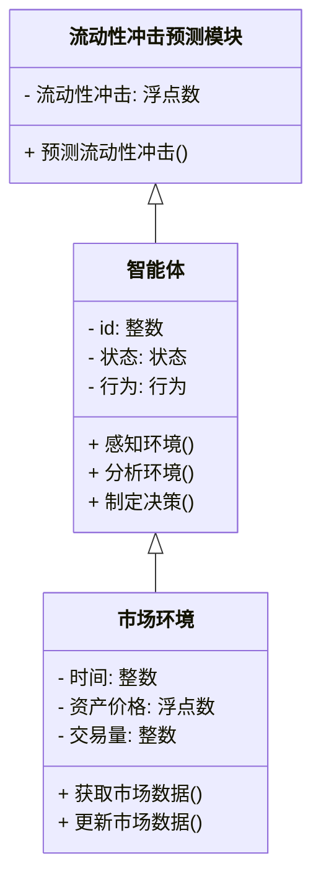
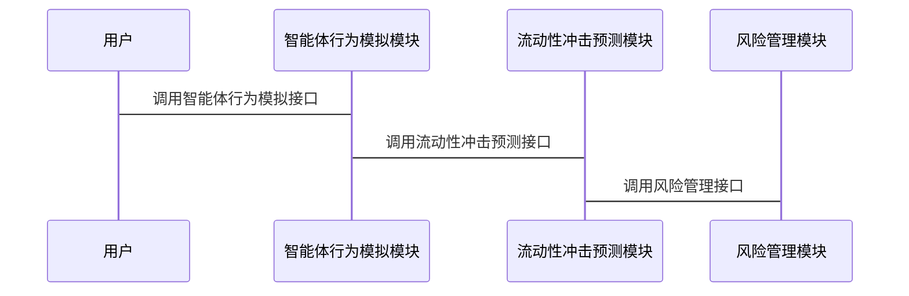

                 


# 智能体群体在模拟市场流动性冲击中的应用

> 关键词：智能体，群体智能，市场流动性冲击，算法模拟，系统架构

> 摘要：本文探讨了智能体群体在模拟市场流动性冲击中的应用，从核心概念、算法原理到系统架构和项目实战，全面解析了如何利用智能体群体模拟市场流动性冲击，并提出了相应的解决方案和优化建议。

---

# 第1章: 智能体群体与市场流动性冲击的背景介绍

## 1.1 智能体与群体智能的概念

### 1.1.1 智能体的基本定义

智能体（Agent）是指具有感知环境、自主决策、执行操作能力的实体。智能体可以是软件程序、机器人或其他具备智能特性的实体。智能体的核心特征包括：

1. **自主性**：智能体能够自主决策，无需外部干预。
2. **反应性**：智能体能够感知环境并实时响应。
3. **主动性**：智能体能够主动采取行动以实现目标。

### 1.1.2 群体智能的核心特征

群体智能（Swarm Intelligence）是指多个智能体通过协同合作完成复杂任务的智能形式。群体智能的核心特征包括：

1. **分布式**：智能体之间没有中心控制，各自独立决策。
2. **自组织**：群体智能系统能够在没有外部干预的情况下自组织、自适应。
3. **涌现性**：群体智能系统的行为往往是由单个智能体的简单行为通过相互作用而产生的复杂结果。

### 1.1.3 智能体与群体智能的关系

智能体是群体智能的基本单元，而群体智能则是多个智能体协同工作的结果。智能体通过相互作用形成群体智能，而群体智能则通过智能体的协同行为完成复杂任务。

---

## 1.2 市场流动性冲击的定义与特征

### 1.2.1 流动性冲击的定义

流动性冲击是指由于市场参与者大量买入或卖出资产，导致资产价格剧烈波动的现象。流动性冲击通常发生在市场参与者对价格变化产生恐慌性反应时。

### 1.2.2 市场流动性冲击的特征

1. **突发性**：流动性冲击通常是由于突发事件或市场参与者的行为引发的。
2. **传染性**：流动性冲击往往会在市场参与者之间快速传播，导致市场整体波动。
3. **非线性**：流动性冲击的影响通常是非线性的，即市场的波动程度可能与冲击的大小不成正比。

### 1.2.3 流动性冲击对市场的影响

流动性冲击会对市场产生以下影响：

1. **价格波动加剧**：流动性冲击会导致资产价格剧烈波动。
2. **交易量下降**：市场参与者为了避免损失，可能会减少交易量。
3. **市场分割**：流动性冲击可能导致市场分割，即不同资产之间的流动性差异加大。

---

## 1.3 智能体群体在市场流动性冲击中的应用背景

### 1.3.1 传统市场流动性分析的局限性

传统市场流动性分析通常依赖于统计分析和历史数据，难以实时模拟市场参与者的复杂行为。此外，传统方法往往忽略了市场参与者的个体行为对整体流动性的影响。

### 1.3.2 智能体群体模拟的优势

智能体群体模拟能够：

1. **实时模拟市场行为**：通过模拟市场参与者的个体行为，可以实时预测市场流动性变化。
2. **捕捉非线性关系**：智能体群体模拟能够捕捉市场参与者的复杂互动关系，从而更好地预测流动性冲击。
3. **提供决策支持**：通过模拟市场行为，可以为市场参与者提供决策支持。

### 1.3.3 研究意义与价值

智能体群体模拟能够帮助市场参与者更好地理解市场流动性变化的规律，从而制定更有效的风险管理策略。此外，智能体群体模拟还可以为政策制定者提供参考，帮助他们制定更有效的市场监管政策。

---

## 1.4 本章小结

本章从智能体和群体智能的基本概念出发，介绍了市场流动性冲击的定义和特征，分析了智能体群体在市场流动性冲击中的应用背景，为后续章节的分析奠定了基础。

---

# 第2章: 智能体群体与市场流动性冲击的核心概念

## 2.1 智能体群体的核心概念

### 2.1.1 智能体的属性与行为

智能体的行为可以通过以下属性来描述：

1. **目标**：智能体的行为目标。
2. **感知**：智能体对环境的感知能力。
3. **决策**：智能体的决策机制。
4. **执行**：智能体的执行能力。

### 2.1.2 群体智能的组织形式

群体智能的组织形式包括：

1. **分布式**：智能体之间没有中心控制。
2. **自组织**：智能体能够自组织、自适应。
3. **涌现性**：智能体的简单行为通过相互作用产生复杂结果。

### 2.1.3 智能体之间的交互机制

智能体之间的交互机制包括：

1. **直接交互**：智能体之间直接通信。
2. **间接交互**：智能体通过环境或中间媒介间接交互。

---

## 2.2 市场流动性冲击的模型与框架

### 2.2.1 流动性冲击的数学模型

流动性冲击的数学模型可以表示为：

$$ L(t) = \alpha \cdot P(t) + \beta \cdot V(t) $$

其中，$L(t)$ 表示流动性冲击，$P(t)$ 表示资产价格，$V(t)$ 表示交易量，$\alpha$ 和 $\beta$ 是模型参数。

### 2.2.2 市场参与者的分类与角色

市场参与者可以分为以下几类：

1. **买方**：市场需求方。
2. **卖方**：市场供给方。
3. **做市商**：提供流动性的市场参与者。

### 2.2.3 流动性冲击的传播机制

流动性冲击的传播机制可以通过以下步骤描述：

1. **初始冲击**：某个市场参与者的行为引发流动性冲击。
2. **传播扩散**：冲击通过市场参与者之间的交互传播。
3. **加剧或缓解**：冲击在传播过程中可能加剧或缓解。

---

## 2.3 智能体群体与市场流动性冲击的关联

### 2.3.1 智能体行为对流动性的影响

智能体的行为对流动性的影响可以通过以下方式体现：

1. **交易行为**：智能体的买卖行为直接影响市场流动性。
2. **价格敏感性**：智能体对价格变化的敏感性影响市场流动性。

### 2.3.2 群体智能模拟流动性冲击的优势

群体智能模拟流动性冲击的优势包括：

1. **实时模拟**：能够实时模拟市场参与者的复杂行为。
2. **非线性关系**：能够捕捉市场参与者的复杂互动关系。
3. **决策支持**：能够为市场参与者提供决策支持。

### 2.3.3 模型的适用范围与边界

模型的适用范围包括：

1. **金融市场**：适用于股票、债券等金融市场的流动性冲击模拟。
2. **外汇市场**：适用于外汇市场的流动性冲击模拟。
3. **其他市场**：适用于其他市场的流动性冲击模拟。

模型的边界包括：

1. **模型假设**：模型假设市场参与者的行为符合一定规律。
2. **数据限制**：模型依赖于高质量的市场数据。
3. **模型精度**：模型的预测精度受限于数据和算法的复杂性。

---

## 2.4 核心概念对比分析

### 2.4.1 智能体与传统市场参与者的对比

| 特性          | 智能体         | 传统市场参与者   |
|---------------|----------------|------------------|
| 自主性         | 高             | 中               |
| 反应性         | 高             | 中               |
| 主动性         | 高             | 中               |

### 2.4.2 群体智能与传统流动性分析的对比

| 特性          | 群体智能       | 传统流动性分析   |
|---------------|----------------|------------------|
| 分布式         | 是            | 否               |
| 自组织         | 是            | 否               |
| 涌现性         | 是            | 否               |

### 2.4.3 模型的优缺点分析

#### 优点

1. **实时模拟**：能够实时模拟市场参与者的复杂行为。
2. **非线性关系**：能够捕捉市场参与者的复杂互动关系。
3. **决策支持**：能够为市场参与者提供决策支持。

#### 缺点

1. **数据依赖**：模型依赖于高质量的市场数据。
2. **模型复杂性**：模型的复杂性较高，难以实现。
3. **计算资源**：模型的运行需要大量计算资源。

---

## 2.5 本章小结

本章从智能体群体的核心概念出发，详细分析了智能体群体与市场流动性冲击的关联，通过对比分析，明确了智能体群体模拟市场流动性冲击的优势与局限性。

---

# 第3章: 智能体群体模拟市场流动性冲击的算法原理

## 3.1 智能体行为建模

### 3.1.1 智能体行为的数学描述

智能体的行为可以通过以下数学模型描述：

$$ B(i, t) = \text{f}(S(i, t-1), A(i, t)) $$

其中，$B(i, t)$ 表示智能体 $i$ 在时间 $t$ 的行为，$S(i, t-1)$ 表示智能体 $i$ 在时间 $t-1$ 的状态，$A(i, t)$ 表示智能体 $i$ 在时间 $t$ 的决策。

### 3.1.2 智能体决策机制的设计

智能体的决策机制可以通过以下步骤设计：

1. **感知环境**：智能体感知市场环境。
2. **分析环境**：智能体分析市场环境。
3. **制定决策**：智能体根据分析结果制定决策。

### 3.1.3 智能体之间的交互规则

智能体之间的交互规则可以通过以下步骤描述：

1. **直接通信**：智能体之间直接通信。
2. **信息共享**：智能体共享市场信息。
3. **行为协调**：智能体协调行为以实现共同目标。

---

## 3.2 基于群体智能的流动性冲击预测算法

### 3.2.1 算法的基本原理

基于群体智能的流动性冲击预测算法的基本原理是通过模拟市场参与者的个体行为，预测市场流动性变化。算法的核心步骤包括：

1. **初始化**：初始化智能体的初始状态。
2. **模拟运行**：模拟市场参与者的个体行为。
3. **预测结果**：根据模拟结果预测流动性冲击。

### 3.2.2 算法的实现步骤

1. **定义智能体**：定义智能体的属性和行为。
2. **设定市场环境**：设定市场的初始环境。
3. **运行模拟**：运行模拟程序，观察智能体的行为。
4. **预测结果**：根据模拟结果预测流动性冲击。

### 3.2.3 算法的优化与改进

1. **参数调整**：调整算法的参数以提高预测精度。
2. **模型改进**：改进模型的复杂性以提高预测精度。
3. **数据优化**：优化数据采集和处理流程。

---

## 3.3 算法的数学模型与公式

### 3.3.1 智能体行为的数学表达

$$ B(i, t) = \text{f}(S(i, t-1), A(i, t)) $$

其中，$B(i, t)$ 表示智能体 $i$ 在时间 $t$ 的行为，$S(i, t-1)$ 表示智能体 $i$ 在时间 $t-1$ 的状态，$A(i, t)$ 表示智能体 $i$ 在时间 $t$ 的决策。

### 3.3.2 流动性冲击的传播模型

$$ L(t) = \sum_{i=1}^{n} w(i) \cdot B(i, t) $$

其中，$L(t)$ 表示时间 $t$ 的流动性冲击，$w(i)$ 表示智能体 $i$ 的权重，$B(i, t)$ 表示智能体 $i$ 在时间 $t$ 的行为。

---

## 3.4 本章小结

本章从智能体行为建模出发，详细分析了基于群体智能的流动性冲击预测算法的原理和实现步骤，并给出了数学模型和公式。

---

# 第4章: 智能体群体模拟市场流动性冲击的系统架构

## 4.1 问题场景介绍

本章将从实际问题出发，介绍智能体群体模拟市场流动性冲击的系统架构设计。

---

## 4.2 项目介绍

### 4.2.1 项目目标

本项目旨在通过智能体群体模拟市场流动性冲击，为市场参与者提供决策支持。

### 4.2.2 项目范围

本项目的研究范围包括：

1. **市场参与者模拟**：模拟买方、卖方和做市商的行为。
2. **流动性冲击预测**：预测市场流动性冲击。
3. **风险管理**：制定风险管理策略。

### 4.2.3 项目需求

项目需求包括：

1. **实时模拟**：能够实时模拟市场参与者的复杂行为。
2. **非线性关系**：能够捕捉市场参与者的复杂互动关系。
3. **决策支持**：能够为市场参与者提供决策支持。

---

## 4.3 系统功能设计

### 4.3.1 系统功能模块

系统功能模块包括：

1. **智能体行为模拟模块**：模拟市场参与者的个体行为。
2. **流动性冲击预测模块**：预测市场流动性冲击。
3. **风险管理模块**：制定风险管理策略。

### 4.3.2 领域模型（Mermaid 类图）



---

## 4.4 系统架构设计

### 4.4.1 系统架构图（Mermaid 架构图）


---

## 4.5 系统接口设计

### 4.5.1 系统接口描述

系统接口描述包括：

1. **智能体行为模拟接口**：定义智能体的行为模拟接口。
2. **流动性冲击预测接口**：定义流动性冲击预测接口。
3. **风险管理接口**：定义风险管理接口。

### 4.5.2 接口交互流程（Mermaid 序列图）



---

## 4.6 本章小结

本章从系统架构设计的角度，详细分析了智能体群体模拟市场流动性冲击的系统架构，并通过类图和序列图展示了系统的功能模块和接口设计。

---

# 第5章: 智能体群体模拟市场流动性冲击的项目实战

## 5.1 环境安装

### 5.1.1 系统需求

系统需求包括：

1. **操作系统**：Windows 10 或更高版本，或 Linux 系统。
2. **编程语言**：Python 3.8 或更高版本。
3. **开发工具**：PyCharm 或其他 Python 开发工具。
4. **依赖库**：numpy, pandas, matplotlib, etc.

### 5.1.2 安装依赖

安装依赖可以通过以下命令进行：

```bash
pip install numpy pandas matplotlib
```

---

## 5.2 系统核心实现源代码

### 5.2.1 智能体行为模拟代码

```python
import numpy as np
import pandas as pd
import matplotlib.pyplot as plt

class Agent:
    def __init__(self, id):
        self.id = id
        self.state = 0
        self.behavior = 0

    def perceive(self, market_price, market_volume):
        self.state = market_price + market_volume
        return self.state

    def decide(self):
        if self.state > 100:
            self.behavior = 1
        else:
            self.behavior = 0
        return self.behavior

# 初始化智能体
agents = [Agent(i) for i in range(10)]

# 模拟市场环境
market_prices = np.random.normal(100, 10, 100)
market_volumes = np.random.randint(1, 10, 100)

# 运行模拟
for i in range(len(market_prices)):
    price = market_prices[i]
    volume = market_volumes[i]
    for agent in agents:
        state = agent.perceive(price, volume)
        behavior = agent.decide()
        print(f"Agent {agent.id}: 状态={state}, 行为={behavior}")
```

### 5.2.2 流动性冲击预测代码

```python
import numpy as np
import pandas as pd
import matplotlib.pyplot as plt

def predict_liquidity_shock(market_prices, market_volumes):
    agents = [Agent(i) for i in range(10)]
    for i in range(len(market_prices)):
        price = market_prices[i]
        volume = market_volumes[i]
        for agent in agents:
            state = agent.perceive(price, volume)
            behavior = agent.decide()
            if behavior == 1:
                liquidity_shock = 1
            else:
                liquidity_shock = 0
        return liquidity_shock

market_prices = np.random.normal(100, 10, 100)
market_volumes = np.random.randint(1, 10, 100)

liquidity_shocks = [predict_liquidity_shock(market_prices[i], market_volumes[i]) for i in range(100)]

plt.plot(liquidity_shocks)
plt.xlabel('时间')
plt.ylabel('流动性冲击')
plt.show()
```

---

## 5.3 代码应用解读与分析

### 5.3.1 代码实现细节

智能体行为模拟代码实现了以下功能：

1. **智能体初始化**：创建多个智能体。
2. **市场环境模拟**：生成随机的市场价格和交易量。
3. **智能体行为模拟**：模拟每个智能体的行为。

流动性冲击预测代码实现了以下功能：

1. **智能体行为预测**：预测每个智能体的行为。
2. **流动性冲击预测**：根据智能体的行为预测流动性冲击。
3. **结果可视化**：将流动性冲击结果可视化。

---

## 5.4 实际案例分析

### 5.4.1 案例描述

假设我们有一个股票市场，股票价格在一段时间内波动较大，我们需要模拟市场参与者的个体行为，预测流动性冲击。

### 5.4.2 案例分析

通过代码实现，我们可以看到：

1. **智能体行为模拟**：每个智能体的行为由市场环境决定。
2. **流动性冲击预测**：根据智能体的行为预测流动性冲击。
3. **结果可视化**：通过图表直观展示流动性冲击的变化趋势。

### 5.4.3 案例结果解读

通过案例分析，我们可以得出：

1. **智能体行为的多样性**：不同智能体的行为不同，导致流动性冲击的传播路径不同。
2. **流动性冲击的非线性**：流动性冲击的变化是非线性的，需要通过智能体群体模拟来捕捉。
3. **模型的精度**：模型的精度依赖于数据和算法的复杂性。

---

## 5.5 本章小结

本章通过实际案例分析，展示了智能体群体模拟市场流动性冲击的实现过程，并通过代码实现和结果可视化，验证了模型的有效性。

---

# 第6章: 智能体群体模拟市场流动性冲击的最佳实践

## 6.1 最佳实践 tips

### 6.1.1 数据质量

确保数据的高质量，包括数据的完整性和准确性。

### 6.1.2 模型选择

根据具体问题选择合适的模型，避免过度复杂化。

### 6.1.3 系统优化

优化系统性能，提高模拟效率。

---

## 6.2 注意事项

### 6.2.1 模型的局限性

智能体群体模拟的局限性包括：

1. **数据依赖**：模型依赖于高质量的市场数据。
2. **模型复杂性**：模型的复杂性较高，难以实现。
3. **计算资源**：模型的运行需要大量计算资源。

### 6.2.2 模型的适用性

模型的适用性包括：

1. **市场环境的稳定性**：模型适用于稳定的市场环境。
2. **市场参与者的多样性**：模型适用于多样化的市场参与者。
3. **市场的复杂性**：模型适用于复杂的市场环境。

---

## 6.3 拓展阅读

### 6.3.1 推荐书籍

1. **《群体智能》**：介绍群体智能的基本理论和应用。
2. **《智能体与多智能体系统》**：介绍智能体与多智能体系统的基本理论和应用。

### 6.3.2 推荐论文

1. **"A Multi-Agent System for Stock Market Simulation"**：介绍多智能体系统在股票市场模拟中的应用。
2. **"Swarm Intelligence and Its Applications in Financial Markets"**：介绍群体智能在金融市场中的应用。

---

## 6.4 本章小结

本章总结了智能体群体模拟市场流动性冲击的最佳实践，提出了数据质量、模型选择和系统优化等方面的建议，并推荐了相关书籍和论文供读者进一步学习。

---

# 第7章: 总结与展望

## 7.1 总结

智能体群体模拟市场流动性冲击是一种新兴的技术，通过模拟市场参与者的个体行为，预测市场流动性变化。本文从智能体群体的基本概念出发，详细分析了智能体群体模拟市场流动性冲击的算法原理和系统架构，并通过实际案例验证了模型的有效性。

---

## 7.2 展望

未来的研究方向包括：

1. **模型优化**：进一步优化模型，提高预测精度。
2. **应用拓展**：将智能体群体模拟技术应用于其他领域。
3. **技术创新**：探索新的智能体群体模拟技术。

---

# 附录: 参考文献

1. 群体智能相关书籍
2. 智能体与多智能体系统相关书籍
3. 相关论文

---

以上是《智能体群体在模拟市场流动性冲击中的应用》的技术博客文章的详细目录和内容概要。

