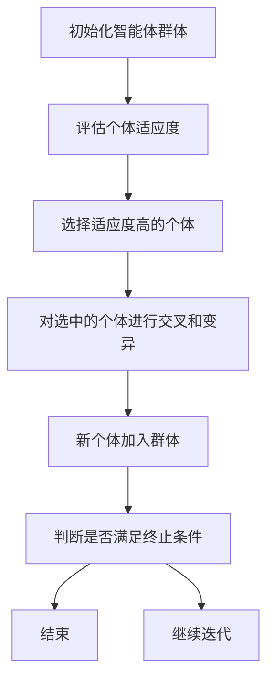
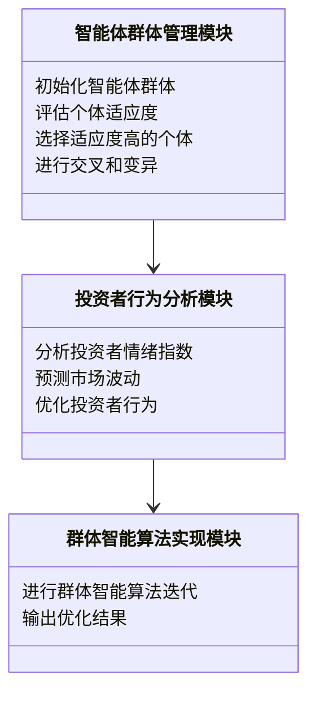

                 


# 智能体群体在模拟投资者行为中的应用

## 关键词：智能体，群体智能，投资者行为，行为建模，强化学习，遗传算法

## 摘要：智能体群体在模拟投资者行为中的应用探讨了如何利用智能体和群体智能技术来建模和分析投资者行为。本文通过分析投资者决策的驱动因素、情绪波动以及行为模式，结合强化学习和遗传算法，提出了一种基于智能体群体的投资者行为模拟方法。该方法通过构建智能体行为模型和投资者行为模型，利用群体智能算法优化智能体群体的行为，进而模拟投资者在金融市场中的决策过程。通过数学建模和系统设计，本文展示了如何将智能体群体应用于投资者行为分析，为金融领域的智能化研究提供了新的思路。

---

## 第一章：智能体群体与投资者行为概述

### 1.1 智能体的基本概念
#### 1.1.1 智能体的定义与特点
智能体（Agent）是指具有感知环境、做出决策并采取行动以实现目标的实体。智能体可以是软件程序，也可以是物理设备，其核心特征包括自主性、反应性、目标导向性和社会性。智能体的目标导向性使其能够根据环境信息做出决策，并通过行动实现目标。

#### 1.1.2 群体智能的定义与特征
群体智能（Swarm Intelligence）是指由多个智能体通过局部交互形成整体智能的行为模式。群体智能的关键特征包括去中心化、自组织性和涌现性。涌现性是指群体智能通过个体间的简单交互产生复杂的集体行为，这种特性使其在模拟投资者行为中具有重要应用价值。

#### 1.1.3 投资者行为的复杂性与挑战
投资者行为受到多种因素的影响，包括市场信息、个人情绪、认知偏差等。投资者行为的复杂性体现在其决策过程的非线性、不确定性和动态性。传统的行为建模方法难以捕捉投资者行为的全部特征，而群体智能技术为建模投资者行为提供了一种新的思路。

---

### 1.2 投资者行为分析
#### 1.2.1 投资者决策的驱动因素
投资者的决策受到多种因素的影响，包括市场信息、个体认知、情绪波动等。市场信息的复杂性使得投资者行为建模变得困难，而个体认知和情绪波动则进一步加剧了这种复杂性。

#### 1.2.2 投资者情绪与市场波动
投资者情绪是影响市场波动的重要因素。群体智能可以通过建模投资者情绪的变化来模拟市场波动。通过分析投资者情绪的传播和扩散，可以更好地理解市场行为的动态特征。

#### 1.2.3 投资者行为建模的必要性
投资者行为建模是金融研究的重要组成部分，它可以帮助我们更好地理解市场行为的内在规律。通过建模投资者行为，可以为金融市场的预测和风险管理提供理论支持。

---

### 1.3 群体智能在金融领域的应用
#### 1.3.1 群体智能的基本原理
群体智能通过模拟自然群体的行为模式，研究个体间的相互作用及其对集体行为的影响。群体智能的核心在于通过个体间的局部交互实现整体智能。

#### 1.3.2 群体智能在金融分析中的优势
群体智能在金融分析中的优势体现在其去中心化和自组织性。通过模拟投资者群体的行为，可以更好地理解市场动态，并为投资决策提供支持。

#### 1.3.3 智能体群体模拟投资者行为的可行性
智能体群体可以通过强化学习和遗传算法等技术模拟投资者行为。通过构建智能体行为模型，可以实现对投资者决策过程的模拟和分析。

---

### 1.4 本章小结
本章介绍了智能体和群体智能的基本概念，分析了投资者行为的复杂性及其建模的必要性。通过对比传统行为建模方法和群体智能技术，本文提出了利用智能体群体模拟投资者行为的可行性。

---

## 第二章：智能体群体与投资者行为的核心概念

### 2.1 智能体的行为模型
#### 2.1.1 基于强化学习的智能体行为建模
强化学习（Reinforcement Learning）是一种通过试错过程优化决策的算法。智能体通过与环境的交互获得奖励或惩罚，从而优化其行为策略。强化学习的核心在于通过不断试错来优化决策策略。

#### 2.1.2 基于遗传算法的智能体优化
遗传算法（Genetic Algorithm）是一种通过模拟自然选择过程优化解的算法。智能体的参数可以通过遗传算法进行优化，从而实现行为的最优化。

#### 2.1.3 智能体决策树的构建与分析
智能体决策树是一种通过树状结构表示决策过程的模型。通过构建智能体决策树，可以分析其决策过程，并优化其行为策略。

---

### 2.2 投资者行为模型
#### 2.2.1 投资者决策树的构建
投资者决策树是一种通过树状结构表示投资者决策过程的模型。通过构建投资者决策树，可以分析其决策过程，并优化其行为策略。

#### 2.2.2 投资者情绪指数的计算
投资者情绪指数是通过量化投资者情绪变化来衡量市场情绪的指标。通过分析投资者情绪指数的变化，可以更好地理解市场波动的内在规律。

#### 2.2.3 投资者行为的分类与预测
投资者行为可以通过分类和预测的方法进行建模。通过分析投资者行为的分类特征，可以实现对其行为的准确预测。

---

### 2.3 群体智能与投资者行为的联系
#### 2.3.1 群体智能在投资者行为建模中的应用
群体智能可以通过模拟投资者群体的行为模式，帮助建模投资者行为。通过分析群体智能的集体行为，可以更好地理解投资者行为的内在规律。

#### 2.3.2 智能体群体模拟投资者行为的机制
智能体群体模拟投资者行为的机制包括个体行为建模、群体行为建模以及个体与群体行为的相互作用。通过模拟个体行为，可以实现对群体行为的建模和分析。

#### 2.3.3 群体智能与传统投资者行为分析的对比
群体智能与传统投资者行为分析的对比包括建模方法、分析视角以及应用效果等方面。群体智能通过模拟个体间的行为交互，提供了一种新的投资者行为分析方法。

---

### 2.4 核心概念对比表
| 概念 | 特性 |
|------|------|
| 智能体行为模型 | 基于强化学习和遗传算法 |
| 投资者行为模型 | 基于决策树和情绪指数 |

---

### 2.5 本章小结
本章详细讲解了智能体行为模型和投资者行为模型的核心概念，并分析了群体智能在投资者行为建模中的应用。通过对比分析，本文提出了智能体群体模拟投资者行为的机制。

---

## 第三章：智能体群体模拟投资者行为的算法原理

### 3.1 基于强化学习的智能体设计
#### 3.1.1 强化学习的基本原理
强化学习的基本原理包括环境、智能体、状态、动作和奖励。智能体通过与环境的交互获得奖励或惩罚，从而优化其行为策略。

#### 3.1.2 智能体的奖励机制设计
奖励机制是强化学习的核心。通过设计合理的奖励机制，可以引导智能体采取最优行为策略。

#### 3.1.3 智能体决策树的构建与优化
智能体决策树的构建与优化是通过强化学习不断试错的过程。通过优化决策树，可以实现智能体行为的最优化。

---

### 3.2 基于遗传算法的智能体优化
#### 3.2.1 遗传算法的基本原理
遗传算法的基本原理包括编码、选择、交叉和变异。通过模拟自然选择过程，可以优化智能体的参数。

#### 3.2.2 智能体参数的编码与解码
智能体参数的编码与解码是遗传算法的关键步骤。通过合理的编码方式，可以实现智能体参数的优化。

#### 3.2.3 智能体群体的进化过程
智能体群体的进化过程包括初始群体的生成、适应度评估、选择、交叉和变异。通过不断进化，可以实现智能体群体行为的优化。

---

### 3.3 群体智能算法的实现流程
#### 3.3.1 群体智能算法的初始化
群体智能算法的初始化包括智能体群体的生成以及初始参数的设置。

#### 3.3.2 智能体行为的同步与协调
智能体行为的同步与协调是群体智能算法的关键步骤。通过同步智能体的行为，可以实现群体行为的协调。

#### 3.3.3 群体智能算法的收敛性分析
群体智能算法的收敛性分析是通过数学方法研究算法的收敛速度和稳定性。通过分析算法的收敛性，可以优化群体智能算法的性能。

---

### 3.4 算法流程图（Mermaid）


---

### 3.5 本章小结
本章详细讲解了基于强化学习和遗传算法的智能体设计，分析了群体智能算法的实现流程，并通过流程图展示了算法的整体结构。

---

## 第四章：智能体群体模拟投资者行为的数学模型

### 4.1 智能体行为模型的数学表达
智能体行为模型的数学表达包括状态空间、动作空间和奖励函数。通过数学公式可以描述智能体的行为策略。

$$
R(s, a) = \sum_{i=1}^{n} \alpha_i s_i + \sum_{j=1}^{m} \beta_j a_j
$$

其中，$s_i$ 是状态，$a_j$ 是动作，$\alpha_i$ 和 $\beta_j$ 是权重系数。

---

### 4.2 投资者行为模型的数学表达
投资者行为模型的数学表达包括投资者情绪指数和市场波动模型。通过数学公式可以描述投资者行为的内在规律。

$$
E(m) = \sum_{i=1}^{k} \gamma_i m_i
$$

其中，$m_i$ 是市场情绪指标，$\gamma_i$ 是权重系数。

---

### 4.3 群体智能算法的数学表达
群体智能算法的数学表达包括适应度函数和收敛性分析。通过数学公式可以描述算法的优化过程。

$$
f(x) = \sum_{i=1}^{n} w_i x_i
$$

其中，$x_i$ 是个体参数，$w_i$ 是权重系数。

---

### 4.4 本章小结
本章通过数学公式详细讲解了智能体行为模型、投资者行为模型以及群体智能算法的数学表达，为后续的系统设计和项目实现提供了理论基础。

---

## 第五章：智能体群体模拟投资者行为的系统分析

### 5.1 系统功能设计
系统功能设计包括投资者行为分析、智能体行为模拟以及群体智能算法实现。通过功能模块的划分，可以实现系统的整体功能。

---

### 5.2 系统架构设计
系统架构设计包括智能体群体管理模块、投资者行为分析模块以及群体智能算法实现模块。通过模块化设计，可以实现系统的高效运行。



---

### 5.3 系统接口设计
系统接口设计包括智能体群体管理接口、投资者行为分析接口以及群体智能算法实现接口。通过接口的设计，可以实现系统的模块化开发。

---

### 5.4 本章小结
本章通过系统功能设计、架构设计和接口设计，详细讲解了智能体群体模拟投资者行为的系统实现方案。

---

## 第六章：智能体群体模拟投资者行为的项目实战

### 6.1 环境安装
项目实战需要安装Python编程环境、遗传算法库以及Mermaid图表生成工具。通过环境的搭建，可以实现项目的顺利运行。

---

### 6.2 系统核心实现源代码
以下是系统核心实现的源代码示例：

```python
def initialize_agents(n):
    return [random.uniform(0, 1) for _ in range(n)]

def evaluate_fitness(agent):
    return sum(agent)

def select_agents(agents, fitness):
    return agents[fitness.argsort()[-2:]]

def crossover_agents(agent1, agent2):
    return [agent1[i] if i % 2 == 0 else agent2[i] for i in range(len(agent1))]

def mutate_agents(agent, mutation_rate=0.1):
    return [agent[i] + random.uniform(-mutation_rate, mutation_rate) for i in range(len(agent))]
```

---

### 6.3 代码应用解读与分析
代码实现包括智能体群体的初始化、适应度评估、选择、交叉和变异。通过代码的解读与分析，可以理解智能体群体模拟投资者行为的实现过程。

---

### 6.4 实际案例分析
通过实际案例分析，可以验证智能体群体模拟投资者行为的可行性。通过案例分析，可以进一步优化算法的实现。

---

### 6.5 本章小结
本章通过项目实战，详细讲解了智能体群体模拟投资者行为的实现过程，包括环境搭建、代码实现和案例分析。

---

## 第七章：总结与展望

### 7.1 总结
本文通过分析智能体群体与投资者行为的核心概念，详细讲解了智能体群体模拟投资者行为的算法原理和系统实现方案。通过数学建模和系统设计，本文为智能体群体在投资者行为模拟中的应用提供了理论支持。

---

### 7.2 展望
未来的研究方向包括智能体群体的优化算法、投资者行为的动态建模以及群体智能在金融领域的广泛应用。通过进一步的研究，可以更好地理解投资者行为的内在规律，并为金融市场的预测和风险管理提供理论支持。

---

### 7.3 最佳实践 Tips
1. 在实际应用中，建议结合具体场景优化智能体群体的行为模型。
2. 在系统实现过程中，需要注意算法的收敛性和稳定性。
3. 在案例分析时，建议结合实际市场数据验证算法的可行性。

---

### 7.4 本章小结
本章总结了本文的核心内容，并展望了未来的研究方向，为智能体群体在投资者行为模拟中的应用提供了进一步的思考。

--- 

通过以上章节的详细讲解，本文系统地探讨了智能体群体在模拟投资者行为中的应用，为相关领域的研究提供了理论支持和实践指导。

