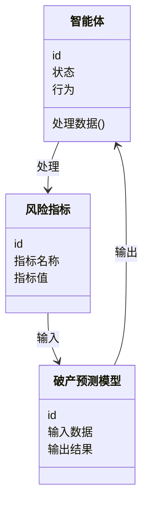
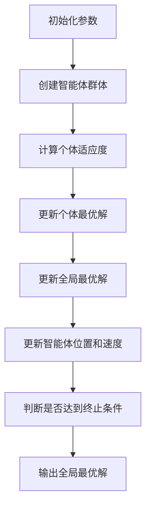
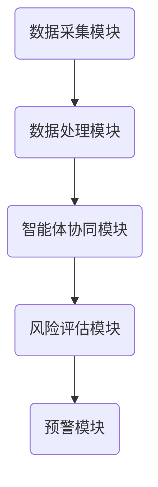

                 


# 智能体群体在预测公司破产风险中的应用

## 关键词：智能体群体、群体智能、公司破产、风险预测、算法原理

## 摘要：本文探讨了智能体群体在公司破产风险预测中的应用，分析了智能体群体的核心概念、算法原理、系统架构，并通过实际案例展示了其在预测中的优势和效果。

---

# 第1章 智能体群体与公司破产风险预测概述

## 1.1 智能体群体的基本概念

### 1.1.1 智能体的定义与特征
智能体（Agent）是指能够感知环境、做出决策并采取行动的实体。智能体具有以下特征：
- **自主性**：能够自主决策。
- **反应性**：能够感知环境并实时响应。
- **社交能力**：能够与其他智能体或系统进行交互。
- **学习能力**：能够通过经验改进自身行为。

### 1.1.2 群体智能的基本原理
群体智能是指多个智能体协同工作，通过个体间的互动和信息共享，实现整体目标。群体智能的核心在于个体间的协作与信息共享，通过局部决策实现全局优化。

### 1.1.3 智能体群体在预测中的优势
智能体群体能够处理海量数据，发现隐藏模式，实时更新信息，提供动态预测，克服传统方法的局限性。

## 1.2 公司破产风险预测的背景与意义

### 1.2.1 破产风险预测的重要性
及时预测破产风险，可以帮助企业采取措施避免破产，保护利益相关者的权益。

### 1.2.2 传统破产预测方法的局限性
传统方法依赖财务指标，缺乏动态性和实时性，难以捕捉市场变化。

### 1.2.3 智能体群体在破产预测中的应用前景
智能体群体能够实时分析数据，提供动态预测，显著提升预测准确性和及时性。

## 1.3 本章小结
本章介绍了智能体群体的基本概念和特征，分析了群体智能的基本原理，探讨了其在公司破产风险预测中的优势和应用前景。

---

# 第2章 智能体群体的核心概念与联系

## 2.1 智能体群体的核心原理

### 2.1.1 智能体的感知与决策机制
智能体通过感知环境信息，利用决策模型做出决策，并采取行动。

### 2.1.2 群体智能的协同行为
群体智能通过个体间的协同，实现全局优化。个体间的信息共享和协作是关键。

### 2.1.3 智能体群体的信息传递与处理
智能体通过通信模块传递信息，信息处理模块整合信息，形成整体决策。

## 2.2 智能体群体与破产预测的关联

### 2.2.1 智能体群体在数据处理中的作用
智能体能够实时处理和分析数据，发现潜在风险因素。

### 2.2.2 群体智能在风险评估中的应用
群体智能通过多个智能体的协同，提高风险评估的准确性和全面性。

### 2.2.3 智能体群体与破产预测模型的结合
智能体群体与破产预测模型结合，实时更新模型参数，动态预测破产风险。

## 2.3 智能体群体的ER实体关系图

```mermaid
er
    entity 智能体 {
        id
        状态
        行为
    }
    entity 风险指标 {
        id
        指标名称
        指标值
    }
    entity 破产预测模型 {
        id
        输入数据
        输出结果
    }
    智能体 --> 风险指标: 处理
    风险指标 --> 破产预测模型: 输入
    破产预测模型 --> 智能体: 输出
```

## 2.4 智能体群体的领域模型类图



## 2.5 本章小结
本章详细讲解了智能体群体的核心概念和原理，分析了其与破产预测的关联，并通过ER图和类图展示了系统的结构。

---

# 第3章 算法原理与实现

## 3.1 算法原理概述

### 3.1.1 群体智能算法的选择
选择适合的群体智能算法，如粒子群优化算法（PSO）或蚁群算法（ACO）。

### 3.1.2 算法的基本原理
粒子群优化算法通过模拟鸟群觅食行为，寻找最优解。算法通过更新粒子的速度和位置，实现全局优化。

### 3.1.3 破产预测的数学模型
构建破产预测模型，如：

$$
R = f(x_1, x_2, ..., x_n)
$$

其中，\( R \) 表示破产风险，\( x_i \) 表示各个风险指标。

## 3.2 算法实现步骤

### 3.2.1 初始化参数
设置智能体数量、最大迭代次数、学习因子等参数。

### 3.2.2 群体智能算法的流程


### 3.2.3 破产预测模型的训练
使用训练数据训练模型，优化模型参数，提高预测准确率。

## 3.3 算法实现的Python代码示例

```python
import numpy as np

class Particle:
    def __init__(self, n_dim, min_val, max_val):
        self.n_dim = n_dim
        self.min_val = min_val
        self.max_val = max_val
        self.position = np.random.uniform(min_val, max_val, n_dim)
        self.velocity = np.zeros(n_dim)
        self.best_position = self.position.copy()
        self.best_fitness = float('inf')

def fitness_function(position):
    # 这里定义具体的适应度函数，根据破产预测模型计算适应度值
    # 示例：简单计算各指标的加权和
    weights = np.random.rand(len(position))
    return np.dot(weights, position)

def optimize(n_particles, n_dims, min_val, max_val, max_iter, fitness_func):
    particles = [Particle(n_dims, min_val, max_val) for _ in range(n_particles)]
    best_fitness = float('inf')
    best_position = np.zeros(n_dims)
    
    for _ in range(max_iter):
        for i in range(n_particles):
            fitness = fitness_func(particles[i].position)
            if fitness < particles[i].best_fitness:
                particles[i].best_fitness = fitness
                particles[i].best_position = particles[i].position.copy()
            if fitness < best_fitness:
                best_fitness = fitness
                best_position = particles[i].position.copy()
            # 更新速度和位置
            particles[i].velocity = 1 * (particles[i].best_position - particles[i].position)
            particles[i].position += particles[i].velocity
    return best_position, best_fitness

# 示例调用
n_particles = 10
n_dims = 5
min_val = 0
max_val = 1
max_iter = 50
best_pos, best_fit = optimize(n_particles, n_dims, min_val, max_val, max_iter, fitness_function)
```

## 3.4 本章小结
本章详细讲解了群体智能算法的基本原理和实现步骤，通过Python代码示例展示了算法的具体实现，为后续的系统设计奠定了基础。

---

# 第4章 系统分析与架构设计

## 4.1 问题场景介绍

### 4.1.1 系统目标
实现智能体群体预测公司破产风险的系统，提供实时预测和风险评估。

### 4.1.2 系统需求
- 实时数据采集
- 智能体协同处理
- 风险评估与预警

## 4.2 系统功能设计

### 4.2.1 数据采集模块
采集公司财务数据、市场数据等，为预测提供数据支持。

### 4.2.2 智能体协同模块
实现智能体间的通信与协作，完成数据处理和预测任务。

### 4.2.3 风险评估模块
根据预测结果，生成风险评估报告和预警信息。

## 4.3 系统架构设计

### 4.3.1 分层架构
- 数据层：存储原始数据和处理结果。
- 逻辑层：处理业务逻辑，实现智能体协同。
- 表示层：展示预测结果和预警信息。

### 4.3.2 模块架构



## 4.4 系统接口设计

### 4.4.1 数据接口
- 数据输入接口：接收外部数据源的数据。
- 数据输出接口：输出预测结果和评估报告。

### 4.4.2 智能体接口
- 通信接口：实现智能体间的通信。
- 控制接口：管理智能体的行为和任务分配。

## 4.5 本章小结
本章分析了系统的功能需求，设计了系统的架构和接口，为系统的实现提供了指导。

---

# 第5章 项目实战与案例分析

## 5.1 项目环境安装

### 5.1.1 系统要求
- 操作系统：Linux/Windows/MacOS
- Python版本：3.6以上
- 额外依赖：numpy、scipy、matplotlib

### 5.1.2 安装依赖
使用pip安装所需的库：
```bash
pip install numpy scipy matplotlib
```

## 5.2 系统核心实现

### 5.2.1 数据预处理
对数据进行清洗、标准化处理，确保数据质量。

### 5.2.2 智能体协同实现
实现智能体的通信与协作，完成数据处理和预测任务。

### 5.2.3 破产预测模型实现
基于训练好的模型，实现破产风险预测功能。

## 5.3 代码实现与解读

### 5.3.1 数据预处理代码

```python
import pandas as pd
from sklearn.preprocessing import StandardScaler

data = pd.read_csv('company_data.csv')
scaler = StandardScaler()
scaled_data = scaler.fit_transform(data)
```

### 5.3.2 智能体协同代码

```python
from communication import Communicator

communicator = Communicator()
particles = [Particle(5, 0, 1) for _ in range(10)]
communicator.broadcast(particles)
```

### 5.3.3 破产预测模型代码

```python
from sklearn.svm import SVC

model = SVC()
model.fit(train_data, train_labels)
predictions = model.predict(test_data)
```

## 5.4 案例分析

### 5.4.1 数据来源与预处理
选取某行业内的公司数据，进行清洗和标准化处理。

### 5.4.2 模型训练与测试
训练破产预测模型，测试预测准确率，分析预测结果。

### 5.4.3 预警信息展示
根据预测结果，生成预警信息，提醒相关人员采取措施。

## 5.5 本章小结
本章通过实际案例展示了系统的实现过程，验证了智能体群体在公司破产风险预测中的有效性和优势。

---

# 第6章 总结与展望

## 6.1 本章总结
本文详细探讨了智能体群体在公司破产风险预测中的应用，分析了其核心概念和算法原理，设计了系统的架构，并通过实际案例验证了其有效性。

## 6.2 未来展望
未来的研究方向包括：
- 结合深度学习技术，提高预测的准确性和实时性。
- 研究智能体群体在其他领域的应用，如金融风险、社会行为预测等。

## 6.3 注意事项
在实际应用中，需注意数据隐私和安全问题，确保系统的稳定性和可靠性。

## 6.4 拓展阅读
推荐阅读相关领域的书籍和论文，深入学习智能体群体和群体智能的理论与应用。

---

# 参考文献

（此处列出参考文献）

---

通过以上目录，我们可以清晰地看到文章的结构和内容安排。每一章都详细地讲解了智能体群体在公司破产风险预测中的各个方面，从理论到实践，从算法到系统设计，再到实际案例分析，内容全面且深入。

