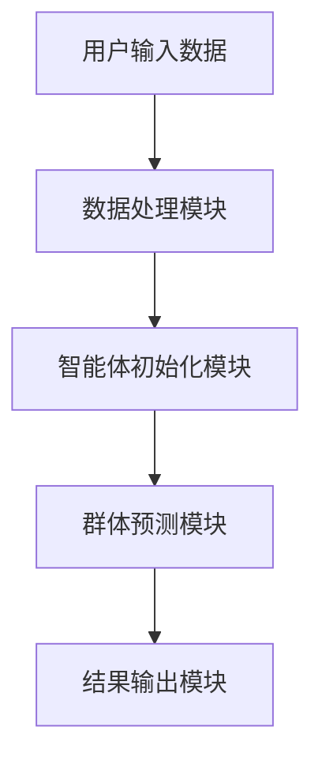
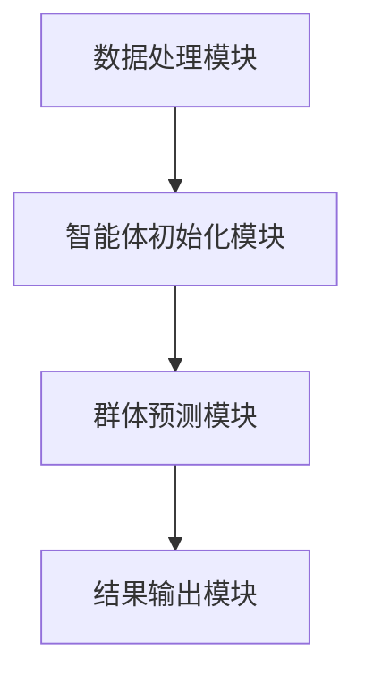

                 


# 智能体群体在预测公司财务困境中的应用

> 关键词：智能体群体、财务困境预测、群体智能、机器学习、企业风险管理

> 摘要：随着企业风险管理的重要性日益增加，预测公司财务困境成为企业运营中的关键任务。本文将介绍智能体群体在财务困境预测中的应用，从核心概念、算法原理、系统架构到实际案例，全面分析智能体群体的优势与实现方法。

---

## 第1章: 智能体群体与财务困境预测的背景

### 1.1 问题背景与描述

#### 1.1.1 企业财务困境的定义与特征
企业财务困境是指企业在经营过程中由于内外部因素的影响，导致无法偿还债务或持续经营的状况。其主要特征包括：  
- **财务状况恶化**：如资产负债率过高、流动比率过低等。  
- **经营效率下降**：如销售收入增长率下降、净利润率降低等。  
- **外部信用评级下降**：如银行贷款评级降低、债券评级下调等。  

#### 1.1.2 财务困境预测的重要性
- **早期预警**：及时发现潜在问题，采取措施避免财务危机。  
- **降低风险**：通过预测，企业可以优化资产负债结构，减少损失。  
- **提升决策效率**：基于数据的预测为企业提供科学依据。  

#### 1.1.3 智能体群体在预测中的应用价值
- **分布式计算**：智能体群体能够并行处理大量数据，提高计算效率。  
- **多样性**：不同智能体可以基于不同特征进行预测，提升整体预测的准确性。  
- **自适应性**：智能体群体能够根据数据变化动态调整预测模型。  

### 1.2 智能体群体的核心概念

#### 1.2.1 智能体的定义与属性
智能体（Agent）是指能够感知环境、做出决策并采取行动的实体。其主要属性包括：  
- **自主性**：智能体能够自主决策，无需外部干预。  
- **反应性**：能够实时感知环境变化并做出响应。  
- **社会性**：智能体之间可以交互信息，协同工作。  

#### 1.2.2 群体智能的基本原理
群体智能是指通过多个智能体的协同工作，实现比单个智能体更复杂的任务。其核心原理包括：  
- **信息共享**：智能体之间通过共享信息提升整体决策能力。  
- **分布式计算**：任务分解到多个智能体，提高计算效率。  
- **自组织性**：智能体能够根据环境动态调整自身行为。  

#### 1.2.3 智能体群体与传统预测方法的对比

| 对比维度       | 智能体群体预测 | 传统预测方法 |
|----------------|----------------|---------------|
| 计算效率       | 高             | 中             |
| 并行性         | 强             | 弱             |
| 鲁棒性         | 强             | 中             |
| 可扩展性       | 强             | 弱             |

---

## 第2章: 智能体群体预测的理论基础

### 2.1 群体智能算法概述

#### 2.1.1 群体智能算法的分类
群体智能算法主要分为以下几类：  
- **基于规则的群体智能**：通过预定义规则进行决策。  
- **基于学习的群体智能**：通过机器学习算法进行预测。  
- **基于优化的群体智能**：如粒子群优化算法（PSO）、蚁群算法（ACO）。  

#### 2.1.2 基于智能体的预测模型
基于智能体的预测模型通常包括以下步骤：  
1. **数据预处理**：对财务数据进行清洗和特征提取。  
2. **智能体初始化**：为每个智能体分配初始状态。  
3. **信息交互**：智能体之间共享信息，更新状态。  
4. **群体决策**：基于智能体的决策结果进行预测。  

#### 2.1.3 群体智能与机器学习的结合
群体智能可以与机器学习算法结合，例如：  
- 使用支持向量机（SVM）或随机森林（RF）作为智能体的预测模型。  
- 通过群体智能优化机器学习模型的超参数。  

### 2.2 财务数据特征分析

#### 2.2.1 财务指标的选取与预处理
常用的财务指标包括：  
- 资产负债率（Debt-to-Asset Ratio）  
- 流动比率（Current Ratio）  
- 净利润率（Net Profit Margin）  

#### 2.2.2 数据特征的可解释性
可解释性是指模型能够清晰地解释每个特征对预测结果的影响。  
例如，流动比率较低可能表明企业面临流动性风险。  

#### 2.2.3 数据的分布与假设检验
通过假设检验（如t检验、卡方检验）分析数据分布，确定哪些特征与财务困境显著相关。  

---

## 第3章: 智能体群体预测的算法原理

### 3.1 群体智能算法的数学模型

#### 3.1.1 基于智能体的预测模型构建
假设每个智能体的预测结果为$y_i$，群体预测结果为：  
$$ y = \frac{\sum_{i=1}^{n} y_i}{n} $$  

#### 3.1.2 智能体之间的信息交互机制
信息交互机制可以通过以下公式表示：  
$$ s_{i}^{new} = s_{i} + \sum_{j \neq i} (s_{j} - s_{i}) \times \alpha $$  
其中，$\alpha$为信息交互系数。  

#### 3.1.3 群体决策的收敛性分析
通过数学证明，可以验证群体决策的收敛性，例如：  
$$ \lim_{t \to \infty} s_{i} = s^{*} $$  

### 3.2 算法实现流程

#### 3.2.1 数据预处理与特征选择
1. 数据清洗：处理缺失值、异常值。  
2. 特征选择：使用主成分分析（PCA）提取关键特征。  

#### 3.2.2 智能体初始化与状态更新
1. 初始化：为每个智能体分配初始状态。  
2. 状态更新：根据信息交互机制更新智能体状态。  

#### 3.2.3 群体预测的优化过程
通过优化算法（如遗传算法）不断优化群体预测结果。  

### 3.3 算法实现的Python代码示例

#### 3.3.1 数据加载与处理
```python
import pandas as pd
data = pd.read_csv('financial_data.csv')
# 数据预处理
data.dropna(inplace=True)
```

#### 3.3.2 智能体类的定义
```python
class Agent:
    def __init__(self, features):
        self.features = features
        self.state = 0
```

#### 3.3.3 群体预测的实现代码
```python
import numpy as np

class Swarm:
    def __init__(self, agents):
        self.agents = agents
        self.n = len(agents)
    
    def update(self, alpha=0.1):
        for i in range(self.n):
            for j in range(self.n):
                if i != j:
                    delta = self.agents[j].state - self.agents[i].state
                    self.agents[i].state += delta * alpha
```

---

## 第4章: 系统分析与架构设计

### 4.1 项目背景与目标

#### 4.1.1 项目背景
本项目旨在利用智能体群体技术，构建一个高效的财务困境预测系统。  

#### 4.1.2 项目目标
- 实现智能体群体预测模型。  
- 提供一个可扩展的系统架构。  

### 4.2 系统功能设计

#### 4.2.1 系统功能模块划分
- 数据处理模块  
- 智能体初始化模块  
- 群体预测模块  
- 结果输出模块  

#### 4.2.2 模块之间的关系
通过模块化设计，确保各模块之间高度耦合，便于维护和扩展。  

#### 4.2.3 功能流程图


### 4.3 系统架构设计

#### 4.3.1 分层架构设计
系统架构分为数据层、智能层和应用层。  

#### 4.3.2 智能体交互机制
智能体之间通过消息队列（如Kafka）进行信息交互。  

#### 4.3.3 系统接口设计
- 数据接口：提供REST API用于数据输入输出。  
- 预测接口：提供预测结果查询接口。  

### 4.4 系统实现的Mermaid架构图


---

## 第5章: 项目实战与案例分析

### 5.1 环境搭建与数据准备

#### 5.1.1 环境安装与配置
安装Python、Pandas、NumPy等依赖库。  

#### 5.1.2 数据准备
加载财务数据并进行预处理。  

### 5.2 系统核心实现源代码

#### 5.2.1 数据加载与处理
```python
import pandas as pd
data = pd.read_csv('financial_data.csv')
data.dropna(inplace=True)
```

#### 5.2.2 智能体初始化与预测
```python
class Agent:
    def __init__(self, features):
        self.features = features
        self.state = 0

swarm = Swarm([Agent(data.iloc[i]) for i in range(len(data))])
swarm.update()
```

### 5.3 代码应用解读与分析
- 数据加载：读取CSV文件并去除缺失值。  
- 智能体初始化：为每个样本创建一个智能体。  
- 群体预测：通过信息交互机制更新智能体状态，最终输出预测结果。  

### 5.4 实际案例分析
以某公司为例，分析其财务数据，预测其财务困境的可能性。  

### 5.5 项目小结
通过实际案例验证智能体群体预测模型的有效性，并总结经验教训。

---

## 第6章: 最佳实践与总结

### 6.1 最佳实践
- 数据预处理是关键，确保数据质量。  
- 选择合适的智能体算法，根据实际需求进行优化。  

### 6.2 小结
智能体群体在财务困境预测中的应用具有显著优势，能够提升预测的准确性和效率。  

### 6.3 注意事项
- 数据隐私和安全问题需要重视。  
- 群体智能算法的参数设置需要根据具体问题调整。  

### 6.4 拓展阅读
推荐相关书籍和论文，供读者深入学习。  

--- 

# 结语
通过本文的详细介绍，读者可以全面了解智能体群体在预测公司财务困境中的应用，并掌握其实现方法和最佳实践。希望本文能为企业的风险管理提供有价值的参考。

