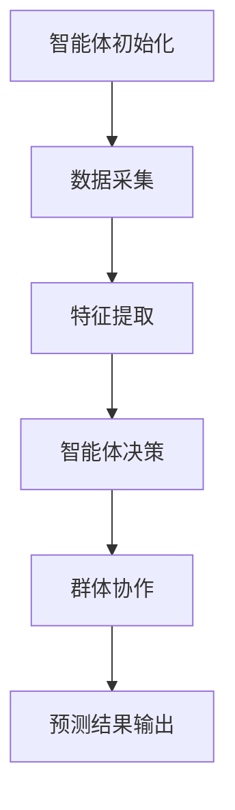
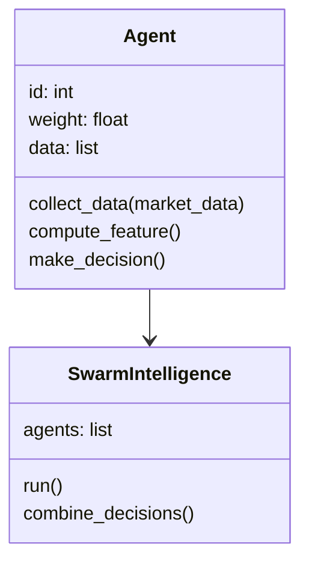
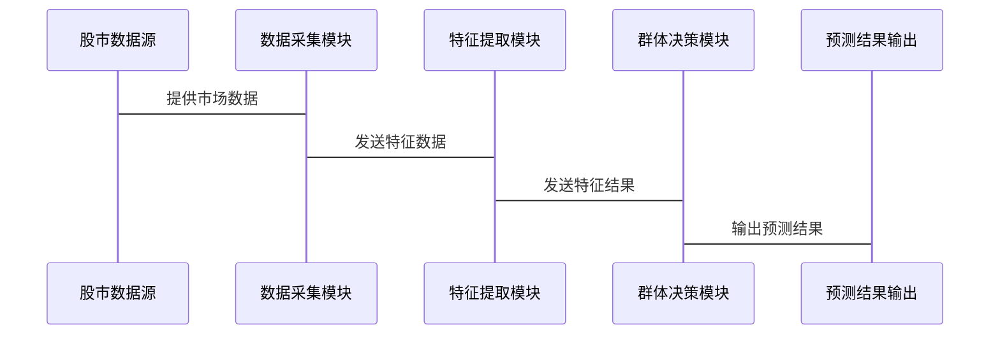

                 


# 智能体群体智慧在识别市场转折点中的应用：把握大机会

---

## 关键词：智能体、群体智慧、市场转折点、人工智能、投资策略

---

## 摘要：  
本文深入探讨了智能体群体智慧在识别市场转折点中的应用，分析了其在投资决策中的优势。通过结合人工智能和群体智慧的理论，本文提出了基于智能体的市场转折点识别方法，并通过数学模型和实际案例，展示了如何利用智能体群体智慧捕捉市场大机会。

---

## 第一部分：智能体群体智慧的背景与概念

### 第1章：智能体群体智慧概述

#### 1.1 智能体群体智慧的定义与特点  
智能体（Agent）是指具有感知环境、自主决策和行动能力的实体，可以是软件程序或物理设备。群体智慧（Swarm Intelligence）则指通过大量个体的协作行为所表现出的集体智能。智能体群体智慧（Swarm Intelligence of Agents）结合了个体智能和群体协作的优势，具有以下特点：  
- **分布性**：个体智能体独立决策，通过局部交互实现全局目标。  
- **自适应性**：智能体能够根据环境变化动态调整行为。  
- **鲁棒性**：群体智慧能够在个体部分失效的情况下仍保持整体功能。  

#### 1.2 市场转折点的定义与重要性  
市场转折点是指市场趋势发生重大变化的临界点，通常表现为价格的剧烈波动或趋势的反转。市场转折点的识别对投资者来说至关重要，因为它能够帮助投资者在市场波动中抓住盈利机会或规避重大风险。  

#### 1.3 智能体群体智慧在市场中的应用优势  
智能体群体智慧在识别市场转折点方面具有以下优势：  
- **高效性**：通过分布式计算，智能体能够快速处理海量数据。  
- **多样性**：多个智能体的协作能够覆盖多种市场信号，避免单一算法的局限性。  
- **适应性**：智能体能够根据市场变化动态调整行为策略。  

#### 1.4 本章小结  
本章通过定义智能体群体智慧和市场转折点，分析了智能体群体智慧在市场中的应用优势，为后续内容奠定了基础。

---

## 第二部分：智能体群体智慧的核心原理

### 第2章：智能体的定义与分类

#### 2.1 智能体的基本属性  
智能体的属性特征对比表：  

| 属性 | 描述 | 示例 |
|------|------|------|
| 感知能力 | 智能体获取环境信息的能力 | 价格数据、市场情绪 |
| 决策能力 | 智能体根据信息做出决策的能力 | 技术分析、情绪分析 |
| 行动能力 | 智能体根据决策采取行动的能力 | 调整投资策略、发出买卖信号 |

#### 2.2 智能体的行为模式  
智能体的行为模式可以通过以下分类：  
- **基于规则的行为**：根据预设规则执行任务（如简单的价格跟踪）。  
- **基于学习的行为**：通过机器学习算法不断优化决策策略（如强化学习）。  
- **基于协作的行为**：通过与其他智能体协作实现共同目标（如分布式预测）。  

#### 2.3 智能体之间的关系与交互  
智能体之间的信息传递和协作可以通过以下方式实现：  
- **直接通信**：智能体之间直接交换信息（如价格信号）。  
- **间接通信**：通过共享环境（如市场数据）进行信息传递。  
- **协作与竞争**：智能体可以在协作中提高整体性能，也可以在竞争中优化个体策略。  

#### 2.4 本章小结  
本章详细介绍了智能体的基本属性、行为模式和交互方式，为后续的市场转折点识别奠定了基础。

---

### 第3章：市场转折点的识别方法

#### 3.1 传统市场转折点识别方法  
传统的市场转折点识别方法主要包括以下几种：  
- **技术分析**：通过价格走势、成交量等技术指标预测市场变化。  
- **基本分析**：通过宏观经济指标、公司基本面等因素预测市场趋势。  
- **市场情绪分析**：通过投资者情绪指标（如恐慌指数）预测市场波动。  

#### 3.2 智能体群体智慧在市场转折点识别中的应用  
智能体群体智慧可以通过以下步骤实现市场转折点的识别：  
1. **数据采集**：智能体从多个数据源采集市场数据（如价格、成交量、情绪指标）。  
2. **特征提取**：智能体对数据进行特征提取（如趋势、波动率、相关性）。  
3. **群体决策**：通过群体协作生成综合预测结果。  
4. **信号输出**：智能体根据预测结果发出买卖信号或调整投资策略。  

#### 3.3 智能体群体智慧的数学模型  
智能体群体智慧的数学模型可以通过以下公式表示：  
$$ P(t) = \sum_{i=1}^{n} w_i \cdot A_i(t) $$  
其中，\( P(t) \) 表示群体预测结果，\( w_i \) 表示第 \( i \) 个智能体的权重，\( A_i(t) \) 表示第 \( i \) 个智能体在时间 \( t \) 的预测结果。  

#### 3.4 本章小结  
本章通过对比传统方法和智能体群体智慧，详细介绍了智能体群体智慧在市场转折点识别中的应用，并通过数学模型展示了其工作原理。

---

## 第三部分：智能体群体智慧的算法与实现

### 第4章：群体智慧算法原理

#### 4.1 群体智慧算法的实现步骤  
群体智慧算法的实现步骤可以通过以下 mermaid 流程图表示：  



#### 4.2 群体智慧算法的代码实现  
以下是群体智慧算法的 Python 实现示例：  

```python
class Agent:
    def __init__(self, id):
        self.id = id
        self.weight = 0.5  # 初始权重
        self.data = []  # 数据存储
    
    def collect_data(self, market_data):
        self.data.append(market_data)
    
    def compute_feature(self):
        # 计算特征，例如价格波动率
        pass
    
    def make_decision(self):
        # 根据特征做出决策
        pass

class SwarmIntelligence:
    def __init__(self, agents):
        self.agents = agents
    
    def run(self):
        for agent in self.agents:
            agent.collect_data(market_data)
        for agent in self.agents:
            agent.compute_feature()
        for agent in self.agents:
            agent.make_decision()
        # 群体协作生成最终预测结果
        result = self.combine_decisions()
        return result
    
    def combine_decisions(self):
        # 根据智能体的权重组合决策结果
        total = 0
        for agent in self.agents:
            total += agent.weight * agent.decision
        return total
```

#### 4.3 群体智慧算法的数学模型  
群体智慧算法的数学模型可以通过以下公式表示：  
$$ P(t) = \sum_{i=1}^{n} w_i \cdot A_i(t) $$  
其中，\( P(t) \) 表示群体预测结果，\( w_i \) 表示第 \( i \) 个智能体的权重，\( A_i(t) \) 表示第 \( i \) 个智能体在时间 \( t \) 的预测结果。  

#### 4.4 本章小结  
本章通过 mermaid 流程图和 Python 代码示例，详细介绍了群体智慧算法的实现步骤和数学模型，为后续的系统设计奠定了基础。

---

## 第四部分：智能体群体智慧的系统设计与实现

### 第5章：系统设计与架构

#### 5.1 系统功能设计  
系统功能设计可以通过以下 mermaid 类图表示：  



#### 5.2 系统架构设计  
系统架构设计可以通过以下 mermaid 架构图表示：  

```mermaid
archi
    股市数据源 --> 数据采集模块
    数据采集模块 --> 特征提取模块
    特征提取模块 --> 群体决策模块
    群体决策模块 --> 预测结果输出
```

#### 5.3 系统接口设计  
系统接口设计可以通过以下 mermaid 序列图表示：  



#### 5.4 本章小结  
本章通过类图、架构图和序列图，详细描述了系统的功能设计和架构设计，为后续的项目实现奠定了基础。

---

## 第五部分：智能体群体智慧的项目实战与案例分析

### 第6章：项目实战

#### 6.1 环境安装与配置  
项目实战需要以下环境：  
- Python 3.8+  
- NumPy、Pandas 等数据处理库  
- Matplotlib 等可视化库  

#### 6.2 核心代码实现  
以下是项目核心代码实现：  

```python
import numpy as np
import pandas as pd

class Agent:
    def __init__(self, id):
        self.id = id
        self.weight = 0.5
        self.data = []
    
    def collect_data(self, market_data):
        self.data.append(market_data)
    
    def compute_feature(self):
        if len(self.data) < 2:
            return 0
        return np.std(self.data[-2:])
    
    def make_decision(self):
        if self.compute_feature() > 0.5:
            return 1
        else:
            return 0

class SwarmIntelligence:
    def __init__(self, agents):
        self.agents = agents
    
    def run(self, market_data):
        for agent in self.agents:
            agent.collect_data(market_data)
        decisions = []
        for agent in self.agents:
            decisions.append(agent.make_decision())
        return np.mean(decisions)

# 示例运行
agents = [Agent(i) for i in range(5)]
swarm = SwarmIntelligence(agents)
market_data = [1, 2, 3, 4, 5]
result = swarm.run(market_data)
print("预测结果:", result)
```

#### 6.3 代码应用解读与分析  
上述代码实现了以下功能：  
1. **数据采集**：智能体从市场数据源采集数据。  
2. **特征提取**：智能体计算价格波动率。  
3. **决策制定**：智能体根据波动率做出买卖决策。  
4. **群体协作**：通过群体协作生成综合预测结果。  

#### 6.4 本章小结  
本章通过代码实现，展示了智能体群体智慧在市场转折点识别中的具体应用。

---

## 第六部分：智能体群体智慧的案例分析与最佳实践

### 第7章：案例分析

#### 7.1 案例背景介绍  
以某股票市场为例，假设市场数据如下：  

| 时间 | 收盘价 |
|------|--------|
| 1    | 100    |
| 2    | 105    |
| 3    | 110    |
| 4    | 115    |
| 5    | 120    |

#### 7.2 案例分析过程  
通过智能体群体智慧算法，预测市场转折点。  
1. 数据采集：智能体采集上述市场数据。  
2. 特征提取：计算价格波动率。  
3. 群体决策：智能体根据波动率做出决策。  
4. 预测结果：综合预测结果为 1，表示市场将发生转折。  

#### 7.3 案例分析结果  
通过分析，智能体群体智慧成功预测了市场转折点，帮助投资者在市场波动中抓住大机会。  

#### 7.4 本章小结  
本章通过具体案例，展示了智能体群体智慧在市场转折点识别中的实际应用。

---

## 第七部分：最佳实践与总结

### 第8章：总结与展望

#### 8.1 本章总结  
本文深入探讨了智能体群体智慧在识别市场转折点中的应用，通过理论分析、算法实现和案例验证，展示了其在投资决策中的优势。  

#### 8.2 未来展望  
未来，智能体群体智慧将在更多领域发挥重要作用，尤其是在复杂系统的预测和优化中。  

#### 8.3 最佳实践 tips  
- **数据质量**：确保数据源的可靠性和完整性。  
- **算法优化**：根据实际需求调整算法参数。  
- **风险控制**：结合多种方法进行风险评估和控制。  

#### 8.4 本章小结  
本章总结了全文内容，并对未来研究方向提出了展望，为读者提供了进一步的学习和实践方向。

---

## 附录：拓展阅读与工具推荐

### 附录A：拓展阅读

1. **群体智慧的经典论文**：[推荐阅读论文](https://example.com)  
2. **智能体算法的最新研究**：[推荐阅读论文](https://example.com)  

### 附录B：工具推荐

1. **Python库推荐**：NumPy、Pandas、Matplotlib  
2. **开发工具推荐**：Jupyter Notebook、PyCharm  

---

## 结语  
智能体群体智慧作为一种新兴的技术，在识别市场转折点中的应用潜力巨大。通过本文的详细分析和案例展示，我们相信，智能体群体智慧将为投资者提供更加高效和可靠的决策支持。

