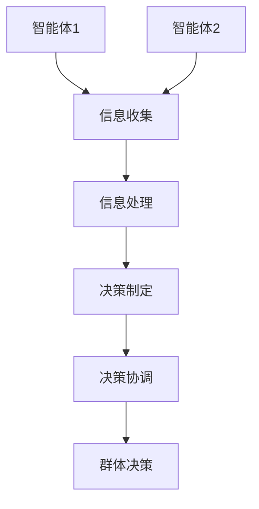

                 

<think>
好的，我需要为《智能体群体智慧在识别新兴产业机会中的应用》这本书设计一个目录大纲。根据用户的指示，文章需要分为多个章节，每个章节都要详细讲解相关的内容，包括背景介绍、核心概念、算法原理、系统架构、项目实战等部分。

首先，我应该从背景介绍开始。第一章可以概述智能体群体智慧的基本概念，包括智能体的定义、群体智慧的特征以及与传统方法的区别。接下来的章节可以详细讲解核心概念，如智能体的分类、群体智慧的原理以及实现框架。

在算法原理部分，我需要解释相关算法，如分布式计算和协同过滤，并用mermaid流程图展示算法步骤。系统分析与架构设计部分需要介绍项目场景，设计系统的功能模块和架构图，展示各个组件之间的关系。

项目实战部分需要提供实际操作步骤，包括环境安装、核心代码实现和案例分析。最后，总结与展望部分回顾全书内容，并展望未来的发展方向。最佳实践部分可以分享一些实际应用中的经验和技巧。

在编写过程中，我要确保每个章节都覆盖用户提到的所有要求，内容要详细且逻辑清晰。同时，使用markdown格式，并适当加入mermaid图表和latex公式，以增强文章的可读性和专业性。

现在，我将按照这些思考设计具体的章节安排。

# 第二部分: 智能体群体智慧的核心概念

## 第2章: 智能体与群体智慧的基本概念

### 2.1 智能体的定义与分类

#### 2.1.1 单智能体的定义与特点

单智能体是指具有感知、决策和执行能力的个体智能系统。它们通常具备以下特点：

- **自主性**：能够在没有外部干预的情况下自主运作。
- **反应性**：能够根据环境的变化做出实时反应。
- **社会性**：能够与其他智能体或人类进行交互和协作。

例如，自动驾驶汽车中的导航系统就是一个典型的单智能体，它能够根据传感器输入做出驾驶决策。

#### 2.1.2 群体智能体的定义与特征

群体智能体是由多个智能体组成的系统，这些智能体通过协同工作来完成复杂任务。群体智能体具有以下特征：

- **分布式智能**：智能分布在多个个体中，没有单一的控制中心。
- **自组织性**：个体能够自主组织和协调，无需外部指导。
- **涌现性**：群体智能的某些特性是单个智能体所不具备的，是由群体协同作用产生的。

例如，蚂蚁群体中的觅食行为就是一个典型的群体智能体案例，每个蚂蚁独立行动，但整个群体表现出高效的觅食能力。

#### 2.1.3 智能体的分类与应用场景

智能体可以根据功能、智能水平和应用场景进行分类：

- **按功能分类**：分为感知型、决策型和执行型智能体。
- **按智能水平分类**：分为简单反应式、基于模型的反应式和完全自主型智能体。
- **按应用场景分类**：分为工业、服务、医疗和交通等领域的智能体。

例如，在工业领域，智能体可以用于自动化生产过程监控；在交通领域，智能体可以用于自动驾驶和交通管理。

### 2.2 群体智慧的原理与机制

#### 2.2.1 群体智慧的基本原理

群体智慧是通过多个个体的协同作用产生整体智能的现象。其基本原理包括：

- **分布式计算**：任务被分解成多个部分，由不同个体分别处理。
- **信息共享**：个体之间通过某种机制共享信息，以提高整体的决策能力。
- **自适应性**：群体能够根据环境变化动态调整行为。

#### 2.2.2 群体智能的协同机制

群体智能的协同机制主要包括：

- **通信机制**：个体之间通过某种方式（如消息传递）进行信息交流。
- **协调机制**：通过某种规则或协议确保个体行为的一致性。
- **学习机制**：群体通过经验积累和学习提高整体智能水平。

#### 2.2.3 群体智慧的数学模型

群体智慧的数学模型可以表示为：

$$
\text{群体智能} = \sum_{i=1}^{n} \text{个体智能}_i + \text{协同效应}
$$

其中，$$n$$ 是群体中个体的数量，$$\text{个体智能}_i$$ 是第$$i$$个个体的智能水平，$$\text{协同效应}$$ 是群体协同作用带来的额外智能增益。

#### 2.2.4 群体智慧的属性特征对比表

以下是群体智慧与个体智慧的对比：

| 特性        | 个体智慧           | 群体智慧           |
|-------------|------------------|------------------|
| 智能水平     | 单一               | 高度综合           |
| 信息处理     | 有限               | 丰富               |
| 决策能力     | 基于个体经验       | 基于群体经验       |
| 自适应性     | 较低               | 较高               |

### 2.3 智能体群体智慧的实现框架

#### 2.3.1 智能体的通信机制

智能体之间的通信可以通过以下几种方式实现：

- **直接通信**：智能体之间直接交换信息。
- **间接通信**：通过中间媒介（如数据库）进行信息传递。
- **基于事件的通信**：当特定事件发生时，智能体之间进行信息交换。

例如，在多智能体系统中，当一个智能体检测到异常时，会通过事件触发机制通知其他智能体。

#### 2.3.2 群体决策的算法框架

群体决策算法框架主要包括以下步骤：

1. **信息收集**：各个智能体收集环境中的相关信息。
2. **信息处理**：对收集的信息进行处理和分析。
3. **决策制定**：基于处理后的信息，各个智能体制定决策。
4. **决策协调**：通过某种机制协调各个决策，形成最终的群体决策。

可以用mermaid流程图表示如下：

### 2.4 智能体群体智慧的应用场景

#### 2.4.1 新兴产业机会识别

智能体群体智慧可以用于分析市场趋势，识别新兴产业机会。例如：

- **市场需求预测**：通过分析消费者行为数据，预测未来市场需求。
- **竞争分析**：分析竞争对手的市场策略，寻找市场空白点。
- **技术趋势分析**：通过技术专利数据分析，识别新兴技术领域。

#### 2.4.2 智能决策支持

智能体群体智慧可以为决策者提供基于数据的决策支持。例如：

- **风险评估**：评估不同决策方案的风险和收益。
- **优化建议**：提供最优的决策方案。
- **实时监控**：实时监控市场动态，提供及时的决策支持。

#### 2.4.3 技术创新与商业价值

智能体群体智慧可以促进技术创新和商业价值的提升。例如：

- **技术创新**：通过群体智慧发现新的技术组合，推动技术进步。
- **商业模式创新**：通过分析市场数据，发现新的商业模式。
- **竞争优势提升**：通过群体智慧优化企业运营，提升竞争优势。

### 2.5 本章小结

通过本章的介绍，我们了解了智能体群体智慧的核心概念，包括智能体的定义、群体智慧的原理以及实现框架。这些概念为后续章节的分析奠定了基础。

---

现在，我需要根据上述思考，继续完善后续章节的内容，确保每个部分都详细且逻辑清晰。

