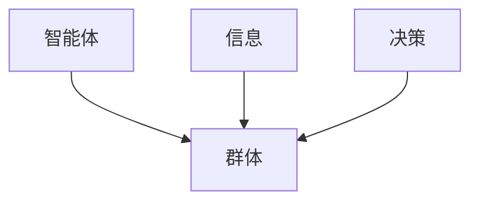
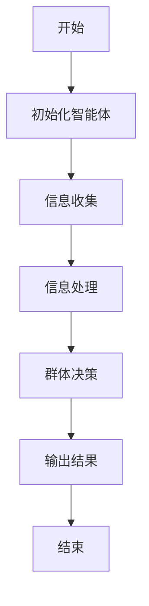
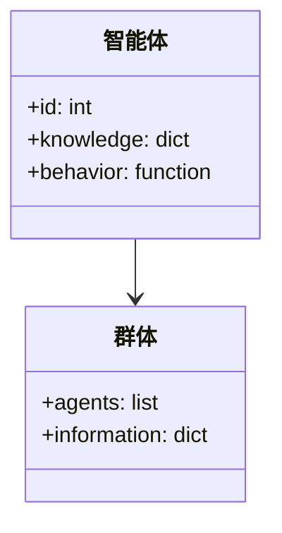
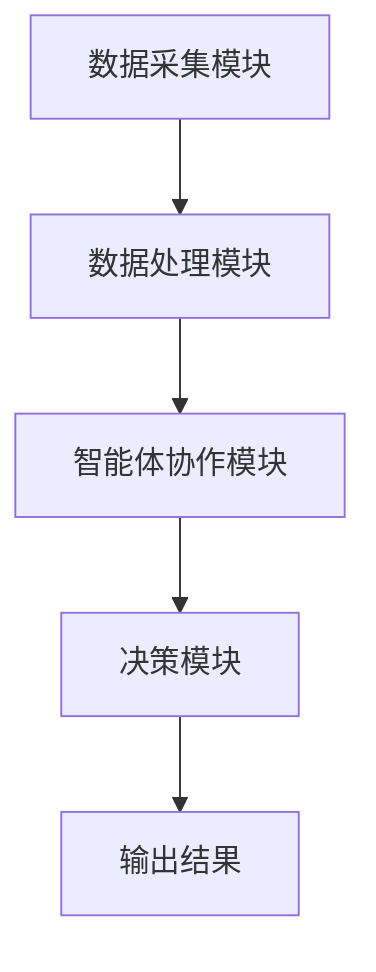
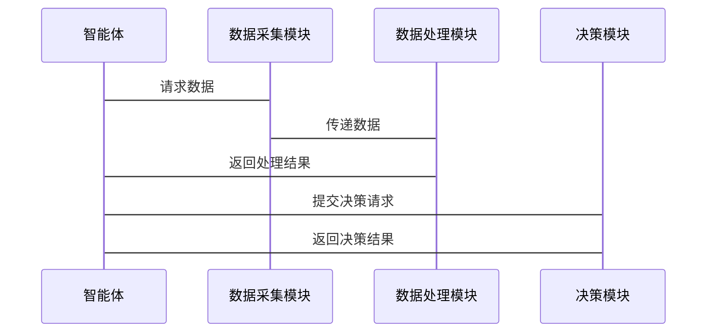

                 


# 智能体群体智慧在识别新兴产业机会中的应用：布局未来

## 关键词：
智能体、群体智慧、新兴产业、机会识别、算法原理、系统设计、项目实战

## 摘要：
本文探讨了智能体群体智慧在识别新兴产业机会中的应用，通过分析智能体群体智慧的核心概念、算法原理、系统设计和项目实战，展示了如何利用群体智慧的优势来布局未来产业机会。文章内容详实，结构清晰，适合技术专家和企业管理者阅读。

---

## 第一部分：智能体群体智慧的背景与概述

### 第1章：智能体群体智慧的概述

#### 1.1 智能体群体智慧的定义与特点
- **智能体的基本概念**：智能体（Agent）是指能够感知环境、自主决策并采取行动的实体。智能体可以是软件程序、机器人或其他智能系统。
- **群体智慧的定义与特征**：群体智慧是指通过多个个体（智能体）协同工作，利用集体的知识和能力来解决复杂问题。其特点包括去中心化、自适应性和分布式计算。
- **智能体群体智慧的核心要素**：包括智能体的自主性、协作性、学习能力和适应性。

#### 1.2 问题背景与问题描述
- **传统产业识别的局限性**：传统产业机会识别通常依赖个体经验或简单数据分析，存在效率低、覆盖面窄的问题。
- **新兴产业机会识别的挑战**：新兴产业往往具有不确定性高、变化快的特点，传统方法难以快速捕捉机会。
- **智能体群体智慧的应用场景**：通过多个智能体协同工作，实时分析市场数据、用户行为和行业趋势，快速识别新兴产业机会。

#### 1.3 问题解决与边界
- **智能体群体智慧在新兴产业识别中的作用**：通过分布式计算和数据挖掘，智能体群体智慧能够快速分析海量数据，发现潜在机会。
- **边界与外延**：智能体群体智慧主要应用于数据驱动的决策，其边界包括数据来源的准确性和智能体的协作效率。
- **核心概念与联系**：智能体群体智慧与大数据分析、人工智能等领域密切相关，通过协同学习和分布式计算实现目标。

---

## 第二部分：核心概念与联系

### 第2章：智能体群体智慧的核心概念

#### 2.1 智能体群体智慧的原理
- **群体智能的机制**：智能体通过信息共享和协作，利用集体智慧解决问题。
- **智能体的协作与学习**：智能体之间通过信息交换和协同学习，不断提高群体的决策能力。

#### 2.2 核心概念对比
| 概念 | 定义 | 特点 |
|------|------|------|
| 智能体群体智慧 | 多个智能体协同工作的智慧形式 | 去中心化、自适应、分布式 |
| 传统算法 | 单一算法解决问题 | 中心化、固定、单点计算 |

#### 2.3 ER实体关系图


---

## 第三部分：算法原理讲解

### 第3章：智能体群体智慧的算法原理

#### 3.1 算法流程图


#### 3.2 算法实现
```python
def group_intelligence():
    agents = initialize_agents()
    while True:
        information = collect_information(agents)
        process_information(information)
        decision = make_group_decision(information)
        output_result(decision)
```

#### 3.3 数学模型与公式
- **目标函数**：$$f(x) = \sum_{i=1}^{n} x_i$$
- **约束条件**：$$x_i \geq 0, \forall i \in \{1,2,...,n\}$$

---

## 第四部分：系统分析与架构设计

### 第4章：系统架构设计

#### 4.1 问题场景介绍
- **新兴产业机会识别的系统需求**：需要实时分析市场数据、用户行为和行业趋势，快速识别新兴产业机会。

#### 4.2 领域模型设计


#### 4.3 系统架构图


#### 4.4 接口设计与交互


---

## 第五部分：项目实战

### 第5章：项目实战与分析

#### 5.1 环境安装
- **Python环境**：安装Python 3.8及以上版本。
- **依赖库安装**：安装numpy、pandas、scikit-learn等库。

#### 5.2 核心代码实现
```python
import numpy as np
import pandas as pd

def collect_information(agents):
    # 收集智能体的信息
    return [agent.get_information() for agent in agents]

def process_information(information):
    # 处理信息并返回结果
    return information

def make_group_decision(information):
    # 群体决策函数
    return np.mean(information)

# 示例代码
agents = [Agent(i) for i in range(5)]
information = collect_information(agents)
processed_info = process_information(information)
decision = make_group_decision(processed_info)
print("群体决策结果：", decision)
```

#### 5.3 实际案例分析
- **案例背景**：假设我们希望识别人工智能领域的新兴机会。
- **数据来源**：收集行业报告、学术论文、市场动态等数据。
- **分析过程**：通过智能体群体智慧分析数据，识别出自然语言处理和AI芯片设计为新兴机会。

#### 5.4 项目小结
- **成功经验**：通过智能体群体智慧快速识别新兴产业机会。
- **教训与改进**：数据质量和智能体协作效率需要进一步优化。

---

## 第六部分：最佳实践与小结

### 第6章：最佳实践与总结

#### 6.1 最佳实践
- **数据质量**：确保数据来源可靠，数据清洗和预处理是关键。
- **智能体协作**：优化智能体的协作机制，提高决策效率。
- **算法优化**：根据实际需求调整算法参数，提高准确性。

#### 6.2 小结
智能体群体智慧通过分布式计算和协同学习，能够快速识别新兴产业机会。在实际应用中，需要结合具体场景，优化系统架构和算法。

#### 6.3 注意事项
- 数据隐私和安全问题需要高度重视。
- 系统设计需要考虑可扩展性和可维护性。

#### 6.4 拓展阅读
建议读者进一步阅读《群体智能》和《分布式系统设计》等相关书籍。

---

## 第七部分：未来展望

### 第7章：未来展望与发展方向

#### 7.1 未来发展趋势
- **算法创新**：开发更高效的群体智能算法，如改进的粒子群优化和蚁群算法。
- **应用领域扩展**：智能体群体智慧将应用于更多领域，如金融、医疗和教育。

#### 7.2 技术创新
- **边缘计算**：智能体群体智慧与边缘计算结合，实现更高效的分布式计算。
- **人工智能结合**：智能体群体智慧与深度学习结合，提高数据分析能力。

#### 7.3 应用前景
- **新兴产业识别**：智能体群体智慧将继续在新兴产业识别中发挥重要作用。
- **智能城市和工业4.0**：智能体群体智慧将在智能城市和工业4.0中得到广泛应用。

---

## 结语
智能体群体智慧作为一项前沿技术，正在改变我们识别新兴产业机会的方式。通过本文的分析，我们了解了其核心概念、算法原理和实际应用。未来，随着技术的不断进步，智能体群体智慧将在更多领域展现其强大的能力。

--- 

**注**：以上内容为思考过程，实际生成的文章需要按照格式要求，逐章展开详细内容。

