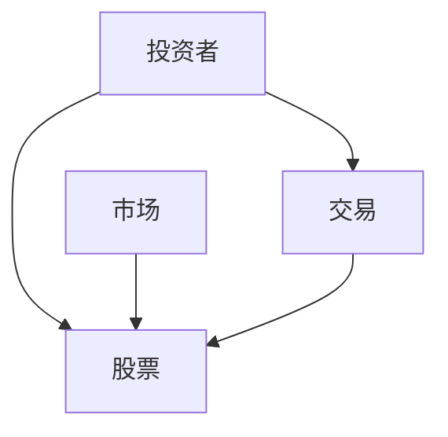

                 


# 智能体间博弈理论在价值投资策略优化中的应用

---

## 关键词：智能体间博弈，价值投资，策略优化，博弈论，投资策略

---

## 摘要

本文探讨了智能体间博弈理论在价值投资策略优化中的应用，通过分析智能体间的互动关系，构建基于博弈论的数学模型，提出了一种新的价值投资优化方法。文章首先介绍了智能体间博弈的背景与核心概念，详细阐述了博弈论模型与算法，构建了相关的数学模型，并通过项目实战验证了该方法的有效性，最后总结了研究的意义与未来展望。

---

## 第1章：问题背景与核心概念

### 1.1 智能体间博弈的背景介绍

#### 1.1.1 智能体（Agent）的定义与特点

智能体是指能够感知环境、做出决策并采取行动的实体。智能体可以是软件程序、机器人或其他能够自主决策的系统。智能体的特点包括：

- **自主性**：无需外部干预，自主决策。
- **反应性**：能够感知环境并实时响应。
- **目标导向性**：根据目标调整行为。

#### 1.1.2 博弈论的基本概念与分类

博弈论是研究多个参与者在冲突或合作情境下的决策理论。主要分类包括：

- **零和博弈**：一方获益，另一方必定损失。
- **非零和博弈**：各方的收益可以是零或非零。
- **完全信息博弈**：参与者完全了解所有信息。
- **不完全信息博弈**：参与者信息有限。

#### 1.1.3 价值投资的定义与特征

价值投资是一种通过分析资产的内在价值，寻找被市场低估的投资机会。其特征包括：

- **长期视角**：注重长期收益而非短期波动。
- **基本面分析**：基于财务数据和行业趋势做出决策。
- **逆向思维**：在市场恐慌时买入，市场疯狂时卖出。

### 1.2 价值投资策略的核心要素

#### 1.2.1 价值投资策略的优化目标

价值投资策略的优化目标在于提高投资回报率，降低风险，优化投资组合。

#### 1.2.2 智能体间博弈与价值投资的结合点

智能体间博弈在价值投资中的应用主要体现在：

- **价格形成机制**：多个智能体的互动影响资产价格。
- **策略优化**：通过博弈论模型优化投资策略。

### 1.3 问题描述与目标

#### 1.3.1 智能体间博弈在投资中的问题

- 智能体行为的不确定性。
- 市场信息的不完全性。

#### 1.3.2 价值投资策略优化的挑战

- 如何在复杂市场环境中优化投资策略。
- 如何量化智能体行为对投资的影响。

#### 1.3.3 本研究的目标与意义

目标是构建基于智能体间博弈的数学模型，优化价值投资策略。意义在于提高投资效率，降低风险。

### 1.4 边界与外延

#### 1.4.1 智能体间博弈的边界条件

- 参与者的理性假设。
- 信息的完全性。

#### 1.4.2 价值投资策略的适用范围

适用于股票、基金等金融资产。

#### 1.4.3 相关概念的对比与区分

| 概念 | 定义 |
|------|------|
| 智能体间博弈 | 多个智能体的互动决策 |
| 价值投资 | 基于内在价值的投资策略 |

### 1.5 核心概念与联系

#### 1.5.1 智能体间博弈的核心原理

智能体通过博弈论模型进行互动，最终达到纳什均衡。

#### 1.5.2 智能体间博弈与价值投资的关系

智能体间的博弈影响市场定价，从而影响价值投资策略。

#### 1.5.3 ER实体关系图架构



---

## 第2章：博弈论模型与算法

### 2.1 博弈论模型的数学表达

#### 2.1.1 纳什均衡的定义与性质

纳什均衡是指在参与者策略组合中，每个参与者采取最优策略，无法通过单方面改变策略而获益。

#### 2.1.2 博弈树与收益矩阵的构建

博弈树展示决策过程，收益矩阵展示各策略组合的收益。

### 2.2 智能体间博弈的算法实现

#### 2.2.1 纳什均衡的计算方法

使用迭代算法求解纳什均衡，例如采用简化模型。

### 2.3 价值投资策略的优化算法

#### 2.3.1 基于博弈论的价值评估模型

构建数学模型，量化智能体行为对资产价值的影响。

---

## 第3章：博弈论与价值投资的数学模型

### 3.1 博弈论基本公式

纳什均衡的数学表达式：

$$
\text{纳什均衡条件：对于任意策略组合 } (s_i, s_{-i}), \text{ 每个玩家 } i \text{ 的策略 } s_i \text{ 是最优反应。}
$$

### 3.2 价值投资策略的数学公式

构建优化模型，例如：

$$
\text{最大化收益：} \sum_{i=1}^n r_i \times w_i
$$

$$
\text{最小化风险：} \sum_{i=1}^n (r_i - \bar{r})^2 \times w_i
$$

---

## 第4章：系统分析与架构设计方案

### 4.1 系统功能设计

构建智能体间博弈的系统，包括数据采集、策略优化、结果分析。

### 4.2 系统架构设计

使用分层架构，展示各模块的交互。

---

## 第5章：项目实战

### 5.1 环境安装

安装必要的库，如numpy、pandas。

### 5.2 核心代码实现

编写博弈模型和价值评估的代码，如：

```python
import numpy as np
import pandas as pd

def nash_equilibrium(players, strategies):
    # 简化模型计算纳什均衡
    pass
```

### 5.3 案例分析

以股票市场为例，分析优化后的投资策略效果。

### 5.4 项目小结

总结项目成果，分析优化效果。

---

## 第6章：总结与展望

### 6.1 研究总结

总结研究成果，强调智能体间博弈在价值投资中的应用。

### 6.2 未来展望

提出未来研究方向，如多智能体博弈的复杂场景。

---

## 第7章：最佳实践与注意事项

### 7.1 最佳实践 tips

- 定期更新模型。
- 注意数据质量。

### 7.2 小结

总结全文，强调智能体间博弈的重要性。

### 7.3 注意事项

- 风险管理。
- 模型调优。

### 7.4 拓展阅读

推荐相关书籍和文献。

---

## 参考文献

列出相关的学术论文和书籍。

---

## 附录

提供代码和数据的具体细节。

---

**全文完**

