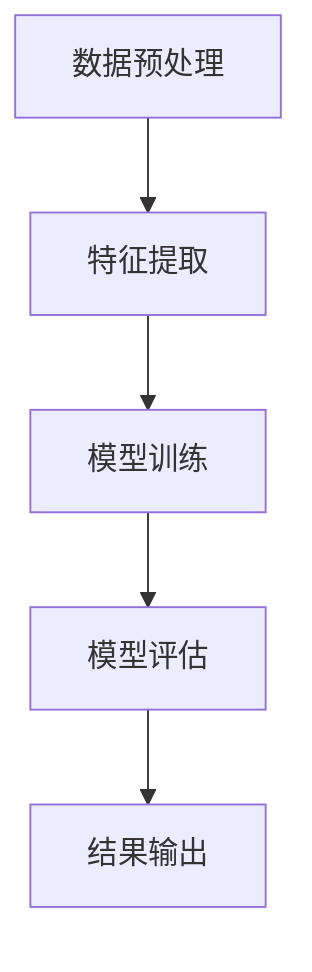

                 


# 智能供应链金融风险预警

## 关键词：
智能供应链金融、风险预警、机器学习、供应链管理、金融风险

## 摘要：
智能供应链金融风险预警是一种利用人工智能和大数据技术，对供应链金融中的潜在风险进行实时监测和预警的方法。本文将从供应链金融的基本概念出发，深入探讨其核心概念、风险特征以及智能预警的实现方法。通过分析供应链金融中的主要风险类型，结合机器学习算法，提出一种基于逻辑回归和随机森林的双重模型，用于供应链金融风险的智能预警。本文还详细介绍了算法的实现过程，包括数据预处理、特征提取、模型训练和评估，并通过实际案例分析展示了模型的应用效果。

---

# 第一部分: 智能供应链金融风险预警概述

## 第1章: 智能供应链金融的背景与意义

### 1.1 供应链金融的定义与特点
供应链金融是指银行或其他金融机构通过整合供应链上下游企业的信息，为企业提供融资服务的一种金融模式。其核心特点包括：
- **数据驱动**：依赖供应链中的数据流和信息流。
- **多方参与**：涉及供应商、客户、银行等多方主体。
- **动态风险**：供应链中的风险具有动态变化的特点。

### 1.2 供应链金融中的风险特征
供应链金融中的主要风险包括：
- **信用风险**：企业违约的可能性。
- **操作风险**：操作过程中的失误或欺诈行为。
- **市场风险**：市场价格波动对供应链的影响。

### 1.3 智能供应链金融的优势
智能供应链金融通过引入人工智能技术，能够实现以下优势：
- **实时监控**：对供应链中的风险进行实时监测。
- **精准预测**：基于历史数据和机器学习算法，精准预测潜在风险。
- **自动化预警**：当风险超过阈值时，自动触发预警机制。

---

# 第二部分: 供应链金融风险预警的核心概念与技术

## 第2章: 供应链金融风险预警的核心概念

### 2.1 供应链金融中的实体关系
供应链金融涉及的主要实体包括：
- 供应商：提供原材料或服务的企业。
- 制造商：生产产品的核心企业。
- 分销商：负责产品销售的渠道。
- 银行或其他金融机构：提供融资服务的机构。

#### ER图展示
```mermaid
erDiagram
    actor 供应商 {
        key 唯一标识符
        属性 信用评分、历史交易记录
    }
    actor 制造商 {
        key 唯一标识符
        属性 企业规模、生产能力
    }
    actor 分销商 {
        key �唯一标识符
        属性 销售额、市场占有率
    }
    actor 银行 {
        key 唯一标识符
        属性 贷款余额、违约记录
    }
    供应商 --> 制造商 : 供应原材料
    制造商 --> 分销商 : 提供产品
    分销商 --> 银行 : 融资需求
    制造商 --> 银行 : 贷款申请
```

### 2.2 供应链金融风险预警的属性特征对比
| 风险类型 | 核心属性 | 关键指标 | 数据来源 |
|----------|----------|----------|----------|
| 信用风险 | 企业信用评分 | 贷款违约率 | 企业历史交易数据 |
| 操作风险 | 操作流程合规性 | 操作失误率 | 系统日志数据 |
| 市场风险 | 市场波动敏感度 | 市场价格波动率 | 市场数据和新闻 |

### 2.3 供应链金融风险预警的关键技术
- 数据挖掘：从海量数据中提取有价值的信息。
- 机器学习：用于风险预测和分类。
- 时间序列分析：分析历史数据中的趋势和周期性。

---

# 第三部分: 供应链金融风险预警的算法原理

## 第3章: 供应链金融风险预警的算法概述

### 3.1 常见的风险预警算法
#### 1. 逻辑回归
逻辑回归是一种用于分类的经典算法，适用于二分类问题。其核心公式为：
$$ P(y=1|x) = \frac{e^{\beta x + \beta_0}}{1 + e^{\beta x + \beta_0}} $$

#### 2. 随机森林
随机森林是一种基于决策树的集成算法，具有较高的准确性和鲁棒性。其核心步骤包括：
1. 随机抽取样本和特征，构建多棵决策树。
2. 对每个样本进行投票，得到最终分类结果。

#### 3. 时间序列分析
时间序列分析用于分析数据的时序特性，常用ARIMA模型：
$$ ARIMA(p, d, q) $$

### 3.2 算法实现流程


### 3.3 基于机器学习的风险预警模型
#### 1. 逻辑回归模型
逻辑回归适用于二分类问题，如违约与非违约分类。

#### 2. 随机森林模型
随机森林能够处理高维数据，适合多分类问题。

---

# 第四部分: 供应链金融风险预警的数学模型与公式

## 第4章: 供应链金融风险预警的数学模型

### 4.1 逻辑回归模型
逻辑回归的目标函数为：
$$ \text{损失函数} = -\frac{1}{m} \sum_{i=1}^m [y_i \ln h(x_i) + (1 - y_i) \ln (1 - h(x_i))] $$

其中，$$ h(x_i) = \frac{e^{\beta x_i + \beta_0}}{1 + e^{\beta x_i + \beta_0}} $$

### 4.2 随机森林模型
随机森林的损失函数为Gini指数：
$$ Gini = \sum_{k=1}^K p_k (1 - p_k) $$

其中，$$ p_k $$ 是第k个类别的概率。

---

# 第五部分: 供应链金融风险预警的系统设计与实现

## 第5章: 供应链金融风险预警系统的架构设计

### 5.1 系统功能设计
系统功能包括：
- 数据采集：从供应链各环节获取数据。
- 风险评估：基于机器学习模型进行风险评估。
- 风险预警：根据评估结果触发预警。

### 5.2 系统架构设计


### 5.3 系统接口设计
系统接口包括：
- 数据接口：与供应链各环节系统对接。
- 用户接口：供用户查询风险评估结果。

---

# 第六部分: 供应链金融风险预警的项目实战

## 第6章: 项目实战

### 6.1 环境安装
需要安装以下库：
- Python 3.8+
- TensorFlow 2.0+
- scikit-learn 0.20+

### 6.2 核心代码实现
```python
import pandas as pd
import numpy as np
from sklearn.model_selection import train_test_split
from sklearn.metrics import accuracy_score
from sklearn.ensemble import RandomForestClassifier
from sklearn.linear_model import LogisticRegression

# 数据加载与预处理
data = pd.read_csv('supply_chain_data.csv')
X = data.drop('target', axis=1)
y = data['target']

# 数据分割
X_train, X_test, y_train, y_test = train_test_split(X, y, test_size=0.2, random_state=42)

# 模型训练
lr_model = LogisticRegression()
lr_model.fit(X_train, y_train)

rf_model = RandomForestClassifier(n_estimators=100, random_state=42)
rf_model.fit(X_train, y_train)

# 模型预测与评估
y_pred_lr = lr_model.predict(X_test)
y_pred_rf = rf_model.predict(X_test)

print("逻辑回归准确率:", accuracy_score(y_test, y_pred_lr))
print("随机森林准确率:", accuracy_score(y_test, y_pred_rf))
```

### 6.3 案例分析
以某制造企业为例，预测其违约风险。通过模型预测，发现其违约概率为70%，触发预警机制，提醒银行采取相应的风险控制措施。

---

# 第七部分: 总结与展望

## 第7章: 总结与展望

### 7.1 本章总结
本文详细介绍了智能供应链金融风险预警的核心概念、算法原理和系统设计，并通过实际案例展示了模型的应用效果。通过对比不同算法的优缺点，提出了基于逻辑回归和随机森林的双重模型，能够有效提高风险预警的准确性。

### 7.2 最佳实践 tips
- 数据质量是模型准确性的关键。
- 模型调优需要结合业务场景。
- 持续监控模型性能，及时更新数据和参数。

### 7.3 小结
智能供应链金融风险预警是人工智能与金融结合的重要应用之一，未来随着技术的不断发展，其应用前景将更加广阔。

### 7.4 注意事项
- 数据隐私保护是系统设计中的重要环节。
- 模型的解释性需要结合业务知识。

### 7.5 拓展阅读
建议读者进一步学习供应链管理、机器学习和金融风险管理的相关知识，以更好地理解和应用智能供应链金融风险预警技术。

---

以上是《智能供应链金融风险预警》的技术博客文章的详细目录和内容概述。

