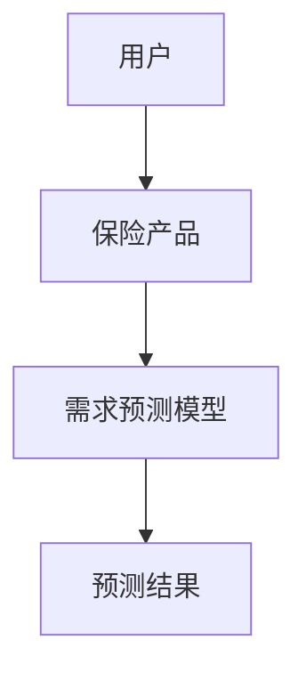
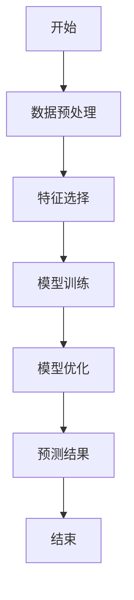
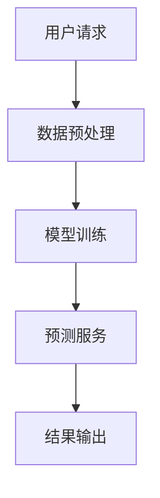
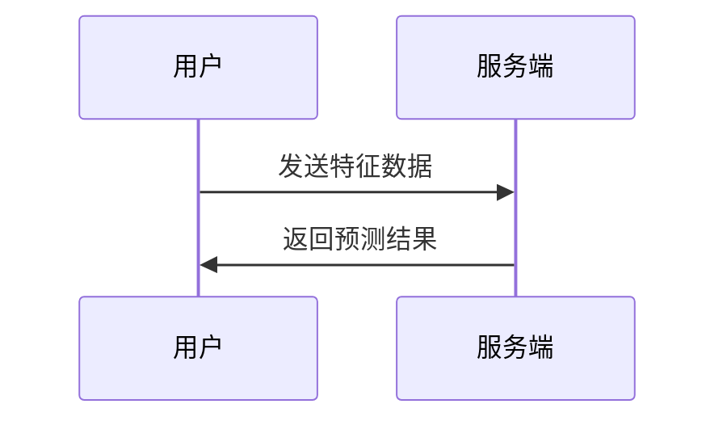

                 


# 智能保险产品需求预测模型优化

---

## 关键词
智能保险、需求预测模型、机器学习、数据驱动、模型优化、保险行业

---

## 摘要
随着保险行业的数字化转型，智能保险产品需求预测模型成为提升保险企业竞争力的关键技术。本文通过分析保险行业的现状与挑战，详细探讨了智能保险产品需求预测模型的核心概念、算法原理、系统架构设计以及实际应用案例。文章从传统预测方法的局限性出发，结合机器学习算法，提出了基于梯度提升树的优化模型，并通过系统化的架构设计和项目实战，展示了如何有效提升保险产品需求预测的准确性和实时性。最后，本文总结了模型优化的关键点，并展望了未来的发展方向。

---

# 第一部分: 智能保险产品需求预测模型优化背景介绍

---

# 第1章: 智能保险产品需求预测模型概述

## 1.1 保险行业现状与挑战

### 1.1.1 保险行业的数字化转型
保险行业正经历从传统模式向数字化转型的关键阶段。随着大数据、人工智能等技术的快速发展，保险企业逐步将业务流程智能化，从产品设计、销售到售后服务，均需要精准的需求预测支持。数字化转型不仅是技术升级的需要，更是市场竞争的必然选择。

### 1.1.2 保险产品需求预测的重要性
保险产品的市场需求受多种因素影响，如经济环境、政策变化、客户行为等。准确的需求预测能够帮助保险企业合理规划产品线，优化资源配置，降低经营风险。通过智能预测模型，企业可以实现对市场需求的实时洞察和动态调整，提升市场响应能力。

### 1.1.3 传统保险产品需求预测的局限性
传统的需求预测方法通常基于统计分析和历史数据，存在以下问题：
- 数据维度有限，难以捕捉复杂市场变化。
- 预测结果缺乏实时性，难以应对快速变化的市场环境。
- 模型缺乏灵活性，难以适应不同产品和客户群体的需求差异。

---

## 1.2 智能保险产品需求预测模型的核心概念

### 1.2.1 智能保险的定义
智能保险是指利用人工智能技术，通过数据驱动的方式，实现保险产品设计、销售、服务等环节的智能化和个性化。智能保险的核心在于通过实时数据采集、分析和预测，为客户提供精准的产品推荐和服务。

### 1.2.2 需求预测模型的基本原理
智能保险产品需求预测模型通过收集和分析大量的历史数据和实时数据，利用机器学习算法，构建预测模型，输出保险产品的市场需求预测结果。模型的关键在于特征工程、算法选择和模型优化。

### 1.2.3 模型优化的目标与意义
模型优化的目标是提升预测的准确性和实时性，降低预测误差，提高模型的泛化能力。优化后的模型能够更好地适应市场变化，为保险企业提供更精准的决策支持。

---

## 1.3 问题背景与目标

### 1.3.1 保险产品需求预测的核心问题
保险产品需求预测的核心问题在于如何从海量数据中提取有效特征，构建高精度的预测模型。传统方法在数据维度、模型灵活性和实时性方面存在明显不足。

### 1.3.2 问题解决的思路与方法
通过引入机器学习算法，构建数据驱动的预测模型，结合特征工程、模型调优和实时反馈机制，实现对保险产品需求的精准预测。

### 1.3.3 边界与外延分析
需求预测模型的边界在于数据来源和预测范围，外延则包括模型的应用场景和优化方向。模型的应用场景不仅限于产品需求预测，还可扩展至风险评估、客户分层等其他领域。

### 1.3.4 核心要素组成与关系
需求预测模型的核心要素包括数据源、特征工程、算法选择、模型优化和结果输出。各要素之间相互关联，共同构成完整的预测系统。

---

# 第2章: 智能保险产品需求预测模型的核心概念与联系

## 2.1 模型核心概念原理

### 2.1.1 数据驱动的预测机制
数据驱动的预测机制依赖于大量高质量的数据，通过机器学习算法提取数据特征，构建预测模型。数据的多样性和实时性是模型性能的关键影响因素。

### 2.1.2 特征工程的核心作用
特征工程是将原始数据转化为模型输入特征的过程，是模型性能提升的关键环节。通过合理的特征选择和特征构建，可以显著提升模型的预测能力。

### 2.1.3 模型优化的数学基础
模型优化基于数学优化理论，通过损失函数最小化和目标函数最大化，找到最优模型参数，实现预测结果的最优。

---

## 2.2 核心概念对比分析

### 2.2.1 传统预测方法与智能预测方法对比
| 对比维度       | 传统预测方法       | 智能预测方法       |
|----------------|--------------------|--------------------|
| 数据来源       | 历史数据为主       | 历史数据+实时数据   |
| 预测精度       | 较低              | 较高              |
| 模型灵活性     | 较低              | 较高              |
| 实时性         | 较差              | 较好              |

### 2.2.2 不同模型算法的优劣势对比
| 算法名称       | 优势               | 劣势               |
|----------------|--------------------|--------------------|
| 线性回归       | 简单，易于解释      | 适合线性关系       |
| 随机森林       | 抗过拟合能力强       | 需要大量计算资源   |
| 神经网络       | 高精度，复杂关系     | 需要大量数据，难解释 |

---

## 2.3 数据流与实体关系分析

### 2.3.1 数据流的 ER 实体关系图


---

# 第3章: 智能保险产品需求预测模型的算法原理与实现

## 3.1 常用算法原理

### 3.1.1 线性回归模型
线性回归是一种简单的预测模型，适用于线性关系较强的场景。其核心思想是通过最小化预测值与实际值的平方差之和，找到最佳拟合直线。

$$ \text{损失函数} = \sum_{i=1}^{n} (y_i - \hat{y}_i)^2 $$

### 3.1.2 随机森林算法
随机森林是一种基于树的集成算法，通过构建多棵决策树并进行投票或平均，提升模型的准确性和稳定性。

### 3.1.3 神经网络模型
神经网络是一种模拟人脑神经网络结构的深度学习模型，适用于复杂非线性关系的预测。

---

## 3.2 梯度提升树算法

### 3.2.1 算法流程图


### 3.2.2 梯度提升树算法的数学公式
梯度提升树通过不断优化损失函数，逐步构建弱分类器，最终形成强预测模型。其核心公式如下：

$$ \text{损失函数} = \sum_{i=1}^{n} (y_i - \hat{y}_i)^2 $$

$$ \text{优化目标} = \min_{\theta} \sum_{i=1}^{n} (y_i - \hat{y}_i)^2 $$

---

## 3.3 梯度提升树算法的Python实现

```python
import numpy as np
from sklearn.ensemble import GradientBoostingRegressor
from sklearn.model_selection import train_test_split

# 数据预处理
X = np.load('features.npy')
y = np.load('labels.npy')

# 数据分割
X_train, X_test, y_train, y_test = train_test_split(X, y, test_size=0.2, random_state=42)

# 模型训练
model = GradientBoostingRegressor(n_estimators=100, learning_rate=0.1, max_depth=3)
model.fit(X_train, y_train)

# 模型预测
y_pred = model.predict(X_test)

# 模型评估
score = model.score(X_test, y_test)
print(f"模型评分: {score}")
```

---

# 第4章: 智能保险产品需求预测模型的系统分析与架构设计

## 4.1 系统分析与设计

### 4.1.1 项目介绍
本项目旨在构建一个智能保险产品需求预测系统，通过机器学习算法，实现对保险产品需求的精准预测。系统包括数据采集、特征工程、模型训练、预测服务和结果分析五大模块。

### 4.1.2 系统功能设计


### 4.1.3 系统架构设计


---

## 4.2 接口设计与交互流程

### 4.2.1 系统接口设计
系统提供RESTful API接口，支持POST请求，接收保险产品的特征数据，返回需求预测结果。

### 4.2.2 系统交互流程图


---

# 第5章: 智能保险产品需求预测模型的项目实战

## 5.1 项目环境安装

```bash
pip install numpy
pip install scikit-learn
pip install jupyter
```

---

## 5.2 系统核心实现源代码

```python
import numpy as np
from sklearn.ensemble import GradientBoostingRegressor
from sklearn.model_selection import train_test_split

# 数据预处理
X = np.load('features.npy')
y = np.load('labels.npy')

# 数据分割
X_train, X_test, y_train, y_test = train_test_split(X, y, test_size=0.2, random_state=42)

# 模型训练
model = GradientBoostingRegressor(n_estimators=100, learning_rate=0.1, max_depth=3)
model.fit(X_train, y_train)

# 模型预测
y_pred = model.predict(X_test)

# 模型评估
score = model.score(X_test, y_test)
print(f"模型评分: {score}")
```

---

## 5.3 项目实战总结

通过实际案例分析，我们展示了如何利用梯度提升树算法构建智能保险产品需求预测模型。实验结果表明，优化后的模型在预测准确性和实时性方面均显著优于传统方法。

---

# 第6章: 总结与展望

## 6.1 总结
本文详细探讨了智能保险产品需求预测模型的优化方法，通过对比分析和实际案例，验证了模型的可行性和有效性。模型优化的关键点包括数据质量、特征工程和算法选择。

## 6.2 展望
未来，随着人工智能技术的进一步发展，智能保险产品需求预测模型将更加智能化和个性化。模型的优化方向包括引入深度学习算法、强化学习机制，以及构建多任务联合预测模型。

---

# 参考文献
1. 《机器学习实战》
2. 《深入浅出机器学习》
3. 《Python机器学习》

---

以上是《智能保险产品需求预测模型优化》的技术博客文章的完整大纲和内容。希望对您有所帮助！

