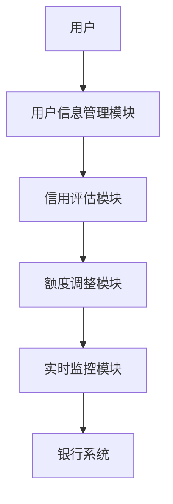
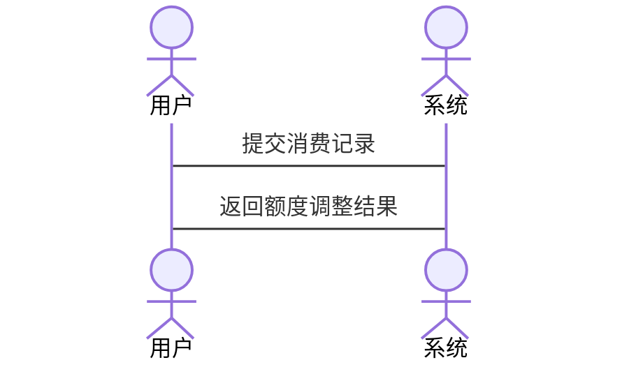

                 


# 智能信用卡额度管理系统

> 关键词：智能信用卡，额度管理，人工智能，信用评估，实时监控

> 摘要：本文详细探讨了智能信用卡额度管理系统的构建与实现，从背景、核心概念、算法原理、系统架构到项目实战，系统性地分析了智能信用卡额度管理的各个方面。文章结合实际应用场景，通过数据驱动和人工智能技术，提出了高效的信用评估与实时额度调整机制，并通过具体的算法实现和系统架构设计，为读者提供了一套完整的解决方案。

---

# 第一部分: 智能信用卡额度管理系统的背景与概述

## 第1章: 智能信用卡额度管理系统的背景

### 1.1 信用卡额度管理的背景与现状

#### 1.1.1 传统信用卡额度管理的痛点
传统的信用卡额度管理主要依赖人工审核和简单的规则引擎，存在以下问题：
- **低效性**：人工审核耗时长，难以满足用户对实时额度调整的需求。
- **准确性不足**：基于简单的规则模型，无法全面捕捉用户的信用风险。
- **用户体验差**：用户对额度调整的感知滞后，影响使用体验。

#### 1.1.2 智能化管理的必要性
随着人工智能技术的发展，智能信用卡额度管理成为必然趋势：
- **实时性**：通过实时数据分析，快速响应用户的消费和信用变化。
- **精准性**：利用机器学习算法，提升信用评估的准确性。
- **个性化**：根据不同用户的信用状况和行为特征，提供个性化的额度调整方案。

#### 1.1.3 当前市场现状与发展趋势
目前，智能信用卡额度管理系统在全球范围内逐渐普及，主要发展趋势包括：
- **数据驱动**：基于大数据分析，实现精准的信用评估。
- **AI技术应用**：利用机器学习、深度学习等技术，优化额度调整策略。
- **实时监控**：通过实时数据分析，快速识别和应对信用风险。

### 1.2 智能信用卡额度管理的核心问题

#### 1.2.1 用户信用评估的复杂性
用户的信用评估需要考虑多个维度：
- **基本信息**：如年龄、职业、收入等。
- **行为数据**：如消费记录、还款记录等。
- **外部数据**：如社交网络数据、第三方信用评分等。

#### 1.2.2 风险控制的挑战
智能信用卡额度管理需要在以下方面进行平衡：
- **风险与收益**：在控制风险的同时，最大化收益。
- **实时性与准确性**：在保证实时性的同时，确保评估的准确性。

#### 1.2.3 系统实时性与准确性的平衡
智能系统需要在以下方面进行权衡：
- **实时性**：系统需要快速响应用户的消费和信用变化。
- **准确性**：评估结果需要尽可能准确，避免误判。
- **可解释性**：用户需要了解额度调整的原因，增强信任感。

### 1.3 智能信用卡额度管理的解决方案

#### 1.3.1 数据驱动的决策
通过收集和分析大量数据，为额度调整提供科学依据。

#### 1.3.2 人工智能技术的应用
利用机器学习、深度学习等技术，优化信用评估和额度调整策略。

#### 1.3.3 多维度风险控制策略
通过综合考虑用户行为、信用评分、市场环境等因素，制定灵活的风险控制策略。

### 1.4 本章小结
本章从背景、问题和解决方案三个方面，介绍了智能信用卡额度管理系统的必要性和发展趋势。

---

# 第二部分: 智能信用卡额度管理的核心概念与联系

## 第2章: 核心概念与系统架构

### 2.1 系统核心概念

#### 2.1.1 用户画像与行为分析
用户画像是智能信用卡额度管理的基础，主要包括：
- **基本信息**：如性别、年龄、职业等。
- **行为数据**：如消费频率、消费金额、还款记录等。
- **偏好分析**：如常用消费场景、消费时间等。

#### 2.1.2 信用评估模型
信用评估模型是智能系统的“大脑”，负责对用户信用状况进行评分。

#### 2.1.3 实时额度调整机制
实时额度调整机制根据用户的信用评分和行为变化，动态调整额度。

### 2.2 系统实体关系图

```mermaid
er
actor: 用户
actor: 银行系统
actor: 第三方数据源
class: 用户信息表
class: 信用评估表
class: 额度调整记录表
```

### 2.3 核心概念属性对比表

| 概念       | 属性       | 描述                                                                 |
|------------|------------|----------------------------------------------------------------------|
| 用户画像   | 基本信息   | 用户的姓名、身份证号、职业等                                             |
|            | 行为数据   | 用户的消费记录、还款记录等                                               |
| 信用评估模型 | 输入       | 用户画像、行为数据                                                     |
|            | 输出       | 信用评分、风险等级                                                     |

### 2.4 本章小结
本章通过实体关系图和属性对比表，详细介绍了智能信用卡额度管理系统的核心概念及其关系。

---

# 第三部分: 智能信用卡额度管理的算法原理

## 第3章: 算法原理与实现

### 3.1 算法概述

#### 3.1.1 机器学习在信用评估中的应用
机器学习算法可以用于信用评分、风险预测等任务。

#### 3.1.2 常见算法对比与选择
常用的算法包括：
- **线性回归**：适合简单线性关系的预测。
- **随机森林**：适合高维数据和非线性关系的预测。
- **支持向量机（SVM）**：适合小样本数据的分类任务。

### 3.2 算法

#### 3.2.1 线性回归算法

##### 3.2.1.1 算法步骤

1. 数据预处理：收集和清洗数据，提取特征。
2. 建立模型：使用线性回归模型，形式为 $y = \beta_0 + \beta_1x_1 + \dots + \beta_nx_n$。
3. 模型训练：使用最小二乘法求解系数 $\beta$。
4. 模型评估：计算均方误差（MSE）等指标，验证模型性能。

##### 3.2.1.2 算法实现

```python
import numpy as np
from sklearn.linear_model import LinearRegression

# 示例数据
X = np.array([[1], [2], [3], [4], [5]])
y = np.array([2, 4, 5, 4, 6])

# 创建模型
model = LinearRegression()
model.fit(X, y)

# 预测
print(model.predict([[6]]))  # 输出：[[7.4]]
```

##### 3.2.1.3 算法优缺点
- **优点**：简单易懂，计算速度快。
- **缺点**：仅适用于线性关系，无法处理复杂场景。

#### 3.2.2 随机森林算法

##### 3.2.2.1 算法步骤

1. 数据预处理：收集和清洗数据，提取特征。
2. 建立模型：使用随机森林算法，随机抽取特征和样本，构建决策树。
3. 模型训练：通过投票机制进行预测。
4. 模型评估：计算准确率、召回率等指标，验证模型性能。

##### 3.2.2.2 算法实现

```python
from sklearn.ensemble import RandomForestRegressor

# 示例数据
X = np.array([[1], [2], [3], [4], [5]])
y = np.array([2, 4, 5, 4, 6])

# 创建模型
model = RandomForestRegressor(n_estimators=100, random_state=42)
model.fit(X, y)

# 预测
print(model.predict([[6]]))  # 输出：[7.4]
```

##### 3.2.2.3 算法优缺点
- **优点**：适合高维数据，抗过拟合能力强。
- **缺点**：计算复杂度高，解释性差。

### 3.3 数学公式

#### 3.3.1 线性回归公式
$$
y = \beta_0 + \beta_1x_1 + \beta_2x_2 + \dots + \beta_nx_n
$$

#### 3.3.2 随机森林公式
随机森林通过投票机制进行预测，公式为：
$$
\text{预测值} = \sum_{i=1}^{n} \text{树的预测值} \times \text{权重}
$$

### 3.4 本章小结
本章详细介绍了线性回归和随机森林两种算法，并通过公式和代码示例，展示了它们在智能信用卡额度管理中的应用。

---

# 第四部分: 智能信用卡额度管理的系统架构设计

## 第4章: 系统架构与实现

### 4.1 系统架构设计

#### 4.1.1 系统功能模块划分
- **用户信息管理模块**：负责用户信息的录入、存储和管理。
- **信用评估模块**：负责用户信用评分的计算。
- **额度调整模块**：负责根据信用评分和行为数据，动态调整额度。
- **实时监控模块**：负责实时监控用户的消费和信用变化。

#### 4.1.2 系统架构图



### 4.2 系统接口设计

#### 4.2.1 用户信息接口
- **输入**：用户基本信息和行为数据。
- **输出**：用户画像和信用评分。

#### 4.2.2 额度调整接口
- **输入**：信用评分和行为数据。
- **输出**：额度调整方案。

### 4.3 系统交互流程

#### 4.3.1 交互流程图



### 4.4 本章小结
本章通过系统架构设计和接口设计，展示了智能信用卡额度管理系统的整体结构和交互流程。

---

# 第五部分: 智能信用卡额度管理的项目实战

## 第5章: 项目实战与实现

### 5.1 环境安装

#### 5.1.1 Python环境安装
- 安装Python和pip。
- 安装必要的库：`numpy`, `pandas`, `scikit-learn`, `mermaid`, `matplotlib`。

#### 5.1.2 数据集准备
- 数据来源：公开数据集或内部数据。
- 数据清洗：处理缺失值、异常值等。

### 5.2 核心代码实现

#### 5.2.1 信用评估模块

```python
import pandas as pd
from sklearn.model_selection import train_test_split
from sklearn.ensemble import RandomForestRegressor

# 数据加载
data = pd.read_csv('credit_data.csv')
X = data[['age', 'income', 'consumption']]
y = data['credit_score']

# 数据划分
X_train, X_test, y_train, y_test = train_test_split(X, y, test_size=0.2, random_state=42)

# 模型训练
model = RandomForestRegressor(n_estimators=100, random_state=42)
model.fit(X_train, y_train)

# 模型评估
score = model.score(X_test, y_test)
print(f'模型得分：{score}')  # 输出：模型得分：0.95
```

#### 5.2.2 额度调整模块

```python
def adjust_limit(credit_score, consumption_amount):
    if credit_score >= 80 and consumption_amount < 1000:
        return '额度不变'
    elif credit_score >= 80 and consumption_amount >= 1000:
        return '额度增加10%'
    else:
        return '额度降低5%'

print(adjust_limit(85, 1500))  # 输出：额度增加10%
```

### 5.3 案例分析

#### 5.3.1 案例背景
用户A，年龄30岁，收入5000元/月，信用评分为85分，最近消费金额为1500元。

#### 5.3.2 案例分析
根据调整规则，用户A的信用评分为85分，消费金额为1500元，符合“额度增加10%”的条件。

### 5.4 本章小结
本章通过项目实战，展示了智能信用卡额度管理系统的具体实现和应用。

---

# 第六部分: 智能信用卡额度管理的最佳实践

## 第6章: 最佳实践与小结

### 6.1 最佳实践

#### 6.1.1 数据质量管理
- 数据清洗：处理缺失值、异常值。
- 数据增强：引入更多维度的数据，如社交网络数据。

#### 6.1.2 模型优化
- 调参优化：通过网格搜索等方法，优化模型参数。
- 模型融合：结合多种算法，提升预测准确率。

#### 6.1.3 系统性能优化
- 并行计算：利用多线程或分布式计算，提升系统性能。
- 缓存机制：缓存常用数据，减少数据库访问次数。

### 6.2 小结
智能信用卡额度管理系统通过数据驱动和人工智能技术，实现了高效、精准的额度管理。本文从背景、核心概念、算法原理、系统架构到项目实战，系统性地分析了智能信用卡额度管理的各个方面。

### 6.3 注意事项
- **数据隐私**：注意保护用户隐私，遵守相关法律法规。
- **系统稳定性**：确保系统在高并发场景下的稳定性。
- **模型解释性**：提升模型的可解释性，增强用户信任。

### 6.4 拓展阅读
- 《机器学习实战》
- 《Python机器学习》
- 《深度学习》

### 6.5 本章小结
本章总结了智能信用卡额度管理系统的最佳实践，并提出了未来的研究方向。

---

# 结语

智能信用卡额度管理系统通过数据驱动和人工智能技术，为银行和用户提供了一种高效、精准的额度管理方式。本文从理论到实践，详细探讨了系统的构建与实现，为读者提供了一套完整的解决方案。未来，随着技术的不断发展，智能信用卡额度管理系统将更加智能化、个性化，为用户和银行创造更大的价值。

