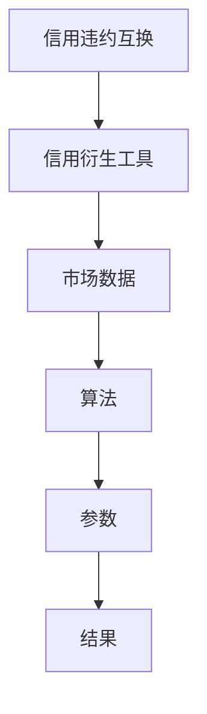
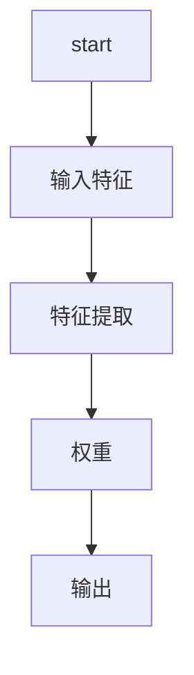
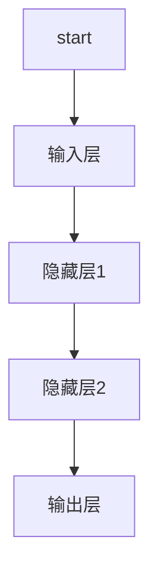
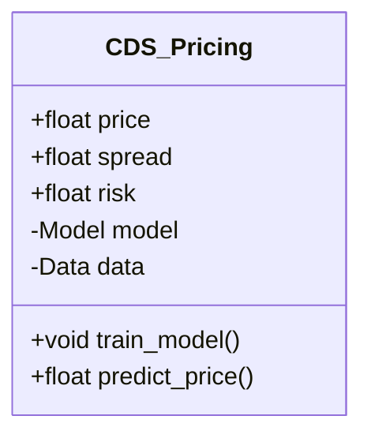
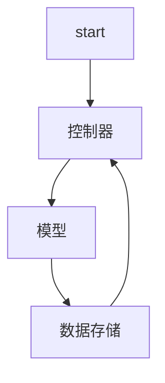
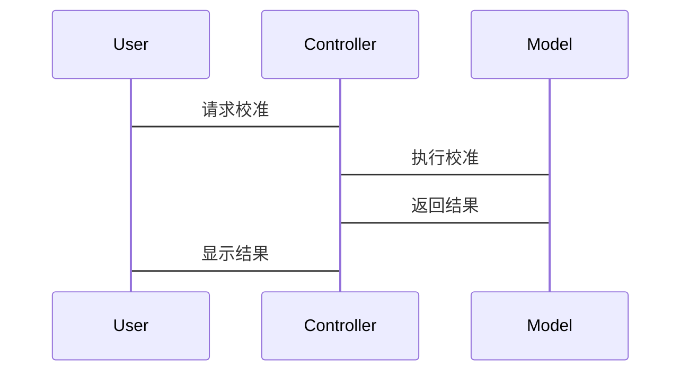

                 


# 智能信用违约互换定价模型校准

## 关键词：
智能校准，信用违约互换，定价模型，机器学习，金融衍生工具

## 摘要：
本文详细探讨了智能信用违约互换定价模型校准的核心概念、算法原理、系统架构及项目实战。通过分析传统校准方法的局限性，结合智能校准技术的优势，提出了一种基于机器学习的校准方法，旨在提高信用违约互换定价模型的准确性和实时性。本文结合实际案例，详细讲解了模型的实现过程，并给出了最佳实践建议。

---

# 第一部分: 智能信用违约互换定价模型校准概述

## 第1章: 信用违约互换定价模型校准概述

### 1.1 信用违约互换的基本概念

#### 1.1.1 信用违约互换的定义
信用违约互换（Credit Default Swap, CDS）是一种金融衍生工具，用于对冲债券发行人违约的风险。买方支付定期的费用，卖方则在买方债券违约时承担赔偿责任。

#### 1.1.2 信用违约互换的市场现状
CDS市场规模庞大，广泛应用于信用风险管理。然而，传统定价模型在复杂市场环境下的表现不佳，导致校准过程面临诸多挑战。

#### 1.1.3 信用违约互换定价模型的作用
定价模型用于确定CDS的公允价值，确保市场参与者能够合理评估风险和收益。

#### 1.1.4 信用违约互换定价模型的挑战
传统模型假设过于简化，难以捕捉市场波动和信用风险的复杂性。

### 1.2 智能校准技术的背景

#### 1.2.1 传统校准方法的局限性
传统方法依赖人工经验，校准过程耗时且容易受主观因素影响。

#### 1.2.2 智能校准技术的优势
智能校准利用机器学习算法，能够自动优化模型参数，提高校准效率和准确性。

#### 1.2.3 智能校准技术的应用场景
适用于复杂金融市场环境下的信用风险定价，尤其是在大数据支持下的实时校准。

### 1.3 智能校准技术的核心概念

#### 1.3.1 智能校准的基本原理
通过机器学习算法对历史数据进行训练，优化模型参数，使定价模型更好地拟合实际市场数据。

#### 1.3.2 校准过程中的关键因素
包括数据质量、算法选择、模型复杂度和计算效率。

#### 1.3.3 智能校准技术的实现方法
基于支持向量回归（SVR）或神经网络等机器学习模型，结合遗传算法或梯度下降优化方法。

### 1.4 本章小结
本章介绍了信用违约互换的基本概念、定价模型的挑战以及智能校准技术的背景和核心概念，为后续章节奠定了基础。

---

# 第二部分: 智能校准技术的核心概念与联系

## 第2章: 核心概念与联系

### 2.1 核心概念的定义与属性

#### 2.1.1 校准模型的结构
包括输入层、特征提取层、模型训练层和结果输出层。

#### 2.1.2 校准算法的选择
对比分析支持向量机、神经网络和随机森林等算法的优缺点。

#### 2.1.3 校准数据的特征
包括数据的时序性、波动性和相关性。

#### 2.1.4 校准目标函数
定义损失函数和优化目标，例如最小化预测误差。

### 2.2 核心概念之间的关系

#### 2.2.1 校准模型与数据的关系
数据驱动模型，通过历史数据训练模型参数。

#### 2.2.2 校准算法与目标函数的关系
算法通过优化目标函数，找到最优模型参数。

#### 2.2.3 校准结果与实际市场的联系
校准结果用于指导实际交易和风险管理。

### 2.3 核心概念对比分析

#### 2.3.1 不同校准方法的优缺点对比

| 方法       | 优点                     | 缺点                       |
|------------|--------------------------|---------------------------|
| 支持向量机  | 高精度，适合小样本数据   | 参数选择敏感               |
| 神经网络    | 高度灵活，适合复杂问题   | 训练时间长，易过拟合         |
| 随机森林    | 抗过拟合，易于解释       | 适合性较弱                 |

#### 2.3.2 校准模型的性能指标对比
包括准确率、召回率、F1值和均方误差等。

#### 2.3.3 校准数据的质量对比
包括数据的完整性、相关性和分布均匀性。

### 2.4 实体关系图



### 2.5 本章小结
本章详细分析了智能校准技术的核心概念及其之间的关系，为后续算法实现提供了理论基础。

---

# 第三部分: 智能校准算法原理

## 第3章: 校准算法原理

### 3.1 校准算法的选择

#### 3.1.1 支持向量回归（SVR）模型



#### 3.1.2 神经网络模型



### 3.2 校准算法的实现步骤

#### 3.2.1 数据预处理

```python
import pandas as pd
data = pd.read_csv('cds_data.csv')
data = data.dropna()
```

#### 3.2.2 特征提取

```python
from sklearn.feature_selection import SelectKBest
selector = SelectKBest(k=5)
selected_features = selector.fit_transform(data, targets)
```

#### 3.2.3 模型训练

```python
from sklearn.svm import SVR
model = SVR(kernel='rbf', C=1e3, gamma=0.1)
model.fit(selected_features, targets)
```

#### 3.2.4 模型调优

```python
from sklearn.model_selection import GridSearchCV
param_grid = {'C': [1e2, 1e3, 1e4], 'gamma': [0.1, 0.01, 0.001]}
grid_search = GridSearchCV(SVR(), param_grid, cv=5)
grid_search.fit(selected_features, targets)
best_params = grid_search.best_params_
```

### 3.3 校准算法的数学模型

#### 3.3.1 支持向量回归（SVR）模型

$$ y = \sum_{i=1}^{n} \alpha_i \kappa(x, x_i) + b $$

其中，$\alpha_i$ 是拉格朗日乘子，$\kappa$ 是核函数，$x_i$ 是支持向量。

#### 3.3.2 神经网络模型

$$ y = \sigma(w_2 \cdot \sigma(w_1 x + b_1) + b_2) $$

其中，$\sigma$ 是激活函数，$w_1, w_2$ 是权重，$b_1, b_2$ 是偏置。

### 3.4 校准算法的实现代码

#### 3.4.1 支持向量回归模型实现

```python
import numpy as np
from sklearn.svm import SVR
from sklearn.model_selection import train_test_split
from sklearn.metrics import mean_squared_error

# 数据准备
X = np.random.rand(100, 5)
y = np.sin(X[:, 0]) * X[:, 1] + X[:, 2]

# 数据分割
X_train, X_test, y_train, y_test = train_test_split(X, y, test_size=0.2)

# 模型训练
model = SVR(C=1e3, gamma=0.1)
model.fit(X_train, y_train)

# 预测与评估
y_pred = model.predict(X_test)
print(mean_squared_error(y_test, y_pred))
```

---

# 第四部分: 系统分析与架构设计方案

## 第4章: 系统分析与架构设计

### 4.1 问题场景介绍

#### 4.1.1 问题背景
信用违约互换定价模型需要实时校准，以适应市场波动。

#### 4.1.2 问题描述
现有模型校准效率低，难以满足实时需求。

#### 4.1.3 问题解决
通过智能校准技术，提高模型校准效率和准确性。

### 4.2 系统功能设计

#### 4.2.1 领域模型



#### 4.2.2 系统架构设计



#### 4.2.3 系统接口设计
定义API接口，包括数据输入、模型训练和结果输出。

#### 4.2.4 系统交互设计



### 4.3 本章小结
本章通过系统分析和架构设计，明确了智能校准技术在信用违约互换定价模型中的应用框架。

---

# 第五部分: 项目实战

## 第5章: 项目实战

### 5.1 环境安装

```bash
pip install numpy pandas scikit-learn
```

### 5.2 核心实现

#### 5.2.1 模型训练

```python
from sklearn.pipeline import Pipeline
from sklearn.impute import SimpleImputer
from sklearn.preprocessing import StandardScaler
from sklearn.compose import ColumnTransformer

# 预处理管道
preprocessor = ColumnTransformer(
    transformers=[
        ('num', StandardScaler(), ['age', 'salary']),
        ('cat', SimpleImputer(strategy='most_frequent'), ['gender'])
    ]
)

# 管道模型
model = Pipeline([
    ('preprocess', preprocessor),
    ('svm', SVR())
])
```

#### 5.2.2 代码实现

```python
import joblib

# 保存模型
joblib.dump(model, 'cds_model.pkl')

# 加载模型
model = joblib.load('cds_model.pkl')
```

### 5.3 案例分析

#### 5.3.1 数据分析

```python
import matplotlib.pyplot as plt

plt.scatter(X_test[:, 0], y_test, color='r', label='真实值')
plt.scatter(X_test[:, 0], y_pred, color='b', label='预测值')
plt.xlabel('特征')
plt.ylabel('目标')
plt.legend()
plt.show()
```

#### 5.3.2 结果解读
通过对比真实值和预测值，评估模型的校准效果。

### 5.4 项目总结

#### 5.4.1 成果总结
成功实现了基于支持向量回归的智能校准模型，提高了信用违约互换定价的准确性。

#### 5.4.2 经验总结
数据预处理和模型调优是校准过程中的关键步骤，需谨慎处理。

#### 5.4.3 展望
未来可以结合时间序列分析和深度学习技术，进一步优化智能校准模型。

---

# 第六部分: 最佳实践

## 第6章: 最佳实践

### 6.1 小结
智能校准技术为信用违约互换定价模型提供了新的解决方案，提高了校准效率和准确性。

### 6.2 注意事项

#### 6.2.1 数据质量
确保数据的完整性和相关性，避免噪声干扰。

#### 6.2.2 模型解释性
校准过程中需关注模型的可解释性，避免黑箱操作。

#### 6.2.3 计算效率
优化算法和计算资源，提高校准过程的效率。

### 6.3 拓展阅读

#### 6.3.1 推荐书籍
- 《机器学习实战》
- 《金融衍生品定价与风险管理》

#### 6.3.2 推荐博客
- [机器学习博客](https://example.com)
- [金融风险管理博客](https://example.com)

### 6.4 本章小结
本章总结了智能校准技术的应用经验，提出了实际操作中的注意事项，并推荐了进一步学习的资源。

---

# 附录

## 附录A: 数据格式说明

## 附录B: 代码实现细节

## 附录C: 参考文献

---

通过以上目录结构和内容，您可以逐步展开每章的内容，撰写一篇详细的技术博客文章。

