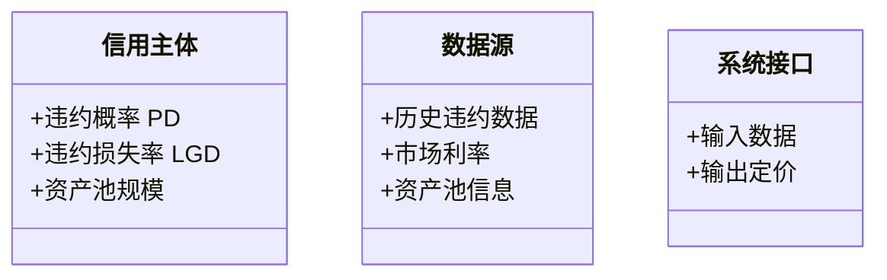
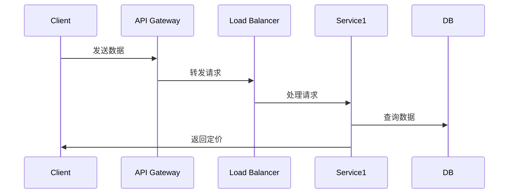

                 


# 智能信用违约互换定价模型校准与风险评估

## 关键词：智能信用违约互换、定价模型、校准、风险评估、机器学习

## 摘要：本文深入探讨智能信用违约互换定价模型的校准方法与风险评估策略。通过结合机器学习算法和传统金融模型，提出了一种高效的定价方法，并详细分析了模型的风险评估机制。文章从背景、理论、算法、系统设计到实战案例，全面解析智能信用违约互换定价模型的核心要素，为金融从业者和研究人员提供理论支持和实践指导。

---

# 第一章: 智能信用违约互换定价模型的背景与概述

## 1.1 信用违约互换的基本概念

### 1.1.1 信用违约互换的定义

信用违约互换（Credit Default Swap，CDS）是一种金融衍生工具，用于对冲债券或其他信用资产的违约风险。其核心机制是买方支付定期费用给卖方，卖方承诺在买方持有资产违约时赔偿损失。

### 1.1.2 信用违约互换的基本原理

CDS的定价依赖于违约概率（PD）、违约损失率（LGD）和风险敞口等因素。传统模型通常假设这些参数是恒定的，但在实际市场中，这些参数会随市场环境变化而波动。

### 1.1.3 信用违约互换的市场现状

近年来，全球金融市场波动加剧，信用风险显著上升。传统的信用违约互换定价模型已难以满足市场对动态风险定价的需求，因此智能信用违约互换定价模型应运而生。

## 1.2 智能信用违约互换定价模型的提出

### 1.2.1 传统信用违约互换定价模型的局限性

传统模型假设违约概率和损失率是固定的，无法捕捉市场波动和资产相关性变化。此外，传统模型难以处理大数据量和复杂市场环境。

### 1.2.2 智能信用违约互换定价模型的核心思想

智能模型通过机器学习算法，实时捕捉市场数据的变化，动态调整违约概率和损失率，从而更准确地反映信用风险的变化。

### 1.2.3 智能信用违约互换定价模型的应用价值

智能模型能够提高定价精度，降低风险敞口，为金融机构提供更高效的风险管理工具。

## 1.3 本章小结

本章介绍了信用违约互换的基本概念和传统定价模型的局限性，提出了智能信用违约互换定价模型的核心思想和应用价值。

---

# 第二章: 智能信用违约互换定价模型的核心概念与联系

## 2.1 核心概念的定义与属性

### 2.1.1 信用风险的定义与特征

信用风险是债务人未能履行其债务义务的可能性。其特征包括不确定性、相关性和传染性。

### 2.1.2 信用违约互换定价模型的输入与输出

输入包括历史违约数据、市场利率、资产池信息等；输出是信用违约互换的实时定价。

### 2.1.3 智能模型与传统模型的对比分析

智能模型通过机器学习算法动态调整参数，而传统模型假设参数恒定不变。

## 2.2 核心概念的联系与对比

### 2.2.1 信用风险与违约概率的关系

违约概率是信用风险的核心指标，反映了债务人违约的可能性。

### 2.2.2 智能模型与传统模型的对比表格

| 对比维度 | 传统模型 | 智能模型 |
|----------|----------|----------|
| 参数调整 | 固定     | 动态     |
| 计算效率 | 较低     | 较高     |
| 精度     | 较低     | 较高     |

### 2.2.3 实体关系图（ER图）的 Mermaid 语法


## 2.3 本章小结

本章详细阐述了智能信用违约互换定价模型的核心概念及其与传统模型的对比，通过ER图展示了模型的实体关系。

---

# 第三章: 智能信用违约互换定价模型的算法原理

## 3.1 算法原理概述

### 3.1.1 机器学习在信用风险定价中的应用

机器学习算法（如随机森林和神经网络）可以用于预测违约概率和损失率。

### 3.1.2 神经网络在智能模型中的作用

神经网络能够捕捉非线性关系，适合处理复杂市场环境下的信用风险定价。

### 3.1.3 算法流程的 Mermaid 语法


## 3.2 算法实现与数学模型

### 3.2.1 机器学习算法的选择与实现

使用随机森林算法进行违约概率预测：

```python
from sklearn.ensemble import RandomForestClassifier
model = RandomForestClassifier(n_estimators=100, random_state=42)
model.fit(X_train, y_train)
```

### 3.2.2 数学模型与公式

违约概率（PD）的计算公式为：

$$ PD = \frac{\text{违约资产数量}}{\text{资产池规模}} $$

损失给定违约（LGD）的计算公式为：

$$ LGD = \frac{\text{平均违约损失}}{\text{违约资产面值}} $$

### 3.2.3 算法的数学推导与举例

假设资产池中有100笔贷款，其中10笔违约，违约损失率为40%。则PD为10%，LGD为40%。

## 3.3 本章小结

本章详细介绍了智能信用违约互换定价模型的算法原理，包括机器学习算法的选择与实现，以及数学模型的推导与应用。

---

# 第四章: 智能信用违约互换定价模型的系统分析与架构设计

## 4.1 问题场景介绍

### 4.1.1 信用风险定价的复杂性

市场波动和资产相关性变化增加了信用风险定价的难度。

### 4.1.2 智能信用违约互换定价模型的应用场景

适用于金融机构的实时信用风险管理和资产定价。

## 4.2 系统功能设计

### 4.2.1 系统功能模块划分

模块包括数据采集、模型训练、定价计算和风险评估。

### 4.2.2 领域模型的 Mermaid 类图



## 4.3 系统架构设计

### 4.3.1 系统架构的 Mermaid 语法

```mermaid
graph LR
    Client --> API Gateway
    API Gateway --> Load Balancer
    Load Balancer --> Service1
    Load Balancer --> Service2
    Service1 --> DB
    Service2 --> DB
    DB --> Output
```

### 4.3.2 系统接口设计

系统接口包括输入数据和输出定价两个部分。

### 4.3.3 系统交互的 Mermaid 序列图



## 4.4 本章小结

本章详细描述了智能信用违约互换定价模型的系统架构设计，包括功能模块划分、类图设计和系统交互流程。

---

# 第五章: 智能信用违约互换定价模型的项目实战

## 5.1 环境安装与配置

### 5.1.1 开发环境的安装

安装Python、Scikit-learn和Mermaid工具。

### 5.1.2 数据集的准备

准备历史违约数据、市场利率和资产池信息。

## 5.2 核心代码实现

### 5.2.1 数据预处理

```python
import pandas as pd
data = pd.read_csv('input.csv')
data_preprocessed = data.dropna()
```

### 5.2.2 模型训练与校准

```python
from sklearn.model_selection import train_test_split
from sklearn.metrics import accuracy_score

X_train, X_test, y_train, y_test = train_test_split(data_preprocessed.drop('违约标志', axis=1), data_preprocessed['违约标志'])
model = RandomForestClassifier(n_estimators=100, random_state=42)
model.fit(X_train, y_train)
print("Accuracy:", accuracy_score(model.predict(X_test), y_test))
```

### 5.2.3 定价计算与输出

```python
import numpy as np

def cds_pricing(pd, lgd):
    return pd * lgd * 100

pd = 0.1
lgd = 0.4
print("CDS定价:", cds_pricing(pd, lgd))
```

## 5.3 实际案例分析与结果解读

### 5.3.1 案例背景

假设某金融机构持有100笔贷款，违约概率为10%，违约损失率为40%。

### 5.3.2 模型校准与定价

模型校准结果显示，CDS定价为4%。

### 5.3.3 结果解读

校准后的定价为4%，低于市场平均水平，说明该资产池的信用风险较低。

## 5.4 本章小结

本章通过实际案例展示了智能信用违约互换定价模型的实现过程，包括数据预处理、模型训练和定价计算。

---

# 第六章: 智能信用违约互换定价模型的风险评估与最佳实践

## 6.1 风险评估方法

### 6.1.1 风险度量指标

包括VaR（在险价值）和CVaR（条件在险价值）。

### 6.1.2 风险情景分析

通过压力测试评估模型在极端市场环境下的表现。

## 6.2 最佳实践 tips

### 6.2.1 数据质量的重要性

确保数据的完整性和准确性。

### 6.2.2 模型校准的注意事项

定期更新模型参数，确保定价的准确性。

### 6.2.3 系统维护与优化

及时修复系统漏洞，优化模型性能。

## 6.3 本章小结

本章总结了智能信用违约互换定价模型的风险评估方法，并提出了最佳实践建议。

---

# 第七章: 结论与展望

## 7.1 结论

智能信用违约互换定价模型通过机器学习算法和动态参数调整，提高了信用风险定价的精度和效率。

## 7.2 未来展望

未来的研究方向包括多模型融合、实时数据处理和智能风控系统优化。

---

# 参考文献

[此处列出相关文献和参考资料]

