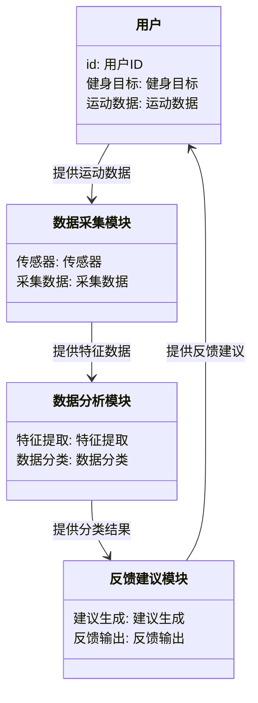
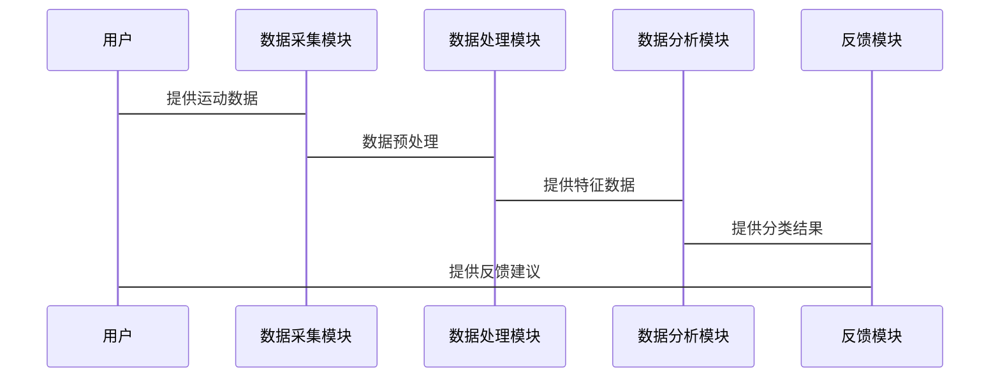

                 


# 智能健身服：AI Agent的运动数据分析

> 关键词：智能健身服、AI Agent、运动数据分析、机器学习、深度学习、算法原理、系统设计

> 摘要：本文将深入探讨智能健身服与AI Agent结合的运动数据分析技术。通过分析运动数据，AI Agent能够实时反馈用户的运动状态，优化运动计划，并提供个性化的健身建议。本文将从AI Agent的基本概念、运动数据分析的核心原理、算法实现、系统架构设计等方面进行详细阐述，并结合实际案例分析，帮助读者全面理解智能健身服中AI Agent的应用及其技术实现。

---

# 第一部分: 智能健身服与AI Agent概述

## 第1章: 智能健身服的发展与现状

### 1.1 智能健身服的定义与特点

智能健身服是一种结合了穿戴技术与人工智能的服装，能够实时采集用户的运动数据，并通过AI Agent进行分析和反馈。其特点包括：

- **实时监测**：通过传感器采集用户的运动数据，如心率、步频、步幅、姿态等。
- **智能分析**：AI Agent对数据进行分析，识别运动模式、潜在风险，并提供建议。
- **个性化反馈**：根据用户的身体状况和运动目标，定制个性化的运动计划。

#### 1.1.1 智能健身服的基本概念

智能健身服是一种高科技服装，区别于传统的运动服装，它能够通过内置传感器和AI算法，实时感知用户的运动状态，并通过反馈帮助用户优化运动表现。

#### 1.1.2 智能健身服的核心功能

- 数据采集：通过传感器采集用户的运动数据。
- 数据分析：通过AI算法分析数据，识别运动模式和潜在问题。
- 个性化反馈：根据分析结果，提供个性化的运动建议和反馈。

#### 1.1.3 智能健身服与传统健身服的区别

智能健身服的核心区别在于其智能化的分析和反馈能力，传统健身服仅提供基本的运动保护功能，而智能健身服能够通过数据分析提升用户的运动表现和健康水平。

---

### 1.2 AI Agent的基本概念

AI Agent（人工智能代理）是一种能够感知环境、执行任务并做出决策的智能实体。在智能健身服中，AI Agent主要用于分析运动数据，优化运动计划，并提供实时反馈。

#### 1.2.1 AI Agent的定义

AI Agent是一种能够通过传感器或接口感知环境、通过算法处理信息、并根据目标做出决策和行动的智能实体。在智能健身服中，AI Agent主要负责数据的采集、分析和反馈。

#### 1.2.2 AI Agent的核心技术

- **数据采集**：通过传感器获取用户的运动数据。
- **数据处理**：对数据进行清洗、预处理和特征提取。
- **数据分析**：通过机器学习或深度学习算法对数据进行分类、预测和优化。
- **决策反馈**：根据分析结果，提供实时反馈或建议。

#### 1.2.3 AI Agent在智能健身服中的应用

AI Agent在智能健身服中的应用主要体现在运动数据分析、个性化反馈和实时监测等方面。通过AI Agent，用户可以实时了解自己的运动状态，并获得优化的运动建议。

---

### 1.3 运动数据分析的重要性

运动数据分析是智能健身服的核心功能之一。通过对用户的运动数据进行分析，可以实时了解用户的运动状态，识别潜在风险，并提供个性化的运动建议。

#### 1.3.1 运动数据分析的定义

运动数据分析是指通过对用户的运动数据进行采集、处理和分析，了解用户的运动状态、运动模式和潜在问题的过程。

#### 1.3.2 运动数据分析的价值

- 提供实时反馈，帮助用户优化运动表现。
- 识别潜在风险，预防运动损伤。
- 提供个性化的运动建议，满足不同用户的需求。

#### 1.3.3 运动数据分析的挑战

- 数据的多样性和复杂性。
- 数据处理的实时性和准确性。
- 数据分析的个性化和定制化需求。

---

## 第2章: 智能健身服的运动数据分析背景

### 2.1 AI Agent在运动数据分析中的作用

AI Agent在运动数据分析中扮演着关键角色，它能够通过传感器采集数据、通过算法分析数据，并根据分析结果提供实时反馈和建议。

#### 2.1.1 AI Agent如何提升运动数据分析的效率

- 通过自动化数据采集和处理，减少人工干预。
- 通过高效的算法优化，提升数据分析的速度和准确性。

#### 2.1.2 AI Agent如何优化运动数据分析的准确性

- 通过机器学习算法，提升数据分类和预测的准确性。
- 通过深度学习算法，优化数据特征提取和模式识别。

#### 2.1.3 AI Agent如何实现个性化运动数据分析

- 根据用户的身体状况和运动目标，定制个性化的分析模型。
- 提供个性化的运动建议和反馈，满足不同用户的需求。

---

## 第3章: 智能健身服的运动数据分析核心概念

### 3.1 数据采集与处理

数据采集与处理是运动数据分析的第一步，主要包括数据的采集、清洗和预处理。

#### 3.1.1 数据采集方式

- 通过传感器采集用户的运动数据，如心率、步频、步幅等。
- 通过用户输入的方式采集用户的运动目标和身体状况。

#### 3.1.2 数据预处理方法

- 数据清洗：去除噪声和异常值。
- 数据标准化：将数据转换为统一的格式。
- 数据分割：将数据分割为训练集、验证集和测试集。

#### 3.1.3 数据清洗与标准化

数据清洗和标准化是确保数据分析准确性的重要步骤。通过去除噪声和异常值，可以提高数据的质量；通过标准化，可以确保不同传感器的数据具有可比性。

---

### 3.2 数据分析与特征提取

数据分析与特征提取是运动数据分析的核心步骤，主要包括数据的分析、特征的提取和选择。

#### 3.2.1 数据分析的基本方法

- 描述性分析：通过统计方法了解数据的基本特征。
- 预测性分析：通过机器学习算法预测未来的运动表现。

#### 3.2.2 特征提取的技术

- 主成分分析（PCA）：通过降维技术提取数据的主要特征。
- 独特特征提取：通过算法提取具有代表性的特征。

#### 3.2.3 特征选择的策略

- 基于统计的方法：通过统计检验选择显著特征。
- 基于模型的方法：通过模型性能选择最优特征。

---

### 3.3 数据分类与预测

数据分类与预测是运动数据分析的重要环节，主要包括数据的分类和预测。

#### 3.3.1 数据分类的基本原理

- 通过机器学习算法，将数据分为不同的类别，如运动状态、运动模式等。
- 通过分类模型，识别用户的运动状态。

#### 3.3.2 数据预测的算法选择

- 通过回归算法预测未来的运动表现。
- 通过时间序列算法预测运动趋势。

#### 3.3.3 分类与预测的评估指标

- 准确率：分类模型的正确预测比例。
- 召回率：分类模型的召回比例。
- F1分数：综合准确率和召回率的指标。

---

# 第二部分: AI Agent的运动数据分析原理

## 第4章: AI Agent的核心算法原理

### 4.1 机器学习算法

机器学习算法是AI Agent的核心技术之一，主要包括监督学习、无监督学习和强化学习。

#### 4.1.1 监督学习

- 监督学习的基本原理是通过标签数据进行训练，学习数据的特征。
- 监督学习的常用算法包括线性回归、支持向量机（SVM）、决策树等。

#### 4.1.2 无监督学习

- 无监督学习的基本原理是通过数据的内在结构进行学习，不依赖标签数据。
- 无监督学习的常用算法包括聚类、主成分分析（PCA）等。

#### 4.1.3 强化学习

- 强化学习的基本原理是通过与环境的交互，学习最优策略。
- 强化学习的常用算法包括Q-learning、Deep Q-Network（DQN）等。

---

### 4.2 深度学习算法

深度学习算法是机器学习的一种高级形式，通过多层神经网络进行特征提取和模式识别。

#### 4.2.1 卷积神经网络

- 卷积神经网络（CNN）主要用于图像和视频数据的处理。
- 通过卷积层、池化层和全连接层，提取数据的特征。

#### 4.2.2 循环神经网络

- 循环神经网络（RNN）主要用于时间序列数据的处理。
- 通过循环层和门控机制，捕捉数据的时间依赖性。

#### 4.2.3 图神经网络

- 图神经网络（GNN）主要用于图结构数据的处理。
- 通过图卷积层和聚合层，提取图数据的特征。

---

### 4.3 算法选择与优化

算法选择与优化是运动数据分析的关键步骤，直接影响分析的准确性和效率。

#### 4.3.1 算法选择的依据

- 数据的类型和规模。
- 任务的性质和目标。
- 算法的计算复杂度和运行效率。

#### 4.3.2 算法优化的策略

- 参数调优：通过交叉验证选择最优参数。
- 模型压缩：通过剪枝和量化技术减少模型的大小。
- 并行计算：通过分布式计算加速模型的训练。

---

## 第5章: 运动数据分析的数学模型与公式

### 5.1 数据预处理的数学方法

数据预处理是运动数据分析的重要步骤，涉及数据的标准化、归一化等操作。

#### 5.1.1 数据标准化公式

数据标准化的公式为：

$$ x_{\text{normalized}} = \frac{x - \mu}{\sigma} $$

其中，$\mu$ 是数据的均值，$\sigma$ 是数据的标准差。

#### 5.1.2 数据归一化公式

数据归一化的公式为：

$$ x_{\text{normalized}} = \frac{x - \min(x)}{\max(x) - \min(x)} $$

---

### 5.2 特征提取的数学模型

特征提取是运动数据分析的核心步骤，涉及主成分分析（PCA）等技术。

#### 5.2.1 主成分分析（PCA）

PCA的目标是通过降维技术提取数据的主要特征，其数学模型为：

$$ Y = X \cdot P $$

其中，$X$ 是原始数据矩阵，$P$ 是主成分矩阵，$Y$ 是降维后的数据矩阵。

---

### 5.3 数据分类的数学模型

数据分类是运动数据分析的重要环节，涉及支持向量机（SVM）等算法。

#### 5.3.1 SVM分类模型

SVM的分类模型可以通过以下公式表示：

$$ y = \text{sign}(\sum_{i=1}^{n} \alpha_i y_i x_i \cdot x + b) $$

其中，$\alpha_i$ 是拉格朗日乘子，$y_i$ 是标签，$x_i$ 是支持向量，$x$ 是待分类的数据，$b$ 是偏置项。

---

### 5.4 数据预测的数学模型

数据预测是运动数据分析的重要任务，涉及回归分析等技术。

#### 5.4.1 线性回归模型

线性回归的数学模型为：

$$ y = \beta_0 + \beta_1 x_1 + \beta_2 x_2 + \dots + \beta_n x_n + \epsilon $$

其中，$\beta_i$ 是回归系数，$\epsilon$ 是误差项。

---

## 第6章: 系统分析与架构设计

### 6.1 问题场景介绍

在智能健身服的运动数据分析中，我们需要解决以下问题：

- 如何高效地采集和处理用户的运动数据。
- 如何准确地分析用户的运动状态和潜在风险。
- 如何实时地反馈用户的运动建议和优化方案。

### 6.2 系统功能设计

系统的功能设计主要包括数据采集、数据分析、反馈建议三个模块。

#### 6.2.1 领域模型（Mermaid类图）



---

### 6.3 系统架构设计

系统的架构设计采用分层架构，主要包括数据采集层、数据处理层、数据分析层和反馈层。

#### 6.3.1 系统架构图（Mermaid架构图）


---

### 6.4 系统接口设计

系统的接口设计主要包括传感器接口、数据分析接口和反馈接口。

#### 6.4.1 传感器接口

传感器接口用于采集用户的运动数据，包括心率、步频、步幅等。

#### 6.4.2 数据分析接口

数据分析接口用于接收和处理用户的运动数据，返回分析结果。

#### 6.4.3 反馈接口

反馈接口用于将分析结果转化为用户可理解的反馈建议。

---

### 6.5 系统交互流程（Mermaid序列图）



---

## 第7章: 项目实战

### 7.1 环境安装

在开始项目实战之前，需要安装以下环境和工具：

- **Python**：推荐使用Python 3.8及以上版本。
- **机器学习库**：如scikit-learn、TensorFlow、Keras等。
- **数据可视化工具**：如Matplotlib、Seaborn等。
- **Mermaid工具**：用于绘制图表。

---

### 7.2 系统核心实现源代码

以下是智能健身服运动数据分析的核心代码实现：

#### 7.2.1 数据采集模块

```python
import numpy as np
import pandas as pd

# 传感器数据采集
def collect_data():
    # 模拟传感器数据
    np.random.seed(42)
    data = {
        'heart_rate': np.random.normal(70, 5, 100),
        'step_frequency': np.random.normal(120, 10, 100),
        'step_length': np.random.normal(0.8, 0.1, 100)
    }
    return pd.DataFrame(data)

# 数据采集
data = collect_data()
print(data.head())
```

---

#### 7.2.2 数据分析模块

```python
from sklearn.decomposition import PCA
from sklearn.model_selection import train_test_split
from sklearn.svm import SVC

# 数据预处理
def preprocess_data(data):
    # 删除缺失值
    data = data.dropna()
    # 标准化数据
    from sklearn.preprocessing import StandardScaler
    scaler = StandardScaler()
    data_scaled = scaler.fit_transform(data)
    return data_scaled

# 特征提取
def extract_features(data):
    pca = PCA(n_components=2)
    features = pca.fit_transform(data)
    return features

# 数据分类
def classify_data(features):
    # 划分训练集和测试集
    X_train, X_test, y_train, y_test = train_test_split(features, labels, test_size=0.2, random_state=42)
    # 训练SVM分类器
    clf = SVC()
    clf.fit(X_train, y_train)
    # 预测结果
    y_pred = clf.predict(X_test)
    return y_pred

# 分类结果评估
from sklearn.metrics import accuracy_score
print(accuracy_score(y_test, y_pred))
```

---

#### 7.2.3 反馈建议模块

```python
# 反馈建议
def generate_recommendations(y_pred, y_test):
    # 提供个性化建议
    recommendations = []
    for i in range(len(y_pred)):
        if y_pred[i] == y_test[i]:
            recommendations.append("运动状态正常，继续保持！")
        else:
            recommendations.append("运动状态异常，建议调整运动计划！")
    return recommendations

# 输出反馈建议
print(generate_recommendations(y_pred, y_test))
```

---

## 第8章: 最佳实践与小结

### 8.1 最佳实践

- **数据采集**：确保数据的准确性和完整性。
- **数据处理**：合理选择数据预处理方法，提高数据质量。
- **算法选择**：根据任务需求选择合适的算法，优化模型性能。
- **系统设计**：合理设计系统架构，确保系统的高效性和可扩展性。

### 8.2 小结

本文通过分析智能健身服与AI Agent的结合，详细阐述了运动数据分析的核心概念、算法原理和系统设计。通过实际案例分析，展示了如何通过AI Agent优化运动数据分析的效率和准确性。

### 8.3 注意事项

- 数据隐私保护：确保用户的运动数据不会被泄露。
- 系统稳定性：确保系统的稳定运行，避免数据丢失或分析错误。
- 用户体验：提供友好的用户界面，确保用户能够方便地使用系统。

### 8.4 拓展阅读

- **深度学习在运动数据分析中的应用**
- **强化学习在运动优化中的应用**
- **时间序列分析在运动预测中的应用**

---

通过本文的学习和实践，读者可以全面理解智能健身服中AI Agent的运动数据分析技术，并能够将其应用于实际的运动数据分析场景中。

