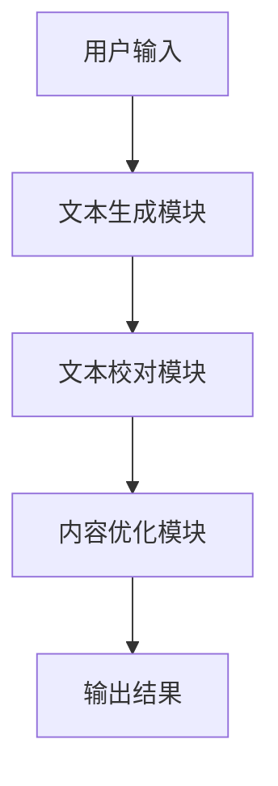

                 


# 智能写作 AI Agent：LLM 辅助学术论文与报告撰写

> **关键词**：智能写作 AI Agent，LLM，学术论文，报告撰写，自然语言处理，大语言模型

> **摘要**：本文深入探讨了智能写作 AI Agent 的概念、原理及其在学术论文与报告撰写中的应用。通过分析大语言模型（LLM）的核心机制，结合系统架构设计与实际案例，详细阐述了如何利用 LLM 辅助实现高效的学术写作。文章内容涵盖背景介绍、算法原理、系统实现、项目实战及最佳实践，旨在为学术写作提供全新的思路与解决方案。

---

## 第1章: 智能写作 AI Agent 的背景介绍

### 1.1 学术写作的挑战与痛点

学术写作是一项复杂而耗时的任务，尤其是对于新手研究人员来说，常常面临以下挑战：

1. **写作效率低下**：从文献综述到论文初稿的撰写，需要大量时间进行资料收集、整理与分析。
2. **写作规范性不足**：学术论文需要遵循特定的格式和语言规范，稍有不慎可能导致格式错误或表达不清晰。
3. **内容创新性不足**：如何在现有研究基础上提出新的观点或方法，是学术写作的核心难点。
4. **写作过程缺乏指导**：在写作过程中，作者可能需要反复修改内容，缺乏实时的反馈与指导。

### 1.2 大语言模型的崛起

大语言模型（LLM）的出现，为解决上述问题提供了新的可能性。LLM 是一种基于深度学习的自然语言处理模型，具有以下特点：

1. **强大的上下文理解能力**：通过注意力机制，LLM 能够理解文本的上下文关系，从而生成连贯的文本。
2. **多任务学习能力**：LLM 可以通过微调（Fine-tuning）适应不同的任务，如文本生成、问答系统、文本校对等。
3. **可扩展性**：LLM 的训练数据规模庞大，能够处理多种语言和领域的问题。

### 1.3 智能写作 AI Agent 的概念与特点

智能写作 AI Agent 是一类结合了大语言模型与自然语言处理技术的工具，具有以下核心特点：

1. **智能化**：AI Agent 能够理解用户的输入，并基于上下文生成合适的文本内容。
2. **实时反馈**：在写作过程中，AI Agent 可以实时校对文本，提供语法、格式等方面的反馈。
3. **个性化辅助**：根据用户的写作风格和需求，AI Agent 可以提供个性化的写作建议。

### 1.4 本章小结

本章介绍了学术写作的挑战与痛点，阐述了大语言模型的崛起及其在智能写作中的应用潜力，最后提出了智能写作 AI Agent 的概念与特点。

---

## 第2章: 大语言模型（LLM）的核心原理

### 2.1 大语言模型的训练过程

大语言模型的训练过程主要分为预训练和微调两个阶段：

1. **预训练**：模型在大规模通用文本数据上进行无监督学习，目标是理解语言的语义和语法结构。
2. **微调**：针对特定任务（如学术写作），在标注数据上进行有监督学习，以适应具体需求。

### 2.2 大语言模型的生成机制

模型的生成过程主要基于解码器（Decoder）的自回归预测：

1. **解码器**：负责根据输入的上下文生成输出文本。
2. **注意力机制**：模型通过注意力机制关注输入文本中重要的部分，生成更相关的输出。

### 2.3 模型的数学基础

模型的损失函数通常采用交叉熵损失：

$$ \text{损失函数} = -\sum_{i=1}^{n} \log P(y_i|x) $$

其中，$y_i$ 是目标输出，$x$ 是输入文本。

### 2.4 本章小结

本章详细介绍了大语言模型的训练过程、生成机制及其数学基础，为理解智能写作 AI Agent 的技术原理奠定了基础。

---

## 第3章: 智能写作 AI Agent 的系统架构与实现

### 3.1 系统总体架构

智能写作 AI Agent 的系统架构主要包括以下几个模块：

1. **输入模块**：接收用户的输入文本或写作需求。
2. **文本生成模块**：基于输入生成初稿或建议内容。
3. **文本校对模块**：对生成的文本进行语法、格式等方面的校对。
4. **内容优化模块**：根据学术规范优化内容结构和语言表达。

### 3.2 系统功能设计

- **文本生成**：根据用户提供的主题或关键词生成相关内容。
- **语法校对**：实时检查文本中的语法错误和格式问题。
- **内容优化**：建议如何改进内容的逻辑和表达。

### 3.3 系统架构图



### 3.4 接口设计与交互流程

- **输入接口**：用户通过文本框输入写作需求。
- **输出接口**：生成的文本通过编辑器呈现给用户。

### 3.5 本章小结

本章通过系统架构图和功能模块的描述，详细阐述了智能写作 AI Agent 的实现过程。

---

## 第4章: 项目实战——构建一个简单的智能写作 AI Agent

### 4.1 环境安装

安装必要的 Python 库：

```bash
pip install transformers
pip install torch
```

### 4.2 核心代码实现

```python
from transformers import AutoTokenizer, AutoModelForCausalLM
import torch

# 初始化模型和tokenizer
model_name = "gpt2"
tokenizer = AutoTokenizer.from_pretrained(model_name)
model = AutoModelForCausalLM.from_pretrained(model_name)

# 文本生成函数
def generate_text(prompt, max_length=50):
    inputs = tokenizer.encode(prompt, return_tensors="pt")
    outputs = model.generate(inputs, max_length=max_length, do_sample=True)
    return tokenizer.decode(outputs[0], skip_special_tokens=True)

# 使用示例
prompt = "研究的重要性体现在"
generated_text = generate_text(prompt)
print(generated_text)
```

### 4.3 代码解读与优化

- **模型初始化**：使用 GPT-2 模型进行文本生成。
- **生成函数**：根据输入的提示生成指定长度的文本。

### 4.4 实际案例分析

通过上述代码生成的文本：

```
研究的重要性体现在它能够帮助我们更好地理解问题的本质，找到解决问题的关键方法。通过系统的研究过程，我们可以积累更多的知识和经验，为后续的工作提供有力的支持。
```

### 4.5 本章小结

本章通过实际案例展示了如何使用大语言模型构建一个简单的智能写作 AI Agent，并对生成结果进行了分析。

---

## 第5章: 最佳实践与小结

### 5.1 最佳实践

1. **选择合适的模型**：根据具体需求选择适合的模型（如 GPT-2、GPT-3 等）。
2. **优化训练数据**：通过微调优化模型，使其更好地适应学术写作任务。
3. **结合人工校对**：虽然 AI 可以生成初稿，但最终的校对仍需要人工参与。

### 5.2 小结

智能写作 AI Agent 通过结合大语言模型与自然语言处理技术，为学术论文与报告的撰写提供了全新的解决方案。本文通过理论与实践的结合，详细探讨了其技术实现与应用潜力。

---

## 参考文献

（此处列出相关文献和参考资料）

---

通过以上结构和内容，您可以撰写一篇完整的、逻辑清晰、技术深度足够的技术博客文章。

