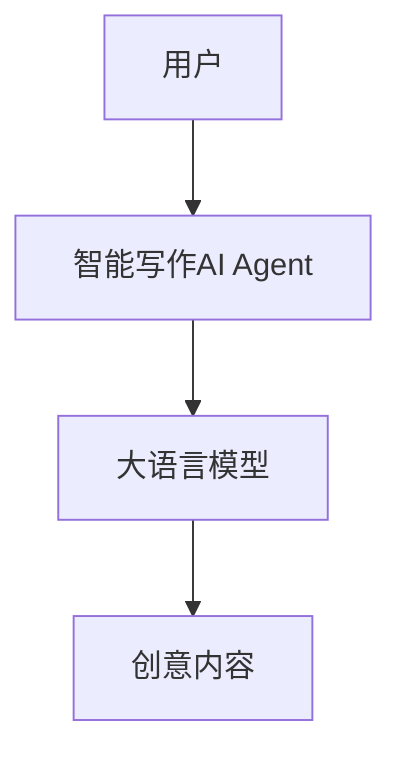
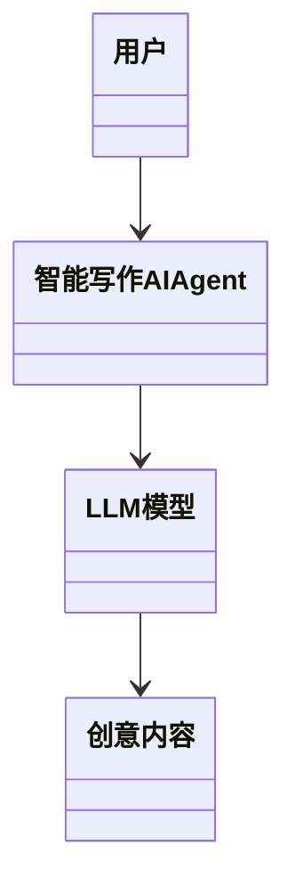
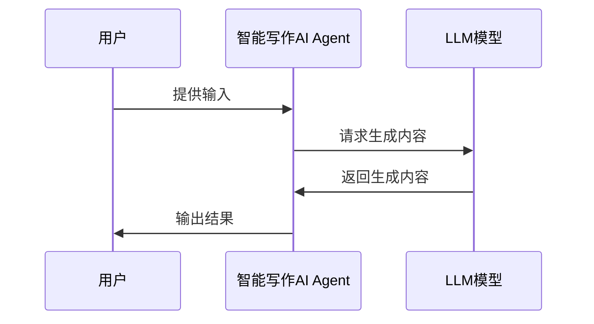

                 


# 智能写作AI Agent：LLM辅助的创意内容生成

## 关键词：智能写作AI Agent, LLM, 创意内容生成, 大语言模型, 自然语言处理

## 摘要：本文深入探讨了智能写作AI Agent在创意内容生成中的应用，分析了大语言模型（LLM）的基本原理及其在写作辅助中的优势。文章从背景介绍、核心概念、算法原理、系统设计到项目实战，全面解析了智能写作AI Agent的实现过程，帮助读者理解如何利用LLM提升创意写作效率。

---

# 第一部分: 背景介绍

## 第1章: 智能写作AI Agent的背景与概念

### 1.1 AI写作工具的背景与发展
#### 1.1.1 传统写作工具的局限性
传统写作工具如文字处理软件虽然功能强大，但缺乏智能化。它们无法理解上下文、提供创意建议或自动生成内容。

#### 1.1.2 AI技术在写作领域的应用现状
AI技术，特别是大语言模型（LLM），在写作领域的应用越来越广泛。AI写作工具可以提供实时建议、自动润色和内容生成。

#### 1.1.3 LLM在创意写作中的优势
LLM能够理解和生成人类语言，具备创造力和灵活性，能够在创意写作中提供独特的见解和灵感。

### 1.2 问题背景与目标
#### 1.2.1 创意写作中的常见问题
创意写作过程中常遇到的问题包括创作瓶颈、时间不足和内容重复。

#### 1.2.2 LLM辅助写作的核心目标
通过LLM技术，帮助用户克服创作瓶颈，提高写作效率，丰富内容创意。

#### 1.2.3 边界与外延
LLM辅助写作的边界在于生成内容的质量和相关性，外延则包括文学创作、市场营销等多个领域。

### 1.3 智能写作AI Agent的核心概念
#### 1.3.1 LLM的基本原理
LLM通过预训练和微调技术，学习海量数据，能够生成与上下文相关的内容。

#### 1.3.2 智能写作AI Agent的功能特点
包括创意建议、内容生成、实时润色和多语言支持。

#### 1.3.3 创意内容生成的实现机制
通过LLM的生成式模型，结合用户输入，输出创意内容。

### 1.4 本章小结
本章介绍了AI写作工具的发展背景，分析了LLM在创意写作中的优势，并明确了智能写作AI Agent的核心概念和目标。

---

# 第二部分: 核心概念与联系

## 第2章: LLM与创意写作的核心概念

### 2.1 LLM的基本原理
#### 2.1.1 预训练与微调的原理
预训练通过无监督学习掌握语言模式，微调则针对特定任务进行有监督训练。

#### 2.1.2 注意力机制的作用
注意力机制使模型能够聚焦重要信息，提升生成内容的相关性。

#### 2.1.3 生成式模型的特点
生成式模型能够自动生成多样化的文本内容，具备灵活性和创造性。

### 2.2 智能写作AI Agent的实体关系
#### 2.2.1 实体关系图


### 2.3 模型对比分析
#### 2.3.1 不同LLM模型的对比表格
| 模型名称 | 参数量 | 主要特点 | 适用场景 |
|--------|------|--------|--------|
| GPT-3 | 175B | 高精度生成 | 创意写作 |
| BERT | 330M | 语义理解 | 文本分析 |

---

# 第三部分: 算法原理

## 第3章: 生成式模型的算法原理

### 3.1 Transformer模型的结构
#### 3.1.1 编码器和解码器的结构
编码器负责输入处理，解码器生成输出。

#### 3.1.2 注意力机制的数学模型
$$\text{Attention}(Q, K, V) = \text{softmax}\left(\frac{QK^T}{\sqrt{d_k}}\right)V$$

### 3.2 训练过程中的数学模型
#### 3.2.1 损失函数的计算
使用交叉熵损失函数衡量生成内容与真实内容的差异。

#### 3.2.2 梯度下降优化
通过Adam优化器调整模型参数，最小化损失函数。

### 3.3 生成式模型的实现代码
```python
import torch
import torch.nn as nn

class Transformer(nn.Module):
    def __init__(self, d_model, n_head, dff):
        super(Transformer, self).__init__()
        self.encoder = nn.Embedding(d_model, d_model)
        self.decoder = nn.Linear(d_model, d_model)
        self.transformer = nn.Transformer(d_model=d_model, nhead=n_head, dff=dff)

    def forward(self, x):
        x = self.encoder(x)
        x = self.transformer(x)
        x = self.decoder(x)
        return x
```

---

# 第四部分: 系统分析与架构设计

## 第4章: 智能写作系统的架构设计

### 4.1 系统功能设计
#### 4.1.1 领域模型


### 4.2 系统架构设计
#### 4.2.1 架构图


### 4.3 接口设计
#### 4.3.1 API接口
提供RESTful API，用户通过接口调用智能写作功能。

### 4.4 交互流程
#### 4.4.1 交互流程图


---

# 第五部分: 项目实战

## 第5章: 智能写作AI Agent的实现

### 5.1 环境安装
#### 5.1.1 安装依赖
安装Python和相关库，如Hugging Face的库。

### 5.2 核心实现代码
```python
from transformers import GPT2LMHeadModel, GPT2Tokenizer

model_name = 'gpt2'
tokenizer = GPT2Tokenizer.from_pretrained(model_name)
model = GPT2LMHeadModel.from_pretrained(model_name)

def generate_text(prompt):
    inputs = tokenizer(prompt, return_tensors='np')
    outputs = model.generate(inputs.input_ids, max_length=50, temperature=0.7)
    return tokenizer.decode(outputs[0], skip_special_tokens=True)

prompt = "Write a story about..."
print(generate_text(prompt))
```

### 5.3 案例分析
通过实际案例展示生成效果，分析生成内容的质量和相关性。

### 5.4 项目小结
总结项目实现的关键点和经验教训。

---

# 第六部分: 最佳实践与小结

## 第6章: 最佳实践与总结

### 6.1 总结
总结全文内容，强调LLM在创意写作中的巨大潜力。

### 6.2 注意事项
提示读者在使用AI写作工具时注意内容原创性和版权问题。

### 6.3 拓展阅读
推荐相关书籍和论文，供读者深入学习。

---

通过以上内容，读者可以全面理解智能写作AI Agent的实现过程和应用价值，掌握如何利用LLM提升创意写作效率。

