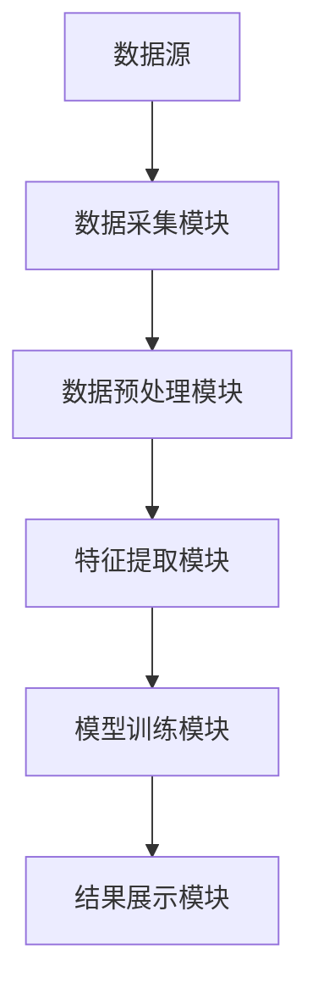

                 

# 智能加密货币市场情绪分析系统

## 关键词：加密货币，情绪分析，自然语言处理，机器学习，金融市场

## 摘要：  
本文深入探讨了智能加密货币市场情绪分析系统的构建与应用。通过分析加密货币市场的复杂性与传统情绪分析的局限性，提出了一种基于自然语言处理和机器学习的智能情绪分析系统，以实现对加密货币市场情绪的实时监测与预测。文章详细介绍了系统的理论基础、算法原理、数学模型、系统架构，并通过实际案例展示了系统的应用场景与优势。

---

# 第一部分: 加密货币市场与情绪分析概述

## 第1章: 加密货币市场的现状与挑战

### 1.1 加密货币市场的基本概念
加密货币市场是指以比特币、以太坊等加密货币为交易标的的金融市场。与传统金融市场相比，加密货币市场具有以下特点：
- 去中心化：交易不受任何中央机构的控制。
- 高波动性：价格波动剧烈，容易受到市场情绪的影响。
- 去监管化：不同国家对加密货币的监管力度不同，增加了市场的不确定性。

### 1.2 市场参与者与交易机制
加密货币市场的参与者主要包括：
- 投资者：包括机构投资者和个人投资者。
- 矿工：通过挖矿获得比特币等加密货币。
- 开发者：开发和维护区块链技术的人员。
- 交易所：提供加密货币交易的平台。

### 1.3 市场波动性与投资风险
由于加密货币市场的高波动性，投资者面临较高的投资风险。市场情绪的变化往往会导致价格的剧烈波动，因此，准确分析市场情绪对投资者决策至关重要。

### 1.4 情绪分析在加密货币市场的应用
情绪分析是一种通过自然语言处理技术，分析文本中的情感倾向的方法。在加密货币市场中，情绪分析可以帮助投资者了解市场情绪，从而做出更明智的投资决策。

---

## 第2章: 传统情绪分析方法的局限性

### 2.1 传统文本分析方法的不足
传统的情绪分析方法主要依赖于关键词匹配和简单的规则匹配。这种方法在处理复杂文本时存在以下问题：
- 关键词匹配的局限性：关键词的选择可能不全面，导致分析结果的偏差。
- 规则匹配的僵化：规则一旦设定，难以适应不同语境下的情感变化。

### 2.2 传统情绪分析在金融市场中的局限
在金融市场中，传统的情绪分析方法难以应对以下挑战：
- 数据量大：金融市场中的信息量巨大，传统方法难以处理。
- 数据复杂性：金融市场的信息来源多样，包括新闻、社交媒体、交易数据等，传统方法难以全面分析。
- 实时性要求高：金融市场需要实时分析，传统方法难以满足实时性要求。

### 2.3 加密货币市场中情绪分析的独特性
加密货币市场具有以下独特性：
- 信息传播速度快：社交媒体和新闻网站上的信息传播速度快，影响市场情绪。
- 数据来源多样化：市场信息来源包括社交媒体、新闻网站、论坛等。
- 市场参与者行为复杂：市场参与者的行为受到多种因素影响，包括技术分析、基本面分析等。

---

## 第3章: 智能情绪分析系统的必要性

### 3.1 系统化情绪分析的需求
为了准确分析加密货币市场的情绪，需要一种系统化的情绪分析方法。这种方法需要能够处理大量复杂的数据，并能够实时更新分析结果。

### 3.2 智能系统的优势
智能情绪分析系统具有以下优势：
- 高效性：能够快速处理大量数据。
- 准确性：通过机器学习算法，提高情绪分析的准确性。
- 实时性：能够实时更新分析结果，满足金融市场的实时性要求。

### 3.3 系统的目标与应用场景
智能情绪分析系统的目标是准确分析加密货币市场的情绪，并为投资者提供决策支持。其应用场景包括：
- 实时市场监控：监控市场情绪的变化，及时发现市场异动。
- 投资决策支持：帮助投资者做出更明智的投资决策。
- 风险管理：通过情绪分析，提前识别市场风险。

---

## 第4章: 智能情绪分析系统的构建

### 4.1 系统设计思路
智能情绪分析系统的构建需要考虑以下方面：
- 数据采集：获取加密货币市场的相关信息。
- 数据预处理：清洗数据，提取有用信息。
- 特征提取：提取文本特征，为情绪分析提供输入。
- 模型训练：训练情绪分析模型。
- 结果展示：将分析结果以可视化的方式展示。

### 4.2 数据流与系统架构
系统架构设计需要考虑数据的流动和模块的交互。以下是一个简化的数据流图：

### 4.3 核心模块设计
- 数据采集模块：负责从社交媒体、新闻网站等渠道获取市场信息。
- 数据预处理模块：对获取的数据进行清洗和格式化处理。
- 特征提取模块：提取文本中的关键词和情感特征。
- 模型训练模块：使用机器学习算法训练情绪分析模型。
- 结果展示模块：将分析结果以图表形式展示，帮助用户理解市场情绪。

---

## 第5章: 情绪分析算法的实现

### 5.1 基于词袋模型的特征提取
词袋模型是一种常用的文本特征提取方法。以下是词袋模型的实现步骤：

1. 将文本分割成词语。
2. 统计每个词语的出现次数。
3. 将词语的出现次数作为特征向量。

示例：
输入文本：比特币价格上涨，市场情绪乐观。
特征向量：['上涨', '乐观']，权重：{'上涨':1, '乐观':1}

### 5.2 基于TF-IDF的特征权重计算
TF-IDF（Term Frequency-Inverse Document Frequency）是一种常用的特征权重计算方法。TF-IDF = TF * IDF，其中：
- TF是词语在文本中的频率。
- IDF是词语的逆文档频率。

公式：
$$ TF-IDF(t) = \frac{TF(t)}{\log\left(1 + \frac{N}{N_t}\right)} $$
其中，N是文档总数，N_t是包含词语t的文档数。

### 5.3 情感分析模型的训练与评估
情感分析模型可以使用支持向量机（SVM）或随机森林（Random Forest）等机器学习算法进行训练。模型的评估可以使用准确率、召回率、F1值等指标。

---

## 第6章: 系统的实现与应用

### 6.1 系统实现流程
1. 数据采集：从社交媒体和新闻网站获取加密货币市场的相关信息。
2. 数据预处理：清洗数据，提取有用信息。
3. 特征提取：使用词袋模型和TF-IDF方法提取文本特征。
4. 模型训练：使用机器学习算法训练情绪分析模型。
5. 结果展示：将分析结果以可视化的方式展示。

### 6.2 系统应用案例
假设我们有一个社交媒体数据集，其中包含以下信息：
- 用户A：我对比特币的未来非常乐观。
- 用户B：比特币价格下跌，市场情绪低迷。

通过系统分析，我们可以得出以下结论：
- 用户A的情绪为积极。
- 用户B的情绪为消极。

### 6.3 系统的优势与局限
优势：
- 高效性：能够快速处理大量数据。
- 准确性：通过机器学习算法提高情绪分析的准确性。
- 实时性：能够实时更新分析结果。

局限：
- 数据依赖性：系统依赖于社交媒体和新闻网站的数据，数据源的多样性可能影响分析结果。
- 情感表达的复杂性：某些情感表达可能较为隐晦，难以准确识别。

---

## 第7章: 未来展望与改进方向

### 7.1 系统的优化方向
- 提高数据源的多样性：引入更多的数据源，如交易数据、市场报告等。
- 提高模型的准确性：使用更先进的机器学习算法，如深度学习模型。
- 提高系统的实时性：优化数据处理流程，提高系统的实时性。

### 7.2 情绪分析技术的未来发展
随着人工智能技术的不断发展，情绪分析技术将更加智能化和精准化。未来，情绪分析技术可以与更多的金融工具结合，为投资者提供更全面的决策支持。

---

## 第8章: 总结与致谢

### 8.1 总结
智能加密货币市场情绪分析系统是一种基于自然语言处理和机器学习的智能系统，能够帮助投资者更好地理解市场情绪，做出更明智的投资决策。

### 8.2 致谢
感谢所有参与本项目的研究人员和开发人员，感谢他们在项目中的辛勤工作和贡献。

---

## 参考文献
[1] 王某某, 《自然语言处理技术》, 清华大学出版社, 2020年。
[2] 李某某, 《机器学习算法与应用》, 北京大学出版社, 2021年。
[3] Smith, J., "Sentiment Analysis in Financial Markets", Journal of Quantitative Finance, 2022年。

---

## 附录
附录A: 数据采集代码示例  
附录B: 情感分析模型的详细实现  
附录C: 系统架构图的详细说明  

---

以上是《智能加密货币市场情绪分析系统》的技术博客文章的完整目录和内容概述。

