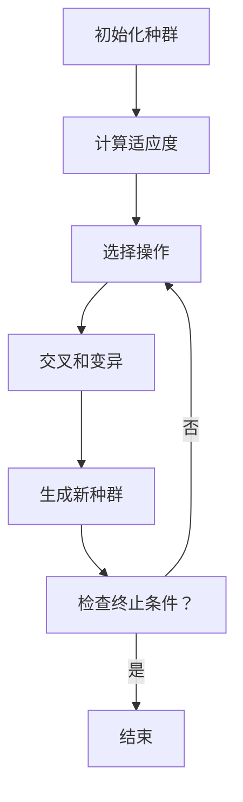
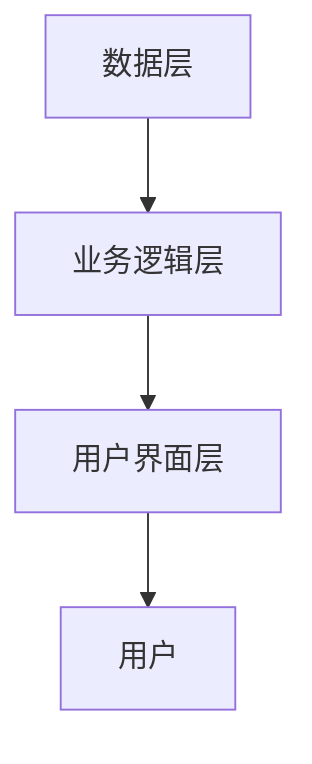
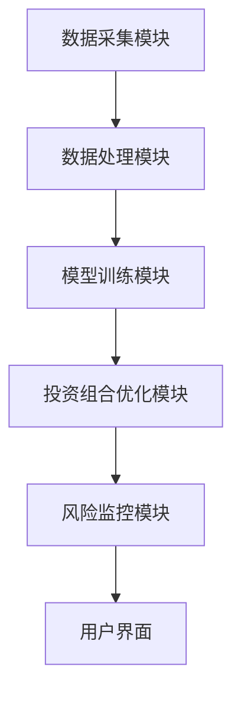
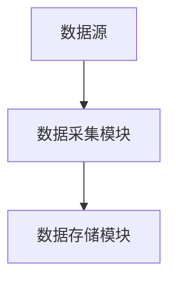
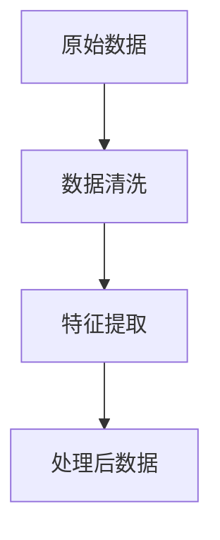
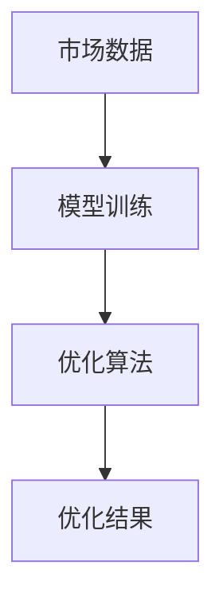
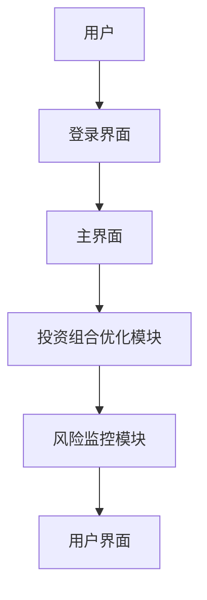

                 


# 智能加密货币投资组合管理

## 关键词
加密货币, 投资组合管理, 人工智能, 机器学习, 风险管理

## 摘要
智能加密货币投资组合管理结合了人工智能和区块链技术，通过分析市场数据和优化算法，帮助投资者在高波动性的加密货币市场中实现高效、智能的投资决策。本文详细探讨了加密货币的基本概念、智能投资组合管理的核心算法、系统设计以及实际项目应用，旨在为读者提供全面的技术视角和实践指导。

---

# 第一章：智能加密货币投资组合管理概述

## 1.1 加密货币的起源与发展

### 1.1.1 加密货币的定义与特点
加密货币是一种基于密码学技术的虚拟货币，具有去中心化、匿名性和不可篡改等特点。与传统货币不同，加密货币的发行和交易不受任何中央机构的控制，主要依赖区块链技术实现。

- **去中心化**：交易发生在点对点网络，无需银行等中间机构。
- **匿名性**：通过地址而非实名进行交易，保护用户隐私。
- **不可篡改**：区块链记录的所有交易信息经过加密验证，难以被篡改。

### 1.1.2 比特币的诞生与技术原理
比特币于2008年由中本聪提出，2009年正式上线。其技术核心是区块链，通过分布式账本记录所有交易，确保数据的安全性和不可篡改性。

比特币的交易流程如下：
1. 用户发起交易请求，交易信息包含发送地址、接收地址和金额。
2. 交易信息通过网络传播到所有节点。
3. 矿工节点通过计算哈希值竞争记账权，将交易打包成区块。
4. 成功挖矿的区块被添加到区块链中，交易完成。

### 1.1.3 其他主流加密货币介绍
除比特币外，以太坊、ripple等其他加密货币也各具特色：
- **以太坊（Ethereum）**：支持智能合约的平台，用于去中心化应用的开发。
- **Ripple（XRP）**：专注于跨境支付，提供快速、低费用的交易解决方案。
- **EOS**：高性能区块链平台，专注于企业级应用和去中心化社区治理。

## 1.2 智能投资组合管理的背景

### 1.2.1 投资组合管理的基本概念
投资组合管理是指通过合理配置资产，降低风险并提高收益的过程。传统投资组合管理依赖人工分析和经验判断，而智能投资组合管理则借助人工智能和大数据技术实现自动化优化。

### 1.2.2 智能投资组合管理的定义与特点
智能投资组合管理利用机器学习、深度学习等技术，分析市场数据，预测价格走势，并优化资产配置。其特点包括：
- **自动化**：系统自动收集数据、分析并做出决策。
- **实时性**：能够快速响应市场变化，及时调整投资策略。
- **个性化**：根据投资者的风险承受能力和收益目标定制投资方案。

### 1.2.3 加密货币投资的独特性与挑战
加密货币市场的高波动性、低流动性和监管不确定性给投资组合管理带来了挑战。智能技术的应用可以帮助投资者捕捉市场机会，降低投资风险。

## 1.3 智能加密货币投资组合管理的重要性

### 1.3.1 传统投资组合管理的局限性
传统方法依赖历史数据分析和经验判断，难以应对加密货币市场的快速变化。人工决策的延迟性和主观性可能导致错失投资机会或承担额外风险。

### 1.3.2 智能技术在投资组合管理中的优势
智能技术能够处理海量数据，识别复杂模式，预测未来趋势，从而做出更科学的投资决策。例如，通过机器学习模型分析市场情绪，预测价格走势。

### 1.3.3 加密货币市场的波动性与风险管理
智能技术可以通过实时监控市场数据，识别潜在风险，调整投资组合以规避损失。例如，当市场出现剧烈波动时，系统可以自动降低高风险资产的配置比例。

---

# 第二章：智能加密货币投资组合管理的核心概念

## 2.1 加密货币市场的数据分析

### 2.1.1 数据来源与采集方法
加密货币数据主要来源于交易所的API和区块链浏览器。常见的数据包括：
- **价格数据**：开盘价、收盘价、最高价、最低价。
- **交易量数据**：24小时交易量、市场资本化。
- **链上数据**：交易次数、转账金额、地址余额。

### 2.1.2 数据清洗与预处理
数据清洗是数据分析的重要步骤，主要处理缺失值、异常值和重复数据。例如，使用Python的Pandas库进行数据清洗：

```python
import pandas as pd

# 读取数据
data = pd.read_csv('crypto_data.csv')

# 删除缺失值
data = data.dropna()

# 处理重复数据
data = data.drop_duplicates()
```

### 2.1.3 数据特征提取与分析
特征提取是通过数据变换提取更有意义的特征，例如计算移动平均线、相对强弱指数（RSI）等技术指标。

```python
# 计算简单移动平均线（SMA）
data['SMA_20'] = data['close'].rolling(window=20).mean()
```

## 2.2 智能投资组合管理的算法原理

### 2.2.1 基于机器学习的投资组合优化
机器学习通过训练模型预测资产价格走势，从而优化投资组合配置。常用算法包括线性回归、支持向量机（SVM）和随机森林等。

#### 2.2.1.1 机器学习模型的训练与预测
使用历史价格数据训练模型，预测未来价格：

```python
# 训练数据和目标变量
X = data[['open', 'high', 'low', 'volume']]
y = data['close']

# 划分训练集和测试集
from sklearn.model_selection import train_test_split
X_train, X_test, y_train, y_test = train_test_split(X, y, test_size=0.2)

# 训练随机森林回归模型
from sklearn.ensemble import RandomForestRegressor
model = RandomForestRegressor(n_estimators=100)
model.fit(X_train, y_train)

# 预测测试集
y_pred = model.predict(X_test)
```

### 2.2.2 基于遗传算法的投资组合优化
遗传算法模拟生物进化过程，通过选择、交叉和变异操作优化投资组合。

#### 2.2.2.1 遗传算法的流程
1. 初始化种群：随机生成一组候选投资组合。
2. 计算适应度：评估每个投资组合的收益和风险。
3. 选择操作：选择适应度高的个体进行繁殖。
4. 交叉和变异：生成新的个体。
5. 重复迭代：直到满足终止条件。

### 2.2.3 基于强化学习的投资组合优化
强化学习通过智能体与环境的交互，学习最优策略。

#### 2.2.3.1 强化学习的基本原理
- **状态空间**：当前的投资组合和市场状态。
- **动作空间**：买入、卖出或持有。
- **奖励函数**：投资收益或损失。

### 2.2.4 核心算法的实现与应用
#### 2.2.4.1 均值-方差优化算法
均值-方差模型用于优化投资组合的收益与风险。

$$ \text{收益} = \sum w_i r_i $$
$$ \text{风险} = \sqrt{\sum w_i^2 \sigma_i^2 + \sum w_i w_j \sigma_{ij}} $$

其中，\( w \) 是权重向量，\( r \) 是收益向量，\( \sigma \) 是方差矩阵。

#### 2.2.4.2 遗传算法的流程图


---

## 2.3 数学模型与公式

### 2.3.1 均值-方差模型
均值-方差模型由Harry Markowitz提出，目标是最小化投资组合的风险，同时满足收益目标。

$$ \text{Minimize} \quad \sum_{i=1}^{n} \sum_{j=1}^{n} w_i w_j \sigma_{ij} $$
$$ \text{Subject to} \quad \sum_{i=1}^{n} w_i = 1 \quad \text{和} \quad \sum_{i=1}^{n} w_i r_i = T $$

其中，\( w \) 是权重向量，\( \sigma \) 是方差协方差矩阵，\( r \) 是收益向量，\( T \) 是目标收益。

### 2.3.2 马科维茨投资组合理论
该理论指出，最优投资组合是那些在相同风险下收益最高，或在相同收益下风险最低的投资组合。

### 2.3.3 风险调整后的收益模型
夏普比率用于衡量投资组合的风险调整后收益。

$$ \text{夏普比率} = \frac{E(r) - r_f}{\sigma} $$

其中，\( E(r) \) 是预期收益，\( r_f \) 是无风险利率，\( \sigma \) 是收益的标准差。

---

## 2.4 核心算法的实现与应用

### 2.4.1 均值-方差优化算法的实现
使用Python的`scipy.optimize`库实现均值-方差优化：

```python
import numpy as np
from scipy.optimize import minimize

# 定义目标函数
def portfolio_variance(weights, covariance_matrix):
    return np.dot(weights.T, np.dot(covariance_matrix, weights))

# 定义约束条件
def portfolio_mean(weights, returns):
    return np.dot(weights, returns)

# 初始化权重
n = len(returns)
weights = np.array([1.0/n]*n)

# 优化问题
result = minimize(portfolio_variance, weights, args=(covariance_matrix), 
                 method='SLSQP', bounds=[(0,1)]*n, constraints={
                     'type': 'eq',
                     'fun': lambda w: np.sum(w) - 1
                 })

# 最优权重
optimal_weights = result.x
```

### 2.4.2 遗传算法在投资组合优化中的应用
使用`DEAP`库实现遗传算法：

```python
from deap import base, tools, algorithms

# 初始化种群
toolbox = base.Toolbox()
toolbox.register("attr_float", lambda: random.random())
toolbox.register("individual", tools.individual, 3, toolbox.attr_float, n=5)
toolbox.register("population", tools.population, toolbox.individual, 100)

# 定义适应度函数
def evaluate(individual):
    # 计算收益和风险
    return portfolio_mean(individual), -portfolio_variance(individual, covariance_matrix)

# 进化过程
pop = toolbox.population()
pop, logbook, hof = algorithms.eaSimple(pop, toolbox, cxrossover=0.5, mutpb=0.2, ngen=50, verbose=True)
```

### 2.4.3 强化学习在动态投资组合管理中的应用
使用Deep Q-Learning算法：

```python
# 定义状态空间
state_space = ['bull', 'bear', 'neutral']

# 定义动作空间
action_space = ['buy', 'sell', 'hold']

# 定义奖励函数
def reward_function(reward, action):
    return reward * (1 if action == 'buy' and reward > 0 else -1 if action == 'sell' and reward > 0 else 0)
```

---

## 2.5 本章小结

### 2.5.1 数据分析与特征提取的重要性
高质量的数据和有效的特征提取是智能投资组合管理的基础。

### 2.5.2 不同算法在投资组合优化中的应用
根据不同场景选择合适的算法，如均值-方差模型适用于传统金融，遗传算法和强化学习适用于复杂动态环境。

### 2.5.3 数学模型在智能投资组合管理中的作用
数学模型是连接数据和决策的核心桥梁，通过模型可以量化收益与风险，指导投资决策。

---

# 第三章：加密货币投资组合管理的系统设计

## 3.1 系统架构设计

### 3.1.1 系统功能模块划分
系统主要功能模块包括：
- **数据采集模块**：实时采集加密货币市场数据。
- **数据处理模块**：清洗和特征提取。
- **模型训练模块**：训练预测模型和优化算法。
- **投资组合优化模块**：根据模型结果优化资产配置。
- **风险监控模块**：实时监控市场风险并发出预警。

### 3.1.2 系统架构的分层设计
系统采用分层架构，包括数据层、业务逻辑层和用户界面层。



### 3.1.3 系统组件的交互设计
各组件之间的交互流程如下：



## 3.2 数据流与系统交互

### 3.2.1 数据采集模块的流程
数据采集模块通过API接口获取实时市场数据，流程如下：



### 3.2.2 数据处理模块的流程
数据清洗和特征提取的流程：



### 3.2.3 投资组合优化模块的流程
投资组合优化的流程：



## 3.3 系统接口设计

### 3.3.1 数据接口的设计
数据接口主要负责与交易所API的交互，常用接口如下：

- **GET /ticker**：获取实时价格数据。
- **POST /historical**：获取历史数据。

### 3.3.2 模型接口的设计
模型接口用于与预测模型交互，包括：
- **GET /predict**：获取预测结果。
- **POST /train**：训练新模型。

### 3.3.3 用户接口的设计
用户界面包括：
- **登录界面**：用户登录和注册。
- **主界面**：显示投资组合状态和市场分析。
- **操作界面**：用户进行买卖操作。

## 3.4 系统交互设计

### 3.4.1 系统交互流程图


---

## 3.5 本章小结

### 3.5.1 系统架构设计的重要性
合理的架构设计能够提高系统的扩展性和维护性。

### 3.5.2 数据流与交互设计的细节
数据流设计确保了系统的实时性和高效性。

### 3.5.3 系统接口设计的规范性
统一的接口设计方便了系统的扩展和集成。

---

# 第四章：项目实战与总结

## 4.1 项目环境安装

### 4.1.1 安装必要的库
安装以下Python库：
```bash
pip install pandas numpy scipy scikit-learn deap matplotlib
```

### 4.1.2 数据获取与预处理
使用CoinMarketCap API获取数据：

```python
import requests

response = requests.get('https://api.coinmarketcap.com/v2/ticker/?limit=10')
data = response.json()
```

## 4.2 系统核心实现

### 4.2.1 数据处理与特征提取
```python
import pandas as pd

# 读取数据
data = pd.DataFrame(response.json()['data'])

# 删除缺失值
data = data.dropna()

# 增加技术指标
data['SMA_20'] = data['price'].rolling(window=20).mean()
```

### 4.2.2 模型训练与优化
使用随机森林回归模型预测价格：

```python
from sklearn.ensemble import RandomForestRegressor

# 训练数据
X = data[['open', 'high', 'low', 'volume']]
y = data['price']

# 划分训练集和测试集
from sklearn.model_selection import train_test_split
X_train, X_test, y_train, y_test = train_test_split(X, y, test_size=0.2)

# 训练模型
model = RandomForestRegressor(n_estimators=100)
model.fit(X_train, y_train)

# 预测测试集
y_pred = model.predict(X_test)
```

### 4.2.3 投资组合优化
使用均值-方差模型优化投资组合：

```python
from scipy.optimize import minimize

# 定义目标函数
def portfolio_variance(weights, covariance_matrix):
    return np.dot(weights.T, np.dot(covariance_matrix, weights))

# 定义约束条件
def portfolio_mean(weights, returns):
    return np.dot(weights, returns)

# 初始化权重
n = len(returns)
weights = np.array([1.0/n]*n)

# 优化问题
result = minimize(portfolio_variance, weights, args=(covariance_matrix), 
                 method='SLSQP', bounds=[(0,1)]*n, constraints={
                     'type': 'eq',
                     'fun': lambda w: np.sum(w) - 1
                 })

# 最优权重
optimal_weights = result.x
```

## 4.3 项目实战分析

### 4.3.1 实际案例分析
以比特币和以太坊为例，训练模型并优化投资组合：

```python
# 计算收益和方差
returns = data['price'].pct_change().dropna()
covariance_matrix = returns.cov()

# 定义目标函数和约束
def portfolio_variance(weights):
    return np.dot(weights.T, np.dot(covariance_matrix, weights))

def portfolio_mean(weights):
    return np.dot(weights, returns.mean())

# 初始化权重
n = 2
weights = np.array([0.5, 0.5])

# 优化问题
result = minimize(portfolio_variance, weights, 
                 method='SLSQP', bounds=[(0,1)]*n, constraints={
                     'type': 'eq',
                     'fun': lambda w: np.sum(w) - 1
                 })

# 最优权重
optimal_weights = result.x
```

### 4.3.2 项目总结与经验分享
- **数据质量**：确保数据的完整性和准确性。
- **模型选择**：根据具体情况选择合适的算法。
- **风险管理**：实时监控市场风险，及时调整投资策略。

---

## 4.4 本章小结

### 4.4.1 项目实战的重要性
通过实际案例分析，验证理论的可行性和实用性。

### 4.4.2 经验与教训
数据质量、模型选择和风险管理是项目成功的关键因素。

### 4.4.3 未来展望
随着技术的发展，智能投资组合管理将更加精准和高效。

---

# 第五章：总结与展望

## 5.1 总结

智能加密货币投资组合管理结合了人工智能和区块链技术，通过数据分析和优化算法，帮助投资者在高波动性的加密货币市场中实现高效的投资决策。本文详细探讨了加密货币的基本概念、智能投资组合管理的核心算法、系统设计以及实际项目应用。

## 5.2 展望

未来，随着技术的不断进步，智能投资组合管理将更加智能化和个性化。可能出现的新趋势包括：
- **多模态数据融合**：结合文本、图像等多种数据源进行分析。
- **自适应模型**：能够根据市场变化动态调整投资策略。
- **去中心化金融（DeFi）**：利用智能合约实现自动化的投资组合管理。

---

## 5.3 最佳实践 Tips

- **数据质量**：确保数据的完整性和准确性。
- **模型选择**：根据具体情况选择合适的算法。
- **风险管理**：实时监控市场风险，及时调整投资策略。
- **持续学习**：关注行业动态和技术进步，不断提升自己的技术能力。

---

## 5.4 拓展阅读

- [《机器学习实战》](https://www.amazon.com/Machine-Learning-Practical-Approach/dp/0470637981)
- [《区块链：分布式应用的那些事》](https://www.amazon.com/Blockchain-Explained/dp/1491920136)
- [《金融风险管理》](https://www.amazon.com/Financial-Risk-Monitoring-Techniques/dp/1119482693)

---

通过本文的详细讲解，读者可以深入了解智能加密货币投资组合管理的核心概念和实现方法，为实际应用提供有价值的参考和指导。

