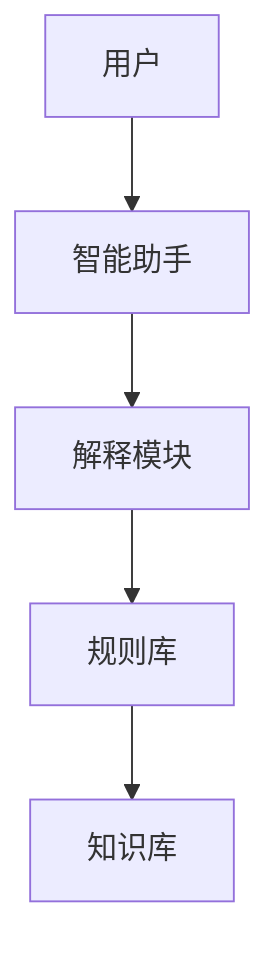
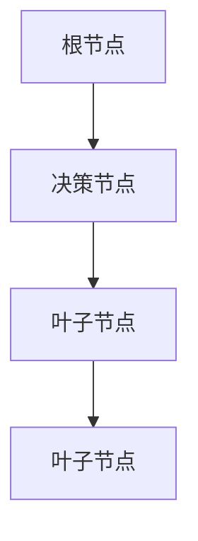
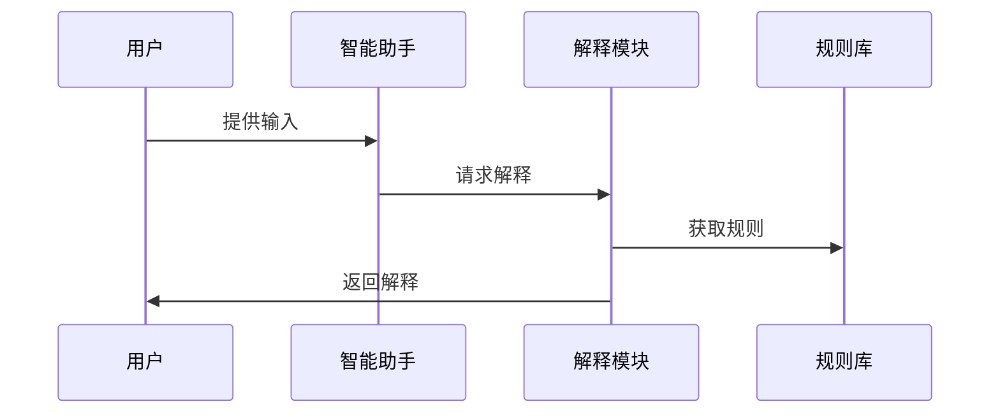

                 


# 智能助手的可解释性设计

## 关键词：智能助手, 可解释性, 人工智能, 系统设计, 解释性模型

## 摘要：  
随着人工智能技术的快速发展，智能助手在各个领域的应用越来越广泛。然而，智能助手的决策过程往往缺乏透明性，这使得用户和开发者难以理解和信任系统的行为。可解释性设计成为解决这一问题的关键。本文将深入探讨智能助手的可解释性设计的核心概念、算法原理、系统架构以及实际应用，帮助读者全面理解并掌握如何设计出更加透明和可靠的智能助手系统。

---

## 第一章: 智能助手与可解释性概述

### 1.1 智能助手的定义与背景

#### 1.1.1 智能助手的定义  
智能助手是一种基于人工智能技术的交互式工具，能够通过自然语言处理、机器学习等技术，理解和执行用户的指令，提供个性化的服务和建议。

#### 1.1.2 智能助手的发展历程  
智能助手的发展经历了从简单的任务执行到复杂决策支持的阶段。早期的智能助手主要用于基本的信息查询和任务调度，而现代智能助手则具备更强的上下文理解和自适应能力。

#### 1.1.3 可解释性的重要性  
随着智能助手在医疗、金融等高风险领域的应用，其决策过程的透明性和可解释性变得尤为重要。用户和开发者需要了解系统是如何得出结论的，以便在出现问题时进行追溯和优化。

### 1.2 可解释性在智能助手中的问题背景

#### 1.2.1 当前智能助手的局限性  
现有的智能助手在处理复杂问题时，往往依赖于复杂的深度学习模型，这些模型通常缺乏可解释性，导致用户难以理解系统的行为。

#### 1.2.2 用户对可解释性的需求  
用户对智能助手的信任建立在其行为的可解释性上。特别是在关键决策领域，用户需要了解系统决策的依据和逻辑。

#### 1.2.3 可解释性设计的必要性  
可解释性设计是智能助手系统的核心要求之一。只有具备可解释性的系统才能在实际应用中获得用户的信任和依赖。

### 1.3 可解释性设计的核心概念

#### 1.3.1 可解释性的定义  
可解释性是指系统的行为和决策能够以人类可理解的方式进行解释和验证。

#### 1.3.2 可解释性设计的边界与外延  
可解释性设计不仅包括系统输出的结果，还包括系统内部的推理过程和数据处理方式。

#### 1.3.3 核心要素与概念结构  
可解释性设计的核心要素包括：透明性、可追溯性、可验证性和可解释性模型的选择与优化。

---

## 第二章: 可解释性设计的核心概念与联系

### 2.1 可解释性设计的原理

#### 2.1.1 解释性模型的分类  
解释性模型可以分为基于规则的模型和基于统计的模型两类。基于规则的模型具有较强的可解释性，而基于统计的模型则更注重预测的准确性。

#### 2.1.2 解释性模型的特征对比  
| 特性      | 基于规则的模型          | 基于统计的模型          |
|-----------|-------------------------|-------------------------|
| 可解释性   | 高                     | 低                     |
| 预测精度   | 低                     | 高                     |
| 灵活性     | 低                     | 高                     |

### 2.2 可解释性设计的实体关系图



---

## 第三章: 可解释性设计的算法原理

### 3.1 基于规则的可解释性算法

#### 3.1.1 规则生成的原理  
基于规则的解释性模型通过预定义的规则对数据进行分类和处理，规则的生成通常依赖于领域专家的知识。

#### 3.1.2 规则匹配的流程  
1. 接收用户输入；
2. 根据预定义规则匹配输入内容；
3. 输出匹配结果及规则依据。

#### 3.1.3 规则的可解释性优势  
基于规则的模型通过明确的规则进行推理，用户可以轻松理解系统决策的原因。

### 3.2 基于线性回归的解释性模型

#### 3.2.1 线性回归的基本原理  
线性回归通过最小化预测值与真实值之间的误差平方和，构建线性关系模型。

#### 3.2.2 线性回归的可解释性  
线性回归模型的系数可以直接解释变量对目标变量的影响程度。

#### 3.2.3 线性回归的数学公式  
$$ y = \beta_0 + \beta_1x_1 + \beta_2x_2 + ... + \beta_nx_n $$

### 3.3 基于决策树的解释性模型

#### 3.3.1 决策树的构建过程  
1. 选择特征进行分裂；
2. 递归构建子树；
3. 剪枝优化模型。

#### 3.3.2 决策树的可解释性  
决策树的结构直观，用户可以通过可视化的方式理解决策逻辑。

#### 3.3.3 决策树的流程图  


---

## 第四章: 可解释性设计的系统架构

### 4.1 智能助手系统的架构设计

#### 4.1.1 问题场景介绍  
智能助手需要在医疗诊断中提供可解释的决策支持，以帮助医生理解和信任系统的建议。

#### 4.1.2 系统功能设计  
系统功能包括用户输入、规则匹配、结果解释和反馈优化。

#### 4.1.3 领域模型类图  


#### 4.1.4 系统架构图  


#### 4.1.5 系统接口设计  
系统接口包括用户输入接口、规则匹配接口和结果解释接口。

#### 4.1.6 系统交互序列图  


---

## 第五章: 可解释性设计的项目实战

### 5.1 项目介绍

#### 5.1.1 项目背景  
本项目旨在设计一个基于规则的智能助手，用于医疗诊断中的症状分析。

#### 5.1.2 核心代码实现  
```python
def medical_diagnosis(symptoms):
    rules = {
        '发烧': ['体温升高', '需要退烧药物'],
        '咳嗽': ['干咳', '需要止咳药物']
    }
    diagnosis = []
    for symptom in symptoms:
        if symptom in rules:
            diagnosis.append(rules[symptom][0])
    return diagnosis
```

#### 5.1.3 代码解读  
上述代码通过预定义的规则对用户输入的症状进行分类，输出对应的诊断结果。

#### 5.1.4 案例分析  
输入症状：发烧、咳嗽  
输出诊断：体温升高、干咳

---

## 第六章: 总结与展望

### 6.1 最佳实践 tips  
- 在智能助手设计中，优先选择具有可解释性的算法。
- 定期更新和优化解释规则，以提高系统的准确性和透明性。

### 6.2 小结  
智能助手的可解释性设计是实现用户信任和系统可靠性的重要保障。通过本文的介绍，读者可以掌握可解释性设计的核心概念、算法原理和系统架构设计方法。

### 6.3 注意事项  
在实际应用中，需要综合考虑系统的性能和可解释性，避免因过度追求可解释性而导致系统性能下降。

### 6.4 拓展阅读  
推荐阅读相关领域的最新论文和技术报告，以获取更多关于可解释性设计的前沿信息。

---

通过以上章节的详细阐述，读者可以系统地理解智能助手的可解释性设计的核心内容，并能够将其应用于实际项目中。

